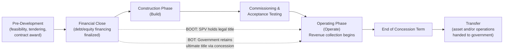

## Build-Operate-Transfer and Build-Own-Operate-Transfer Structures

### Overview

Build-Operate-Transfer (BOT) and Build-Own-Operate-Transfer (BOOT) are among the foundational contractual typologies within the broader PPP taxonomy, historically among the earliest formalized structures used for large-scale, greenfield infrastructure development where a private party finances, constructs, and operates an asset for a defined concession period before transferring it to the public sector. Distinguishing BOT from BOOT — and both from adjacent structures such as BOO (Build-Own-Operate) — requires close attention to the ownership question during the operating period, which has significant implications for risk allocation, financing structure, and regulatory treatment.

### Core Definitions

**Key Points**

- **BOT (Build-Operate-Transfer)**: A private entity (typically a Special Purpose Vehicle, or SPV) designs, finances, and constructs the asset, then operates and maintains it for a fixed concession period to recover its investment and earn a return, after which **ownership transfers to the government** at the end of the concession term. During the operating period, the government typically retains at least nominal or ultimate ownership of the underlying asset, with the private party holding an operating right or usage right rather than full title.
- **BOOT (Build-Own-Operate-Transfer)**: Functionally similar to BOT, but the private entity holds actual **legal ownership** of the asset during the construction and operating phases, not merely an operating concession, before transferring ownership to the government at the end of the term.
- The practical distinction between BOT and BOOT often centers on **which party bears title to the asset (and associated risks, such as insurable risk, property tax liability, and balance sheet treatment) during the operating period** — this can carry meaningful implications for financing terms, insurance arrangements, and government fiscal accounting, even where the operational and revenue mechanics are otherwise similar. [Inference — the distinction is widely referenced in PPP literature, though in some jurisdictions and specific contracts, the terms BOT and BOOT are used loosely or interchangeably, so contract-specific legal review is required to determine actual title arrangements]

### Comparative Structure Table

| Feature | BOT | BOOT | BOO (for contrast) |
| --- | --- | --- | --- |
| Who finances construction | Private SPV | Private SPV | Private SPV |
| Who holds legal title during operation | Government (or retained via concession) | Private SPV | Private SPV |
| Transfer to government at end of term | Yes | Yes | No — asset remains privately owned indefinitely |
| Typical concession length | 15–30 years | 20–30+ years | Indefinite / no fixed transfer date |
| Common sectors | Toll roads, water treatment, power plants | Power generation, large industrial infrastructure | Power generation (especially independent power producers) |

**[Unverified]** Exact terminology usage and legal distinctions vary by jurisdiction; some national PPP laws (including in various Southeast Asian, Latin American, and African contexts) define BOT and BOOT with jurisdiction-specific legal nuances that should be verified against the applicable national PPP or BOT law rather than assumed from general international usage.

### Lifecycle Phases of a BOT/BOOT Structure

### Key Structural Components

#### The Special Purpose Vehicle (SPV) / Project Company

**Key Points**

- The SPV is typically a standalone legal entity created solely to develop, finance, build, and operate the specific project, isolating project-specific liabilities from the sponsors' broader balance sheets — a structure sometimes referred to as **non-recourse or limited-recourse project finance**.
- Sponsors (construction firms, infrastructure investment funds, operating companies) hold equity in the SPV, while a syndicate of lenders (commercial banks, development finance institutions, bondholders) provide debt financing secured primarily against the project's own cash flows and assets rather than the sponsors' general creditworthiness.
- Typical capital structures in BOT/BOOT projects are debt-heavy, often reflecting debt-to-equity ratios in the range of 70:30 to 80:20, though this varies substantially by sector, country risk profile, and lender risk appetite. [Unverified — specific ratios vary significantly by project and should not be treated as a universal benchmark]

#### The Concession Agreement

The concession agreement (or BOT/BOOT contract) between the government (or a designated contracting authority) and the SPV is the central legal instrument governing the arrangement, and typically specifies:

1. **Scope of works** — design and construction specifications, performance standards, and technical requirements.
2. **Concession term** — the fixed duration during which the SPV operates the asset and collects revenue.
3. **Revenue mechanism** — how the SPV is compensated (see revenue models below).
4. **Risk allocation matrix** — which party bears construction risk, demand risk, force majeure risk, currency/inflation risk, regulatory/political risk, and residual value risk.
5. **Performance standards and step-in rights** — conditions under which the government (or lenders, via step-in rights) may intervene if the SPV underperforms or defaults.
6. **Handover/transfer conditions** — the technical, financial, and legal conditions the asset must satisfy at the end of the concession term before transfer is deemed complete (often requiring a defined residual asset condition or remaining useful life standard).

#### Revenue Models

**Key Points**

- **User-pay / toll-based structures**: the SPV collects revenue directly from end users (e.g., toll road users, water utility customers), meaning the SPV bears **demand risk** — the risk that actual usage falls short of forecast, directly affecting revenue.
- **Government-pay / availability-based structures**: the government (or a designated offtaker) pays the SPV based on the asset being available and meeting performance standards, regardless of actual usage volume, shifting demand risk back to the public sector while the SPV retains construction and operating performance risk.
- **Hybrid structures**: combine elements of both, such as a minimum revenue guarantee (MRG) from government that supplements toll revenue if actual demand falls below a specified threshold, partially mitigating the SPV's demand risk exposure while preserving some user-pay revenue.
- Independent power producer (IPP) structures, a common application of BOT/BOOT in the power sector, typically rely on a **Power Purchase Agreement (PPA)** with a state utility or grid operator as the offtaker, which functions similarly to an availability-based payment mechanism, often including capacity payments (fixed, tied to available generation capacity) and energy payments (variable, tied to actual generation output).

### Risk Allocation Principles

A core theoretical principle underlying BOT/BOOT structuring is that **risk should be allocated to the party best able to manage or absorb it** — a principle sometimes summarized as allocating risk to whichever party has the greatest ability to control, mitigate, or price that risk.

| Risk Category | Typically Allocated To | Rationale |
| --- | --- | --- |
| Construction cost overrun / delay | Private SPV (via fixed-price EPC contract) | SPV/its EPC contractor controls construction execution |
| Design and technology risk | Private SPV | SPV selects technology and design approach |
| Demand/usage risk | Varies — SPV (user-pay) or Government (availability-pay) | Depends on which party can better forecast or influence usage |
| Currency/inflation risk | Often shared or partially retained by government (via indexation clauses) | Neither party fully controls macroeconomic variables |
| Political/regulatory risk (expropriation, change in law) | Typically Government | Government controls policy and regulatory environment |
| Force majeure (natural disasters, war) | Typically shared via defined force majeure clauses | Neither party controls the event |
| Residual value / handover condition risk | Private SPV (until transfer conditions are met) | SPV controls maintenance during operating period |

**[Inference]** This risk allocation table reflects commonly cited principles in project finance and PPP structuring literature; actual allocation in any specific contract is a negotiated outcome and can deviate from these general norms based on country risk context, sector-specific dynamics, and relative bargaining power of the parties.

### Financial Modeling Considerations Specific to BOT/BOOT

**Key Points**

- BOT/BOOT projects are typically evaluated using **project-level discounted cash flow (DCF) modeling**, projecting construction costs, operating revenues, operating expenses, debt service, and terminal/residual value (if any) across the full concession term.
- Key financial metrics commonly used to assess project viability and lender comfort include:
  - **Debt Service Coverage Ratio (DSCR)**: $\text{DSCR} = \dfrac{\text{Cash Flow Available for Debt Service}}{\text{Total Debt Service (Principal + Interest)}}$, with lenders typically requiring a minimum DSCR (often above 1.2x–1.5x, though this varies by sector and lender) to ensure adequate cash flow buffer.
  - **Loan Life Coverage Ratio (LLCR)**: the ratio of the present value of cash flows available for debt service over the remaining loan life to the outstanding debt balance, used to assess coverage across the full loan tenor rather than a single period.
  - **Project Internal Rate of Return (Project IRR)** and **Equity IRR**: used by sponsors and lenders to assess whether projected returns justify the risk profile of the investment.
- **[Behavior may vary]** Specific covenant thresholds, DSCR minimums, and required reserve account structures (such as Debt Service Reserve Accounts, or DSRAs) vary substantially by lender, sector, country risk rating, and prevailing market conditions at financial close, and should not be treated as fixed universal standards.

### Comparison: BOT/BOOT vs. Other Common PPP Typologies

| Structure | Ownership During Operation | Typical Application |
| --- | --- | --- |
| BOT | Government (via concession) | Toll roads, water treatment plants |
| BOOT | Private SPV | Power plants, large industrial infrastructure |
| BOO | Private SPV (no transfer) | Independent power producers |
| DBFO (Design-Build-Finance-Operate) | Varies; often government, with private operating role | Social infrastructure, availability-payment roads |
| Concession (rehabilitation-based) | Government (asset pre-exists) | Airport, port, or existing utility rehabilitation and operation |

BOT and BOOT are distinguished from a pure **management contract** or **lease/affermage** arrangement (where no significant new construction/financing occurs) by the private party's central role in financing and constructing new or substantially rehabilitated infrastructure, not merely operating an existing asset.

### Handover / Transfer Mechanics at End of Concession Term

**Key Points**

- The transfer process at the end of the concession term is a critical and often contractually detailed phase, since the government typically requires the asset to be handed over in a specified minimum operating condition, sometimes verified through independent technical audits in the final years of the concession.
- Contracts commonly specify a **handback reserve account** or minimum maintenance capital expenditure requirement in the final years of the concession, to prevent the SPV from under-maintaining the asset as the transfer date approaches (since the SPV has diminishing incentive to invest in an asset it is about to relinquish) — a phenomenon sometimes referred to as the **"end-of-concession maintenance problem."**
- Dispute resolution mechanisms, often including international arbitration clauses, are commonly included specifically to address disagreements over whether handover conditions have been satisfactorily met. [Inference]

### Illustrative BOT Structure Diagram (svg_diagram)

<svg xmlns="http://www.w3.org/2000/svg" viewBox="0 0 700 440">
<text x="350" y="25" text-anchor="middle" font-size="16" font-weight="bold" fill="#1a1a1a">BOT/BOOT Contractual Structure (svg_diagram)</text>
<rect x="280" y="50" width="140" height="55" rx="6" fill="#2471a3" opacity="0.9" />
<text x="350" y="73" text-anchor="middle" font-size="12" fill="#fff" font-weight="bold">Government /</text>
<text x="350" y="90" text-anchor="middle" font-size="12" fill="#fff" font-weight="bold">Contracting Authority</text>
<rect x="280" y="180" width="140" height="55" rx="6" fill="#c0392b" opacity="0.9" />
<text x="350" y="203" text-anchor="middle" font-size="12" fill="#fff" font-weight="bold">Special Purpose</text>
<text x="350" y="220" text-anchor="middle" font-size="12" fill="#fff" font-weight="bold">Vehicle (SPV)</text>
<rect x="40" y="300" width="130" height="50" rx="6" fill="#7d6608" opacity="0.9" />
<text x="105" y="322" text-anchor="middle" font-size="11" fill="#fff" font-weight="bold">Equity Sponsors</text>
<text x="105" y="338" text-anchor="middle" font-size="11" fill="#fff">(Construction firms,</text>
<rect x="40" y="360" width="130" height="30" rx="6" fill="#7d6608" opacity="0.7" />
<text x="105" y="379" text-anchor="middle" font-size="10" fill="#fff">Infra funds)</text>
<rect x="530" y="300" width="130" height="50" rx="6" fill="#1e8449" opacity="0.9" />
<text x="595" y="322" text-anchor="middle" font-size="11" fill="#fff" font-weight="bold">Lenders</text>
<text x="595" y="338" text-anchor="middle" font-size="11" fill="#fff">(Banks, DFIs,</text>
<rect x="530" y="360" width="130" height="30" rx="6" fill="#1e8449" opacity="0.7" />
<text x="595" y="379" text-anchor="middle" font-size="10" fill="#fff">Bondholders)</text>
<rect x="280" y="300" width="140" height="50" rx="6" fill="#6c3483" opacity="0.9" />
<text x="350" y="322" text-anchor="middle" font-size="11" fill="#fff" font-weight="bold">EPC Contractor</text>
<text x="350" y="338" text-anchor="middle" font-size="10" fill="#fff">(fixed-price build)</text>
<line x1="350" y1="105" x2="350" y2="180" stroke="#333" stroke-width="1.5" marker-end="url(#arrow)" />
<text x="360" y="145" font-size="10" fill="#333">Concession Agreement</text>
<line x1="280" y1="207" x2="170" y2="320" stroke="#333" stroke-width="1.5" />
<text x="190" y="270" font-size="10" fill="#333">Equity</text>
<line x1="420" y1="207" x2="530" y2="320" stroke="#333" stroke-width="1.5" />
<text x="470" y="270" font-size="10" fill="#333">Debt Financing</text>
<line x1="350" y1="235" x2="350" y2="300" stroke="#333" stroke-width="1.5" />
<text x="360" y="270" font-size="10" fill="#333">EPC Contract</text>
<line x1="200" y1="70" x2="280" y2="70" stroke="#888" stroke-width="1" stroke-dasharray="4,2" />
<text x="205" y="65" font-size="10" fill="#555">End users</text>
<text x="205" y="80" font-size="10" fill="#555">(tolls/tariffs) or</text>
<text x="205" y="92" font-size="10" fill="#555">Offtaker (PPA)</text>
</svg>

### Common Sectoral Applications

**Key Points**

- **Transportation**: toll roads, bridges, and tunnels are among the most common BOT applications globally, typically structured as user-pay (toll-based) concessions with demand risk borne substantially by the SPV, sometimes mitigated through minimum revenue guarantees.
- **Power generation**: BOOT and BOO structures are particularly common for independent power producer (IPP) projects, where the SPV owns the generation asset and sells output to a state utility offtaker under a long-term PPA.
- **Water and wastewater treatment**: BOT structures are common for large treatment plants, often with the government or municipal water utility as the offtaker/bulk purchaser rather than direct end-user tolling.
- **[Unverified]** The relative prevalence of BOT versus BOOT versus other structures by sector and region shifts over time with financing market conditions, government policy preferences, and evolving legal frameworks in specific countries; current sectoral trends should be verified against recent market data rather than assumed static.

### Common Structuring and Implementation Challenges

**Key Points**

- **Currency mismatch risk**: in many emerging market BOT/BOOT projects, debt financing (often denominated in hard currency such as USD) is mismatched against revenue collected in local currency (tolls, tariffs), creating foreign exchange risk that must be addressed through hedging, indexation clauses, or government currency risk-sharing mechanisms.
- **Political and regulatory risk over long concession terms**: given concession terms often spanning 20–30 years, changes in government administration, regulatory frameworks, or macroeconomic policy over the life of the concession can materially affect project economics, motivating the inclusion of stabilization clauses or political risk insurance (available through providers such as the Multilateral Investment Guarantee Agency, MIGA, and various export credit agencies).
- **Land acquisition and right-of-way delays**: particularly relevant for linear infrastructure such as toll roads, delays in government-led land acquisition can push back the construction timeline and increase financing costs, and is frequently cited as a major source of project delay and cost overrun in BOT road projects in multiple countries. [Inference]
- **Environmental and social safeguards compliance**: projects financed in part by multilateral development banks or export credit agencies are typically subject to environmental and social safeguard requirements (such as IFC Performance Standards or equivalent national frameworks), which must be integrated into project planning and can affect timeline and cost.

**Related Topics**

- Special Purpose Vehicle (SPV) Structuring and Project Finance Fundamentals
- Power Purchase Agreements and Independent Power Producer Structuring
- Minimum Revenue Guarantees and Demand Risk Mitigation Mechanisms
- Debt Service Coverage Ratio and Project Finance Credit Metrics
- Design-Build-Finance-Operate (DBFO) Structures
- Concession Agreements for Existing Infrastructure Rehabilitation
- Political Risk Insurance and Multilateral Guarantee Instruments (MIGA, ECAs)
- End-of-Concession Handover and Asset Condition Assessment