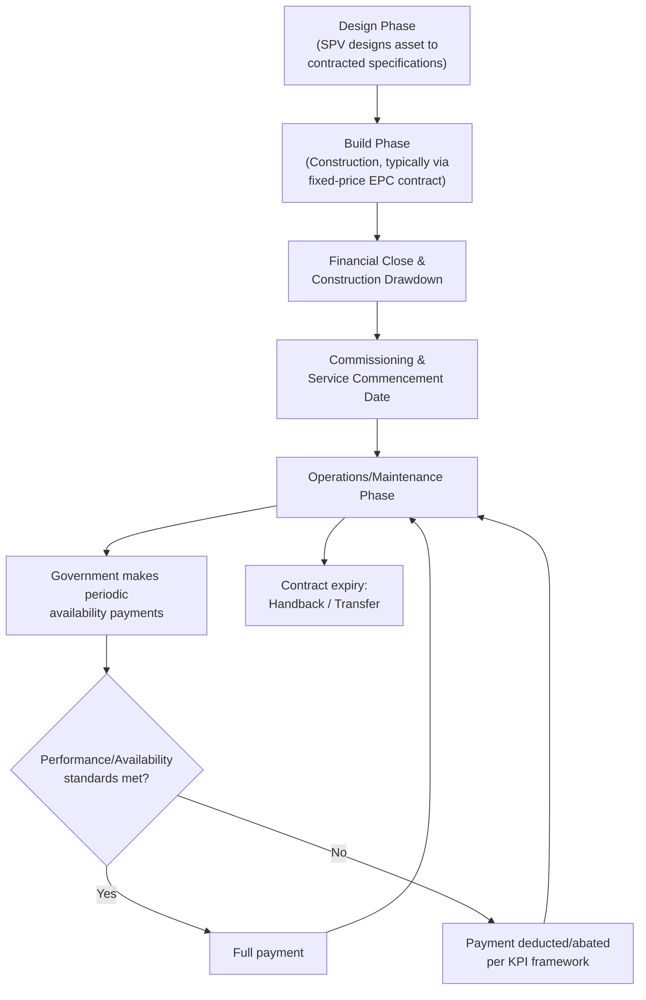

## Design-Build-Finance-Operate and Design-Build-Finance-Maintain Models

### Overview

Design-Build-Finance-Operate (DBFO) and Design-Build-Finance-Maintain (DBFM) are PPP contract typologies distinguished from BOT/BOOT structures primarily by their **payment mechanism** and the **scope of private-sector operational responsibility**. Where BOT/BOOT structures are historically associated with user-pay, demand-risk-bearing concessions, DBFO and DBFM models are predominantly associated with **availability-based payment mechanisms**, in which the government (or a public authority) pays the private party based on the asset being available and meeting defined performance standards, regardless of actual usage. This distinction has significant implications for risk allocation, financing structure, and the sectors in which each model is most commonly applied.

### Core Definitions

**Key Points**

- **DBFO (Design-Build-Finance-Operate)**: A private SPV designs, constructs, finances, and **operates** the asset over the contract term, with operations typically including the full range of service delivery (e.g., toll collection, traffic management, or facility operations), not merely physical upkeep.
- **DBFM (Design-Build-Finance-Maintain)**: A private SPV designs, constructs, and finances the asset, but its ongoing responsibility is limited to **maintenance** of the physical asset, while actual service delivery or operations (e.g., running the school, staffing the hospital, providing the core public service) remains with the government or a separate public operator.
- The distinction between "Operate" and "Maintain" in the acronym is substantive: DBFO transfers a broader bundle of operational and service-delivery responsibility to the private party, while DBFM narrows private responsibility to physical asset condition and lifecycle maintenance, leaving core service provision in public hands. [Inference — this distinction is the standard interpretation in PPP literature, though specific contracts sometimes blend elements of both, and terminology usage can vary by jurisdiction]

### DBFO vs. DBFM vs. BOT: Comparative Table

| Feature | DBFO | DBFM | BOT (for contrast) |
| --- | --- | --- | --- |
| Design/Build/Finance by private SPV | Yes | Yes | Yes |
| Operations scope | Broad (traffic mgmt, toll collection, facility ops) | Narrow (physical maintenance only) | Broad (full commercial operation) |
| Core public service delivery | May include ancillary services | Remains with government/public operator | Often not applicable (infrastructure-only) |
| Typical payment mechanism | Availability payment, sometimes shadow tolls | Availability payment | User-pay tolls/tariffs (demand risk to SPV) |
| Demand risk allocation | Typically retained by government | Typically retained by government | Typically borne by SPV |
| Common sectors | Highways (shadow-toll or availability roads) | Schools, hospitals, courts, social infrastructure | Toll roads, power plants, water treatment |

### The Availability Payment Mechanism

**Key Points**

- Under an availability payment structure, the government (or public authority) makes periodic payments (monthly, quarterly, or annually) to the SPV contingent on the asset being **available for use and meeting specified performance/quality standards**, rather than on the volume of usage.
- Payments are typically subject to **deductions or abatements** for periods of unavailability (e.g., lane closures on a highway, a classroom out of service, a hospital ward non-operational) and for failure to meet defined key performance indicators (KPIs), such as response times for maintenance issues, cleanliness standards, or safety compliance.
- This mechanism shifts **demand risk to the government** (since payment does not depend on how many cars use the road or how many patients use the hospital), while **retaining performance and availability risk with the SPV** (since the SPV's revenue directly depends on keeping the asset available and compliant).
- A simplified availability payment formula:

$$P_t = P_{base} - \sum_{i} D_i(t) - \sum_{j} A_j(t)$$

Where $P_t$ is the payment in period $t$, $P_{base}$ is the base contracted availability payment, $D_i(t)$ represents deductions for unavailability events $i$, and $A_j(t)$ represents abatements for performance failures $j$ (such as KPI breaches).

**Example**

Consider a DBFM contract for a public school facility with a base monthly availability payment of ₱8,000,000. If 3 classrooms (out of 40) were unavailable for 5 days during the month due to a maintenance failure, and the contract specifies a per-classroom-day deduction of ₱15,000:

$$\text{Deduction} = 3 \times 5 \times ₱15{,}000 = ₱225{,}000$$

$$P_t = ₱8{,}000{,}000 - ₱225{,}000 = ₱7{,}775{,}000$$

This illustrates how the payment mechanism creates a direct financial incentive for the SPV to maintain the asset proactively, since deductions compound with both the number of affected units and the duration of unavailability. [Inference — illustrative example constructed for demonstration, not derived from a specific real contract]

### Lifecycle and Payment Flow Structure

### Risk Allocation Under DBFO/DBFM

**Key Points**

- **Construction risk** (cost overrun, delay) is typically transferred to the SPV, usually backed by a fixed-price, date-certain Engineering, Procurement, and Construction (EPC) contract with the SPV's chosen contractor, often supported by liquidated damages provisions for late delivery.
- **Availability/performance risk** is the central risk borne by the SPV during the operating period — the SPV's revenue stream is directly exposed to its own maintenance performance, making asset lifecycle management a core commercial concern rather than a peripheral cost center.
- **Demand/usage risk** is typically retained by the government under both DBFO and DBFM availability-payment structures, which is the key risk-allocation feature distinguishing these models from user-pay BOT/BOOT concessions.
- **Design risk** is generally transferred to the SPV, incentivizing whole-life-cost-optimized design choices (e.g., selecting more durable, higher-upfront-cost materials that reduce long-term maintenance obligations), since the same entity bears both the construction cost and the multi-decade maintenance liability — an incentive alignment often cited as a core theoretical advantage of integrating design, build, and long-term maintenance responsibility within a single private party. [Inference — this incentive-alignment argument is a standard theoretical justification in PPP literature, though empirical validation of the magnitude of this effect varies by study and is not universally accepted]
- **Political/regulatory (change in law) risk** and **force majeure risk** are typically allocated to government or shared, consistent with general PPP risk allocation principles.

### Distinguishing Shadow Tolls from Availability Payments

**Key Points**

- Some DBFO highway contracts (particularly in earlier UK and various European road PPP programs) used a **shadow toll** mechanism, in which the government pays the SPV a per-vehicle rate based on actual traffic volume, but the end user does not pay a toll directly — the "toll" is shadow-paid by government based on usage bands.
- This differs from a pure availability payment (which does not vary with usage volume at all) and from a genuine user-pay toll (where end users pay directly and the SPV bears demand risk). Shadow tolls represent an intermediate structure: usage-linked payment, but paid by government rather than end users, which can still expose the SPV to some demand risk depending on how the shadow toll bands and caps are structured.
- **[Unverified]** The prevalence of shadow toll structures relative to pure availability payment structures has evolved over time and varies by country's PPP program history; current usage should be verified against the specific national or sub-national PPP framework in question rather than assumed to be current global standard practice.

### Financial Structuring Considerations

**Key Points**

- Because availability payments are generally more predictable and less exposed to demand forecasting error than user-pay revenue, DBFO/DBFM projects are often considered to carry a **lower revenue risk profile**, which can translate into more favorable financing terms (lower cost of debt, higher achievable leverage) relative to comparable demand-risk-bearing BOT structures. [Inference — this is a commonly cited financing market pattern in project finance literature, though actual terms depend on lender assessment of the specific counterparty (government payment) credit risk and contract structure]
- The government's own payment obligation under an availability payment structure is a long-term **fiscal commitment**, and depending on the accounting treatment applied (e.g., under IPSAS, national government finance statistics frameworks, or specific PPP fiscal risk guidance), these obligations may or may not appear on the government's balance sheet or count toward headline public debt figures — a matter of ongoing debate and evolving accounting standard treatment, as also discussed in the context of VfM methodology critiques.
- Key project finance metrics — Debt Service Coverage Ratio (DSCR), Loan Life Coverage Ratio (LLCR) — are applied similarly to BOT/BOOT project finance modeling, but with cash flow projections built around the contracted availability payment schedule (adjusted for expected deduction/abatement experience) rather than demand-driven revenue forecasts, generally producing a more stable and forecastable cash flow profile for lenders to underwrite against.

### Comparative Diagram: Payment Risk Allocation (svg_diagram)

<svg xmlns="http://www.w3.org/2000/svg" viewBox="0 0 700 400">
<text x="350" y="25" text-anchor="middle" font-size="16" font-weight="bold" fill="#1a1a1a">Payment Mechanism and Risk Allocation Spectrum (svg_diagram)</text>
<line x1="80" y1="200" x2="620" y2="200" stroke="#333" stroke-width="2" />
<polygon points="620,200 610,194 610,206" fill="#333" />

<text x="80" y="230" font-size="12" text-anchor="middle" fill="#333" font-weight="bold">Full Demand Risk</text>

<text x="80" y="248" font-size="11" text-anchor="middle" fill="#555">to Private Party</text>

<text x="620" y="230" font-size="12" text-anchor="middle" fill="#333" font-weight="bold">Full Demand Risk</text>

<text x="620" y="248" font-size="11" text-anchor="middle" fill="#555">to Government</text>

<circle cx="150" cy="200" r="8" fill="#c0392b" />
<text x="150" y="170" font-size="12" text-anchor="middle" fill="#c0392b" font-weight="bold">BOT / BOOT</text>
<text x="150" y="185" font-size="10" text-anchor="middle" fill="#555">(User-pay tolls)</text>
<circle cx="330" cy="200" r="8" fill="#7d6608" />
<text x="330" y="170" font-size="12" text-anchor="middle" fill="#7d6608" font-weight="bold">DBFO</text>
<text x="330" y="185" font-size="10" text-anchor="middle" fill="#555">(Shadow toll variant)</text>
<circle cx="500" cy="200" r="8" fill="#2471a3" />
<text x="500" y="170" font-size="12" text-anchor="middle" fill="#2471a3" font-weight="bold">DBFO</text>
<text x="500" y="185" font-size="10" text-anchor="middle" fill="#555">(Pure availability payment)</text>
<circle cx="580" cy="200" r="8" fill="#1e8449" />
<text x="580" y="230" font-size="12" text-anchor="middle" fill="#1e8449" font-weight="bold">DBFM</text>
<text x="580" y="248" font-size="10" text-anchor="middle" fill="#555">(Availability + maintenance only)</text>
</svg>

### Sectoral Applications

**Key Points**

- **DBFM** is particularly common in **social infrastructure** sectors — schools, hospitals, courts, prisons, government office buildings — where the core public service (education, healthcare, justice administration) is politically and operationally sensitive, and governments generally prefer to retain direct control over service delivery while transferring the design, construction, financing, and physical maintenance burden to the private sector.
- **DBFO** is more commonly associated with **transportation infrastructure**, particularly highways, where the private party's operational role (traffic management, toll or shadow-toll collection, incident response) is more naturally integrated with physical asset management, and the "service" being delivered is closely tied to the physical asset's condition and availability rather than requiring specialized public-sector service delivery (like clinical care or education).
- Some DBFO/DBFM contracts in practice include **soft facilities management** services (catering, cleaning, security) alongside hard facilities maintenance, particularly in social infrastructure DBFM contracts, though the degree to which soft FM is bundled into the private party's scope varies significantly by jurisdiction and specific project, and has itself been a subject of policy debate regarding whether such bundling delivers genuine efficiency gains. [Inference]

### Common Structuring and Implementation Challenges

**Key Points**

- **Output specification risk**: DBFO/DBFM contracts rely heavily on precisely defined **output specifications** (performance and availability standards) rather than input/process specifications, and poorly drafted or ambiguous output specifications are a frequently cited source of contractual dispute, since both parties may reasonably disagree about whether a given standard has been met.
- **KPI and deduction regime calibration**: the deduction/abatement regime must be carefully calibrated — too lenient, and the SPV has insufficient incentive to maintain the asset proactively; too punitive or ambiguous, and financing becomes more expensive as lenders price in the risk of unpredictable payment deductions, or disputes over deduction application become frequent. [Inference]
- **Interface risk in DBFM social infrastructure**: because DBFM separates physical maintenance (private) from service delivery (public), disputes can arise over interface issues — for example, whether a facility fault affecting service delivery stems from a maintenance failure (SPV's responsibility) or from how the public operator is using the facility (public responsibility) — requiring clearly defined interface protocols in the contract.
- **Long-term contract rigidity**: as with BOT/BOOT structures, DBFO/DBFM concession terms spanning 20–30 years raise concerns about the asset's ability to adapt to changing service delivery models, technology, or demographic needs over the contract life, a concern particularly salient for social infrastructure where service delivery models (e.g., in healthcare or education) can evolve substantially over multi-decade periods. [Inference]

### Handback and Contract Expiry

**Key Points**

- As with BOT/BOOT structures, DBFO/DBFM contracts typically specify defined **handback condition standards** the asset must meet at contract expiry, often verified through independent technical surveys in the final years of the contract term.
- Because the SPV's ongoing revenue is tied to maintaining availability throughout the contract term (unlike a pure BOT concession where end-of-term incentives can weaken), the "end-of-concession maintenance problem" is theoretically less pronounced in well-structured DBFO/DBFM contracts, since deduction-based payment continues to incentivize upkeep until contract expiry — though contracts still commonly include specific handback condition surveys and remediation obligations to address any residual condition gap. [Inference]

**Related Topics**

- Availability Payment Mechanisms and KPI/Deduction Regime Design
- Output Specification Drafting in Social Infrastructure PPPs
- Build-Operate-Transfer and Build-Own-Operate-Transfer Structures
- Facilities Management Bundling in Social Infrastructure Contracts
- Debt Service Coverage Ratio and Project Finance Credit Metrics
- Fiscal Accounting Treatment of Long-Term Availability Payment Obligations
- Shadow Toll Road Programs: International Case Studies
- Handback Condition Surveys and End-of-Contract Asset Transfer