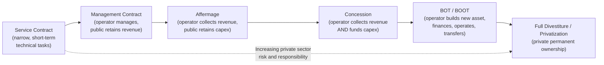

## Concession and Affermage Contracts

### Overview

Concession and affermage contracts represent a distinct family of PPP typologies characterized by their application to **existing infrastructure assets** rather than greenfield construction. Unlike BOT/BOOT or DBFO/DBFM structures, which are typically triggered by the need to build new infrastructure, concession and affermage arrangements are most commonly used when a government wishes to transfer the **operation, maintenance, and often capital investment responsibility** for an already-existing asset to a private operator, while retaining public ownership of the underlying infrastructure. These structures are especially prevalent in the water and sanitation, airport, port, and urban transit sectors.

### Core Definitions

**Key Points**

- **Concession contract**: A private operator is granted the right to operate an existing (or substantially existing) public asset for a defined period, collects revenue directly from users (tariffs, fees, tolls), and is typically responsible for both **operating expenditure and capital investment** (rehabilitation, expansion, renewal) over the concession term, in exchange for a concession fee paid to the government and/or an obligation to meet defined investment and service targets.
- **Affermage contract** (from the French *affermage*, sometimes translated as "lease" though this can cause confusion with a pure lease arrangement): A private operator manages and operates an existing asset, collects revenue from users, but the **capital investment obligation remains substantially with the government** or a public asset-holding entity, while the operator's fee is typically structured as a **fixed or formula-based tariff component** it retains from user charges, remitting a separate portion (sometimes called a "surtax" or redevance) to the public asset owner to fund government-led capital works.
- The key distinguishing feature between concession and affermage is **who bears the capital investment (capex) obligation**: concessions place capex substantially with the private operator, while affermage arrangements retain capex substantially with the public sector, with the private party's role concentrated on operations, maintenance, and revenue collection. [Inference — this is the standard distinction as applied in water sector PPP literature, particularly associated with French-origin models used extensively in Francophone Africa and elsewhere; specific national legal frameworks may define these terms with local variations]

### Comparative Table: Concession vs. Affermage vs. Management Contract vs. Lease

| Feature | Concession | Affermage | Lease (pure) | Management Contract |
| --- | --- | --- | --- | --- |
| Asset ownership | Public | Public | Public | Public |
| Capital investment (capex) responsibility | Private operator | Public sector | Public sector | Public sector |
| Operating expenditure (opex) responsibility | Private operator | Private operator | Private operator | Public sector (operator manages on public's behalf) |
| Revenue collection | Private operator (direct from users) | Private operator (direct from users, net of redevance) | Private operator (direct from users) | Public sector retains revenue; operator paid a fee |
| Demand risk | Private operator | Private operator (though often lower due to lower capex tied returns) | Private operator | Public sector (operator paid fixed/performance fee) |
| Typical contract duration | 15–30+ years | 8–15 years | 5–15 years | 3–5 years |
| Common sectors | Water utilities, airports, ports, toll roads | Water and sanitation utilities (esp. Francophone Africa) | Water utilities, agricultural infrastructure | Water utilities, hospitals (limited scope) |

**[Unverified]** Typical contract durations vary substantially by country, sector, and specific project; the ranges above are illustrative and should be verified against specific national PPP program data or the specific contract in question rather than treated as fixed standards.

### The PPP Contractual Spectrum: Private Sector Responsibility Gradient

This gradient illustrates that concession and affermage occupy a middle position on the broader PPP spectrum — more private responsibility than a management contract, but stopping short of the full private financing and ownership transfer characteristic of BOT/BOOT, and well short of full privatization/divestiture.

### The Redevance Mechanism in Affermage Contracts

**Key Points**

- A defining structural feature of affermage contracts is the **redevance** (sometimes translated as "surcharge," "capital charge," or "asset renewal fee"), a component of the user tariff that the private operator collects but does not retain — instead remitting it to the public asset owner (often a dedicated public investment fund or the municipal/national water authority) specifically to finance capital investment, network extension, and major asset renewal.
- This creates a structural separation between the **operator's tariff component** (retained by the operator to cover its operating costs and profit margin) and the **redevance component** (passed through to fund public-sector-led capital works), both of which are typically bundled into the single tariff paid by end users, though accounted for separately.
- A simplified tariff decomposition:

$$T_{user} = T_{opex} + T_{redevance}$$

Where $T_{user}$ is the total tariff charged to the end user, $T_{opex}$ is the operator's retained component covering operating costs and margin, and $T_{redevance}$ is the pass-through component remitted to the public asset owner for capital investment purposes.

**Example**

If a water utility charges an end user ₱45 per cubic meter, and the affermage contract specifies that ₱32 per cubic meter is retained by the private operator to cover operations and its margin, while ₱13 per cubic meter is remitted as redevance to the national water investment fund for network expansion and major asset renewal, then:

$$T_{opex} = ₱32/\text{m}^3, \quad T_{redevance} = ₱13/\text{m}^3, \quad T_{user} = ₱45/\text{m}^3$$

The operator's financial performance and returns are judged against the $T_{opex}$ component only, since the redevance funds are not part of the operator's revenue base and are typically ring-fenced for public capital works. [Inference — illustrative example constructed for demonstration, not derived from a specific real tariff structure]

### Risk Allocation Under Concession vs. Affermage

**Key Points**

- **Concession**: because the private operator bears both opex and capex responsibility, it assumes substantially more **long-term investment risk** — cost overruns on capital works, technology obsolescence, and the risk that tariff revenue proves insufficient to service the capital investment made. This generally requires a longer concession term (often 20–30+ years) to allow adequate time for capital cost recovery, and typically involves more complex project financing arrangements.
- **Affermage**: because capex remains with the public sector, the private operator's risk is more narrowly concentrated on **operating efficiency and revenue collection performance** — its returns depend on how efficiently it can operate the asset and collect tariffs relative to its retained tariff component, rather than on the success of large capital investment programs. This generally allows for shorter contract terms and simpler, less capital-intensive financing structures on the operator's side.
- **Demand risk** is typically borne by the private operator in both models, since revenue is collected directly from end users in both concession and affermage arrangements, though the magnitude of financial exposure differs given the different capital risk profiles layered on top.
- **[Inference]** The lower capital risk profile of affermage relative to concession is often cited as a reason affermage has been favored in some lower-income or higher-country-risk contexts, where attracting large-scale, long-tenor private capital investment for a full concession structure may be more difficult, though this generalization does not hold uniformly across all country and sector contexts.

### Concession Fees and Government Revenue

**Key Points**

- Concession contracts frequently include a **concession fee** paid by the operator to the government, which can take several forms:
  - **Upfront fee**: a lump-sum payment at contract signing, sometimes used by governments to monetize the value of the existing asset or the right to operate it.
  - **Annual/periodic fee**: a fixed or revenue-linked payment made throughout the concession term.
  - **Revenue-sharing arrangement**: a percentage of operator revenue (or profit above a defined threshold) shared with the government, sometimes structured progressively (higher revenue-sharing percentages at higher revenue/profit bands).
- The structuring of concession fees involves a trade-off: higher upfront or fixed fees provide more certain and immediate government revenue but may reduce the operator's capacity or willingness to invest in the asset, while revenue-sharing structures align government revenue with the asset's ongoing commercial performance but introduce revenue variability for the public sector. [Inference]

### Sectoral Applications

#### Water and Sanitation

**Key Points**

- Affermage contracts have been particularly prevalent in **water and sanitation utility management**, especially in Francophone West and Central Africa, where the model originated in French municipal water administration practice before being exported through development finance institution-supported reform programs.
- Concession contracts in the water sector have also been used extensively in various Latin American and Asian contexts, sometimes controversially, with several high-profile water concession contracts in the 1990s and 2000s subject to renegotiation, early termination, or public controversy over tariff increases — a history frequently cited in academic and civil society critique of water sector privatization more broadly. [Unverified — specific case outcomes and their causes are contested and vary significantly by case; general characterization of this historical pattern is well-documented in development economics and public policy literature, but citing specific cases accurately requires reference to the specific documented case]

#### Airports and Ports

**Key Points**

- Airport and port concessions are common globally, typically structured as full concessions (private operator responsible for both capex and opex) given the significant capital investment often required for terminal expansion, runway upgrades, or port capacity enhancement.
- Airport concessions frequently include both **aeronautical revenue** (landing fees, passenger service charges) and **non-aeronautical/commercial revenue** (retail concessions, parking, real estate) within the operator's revenue base, with the balance between these revenue streams a significant factor in concession valuation and bid structuring. [Inference]

#### Urban Transit

**Key Points**

- Urban rail, bus rapid transit, and metro system concessions vary in structure, sometimes resembling full concessions (private capex and opex, fare revenue) and sometimes resembling availability-payment DBFO-style structures (particularly where fare revenue is politically capped or insufficient to support private capital investment, requiring government payment support alongside or instead of fare revenue). [Inference]

### Illustrative Concession vs. Affermage Structure (svg_diagram)

<svg xmlns="http://www.w3.org/2000/svg" viewBox="0 0 700 420">
<text x="350" y="25" text-anchor="middle" font-size="16" font-weight="bold" fill="#1a1a1a">Concession vs. Affermage: Capex/Opex Split (svg_diagram)</text>

<text x="175" y="55" text-anchor="middle" font-size="14" font-weight="bold" fill="`#c0392b`">Concession</text>

<rect x="60" y="70" width="230" height="60" rx="6" fill="`#c0392b`" opacity="0.85" />

<text x="175" y="95" text-anchor="middle" font-size="12" fill="#fff" font-weight="bold">Private Operator</text>

<text x="175" y="112" text-anchor="middle" font-size="11" fill="#fff">Funds CAPEX + OPEX</text>

<rect x="60" y="150" width="230" height="45" rx="6" fill="#e8daef" opacity="0.9" />
<text x="175" y="175" text-anchor="middle" font-size="11" fill="#333">Collects full tariff revenue</text>
<rect x="60" y="205" width="230" height="45" rx="6" fill="#d5d8dc" opacity="0.9" />
<text x="175" y="230" text-anchor="middle" font-size="11" fill="#333">Government: asset owner,</text>
<text x="175" y="243" text-anchor="middle" font-size="10" fill="#555">receives concession fee</text>

<text x="525" y="55" text-anchor="middle" font-size="14" font-weight="bold" fill="`#2471a3`">Affermage</text>

<rect x="410" y="70" width="230" height="60" rx="6" fill="`#2471a3`" opacity="0.85" />

<text x="525" y="95" text-anchor="middle" font-size="12" fill="#fff" font-weight="bold">Private Operator</text>

<text x="525" y="112" text-anchor="middle" font-size="11" fill="#fff">Funds OPEX only</text>

<rect x="410" y="150" width="230" height="45" rx="6" fill="#e8daef" opacity="0.9" />
<text x="525" y="170" text-anchor="middle" font-size="11" fill="#333">Retains T-opex portion,</text>
<text x="525" y="183" text-anchor="middle" font-size="10" fill="#555">remits T-redevance</text>
<rect x="410" y="205" width="230" height="60" rx="6" fill="#d5d8dc" opacity="0.9" />
<text x="525" y="228" text-anchor="middle" font-size="11" fill="#333">Government: asset owner,</text>
<text x="525" y="243" text-anchor="middle" font-size="10" fill="#555">funds CAPEX using</text>
<text x="525" y="256" text-anchor="middle" font-size="10" fill="#555">redevance receipts</text>
</svg>

### Financial Modeling Considerations

**Key Points**

- **Concession** financial models typically resemble project finance structures similar to BOT/BOOT, projecting a full capital investment program alongside operating cash flows, since the operator must recover both capex and opex investment over the concession term — requiring careful attention to Debt Service Coverage Ratio (DSCR) and capital recovery timing given the typically longer asset life of rehabilitation and expansion works.
- **Affermage** financial models are comparatively simpler, focused primarily on operating margin analysis (retained tariff component minus operating costs) since large capital investment is not part of the operator's balance sheet, generally requiring less intensive project financing and a shorter investment horizon for the operator's own capital.
- Tariff-setting methodology — whether tariffs are fixed for the contract term, indexed to inflation, subject to periodic regulatory review, or tied to a rate-of-return or price-cap regulatory framework — is a critical driver of both models' financial viability and is often the subject of extensive negotiation and, in some contexts, independent regulatory oversight. [Inference]

### Common Structuring and Implementation Challenges

**Key Points**

- **Asset condition and baseline uncertainty**: because concession and affermage contracts apply to existing assets, accurately assessing the baseline condition of the asset at contract commencement is critical — disputes frequently arise over whether observed deterioration or required repairs stem from pre-existing conditions (public sector's historical responsibility) or post-contract operator neglect. [Inference]
- **Tariff affordability and political sensitivity**: because both models rely on direct user tariffs, and essential services like water are politically sensitive, tariff increases needed to make the arrangement financially viable for the operator (or to fund the redevance for capital works) can generate substantial public and political resistance, historically a significant source of contract renegotiation or early termination in several documented water concession cases. [Unverified — specific case details vary and should be sourced individually]
- **Regulatory capacity**: effective concession and affermage arrangements generally require a capable independent regulator or contracting authority to monitor performance, enforce tariff and service standards, and mediate disputes; weak regulatory capacity has been cited as a contributing factor in underperforming concession arrangements in various contexts. [Inference]
- **Redevance fund governance** (specific to affermage): ensuring that redevance receipts are genuinely ring-fenced and effectively deployed for the intended capital investment purposes — rather than diverted to other government spending priorities — has been identified as an implementation challenge in some affermage programs, since the operator has limited direct control or oversight over how the public asset owner uses redevance funds. [Inference]

**Related Topics**

- Build-Operate-Transfer and Build-Own-Operate-Transfer Structures
- Design-Build-Finance-Operate and Design-Build-Finance-Maintain Models
- Tariff Regulation Methodologies: Rate-of-Return vs. Price-Cap Frameworks
- Water Sector PPP Case Studies and Contract Renegotiation Patterns
- Independent Regulatory Capacity for Concession Oversight
- Airport and Port Concession Structuring and Revenue Sharing
- Management Contracts and Service Contracts in Public Utility Reform