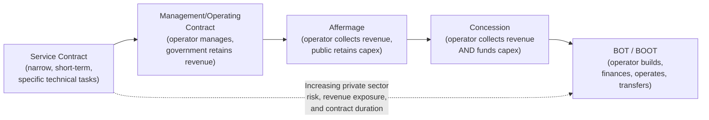

## Management and Operating Contracts

### Overview

Management and Operating Contracts represent the most limited form of private sector participation on the broader PPP contractual spectrum, positioned closest to pure public provision and furthest from the capital-intensive, long-tenor structures such as concessions or BOT/BOOT. Under these arrangements, a private operator is engaged to manage or operate a public asset or service on the government's behalf for a relatively short, fixed term, in exchange for a fee, while asset ownership, revenue collection, and capital investment responsibility remain substantially with the public sector. These structures are often used as a lower-risk entry point for introducing private sector operational expertise and management discipline into public service delivery, frequently as a precursor or stepping stone to more ambitious PPP structures.

### Core Definitions

**Key Points**

- **Management contract**: A private operator is engaged to manage the day-to-day operation of a public asset or service — including staffing decisions, operational planning, and performance improvement — but **does not collect revenue directly** from end users and **does not bear commercial risk**; the government retains revenue collection and pays the operator a fee, which may be fixed, performance-linked, or a combination of both.
- **Operating contract** (sometimes used interchangeably with management contract, though in some frameworks treated as a narrower subset): typically focuses more specifically on the technical and operational execution of running an asset (e.g., operating a water treatment plant's technical processes) rather than the broader managerial and institutional capacity-building scope sometimes associated with "management contracts" in development finance institution usage.
- In both variants, the private party's compensation is structurally **decoupled from end-user revenue and demand risk** — the operator is paid by the government (or a public utility) based on the contract terms, not by collecting tariffs directly from the public, which is the key distinguishing feature separating these contracts from concession, affermage, or BOT/BOOT structures. [Inference — the management/operating contract distinction is used inconsistently across institutions and literature; some multilateral development bank guidance treats them as broadly synonymous, while others draw finer distinctions based on scope]

### Position on the PPP Spectrum

Management and operating contracts sit adjacent to, and are sometimes preceded by, even narrower **service contracts** (which cover discrete technical tasks such as billing system installation, meter reading, or a specific maintenance campaign, typically for a period of months rather than years), while management contracts encompass a broader, ongoing operational mandate.

### Comparative Table: Management/Operating Contract vs. Service Contract vs. Affermage

| Feature | Service Contract | Management/Operating Contract | Affermage (for contrast) |
| --- | --- | --- | --- |
| Scope | Narrow, discrete technical task | Broad, ongoing day-to-day operations | Broad operations + revenue collection |
| Typical duration | Months to 2 years | 3–5 years | 8–15 years |
| Revenue collection | N/A (public retains) | Public sector retains | Private operator collects |
| Private party bears commercial/demand risk | No | No | Yes |
| Payment to private party | Fixed fee for defined task | Fixed and/or performance-linked management fee | Retained tariff component |
| Capital investment responsibility | N/A | Public sector | Public sector |
| Typical objective | Solve a specific technical problem | Improve operational efficiency, build institutional capacity | Operate asset commercially while public funds capex |

### Fee and Payment Structures

**Key Points**

- **Fixed fee structure**: the operator receives a predetermined fee (often paid periodically over the contract term) regardless of operational performance, providing payment certainty but comparatively weaker performance incentives.
- **Performance-linked fee structure**: a portion of the operator's compensation is tied to achieving specified Key Performance Indicators (KPIs) — such as reductions in non-revenue water (water lost to leaks or unbilled consumption), improvements in bill collection rates, reductions in equipment downtime, or service coverage expansion targets.
- **Hybrid structure**: combines a base fixed fee (covering the operator's core costs and a baseline margin) with a performance-linked bonus component, which is the structure most commonly recommended in development finance institution guidance as balancing payment predictability with genuine efficiency incentives. [Inference]
- A simplified performance-linked fee formula:

$$F_{total} = F_{base} + \sum_{k} w_k \cdot \max(0, KPI_k^{actual} - KPI_k^{target})$$

Where $F_{total}$ is the total fee paid, $F_{base}$ is the fixed base component, and each term in the summation represents a weighted bonus $w_k$ earned for exceeding a specific performance target $KPI_k^{target}$ (with the $\max(0, \cdot)$ ensuring no bonus is paid, and typically no penalty applied beyond the base fee reduction mechanism, for underperformance relative to target — the specific penalty/bonus symmetry varies by contract design).

**Example**

Consider a water utility management contract with a base annual fee of ₱40,000,000, plus a performance bonus of ₱2,000,000 for each percentage point reduction in non-revenue water below a 35% baseline target, capped at a maximum bonus of ₱20,000,000. If the operator achieves a reduction to 28% (7 percentage points below the 35% target):

$$\text{Bonus} = 7 \times ₱2{,}000{,}000 = ₱14{,}000{,}000$$

$$F_{total} = ₱40{,}000{,}000 + ₱14{,}000{,}000 = ₱54{,}000{,}000$$

Since ₱14,000,000 is below the ₱20,000,000 cap, the full calculated bonus is paid. This structure directly rewards the operator for a specific, measurable efficiency outcome without exposing it to broader tariff revenue or demand risk. [Inference — illustrative example constructed for demonstration, not derived from a specific real contract]

### Risk Allocation Under Management/Operating Contracts

**Key Points**

- **Commercial/demand risk**: remains with the government or public utility, since the operator does not collect end-user revenue directly — this is the defining risk allocation feature of this contract type.
- **Operational/performance risk**: transferred to the private operator to the extent captured in the KPI framework — the operator bears the risk of not earning performance bonuses (or, in some structures, facing fee deductions) if it fails to meet operational targets, but this risk is generally bounded and does not expose the operator to the kind of open-ended financial loss possible under a concession or BOT structure.
- **Capital investment risk**: remains entirely with the public sector, since management and operating contracts do not typically involve private capital expenditure on asset rehabilitation or expansion — the operator works within the existing asset base as provided.
- **Political and institutional risk**: because these contracts are generally shorter-term and lower-capital-commitment, the private operator's exposure to long-term political or regulatory risk is substantially lower than under multi-decade concession or BOT arrangements, which is one of the reasons these structures are sometimes used in higher political-risk or lower-institutional-capacity contexts as an initial step before considering more ambitious PPP structures. [Inference]

### Typical Applications and Rationale

**Key Points**

- **Institutional capacity building**: management contracts are frequently used explicitly as a **capacity-building mechanism**, where the private operator's mandate includes training public sector staff, introducing modern management information systems, and establishing operational practices intended to persist after the contract ends and the asset potentially reverts to fully public operation or transitions to a more advanced PPP structure.
- **Turnaround situations**: governments facing a poorly performing public utility (e.g., high non-revenue water, poor bill collection, chronic service interruptions) sometimes use a management contract as a relatively low-risk mechanism to introduce private operational expertise and demonstrate improved performance before committing to a longer-term, higher-capital-commitment structure such as a concession or affermage.
- **Political sensitivity mitigation**: because management contracts do not involve private tariff collection or asset ownership transfer, they are sometimes viewed as more politically palatable in contexts where private sector involvement in essential services (water, in particular) is a sensitive or contested policy issue, since the government retains visible control over revenue and pricing decisions. [Inference]
- **Sector applications**: management and operating contracts have been used across water and sanitation utilities, airport operations, hospital facility management (non-clinical functions), power sector operations, and various municipal service functions (solid waste management operations, for example) in numerous countries, often with support or promotion from multilateral development banks as part of broader public sector reform programs. [Unverified — specific program details and outcomes vary by country and case and should be sourced individually rather than generalized]

### Structural Diagram: Management Contract Payment and Oversight Flow (svg_diagram)

<svg xmlns="http://www.w3.org/2000/svg" viewBox="0 0 700 400">
<text x="350" y="25" text-anchor="middle" font-size="16" font-weight="bold" fill="#1a1a1a">Management Contract Structure (svg_diagram)</text>
<rect x="260" y="50" width="180" height="55" rx="6" fill="#2471a3" opacity="0.9" />
<text x="350" y="73" text-anchor="middle" font-size="12" fill="#fff" font-weight="bold">Government / Public Utility</text>
<text x="350" y="90" text-anchor="middle" font-size="11" fill="#fff">(Asset owner, revenue holder)</text>
<rect x="260" y="180" width="180" height="55" rx="6" fill="#c0392b" opacity="0.9" />
<text x="350" y="203" text-anchor="middle" font-size="12" fill="#fff" font-weight="bold">Private Operator</text>
<text x="350" y="220" text-anchor="middle" font-size="11" fill="#fff">(Manages operations)</text>
<rect x="40" y="300" width="180" height="50" rx="6" fill="#7d6608" opacity="0.9" />
<text x="130" y="322" text-anchor="middle" font-size="11" fill="#fff" font-weight="bold">End Users</text>
<text x="130" y="338" text-anchor="middle" font-size="10" fill="#fff">Pay tariffs to government</text>
<rect x="480" y="300" width="180" height="50" rx="6" fill="#1e8449" opacity="0.9" />
<text x="570" y="322" text-anchor="middle" font-size="11" fill="#fff" font-weight="bold">Fee Payment</text>
<text x="570" y="338" text-anchor="middle" font-size="10" fill="#fff">Base + performance bonus</text>
<line x1="350" y1="105" x2="350" y2="180" stroke="#333" stroke-width="1.5" marker-end="url(#arrow2)" />
<text x="360" y="145" font-size="10" fill="#333">Management Contract</text>
<line x1="130" y1="300" x2="280" y2="105" stroke="#333" stroke-width="1.5" marker-end="url(#arrow2)" />
<text x="150" y="230" font-size="10" fill="#333">Tariff revenue</text>
<line x1="420" y1="105" x2="560" y2="300" stroke="#333" stroke-width="1.5" marker-end="url(#arrow2)" />
<text x="480" y="230" font-size="10" fill="#333">Fee (govt to operator)</text>
</svg>

### Limitations and Critiques

**Key Points**

- **Weak performance incentives relative to revenue-linked models**: because the operator does not bear commercial or demand risk, and its potential upside is generally capped by the performance bonus structure, critics argue that management contracts provide comparatively weaker incentives for genuine transformational efficiency improvement compared to models where the operator's own capital and revenue are directly at stake (such as concessions), a critique sometimes summarized as the "skin in the game" argument. [Inference — this is a commonly cited theoretical critique in PPP literature, though empirical evidence on the actual comparative performance of management contracts versus higher-risk-transfer models is mixed and context-dependent]
- **Short contract duration limits transformational impact**: with typical durations of 3–5 years, critics note that management contracts may be too short to achieve deep institutional reform or to justify significant operator investment in staff training, systems, or process redesign, particularly if renewal is uncertain. [Inference]
- **Capacity building may not persist**: even where management contracts successfully introduce improved management practices, systems, or trained staff, there is no guarantee these improvements persist after the contract ends, particularly if the asset reverts to public management without the discipline, systems, or accountability structures maintained by the private operator's exit. [Inference]
- **Limited capital investment addresses only part of underperformance**: because management contracts explicitly exclude capital investment responsibility, they may be poorly suited to situations where poor service performance stems substantially from underinvestment in physical infrastructure (aging pipes, insufficient treatment capacity) rather than purely operational or managerial deficiencies, in which case a management contract alone would not resolve the underlying capital constraint. [Inference]

### KPI Design Considerations

**Key Points**

- Well-designed KPI frameworks for management contracts typically balance **outcome metrics** (e.g., non-revenue water percentage, customer satisfaction scores, service coverage rates) with **process metrics** (e.g., billing accuracy, complaint resolution time), since outcome metrics alone can sometimes be influenced by factors outside the operator's direct control (such as underlying infrastructure condition inherited from before the contract began).
- Establishing an accurate **performance baseline** at contract commencement is critical, since bonus payments are typically calculated relative to improvement against this baseline — an inaccurate or manipulated baseline (whether artificially high or low) can distort incentive alignment for the entire contract term. [Inference]
- KPI frameworks generally require independent verification or auditing mechanisms (rather than relying solely on operator self-reporting) to maintain credibility and avoid disputes over bonus payment calculations. [Inference]

### Transition Pathways to Other PPP Structures

**Key Points**

- Management and operating contracts are sometimes explicitly designed as a **transitional phase** within a broader sector reform sequence, where a government first uses a management contract to improve operational performance, data quality, and institutional capacity, before subsequently tendering a longer-term affermage or concession contract once baseline performance and asset condition data are better established.
- This sequencing can reduce information asymmetry for potential concession or affermage bidders (since improved operational data from the management contract phase provides more reliable due diligence information), potentially improving the quality and competitiveness of subsequent PPP tenders. [Inference]
- **[Unverified]** The frequency and success rate of this specific transition pathway (management contract → concession/affermage) varies significantly by country and sector and should be assessed against documented case studies rather than assumed as a standard or guaranteed reform sequence.

**Related Topics**

- Concession and Affermage Contracts
- Service Contracts and Narrow-Scope Private Sector Engagement
- Key Performance Indicator (KPI) Design for Utility Management Contracts
- Non-Revenue Water Reduction Programs and Performance-Based Contracting
- Institutional Capacity Building in Public Utility Reform
- Sector Reform Sequencing: From Management Contracts to Full Concessions
- Independent Performance Verification and Audit Mechanisms in PPP Contracts