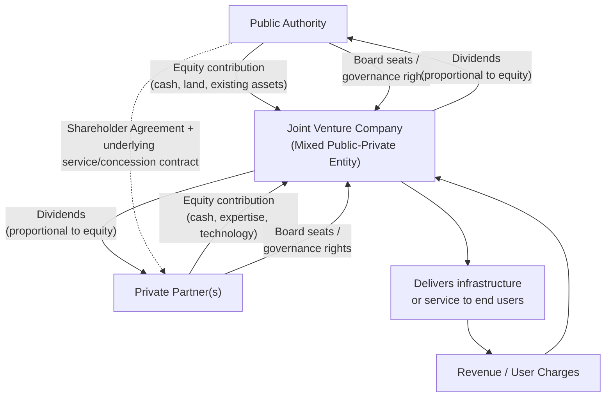

## Joint Ventures and Institutionalized PPPs

### Overview

Joint Ventures (JVs) and Institutionalized Public-Private Partnerships (IPPPs) represent a structurally distinct category within the PPP taxonomy, differentiated from the purely **contractual PPP (CPPP)** models covered elsewhere in this chapter (BOT/BOOT, DBFO/DBFM, concession, affermage, management contracts) by the creation of a **shared corporate entity** in which both the public and private partners hold equity ownership. Rather than the public and private parties relating to each other purely through a contract governing a defined service or asset, institutionalized PPPs involve the government becoming a **co-owner** of the delivery vehicle itself, fundamentally altering the governance, risk-sharing, and accountability dynamics of the arrangement.

### Core Definitions

**Key Points**

- **Institutionalized PPP (IPPP)**: A PPP structure in which the public authority and one or more private partners jointly establish or co-own a legal entity (a joint venture company, mixed-capital company, or similar corporate vehicle) that is then responsible for delivering the infrastructure or service, with both parties holding equity stakes and typically board representation.
- **Contractual PPP (CPPP)**, by contrast (covered in the BOT/BOOT, DBFO/DBFM, and concession content in this chapter): the public and private parties relate through a bilateral contract, with the private party typically structured as a wholly private Special Purpose Vehicle (SPV) in which the government holds no equity stake.
- The defining structural feature of an IPPP is that the **public sector holds an ownership interest in the delivery entity itself**, not merely a contractual counterparty relationship — this changes the government's role from external regulator/purchaser to internal co-owner with associated governance rights and fiduciary considerations. [Inference — this is the standard distinction used in EU PPP policy literature and broader international practice, though specific equity thresholds or governance requirements that qualify an arrangement as "institutionalized" vary by jurisdiction and are not universally standardized]

### IPPP vs. CPPP: Comparative Structure

| Feature | Contractual PPP (CPPP) | Institutionalized PPP (IPPP) |
| --- | --- | --- |
| Public sector role | External counterparty/regulator | Co-owner/shareholder |
| Delivery vehicle ownership | Wholly private SPV | Mixed public-private joint venture entity |
| Governance mechanism | Contract terms, KPIs, step-in rights | Board representation, shareholder agreement, contract |
| Public sector financial exposure | Defined by contract (payments, guarantees) | Equity investment + contractual exposure |
| Typical legal basis | Concession law, procurement law, specific PPP contract | Company law + PPP/procurement law (dual legal framework) |
| Common examples | BOT, BOOT, DBFO, DBFM, concession, affermage | Mixed-capital utility companies, urban development JVs |

### Structural and Governance Diagram

### Rationale for Institutionalized PPP Structures

**Key Points**

- **Deeper alignment of long-term interests**: because both parties hold an equity stake in the same entity, proponents argue IPPPs can create stronger alignment of long-term incentives than a purely contractual relationship, since the government shares directly in both the upside (dividends, asset value appreciation) and downside (losses, need for additional capital injections) of the venture's performance, rather than relying solely on contractual enforcement mechanisms. [Inference — this is a commonly cited theoretical rationale in EU and academic PPP literature, though the empirical evidence on whether this alignment actually produces better outcomes than well-structured contractual PPPs is mixed and contested]
- **Retained government influence over strategic decisions**: board representation gives the public partner ongoing influence over major strategic and operational decisions throughout the entity's life, rather than the more limited, contract-defined intervention rights (such as step-in rights upon default) typical of contractual PPPs.
- **Asset or land contribution as an alternative to cash equity**: IPPPs can allow a government to contribute non-cash assets (existing land, infrastructure, or in-kind contributions) as its equity stake, which can be attractive where the public authority has valuable assets but limited fiscal capacity for cash co-investment.
- **Common in urban development and regeneration**: IPPP structures have been particularly associated with urban development, land regeneration, and mixed-use real estate projects, where the public authority often contributes land as equity and the private partner contributes development expertise and financing, sharing in the resulting commercial development's value. [Inference]
- **Mixed-capital utility companies**: in some countries, particularly in parts of Europe and Latin America, water, energy, or transit utilities have been restructured as mixed-capital companies (sometimes termed "société d'économie mixte" in French-influenced legal traditions) with government and private shareholders, blending institutionalized ownership with an underlying operating concession or affermage-style contract governing day-to-day operations. [Unverified — specific prevalence and legal forms vary substantially by country and should be verified against the relevant national company and PPP law]

### Governance Complexity: Dual Legal Frameworks

**Key Points**

- IPPPs typically operate under **two overlapping legal frameworks simultaneously**: general company law (governing the joint venture entity's corporate governance, shareholder rights, and fiduciary duties) and public procurement/PPP-specific law (governing how the public partner's participation was established, competitive tendering requirements, and often an underlying service or concession contract between the public authority and the JV entity itself).
- This dual framework can create **governance complexity and potential conflicts of interest**: the public authority may simultaneously act as (a) a shareholder in the JV entity, (b) the regulator or contracting authority overseeing the JV's service delivery performance, and (c) in some structures, the entity granting the underlying concession or contract to the JV it partially owns — creating a structural tension between the government's ownership interest (which benefits from the JV's commercial success) and its regulatory/oversight interest (which requires arm's-length scrutiny of the JV's performance). [Inference — this conflict-of-interest concern is frequently raised in EU PPP policy discussions regarding IPPPs, particularly in the context of competitive neutrality and state aid rules]
- The **European Union's state aid and public procurement rules** have historically required careful structuring of IPPPs to ensure the private partner's selection process is suffiently competitive and transparent (since selecting a private partner to join a mixed-capital entity can otherwise function as a de facto uncompeted procurement of the underlying services), and the European Commission has issued specific guidance addressing how IPPPs should be structured to comply with EU procurement directives. [Unverified — specific current EU legal requirements should be verified against the applicable procurement directive and any updated European Commission guidance, as legal frameworks in this area have evolved over time]

### Financial Structuring Considerations

**Key Points**

- **Equity contribution structuring**: the relative equity stakes of the public and private partners (and whether contributed as cash, land, existing infrastructure, or in-kind services) directly determine both parties' proportional claim on dividends and their voting/governance rights, making the initial valuation of non-cash contributions (particularly land or existing assets) a critical and sometimes contentious element of IPPP structuring. [Inference]
- **Capital call and additional funding provisions**: because both parties are equity holders rather than one party being purely a contractual counterparty, IPPP shareholder agreements typically include provisions governing how additional capital needs (e.g., for cost overruns or expansion) are funded — whether through proportional capital calls on both shareholders, additional private equity/debt raised by the JV entity itself, or other mechanisms — and disputes over additional funding obligations are a documented source of tension in some IPPP arrangements. [Inference]
- **Dividend policy and reinvestment**: shareholder agreements must also address the balance between distributing dividends to shareholders (including the public partner, which may value near-term fiscal revenue) versus reinvesting profits into asset maintenance or expansion (which may be more aligned with long-term service quality objectives), a tension that can arise particularly where the public partner faces near-term fiscal pressure.
- **Exit mechanisms**: because IPPPs create an ongoing corporate relationship rather than a fixed-term contract with a defined transfer date, shareholder agreements typically require explicit exit provisions — buy-sell/shotgun clauses, rights of first refusal on share transfers, and mechanisms for valuing and unwinding either party's stake — which can be more complex to negotiate and execute than the handback provisions typical of contractual PPPs. [Inference]

### Comparative Risk and Accountability Profile

| Dimension | Contractual PPP | Institutionalized PPP |
| --- | --- | --- |
| Government financial exposure if venture underperforms | Limited to defined contractual liabilities (e.g., termination payments, guarantees) | Potentially unlimited to the extent of equity stake, plus possible additional capital call exposure |
| Ease of switching operators/partners at contract end | Relatively clear (new tender, new SPV) | More complex (requires share transfer, valuation, potential legal disputes) |
| Transparency and public accountability | Generally clearer (contract terms are the primary reference document) | More complex (financial performance embedded in company accounts, subject to company law disclosure rules rather than solely public contract disclosure norms) |
| Political/reputational risk if venture fails | Government as counterparty, can potentially terminate/re-tender | Government as co-owner, may share reputational and financial consequences of failure more directly |

**[Inference]** This comparative table reflects general structural characteristics commonly discussed in PPP governance literature; actual risk exposure in any specific IPPP depends heavily on the specific shareholder agreement, equity stake size, and any parallel guarantees or contractual protections negotiated.

### Illustrative Example: Mixed-Capital Utility Structure (svg_diagram)

<svg xmlns="http://www.w3.org/2000/svg" viewBox="0 0 700 400">
<text x="350" y="25" text-anchor="middle" font-size="16" font-weight="bold" fill="#1a1a1a">Mixed-Capital Utility with Underlying Concession (svg_diagram)</text>
<rect x="60" y="60" width="180" height="55" rx="6" fill="#2471a3" opacity="0.9" />
<text x="150" y="83" text-anchor="middle" font-size="12" fill="#fff" font-weight="bold">Municipal Government</text>
<text x="150" y="100" text-anchor="middle" font-size="10" fill="#fff">(e.g., 49% equity)</text>
<rect x="460" y="60" width="180" height="55" rx="6" fill="#c0392b" opacity="0.9" />
<text x="550" y="83" text-anchor="middle" font-size="12" fill="#fff" font-weight="bold">Private Operator</text>
<text x="550" y="100" text-anchor="middle" font-size="10" fill="#fff">(e.g., 51% equity)</text>
<rect x="235" y="180" width="230" height="70" rx="6" fill="#6c3483" opacity="0.9" />
<text x="350" y="205" text-anchor="middle" font-size="12" fill="#fff" font-weight="bold">Mixed-Capital Company</text>
<text x="350" y="222" text-anchor="middle" font-size="10" fill="#fff">(Joint Venture Entity)</text>
<text x="350" y="238" text-anchor="middle" font-size="10" fill="#fff">Board: proportional representation</text>
<line x1="150" y1="115" x2="280" y2="180" stroke="#333" stroke-width="1.5" />
<text x="155" y="150" font-size="10" fill="#333">Equity + governance</text>
<line x1="550" y1="115" x2="420" y2="180" stroke="#333" stroke-width="1.5" />
<text x="480" y="150" font-size="10" fill="#333">Equity + governance</text>
<rect x="235" y="300" width="230" height="55" rx="6" fill="#7d6608" opacity="0.9" />
<text x="350" y="323" text-anchor="middle" font-size="12" fill="#fff" font-weight="bold">End Users</text>
<text x="350" y="340" text-anchor="middle" font-size="10" fill="#fff">Pay tariffs for service</text>
<line x1="350" y1="250" x2="350" y2="300" stroke="#333" stroke-width="1.5" marker-end="url(#arrow3)" />
<text x="360" y="280" font-size="10" fill="#333">Service delivery</text>
</svg>

### Common Applications

**Key Points**

- **Urban development and land regeneration**: joint ventures where the public authority contributes publicly-owned land as equity and the private partner contributes development capital and expertise, sharing in the value created by the resulting mixed-use, commercial, or residential development — common in large-scale urban renewal or transit-oriented development projects. [Inference]
- **Utility restructuring**: mixed-capital company structures for water, energy distribution, or public transit utilities, often emerging from a policy decision to partially privatize a previously wholly state-owned utility while retaining a public ownership stake and governance influence rather than pursuing full divestiture.
- **Special economic zones and industrial park development**: joint ventures between government entities (sometimes at the national, regional, or municipal level) and private industrial developers to plan, finance, and manage special economic zones, industrial parks, or similar large-scale development areas. [Inference]
- **Airport and port authority restructuring**: in some jurisdictions, formerly wholly state-owned airport or port authorities have been restructured as mixed-capital companies with private strategic investors taking a minority or majority equity stake alongside continued government ownership. [Unverified — specific examples and structures vary considerably by country and should be verified individually]

### Limitations and Critiques

**Key Points**

- **Conflict of interest between ownership and regulatory roles**: as discussed above, when the government is simultaneously a shareholder benefiting from the JV's commercial success and the regulator responsible for holding it accountable to service standards, critics argue this can weaken effective independent oversight compared to a purely contractual PPP where the government's regulatory role is not complicated by a financial ownership stake in the entity being regulated. [Inference]
- **Reduced competitive tension over the contract life**: unlike a contractual PPP concession, which typically has a defined end date triggering a new competitive tender, an IPPP's corporate structure can persist indefinitely (subject to shareholder agreement exit provisions), potentially reducing the periodic competitive pressure that re-tendering would otherwise provide. [Inference]
- **Complexity and transaction costs**: establishing and governing a joint venture entity — including negotiating shareholder agreements, valuing in-kind contributions, and navigating the dual legal framework of company law and procurement/PPP law — generally involves higher transaction costs and longer structuring timelines than establishing a straightforward contractual PPP. [Inference]
- **Fiscal risk and contingent liability**: the public partner's equity stake, and potential exposure to future capital calls, represents a form of fiscal risk that may not always be as transparently disclosed or as well understood by legislative oversight bodies as the more clearly defined payment obligations typical of contractual PPPs (such as availability payments under a DBFM contract), a concern raised in various public financial management and fiscal transparency literature. [Inference]

### Selecting Between Institutionalized and Contractual PPP Structures

**Key Points**

- The choice between an IPPP and a CPPP structure typically depends on factors including: the government's objectives regarding long-term strategic control and revenue-sharing (favoring IPPP), the desire for clearer contractual accountability and eventual re-competition (favoring CPPP), the availability of non-cash assets (such as land) the government wishes to contribute as equity (favoring IPPP), and the relative institutional and legal capacity to manage the added governance complexity of a joint venture structure (favoring CPPP where capacity is more limited). [Inference]
- Some multilateral development bank and national PPP unit guidance documents express a general preference for contractual PPP structures over institutionalized structures specifically due to the governance complexity and conflict-of-interest concerns discussed above, though this is not a universal position and IPPPs remain a recognized and used structure in specific contexts, particularly urban development and certain utility restructuring scenarios. [Unverified — the relative institutional preference for CPPP versus IPPP structures varies by jurisdiction, sector, and evolving policy guidance, and should be verified against current national PPP framework documents]

**Related Topics**

- Concession and Affermage Contracts
- Management and Operating Contracts
- Mixed-Capital Company Structures in Utility Restructuring
- EU Public Procurement Rules and State Aid Considerations for Joint Ventures
- Shareholder Agreement Structuring: Exit Mechanisms and Capital Call Provisions
- Land Valuation and In-Kind Equity Contribution in Urban Development PPPs
- Fiscal Risk Disclosure for Contingent Liabilities in Government-Owned Enterprises