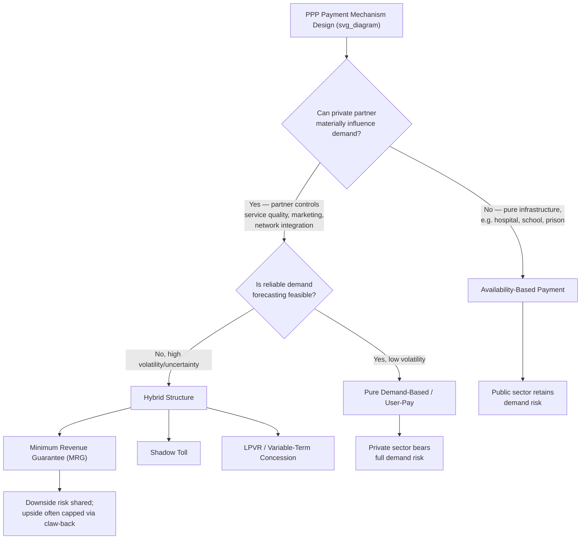

## Availability-Based versus Demand-Based Contract Structures

### Overview

Availability-based and demand-based (revenue-risk) payment mechanisms represent the two primary archetypes for structuring how a private partner is compensated in a PPP. The distinction determines which party bears **usage/demand risk**, and cascades into differences in project finance bankability, risk pricing, incentive alignment, and applicable sectors. Most real-world PPPs fall along a spectrum between these two poles, or use hybrid structures that blend elements of both.

### Core Definitions

**Availability-Based Payment (also called "Availability Payment," "Unitary Charge," or "Government Payment" model)**: The private partner receives a periodic payment (typically monthly or quarterly) from the public authority conditional on the asset being **available for use** at a specified performance/quality standard — regardless of how many users actually use the asset.

**Demand-Based Payment (also called "Revenue Risk," "User-Pay," or "Toll Road" model)**: The private partner's revenue comes directly from **end-user charges** (tolls, fares, tariffs) or usage-based payments, making revenue a direct function of actual demand/volume.

$$\text{Availability Payment: } R_t = f(\text{Performance}_t) \quad \text{independent of } Q_t$$

$$\text{Demand-Based Payment: } R_t = P \times Q_t$$

where $R_t$ is revenue in period $t$, $Q_t$ is quantity/volume of usage, and $P$ is the price/tariff per unit of use.

### Risk Allocation Comparison

**Key Points**

| Risk Category | Availability-Based | Demand-Based |
| --- | --- | --- |
| Demand/volume risk | Retained by public authority (grantor) | Transferred to private partner |
| Construction risk | Typically transferred to private partner | Typically transferred to private partner |
| Operating/maintenance risk | Transferred to private partner | Transferred to private partner |
| Performance/quality risk | Transferred to private partner (payment deductions for non-availability) | Transferred to private partner, but secondary to demand risk |
| Macroeconomic/traffic forecasting risk | Retained by public authority | Borne by private partner (and ultimately by lenders/equity) |
| Revenue predictability | High — cash flows resemble an annuity | Low to moderate — cash flows correlate with GDP, fuel prices, competing routes, etc. |

This allocation follows directly from the **incomplete contracts / property rights logic** covered under bundling: risk is assigned to the party that holds the residual control rights and decision-making capacity over the underlying driver of that risk. The public authority typically controls macro policy variables (competing free roads, land use, economic policy) that drive demand, which is the standard justification for why pure demand risk transfer to a private party is often considered inefficient unless that party also has meaningful influence over demand generation (e.g., through marketing, service quality, or network integration).

### Availability-Based Model: Mechanics

**Key Points**

- Payment formula typically structured as a **base unitary charge** minus **deductions** for:
  - Unavailability (lane/facility closures, downtime)
  - Performance failures against Key Performance Indicators (KPIs) (e.g., response time to defects, cleanliness standards, safety incidents)
- Deduction regimes are usually **tiered/banded**, with escalating penalties for repeated or prolonged failures, and can include a "persistent breach" trigger that allows contract termination.
- Payments often begin only at **service commencement** (post-construction), meaning the private partner bears full construction-period financing risk with no revenue until the asset is operational.
- Payments are frequently **indexed to inflation** (e.g., linked to a Consumer Price Index) to preserve real value over the (often 25–30 year) contract term.

$$\text{Unitary Charge}_t = \text{Base Charge}_t - \sum_k D_k(\text{Performance Failure}_k)$$

**Example**

A hospital PPP (common in UK PFI/PF2 and Canadian P3 social infrastructure) pays the private partner a fixed monthly unitary charge covering capital recovery, financing costs, and facilities-management services (cleaning, catering, maintenance — *not clinical services*, which remain public). If the private partner fails to maintain operating theatres above a specified uptime threshold, deductions reduce that month's payment; the number of patients treated has no direct bearing on the private partner's revenue.

### Demand-Based Model: Mechanics

**Key Points**

- Revenue directly tied to traffic/ridership/usage volumes multiplied by a regulated or contractually-set tariff.
- Tariff-setting mechanisms vary:
  - **Fixed schedule** with periodic escalation clauses (inflation-indexed).
  - **Price-cap regulation** (RPI-X style), common in utility-style concessions.
  - **Rate-of-return regulation**, less common in modern PPPs due to weak cost-control incentives.
- Often paired with **risk-mitigation instruments** because pure demand risk is difficult to finance:
  - **Minimum Revenue Guarantees (MRGs)**: government tops up revenue if actual demand falls below a threshold.
  - **Revenue-sharing/claw-back mechanisms**: government captures upside revenue above a ceiling, symmetric to the MRG downside protection.
  - **Present-Value-of-Revenue (PVR) / Least-Present-Value-of-Revenue (LPVR) auctions**: the concession term itself is variable, ending once the operator collects a pre-bid target present value of revenue, which mechanically shifts *traffic forecasting risk* away from the private bidder (the classic mechanism proposed by Engel, Fischer, and Galetovic).

**Example**

A toll road concession charges vehicles a per-trip toll. If actual traffic volumes come in below the base-case forecast used in the bid (a common empirical finding in toll-road PPPs globally), the concessionaire's revenue and debt-service coverage ratio fall correspondingly, potentially triggering technical default on project-finance loan covenants even if construction and operations were executed perfectly.

### Diagram: Payment Mechanism Decision Structure (svg_diagram)

### Hybrid and Intermediate Structures

**Key Points**

- **Shadow Tolls**: The public authority pays the private partner per unit of usage (e.g., per vehicle), but the *end user* pays nothing directly. This transfers *some* volume-sensitivity to the private partner's revenue stream (revenue still varies with traffic) while avoiding the political and equity concerns of direct user tolling. It differs from a pure demand model because the payer is the government, not the user, but differs from pure availability payment because revenue still fluctuates with usage bands.
- **Minimum Revenue Guarantees (MRGs)**: Converts a demand-based structure into a partial hybrid by placing a floor under revenue, effectively giving the private partner a payoff structure resembling a **put option** written by the government.

$$R_t^{MRG} = \max\left(P \times Q_t,\ R_{min}\right)$$

- **Availability Payments with Usage-Linked Bonus/Malus**: A primarily availability-based contract can incorporate small demand-linked incentive payments (e.g., ridership bonuses in some transit PPPs) without transferring full demand risk, used to partially align private incentives with service-quality outcomes that indirectly drive usage.

### Bankability and Project Finance Implications

**Key Points**

- Availability-based structures generally achieve **higher leverage ratios and lower cost of debt**, because lenders can underwrite against a contractually predictable cash flow stream with performance risk as the primary variable, rather than volatile market demand.
- Demand-based structures typically require **higher equity cushions**, **debt service reserve accounts**, and sometimes **credit enhancement** (government guarantees, multilateral development bank partial risk guarantees) to be financeable, since lenders discount uncertain traffic/ridership forecasts heavily — [Inference] this is widely reflected in credit rating agency methodologies (e.g., Moody's, S&P frameworks for project finance) that apply materially different risk weightings to availability-based versus merchant/demand-risk project structures, though exact weightings vary by rating agency and have been revised over time.
- **Traffic risk optimism bias** is a well-documented empirical phenomenon in toll-road PPPs (independent of the theoretical framework): actual traffic frequently falls below bid-stage forecasts in the early years of operation, a pattern studied extensively in infrastructure finance literature (e.g., Bain's research on traffic forecasting accuracy in toll road concessions).

### Sectoral Applicability

| Sector | Typical Structure | Rationale |
| --- | --- | --- |
| Social infrastructure (hospitals, schools, prisons, government buildings) | Availability-based | No direct "user charge" is feasible/appropriate; usage doesn't vary in a way private partner can influence |
| Toll roads / bridges (greenfield, uncertain demand) | Demand-based or LPVR hybrid | Direct usage measurable; user-pays principle politically/economically justified |
| Toll roads (mature, stable traffic corridors) | Demand-based with MRG, or availability-based conversion | Predictable demand makes pure user-pay financeable without heavy guarantees |
| Urban transit / light rail | Availability-based or shadow toll | Fare revenue often retained by public transit authority for network/fare-integration reasons; ridership risk considered largely outside operator's control |
| Water/wastewater utilities | Demand-based (tariff) with regulatory price caps | Usage-based billing is standard utility practice; regulated to prevent monopoly pricing |
| Power generation (IPPs) | Availability-based (capacity payment) + demand-based (energy payment) hybrid | Reflects the distinct fixed-capacity and variable-output components of the underlying asset economics |

### Public Sector Fiscal and Accounting Considerations

**Key Points**

- Availability payments are frequently scrutinized under public accounting standards (e.g., IPSAS 32, Eurostat's ESA 2010 rules, or national equivalents such as GASB in the U.S.) to determine whether the underlying asset and associated liability should appear **on the government's balance sheet**, since a government-funded availability payment can resemble deferred public borrowing if risk transfer is deemed insufficient.
- Demand-based ("user-pay") concessions are more straightforwardly classified as **off-balance-sheet** for the granting government, since the private partner bears substantive market/demand risk — a key factor in the accounting tests applied by statisticians (e.g., Eurostat's "construction risk + availability risk + demand risk" test, where transfer of at least two of three risk categories typically supports off-balance-sheet treatment).
- [Unverified] The precise balance-sheet classification outcome depends on jurisdiction-specific accounting rules and the specific contractual risk-transfer provisions, and can shift with revisions to statistical/accounting guidance over time; content here reflects general principles rather than a determination for any specific contract or jurisdiction.

### Incentive Alignment Analysis

**Key Points**

- Availability payments concentrate incentives on **construction quality and O&M performance**, since revenue is fully within the private partner's control once operational — this creates strong alignment for lifecycle asset management but **weak alignment for demand-generation activities** (marketing, service expansion, capacity planning for growth).
- Demand-based payments concentrate incentives on **service quality that drives usage** and **revenue-maximizing behavior** (dynamic pricing, capacity expansion, customer service), but can create tension with public-interest objectives (e.g., a toll operator may resist toll reductions or oppose competing free infrastructure that reduces its traffic, even where such infrastructure serves broader public welfare).
- [Speculation] Some practitioners argue availability payments are structurally more resistant to renegotiation pressure than demand-based contracts, since the latter's revenue volatility creates more frequent occasions (revenue shortfalls) that prompt the private partner to seek contract amendments — though this is an empirical claim requiring case-by-case verification rather than a universal law.

### Related Topics

- Minimum Revenue Guarantees and Government Contingent Liabilities
- Least-Present-Value-of-Revenue (LPVR) Auction Design (Engel-Fischer-Galetovic Mechanism)
- Shadow Toll Contract Design and Traffic Risk Sharing
- Project Finance Debt Structuring and Debt Service Coverage Ratios
- Eurostat/IPSAS Risk-Transfer Tests and On/Off-Balance-Sheet Treatment
- Performance-Based Contracting and KPI/Deduction Regime Design
- Traffic and Demand Forecasting Methodologies and Optimism Bias
- Value-for-Money Assessment Methodologies in Payment Mechanism Selection