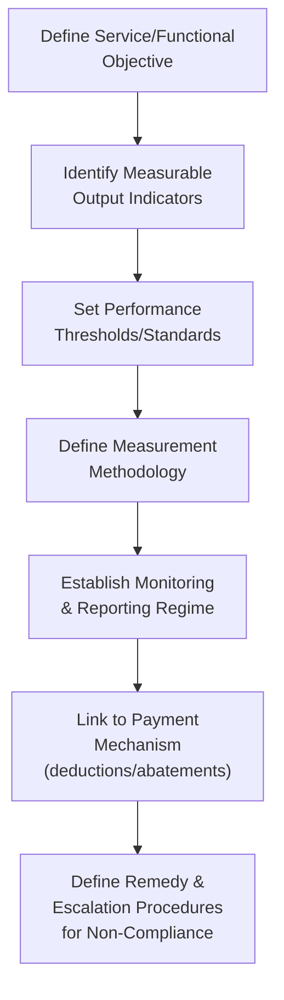

## Output-Based Specifications and Performance Standards

### Overview

Output-based specifications represent a foundational drafting philosophy in PPP contracts, distinguishing modern PPP procurement from traditional public works procurement's reliance on detailed input or process specifications. Rather than prescribing precisely how a private party must design, build, or operate an asset, an output-based specification defines **what outcome or standard of service must be achieved**, leaving the private party free to determine the most efficient means of achieving it. This shift in specification philosophy is a central mechanism through which PPP contracts are intended to transfer design, innovation, and operational efficiency risk to the private sector while enabling genuine performance-based accountability throughout the contract term.

### Input vs. Output Specifications: Core Distinction

**Key Points**

- An **input specification** (or process/prescriptive specification) dictates the specific materials, methods, staffing levels, or processes the contractor must use — for example, specifying that a road must have a particular asphalt mix design of a defined thickness, or that a facility must be cleaned according to a prescribed cleaning schedule and method.
- An **output specification** instead defines the **required outcome or performance standard** — for example, specifying that a road surface must maintain a defined roughness index and skid resistance level over the contract term, or that a facility must achieve a defined cleanliness standard as measured by a specific inspection protocol, without dictating the specific cleaning method or frequency used to achieve it.
- The theoretical rationale for output specifications in PPP contracts is that they **transfer design and operational risk** to the private party (which bears responsibility for figuring out how to meet the standard cost-effectively over the contract's often multi-decade term) while enabling the private party to apply innovation, whole-life-cost optimization, and its own technical expertise, rather than being constrained by a public sector-specified process that may not reflect the most efficient approach. [Inference — this is the standard theoretical justification found throughout PPP procurement literature and government PPP unit guidance]

### Comparative Table: Input vs. Output Specification Approach

| Dimension | Input/Process Specification | Output Specification |
| --- | --- | --- |
| What is specified | Materials, methods, staffing, process steps | Required outcome, standard, or performance level |
| Design risk allocation | Remains largely with public sector (or its designer) | Transferred to private party |
| Innovation incentive | Limited (contractor must follow prescribed method) | Strong (contractor free to choose most efficient method) |
| Contract monitoring focus | Compliance with prescribed process | Achievement of measured outcome |
| Typical use | Traditional public works procurement | PPP/DBFO/DBFM contracts |
| Risk of specification gaps | Lower (process is explicit) | Higher (ambiguous outcome definitions can cause disputes) |

### Structuring an Output Specification: Core Components

**Key Points**

- **Service/functional objective**: the underlying purpose the asset or service must fulfill (e.g., "provide safe, reliable road access between Point A and Point B" rather than "construct a 4-lane highway with X specification").
- **Measurable output indicators**: the specific, quantifiable metrics used to assess whether the functional objective is being met (e.g., journey time reliability, incident response time, surface condition index).
- **Performance thresholds**: the specific numerical or categorical standard that must be achieved for each indicator (e.g., "99% of scheduled train departures within 5 minutes of scheduled time").
- **Measurement methodology**: the precise, ideally objective and independently verifiable method by which performance against each indicator is assessed (inspection protocols, automated sensor data, independent survey methodology).
- **Monitoring and reporting regime**: who conducts monitoring (self-reporting by the operator, independent third-party verification, or a combination), at what frequency, and through what reporting format and escalation path.
- **Payment linkage**: how measured performance translates into the payment mechanism, typically through deductions or abatements for failing to meet thresholds (as discussed in the DBFO/DBFM payment mechanism content) or bonus payments for exceeding them.

### Key Performance Indicator (KPI) Design Principles

**Key Points**

- **SMART criteria**: well-designed KPIs are generally described as Specific, Measurable, Achievable, Relevant, and Time-bound — vague or subjectively assessed indicators (e.g., "maintain a high standard of cleanliness" without a defined inspection protocol) are a frequent source of contractual dispute.
- **Outcome vs. process KPIs**: as discussed in the management contract content, output specifications generally favor **outcome-based KPIs** (e.g., "average passenger wait time") over **process-based KPIs** (e.g., "number of staff on duty"), since the latter reintroduces input-specification-like constraints that limit the private party's operational flexibility.
- **Leading vs. lagging indicators**: some output specifications incorporate **leading indicators** (early warning metrics that predict future performance problems, such as equipment maintenance backlogs) alongside **lagging indicators** (metrics that measure outcomes after the fact, such as service failure counts), allowing for proactive intervention before a lagging indicator threshold is actually breached. [Inference]
- **Avoiding perverse incentives**: KPI frameworks must be carefully designed to avoid incentivizing behavior that meets the letter of a specification while undermining its underlying intent — for example, a road maintenance KPI focused solely on pothole repair response time could incentivize an operator to patch potholes minimally and repeatedly rather than investing in more durable, cost-effective repairs, if the KPI does not also account for repair durability or recurrence rate. [Inference — this is a well-documented general risk in performance-based contracting theory, though the specific example is illustrative rather than drawn from a documented case]

### Example Output Specification Framework: Highway DBFO Contract

**Example**

| Output Indicator | Performance Threshold | Measurement Method | Payment Consequence |
| --- | --- | --- | --- |
| Lane availability | ≥99.5% of scheduled hours available | Automated traffic monitoring + inspection log | Deduction per unavailable lane-hour beyond threshold |
| Pavement condition index | Minimum roughness/rutting score per defined scale | Annual independent pavement survey | Remediation obligation; repeated failure triggers deduction |
| Incident response time | Attend within 30 minutes of notification | Time-stamped incident log, independently auditable | Deduction per late response beyond threshold |
| Winter maintenance (gritting/plowing) | Treated within 2 hours of trigger conditions | Weather data cross-referenced with treatment log | Deduction per missed/late treatment event |

This illustrates how each output indicator is paired with an objective measurement method and a defined payment consequence, forming the backbone of the availability payment deduction regime discussed in the DBFO/DBFM content. [Inference — illustrative example framework, not drawn from a specific real contract's exact terms]

### The Output Specification and Whole-Life Costing

**Key Points**

- A central theoretical benefit of output specifications is their support for **whole-life costing** decision-making: because the private party is responsible for meeting the output standard over the entire contract term (often 20–30 years) rather than simply delivering a compliant asset at handover, it has a direct financial incentive to weigh higher upfront capital costs (e.g., more durable materials) against lower long-term maintenance costs, rather than optimizing solely for lowest initial construction cost as might occur under separated design-bid-build procurement with input specifications.
- This whole-life costing incentive is one of the most frequently cited efficiency rationales for PPP procurement generally, though critics (as discussed in the VfM critiques content) note that the actual realization of whole-life efficiency gains depends heavily on the quality of the output specification, the accuracy of the deduction regime in capturing true lifecycle cost tradeoffs, and the credibility of long-term enforcement mechanisms. [Inference]

### Drafting Challenges and Common Pitfalls

**Key Points**

- **Specification ambiguity**: output specifications that are insufficiently precise about measurement methodology, thresholds, or the conditions under which a standard applies are a frequent and significant source of contractual dispute over the life of a PPP contract, since both parties may reasonably interpret an ambiguous standard differently once a real-world edge case arises.
- **Incompleteness — unanticipated scenarios**: given multi-decade contract terms, output specifications drafted at the outset cannot anticipate every future operational scenario, technological change, or shift in service delivery expectations, requiring either periodic specification review mechanisms or robust contractual change/variation procedures to handle circumstances not contemplated in the original specification. [Inference]
- **Over-specification undermines the output-based rationale**: a specification that becomes so detailed and prescriptive that it effectively dictates specific methods (even while nominally framed as an "output") can undermine the core rationale for using an output-based approach in the first place, re-introducing the design and innovation constraints associated with input specifications while retaining the complexity of an output-based payment and monitoring regime. [Inference]
- **Interface and boundary specification issues**: in DBFM-type structures where private maintenance responsibility is separated from public service delivery (as discussed in the DBFO/DBFM content), the output specification must clearly define the boundary between the private party's maintenance-related outputs and the public operator's service-delivery responsibilities, since ambiguity at this interface is a documented source of dispute. [Inference]
- **Monitoring cost and administrative burden**: comprehensive output specification monitoring — particularly where it relies on independent third-party verification rather than self-reporting — carries its own administrative and financial cost, which must be weighed against the specification's granularity and the materiality of the risk being monitored. [Inference]

### Independent Verification and Monitoring Mechanisms

**Key Points**

- **Self-reporting with audit rights**: the private operator reports its own performance against the output specification, with the public authority retaining audit and inspection rights to verify accuracy — a lower-cost approach but one that depends on trust and periodic verification to remain credible.
- **Independent third-party monitoring**: an independent technical advisor or monitoring body, engaged separately from both the public authority and the private operator, conducts regular inspections or reviews performance data — used particularly for technically complex or high-stakes performance indicators (such as structural safety inspections) where independence and technical expertise are critical.
- **Automated/sensor-based monitoring**: increasingly used for indicators amenable to objective, continuous measurement (traffic sensors for lane availability, building management systems for facility environmental conditions), reducing reliance on manual inspection and potentially reducing dispute risk given the more objective nature of the underlying data, though requiring upfront investment in monitoring infrastructure and data integrity safeguards. [Inference]
- **Dispute resolution for measurement disagreements**: because even well-designed measurement methodologies can produce contested results (e.g., disputes over whether a specific weather event triggered a winter maintenance obligation), output specifications are typically paired with a defined dispute resolution mechanism, often involving an independent technical expert determination process before escalation to broader contractual dispute resolution (arbitration or litigation). [Inference]

### Illustrative Output Specification Lifecycle Diagram (svg_diagram)

<svg xmlns="http://www.w3.org/2000/svg" viewBox="0 0 700 380">
<text x="350" y="25" text-anchor="middle" font-size="16" font-weight="bold" fill="#1a1a1a">Output Specification Monitoring Cycle (svg_diagram)</text>
<rect x="270" y="50" width="160" height="50" rx="6" fill="#2471a3" opacity="0.9" />
<text x="350" y="80" text-anchor="middle" font-size="12" fill="#fff" font-weight="bold">Output Standard Set</text>
<rect x="270" y="130" width="160" height="50" rx="6" fill="#7d6608" opacity="0.9" />
<text x="350" y="160" text-anchor="middle" font-size="12" fill="#fff" font-weight="bold">Performance Measured</text>
<rect x="270" y="210" width="160" height="50" rx="6" fill="#c0392b" opacity="0.9" />
<text x="350" y="240" text-anchor="middle" font-size="12" fill="#fff" font-weight="bold">Compared to Threshold</text>
<rect x="80" y="290" width="160" height="50" rx="6" fill="#1e8449" opacity="0.9" />
<text x="160" y="313" text-anchor="middle" font-size="11" fill="#fff" font-weight="bold">Threshold Met:</text>
<text x="160" y="330" text-anchor="middle" font-size="10" fill="#fff">Full payment / bonus</text>
<rect x="460" y="290" width="160" height="50" rx="6" fill="#943126" opacity="0.9" />
<text x="540" y="313" text-anchor="middle" font-size="11" fill="#fff" font-weight="bold">Threshold Missed:</text>
<text x="540" y="330" text-anchor="middle" font-size="10" fill="#fff">Deduction / remedy triggered</text>
<line x1="350" y1="100" x2="350" y2="130" stroke="#333" stroke-width="1.5" marker-end="url(#arrow4)" />
<line x1="350" y1="180" x2="350" y2="210" stroke="#333" stroke-width="1.5" marker-end="url(#arrow4)" />
<line x1="300" y1="260" x2="200" y2="290" stroke="#333" stroke-width="1.5" marker-end="url(#arrow4)" />
<line x1="400" y1="260" x2="500" y2="290" stroke="#333" stroke-width="1.5" marker-end="url(#arrow4)" />
</svg>

### Output Specifications Across Sectors

**Key Points**

- **Transportation**: journey time reliability, lane/road availability, surface condition indices, incident response times, signage and lighting functionality standards.
- **Social infrastructure (schools, hospitals)**: facility availability by room/ward type, environmental condition standards (temperature, air quality), equipment uptime, response times for facilities faults — generally excluding clinical or educational service quality metrics, which remain with the public operator under DBFM-type structures.
- **Water and wastewater**: water quality compliance against regulatory standards, service continuity (hours of supply per day), pressure standards, non-revenue water reduction targets, effluent quality standards for treated wastewater discharge.
- **Digital/IT infrastructure PPPs**: system uptime/availability percentages, response time for service tickets, cybersecurity incident response standards, data processing accuracy — an area of growing relevance as PPP structures extend into digital government infrastructure. [Inference]

### Relationship to Value for Money and Risk Transfer

**Key Points**

- Output specifications are the **mechanism through which the theoretical risk transfer benefits of PPP** (discussed extensively in the VfM and PSC content) are operationalized in practice — a PSC/VfM analysis may model a certain level of risk transfer value, but that value is only realized if the underlying output specification and its associated payment deduction mechanism actually functions as designed to hold the private party accountable for performance.
- Weak or poorly monitored output specifications represent a practical implementation gap between the theoretical risk transfer assumed in a VfM assessment and the risk transfer actually achieved in contract operation, connecting directly to the critique (raised in the VfM critiques content) that ex-ante analysis cannot fully capture how a contract will actually be administered and enforced over its term. [Inference]

**Related Topics**

- Design-Build-Finance-Operate and Design-Build-Finance-Maintain Models
- Payment Mechanisms and Deduction/Abatement Regime Design
- Key Performance Indicator (KPI) Frameworks for Utility and Facility Management
- Independent Technical Advisors and Third-Party Monitoring in PPP Contracts
- Dispute Resolution and Expert Determination Mechanisms in PPP Contracts
- Whole-Life Costing and Lifecycle Asset Management
- Variation and Change Mechanisms for Long-Term PPP Contracts
- Critiques and Limitations of Value for Money Methodologies