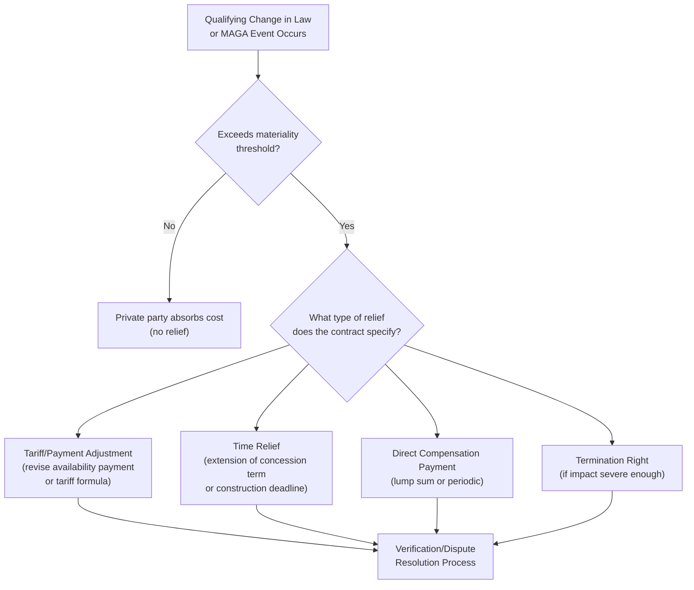

## Change in Law and Material Adverse Government Action Clauses

### Overview

Change in Law (CiL) and Material Adverse Government Action (MAGA) clauses are core risk-allocation provisions in PPP contracts that address a fundamental asymmetry inherent to any long-term arrangement between a private party and a government: the government is simultaneously the **contracting counterparty** and the **sovereign authority** capable of unilaterally altering the legal, regulatory, and fiscal environment in which the contract operates. These clauses define how the financial consequences of legislative, regulatory, or discretionary government actions occurring after contract signing are allocated between the parties, and are among the most heavily negotiated provisions in PPP contract drafting given their direct link to lender comfort and project bankability.

### The Core Problem: Sovereign Risk in a Bilateral Contract

**Key Points**

- Unlike a purely commercial contract between two private parties, a PPP contract's public sector counterparty retains legislative and regulatory authority that can directly affect the contract's economics — for example, by introducing new environmental regulations, changing tax rates, imposing new safety standards, or altering tariff-setting rules — actions the private party has no ability to negotiate around or avoid through ordinary contractual means.
- Without a clearly defined Change in Law mechanism, the private party (and, critically, its lenders) would bear open-ended exposure to the government's own future legislative and regulatory discretion, which is generally considered an unacceptable and unbankable risk allocation, since lenders require reasonable certainty regarding the cash flow assumptions underlying their credit decisions over a multi-decade loan tenor. [Inference — this is the standard rationale articulated throughout project finance and PPP contract drafting guidance]
- Change in Law and MAGA clauses exist specifically to define, in advance, which categories of government action trigger compensation, relief, or contract adjustment, and which are treated as ordinary business risk the private party must absorb without recourse.

### Defining "Change in Law"

**Key Points**

- A Change in Law clause typically defines a **"Qualifying Change in Law"** — a specific, contractually defined category of legislative, regulatory, or administrative action occurring after a defined reference date (usually contract signing or financial close) that triggers a right to relief.
- Common categorizations used to scope Qualifying Change in Law include:
  - **General vs. Specific/Discriminatory Change in Law**: a general change in law applies broadly across an economy or sector (e.g., a nationwide increase in corporate tax rate), while a discriminatory or specific change in law targets the project, the PPP sector specifically, or a narrow class of entities that effectively includes the project (e.g., a new tax specifically targeting toll road concessionaires).
  - **Change in Law vs. Change in Interpretation**: some frameworks distinguish a genuine change in the text of law or regulation from a change in how an existing law is interpreted or enforced by courts or regulators, with the latter sometimes excluded or treated differently since it does not involve a clear legislative act.
  - **Anticipated vs. Unanticipated Change in Law**: some contracts exclude relief for changes in law that were reasonably foreseeable at the time of contract signing (e.g., a regulatory change already published in draft form or under public consultation before financial close), on the basis that a diligent bidder should have priced in a reasonably foreseeable future change. [Inference]
- **[Unverified]** The precise legal drafting conventions and terminology used to define Change in Law vary considerably across jurisdictions and specific contract precedents; the categorizations above reflect commonly discussed distinctions in international project finance and PPP drafting practice, but the specific defined terms in any given contract must be assessed against that contract's actual drafted language.

### Comparative Table: Categories of Change in Law and Typical Risk Allocation

| Category | Description | Typical Risk Allocation Tendency |
| --- | --- | --- |
| General Change in Law | Broad economy-wide legislative/regulatory change (e.g., general tax rate change) | Often retained by private party (treated as ordinary business risk), though thresholds/materiality tests vary |
| Discriminatory Change in Law | Targets the specific project, sector, or a narrow class including the project | Often allocated to government (relief/compensation provided) |
| Specific Change in Law | Targets the specific contract or asset directly | Often allocated to government (relief/compensation provided) |
| Change in Law affecting cost of compliance (e.g., new safety/environmental standard) | Requires capital or operating expenditure to comply | Often shared or compensated via defined mechanism, subject to materiality threshold |
| Anticipated/foreseeable Change in Law | Change reasonably foreseeable at contract signing | Often excluded from relief (private party deemed to have priced it in) |

**[Inference]** This table reflects generally discussed risk allocation tendencies in PPP and project finance literature and guidance documents; actual allocation in any specific contract is a negotiated outcome reflecting the specific bargaining context, sector, and jurisdiction, and can deviate materially from these general tendencies.

### Materiality Thresholds and De Minimis Provisions

**Key Points**

- Change in Law clauses typically include a **materiality threshold** — a minimum financial impact (often expressed as a percentage of project revenue, a fixed monetary amount, or a combination) below which the private party bears the cost without relief, on the rationale that minor regulatory adjustments represent ordinary business risk and would create excessive administrative burden if every small change triggered a compensation claim.
- Materiality thresholds may be assessed on a **per-event basis**, a **cumulative/aggregate basis** over a defined period, or both, to prevent a private party from aggregating numerous individually immaterial changes into a large cumulative claim, or conversely to prevent a government from avoiding compensation obligations by characterizing what is functionally a single significant change as multiple smaller changes. [Inference]
- The specific threshold levels are a matter of case-by-case negotiation, and no single threshold can be treated as a universal industry standard; typical structures involve either a percentage-of-revenue trigger or a fixed monetary floor, calibrated to the specific project's scale. [Unverified]

### Material Adverse Government Action (MAGA)

**Key Points**

- **Material Adverse Government Action** clauses address government actions that are **not** formal changes in law or regulation but nonetheless materially and adversely affect the project — for example, unreasonable delay or refusal in granting permits, licenses, or approvals the government is contractually or otherwise obligated to provide; discriminatory administrative action; or expropriation-adjacent measures that fall short of formal expropriation.
- MAGA clauses are conceptually related to, but distinct from, **political risk** more broadly (which can include war, civil unrest, or currency inconvertibility) and from formal **expropriation clauses** (which address outright government seizure of the asset or equity) — MAGA typically occupies a middle category addressing discretionary administrative or executive action short of formal legislative change or outright expropriation.
- Because MAGA by definition involves government **discretionary action** rather than legislative or regulatory change, defining its scope with sufficient precision to be enforceable — while not so broadly as to expose the government to compensation claims for essentially any adverse administrative decision — is a recognized drafting challenge. [Inference]

### Relief Mechanisms: How Compensation Is Structured

**Key Points**

- **Tariff or payment mechanism adjustment**: revising the availability payment formula, tariff level, or indexation mechanism to reflect the increased cost of compliance, often the preferred mechanism where the change in law imposes an ongoing, quantifiable cost increase (e.g., a new environmental compliance requirement adding to annual operating costs).
- **Time relief / extension of term**: extending the concession term or adjusting construction deadlines to compensate for delay or additional work required by the change in law, without necessarily requiring an immediate cash payment — useful where the impact is primarily time-related rather than a permanent ongoing cost increase.
- **Direct compensation payment**: a lump-sum or periodic direct payment from the government to the private party, calculated based on demonstrated additional cost or lost revenue attributable to the qualifying change — often used for one-off capital cost impacts (e.g., a new safety retrofit requirement).
- **Termination right**: in cases of sufficiently severe or fundamental change in law (sometimes distinguished as a "Change in Law affecting the fundamental viability of the project"), the contract may provide a termination right, typically triggering a defined termination payment mechanism (addressed further under termination and compensation provisions).
- **[Inference]** The choice among these mechanisms in any specific contract reflects negotiated allocation of both magnitude and type of risk, and contracts commonly employ different mechanisms for different categories or magnitudes of change in law (e.g., tariff adjustment for moderate ongoing cost changes, termination right reserved for changes affecting fundamental project viability).

### Interaction with Financing and Lender Requirements

**Key Points**

- Lenders financing PPP projects typically require Change in Law provisions to meet a threshold of adequacy sufficient to protect debt service coverage, since an unmitigated adverse change in law could otherwise directly threaten the project's ability to service its debt obligations — making Change in Law clause adequacy a **direct bankability determinant** scrutinized closely during lender due diligence.
- **Direct agreements** (tripartite agreements between the government, the private party/SPV, and the lenders) frequently reference or incorporate Change in Law provisions, since lenders have a direct financial interest in ensuring the compensation or relief mechanism functions as intended, and may require **step-in rights** or consultation rights specifically in connection with change in law disputes or claims. [Inference]
- Credit rating agencies and lenders assessing project finance transactions typically evaluate the robustness, clarity, and historical enforceability of Change in Law provisions as part of their overall country and contract risk assessment, particularly in jurisdictions with less mature rule-of-law track records regarding contract enforcement against sovereign counterparties. [Inference]

### Distinguishing Change in Law from Force Majeure

**Key Points**

- Change in Law is conceptually related to, but legally and contractually distinct from, **force majeure** provisions (which address extraordinary events outside either party's control, such as natural disasters, war, or pandemics) — the key distinction is that Change in Law specifically addresses **government legislative/regulatory action**, which is not "outside the control" of the government party in the same sense a natural disaster is outside the control of both parties.
- Some contracts nonetheless nest Change in Law within a broader force majeure or "relief event" framework, while others treat it as an entirely separate defined category with its own dedicated clause structure — the specific drafting architecture varies by jurisdiction, sector, and the specific precedent contract forms used as the drafting template. [Inference]
- The distinction matters practically because force majeure relief mechanisms (often limited to time extension or, in severe cases, termination without compensation obligations attaching to either party) frequently differ from Change in Law relief mechanisms (which more commonly include direct compensation, reflecting the different degree of "control" or responsibility attributed to the triggering party). [Inference]

### Illustrative Risk Allocation Spectrum (svg_diagram)

<svg xmlns="http://www.w3.org/2000/svg" viewBox="0 0 700 380">
<text x="350" y="25" text-anchor="middle" font-size="16" font-weight="bold" fill="#1a1a1a">Change in Law Risk Allocation Spectrum (svg_diagram)</text>
<line x1="70" y1="200" x2="630" y2="200" stroke="#333" stroke-width="2" />
<polygon points="630,200 620,194 620,206" fill="#333" />

<text x="70" y="230" font-size="11" text-anchor="middle" fill="#333" font-weight="bold">Private Party Bears Risk</text>

<text x="630" y="230" font-size="11" text-anchor="middle" fill="#333" font-weight="bold">Government Bears Risk</text>

<circle cx="140" cy="200" r="8" fill="#c0392b" />
<text x="140" y="170" font-size="11" text-anchor="middle" fill="#c0392b" font-weight="bold">General, Foreseeable</text>
<text x="140" y="185" font-size="10" text-anchor="middle" fill="#555">Change in Law</text>
<circle cx="300" cy="200" r="8" fill="#7d6608" />
<text x="300" y="170" font-size="11" text-anchor="middle" fill="#7d6608" font-weight="bold">General, Unforeseeable</text>
<text x="300" y="185" font-size="10" text-anchor="middle" fill="#555">Change (below threshold)</text>
<circle cx="450" cy="200" r="8" fill="#2471a3" />
<text x="450" y="170" font-size="11" text-anchor="middle" fill="#2471a3" font-weight="bold">General Change</text>
<text x="450" y="185" font-size="10" text-anchor="middle" fill="#555">(above materiality threshold)</text>
<circle cx="580" cy="200" r="8" fill="#1e8449" />
<text x="580" y="170" font-size="11" text-anchor="middle" fill="#1e8449" font-weight="bold">Discriminatory /</text>
<text x="580" y="185" font-size="10" text-anchor="middle" fill="#555">Specific Change in Law</text>
</svg>

### Common Drafting and Implementation Challenges

**Key Points**

- **Defining the reference date**: establishing the precise cut-off date (contract signing, bid submission, or financial close) after which a legislative or regulatory action qualifies as a "change" is critical, since changes already in force or in draft before that date are typically deemed already priced into the private party's bid. [Inference]
- **Causation and quantification disputes**: even where a change in law is undisputedly a "Qualifying Change in Law," parties frequently disagree over the precise financial impact attributable to it (as distinct from other concurrent factors affecting project costs or revenue), making causation and quantification methodology a frequent source of dispute requiring expert determination or arbitration. [Inference]
- **Interaction with tax law changes**: tax-specific change in law provisions are often treated as a distinct sub-category with their own specific drafting conventions, since general tax changes are frequently treated as ordinary business risk (excluded from relief) while discriminatory or project-specific tax measures are more commonly compensated — though the specific line-drawing is heavily contract- and jurisdiction-specific. [Inference]
- **Currency and macroeconomic changes**: changes to currency convertibility rules, capital controls, or exchange rate regimes raise particularly complex Change in Law drafting issues in cross-border or foreign-currency-financed projects, often addressed through separate, more specialized political risk or currency inconvertibility provisions rather than the general Change in Law clause alone. [Inference]
- **Evolving regulatory areas (e.g., climate/environmental policy)**: sectors subject to rapidly evolving regulatory frameworks (such as environmental and emissions standards) present a particular drafting challenge, since parties must anticipate a higher likelihood of future regulatory change over a multi-decade contract term, which can affect how materiality thresholds and relief mechanisms are calibrated at signing. [Inference]

### Practical Checklist for Change in Law / MAGA Clause Review

1. Confirm the precise definition of "Qualifying Change in Law" and how it distinguishes general, discriminatory, and specific change categories.
2. Identify the reference date after which changes qualify for relief, and confirm treatment of changes already foreseeable or in draft at that date.
3. Review materiality thresholds — per-event and cumulative — and confirm the currency, percentage, or method used to assess them.
4. Identify which relief mechanism(s) apply to which categories of change (tariff adjustment, time extension, direct compensation, termination right).
5. Confirm the process for demonstrating and quantifying financial impact, including any independent expert determination or verification steps.
6. Review how MAGA is separately defined and distinguished from Change in Law, force majeure, and expropriation provisions.
7. Confirm lender consultation, notice, or consent rights in connection with Change in Law claims or disputes, particularly where a direct agreement is in place.
8. Assess whether tax-specific and currency/macroeconomic change provisions are addressed within the general Change in Law clause or through separate specialized provisions.

**Related Topics**

- Force Majeure Clauses and Risk Allocation for Extraordinary Events
- Termination Provisions and Compensation on Termination
- Direct Agreements and Lender Step-In Rights
- Political Risk Insurance and Multilateral Guarantee Instruments
- Output-Based Specifications and Performance Standards
- Expert Determination and Dispute Resolution Mechanisms in PPP Contracts
- Currency Inconvertibility and Foreign Exchange Risk Provisions
- Tax Risk Allocation in Long-Term Infrastructure Contracts