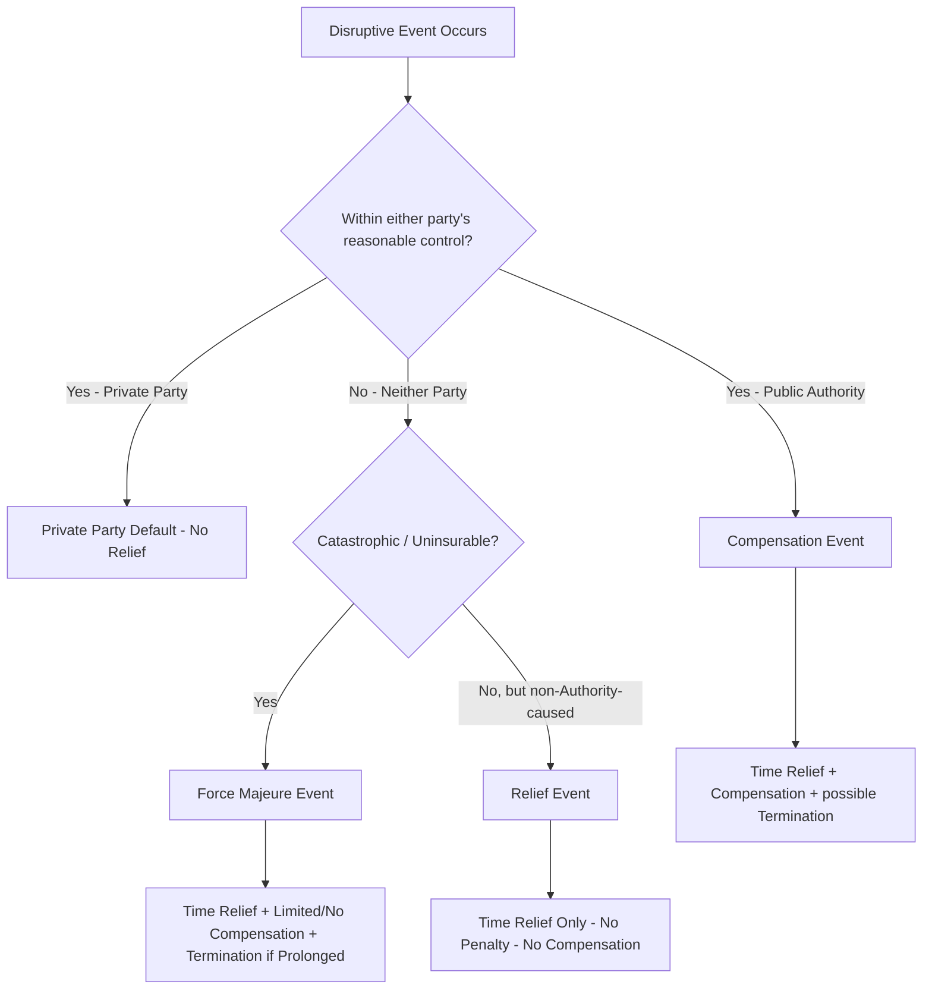
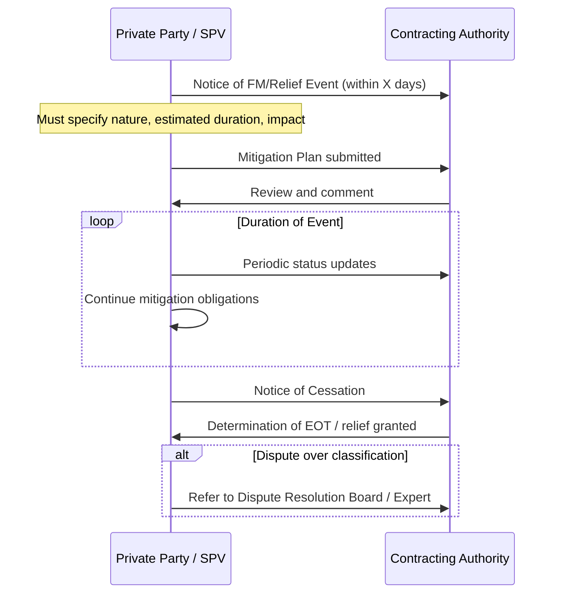

## Force Majeure and Relief Event Provisions

### Definition and Conceptual Framework

Force Majeure (FM) and Relief Events are risk-allocation mechanisms embedded in Public-Private Partnership (PPP) contracts that determine which party bears the consequences of events outside either party's reasonable control. These clauses answer three questions for any disruptive event: (1) who bears the cost, (2) who bears the schedule/performance impact, and (3) under what conditions does the contract terminate.

PPP contracts typically distinguish between three tiers of exogenous risk:

- **Force Majeure Events** — catastrophic, unforeseeable events (war, natural disasters) where risk is shared or excused, usually with no compensation for lost revenue but relief from default and termination rights.
- **Relief Events** — events that excuse the private party (Project Company/SPV) from performance failure and extend time, but do not usually entitle it to compensation. The Authority is "relieved" from imposing penalties, and the private party is "relieved" from liability.
- **Compensation Events** (sometimes called Authority Default or Political Force Majeure) — events typically caused by or within the control of the public sector (change in law, expropriation, Authority breach) where the private party is entitled to both time relief and financial compensation.

**Key Points**

- FM excuses performance; it does not automatically extend to compensation.
- The categorization of an event (FM vs. Relief vs. Compensation) is the single most litigated issue in PPP contract administration.
- The specific bucket an event falls into is contractually defined — there is no universal legal definition of FM that automatically applies across jurisdictions or contracts.

### Risk Allocation Logic

The economic rationale follows the "least-cost avoider" or "best risk bearer" principle: risk should sit with the party best able to control, mitigate, insure, or price it.

### Standard Force Majeure Definition Structure

Most PPP contracts (following World Bank/EPEC/multilateral toolkits) use a two-limb definition:

1. **General test (chapeau)**: An event or circumstance that is (a) beyond the reasonable control of the affected party, (b) which that party could not reasonably have prevented or overcome, and (c) which was not caused by the fault or negligence of that party.
2. **Illustrative (non-exhaustive or exhaustive) list**: war, invasion, act of foreign enemies, hostilities, civil war, rebellion, terrorism, sabotage, nuclear contamination, ionizing radiation, natural catastrophes (earthquake, flood, typhoon), epidemic/pandemic (post-COVID-19 a near-universal express inclusion).

$$\text{FM Event} = \text{Uncontrollable} \cap \text{Unforeseeable} \cap \text{Unavoidable} \cap \text{Non-Attributable}$$

**Example**

> "Force Majeure Event means any event or circumstance (or combination of events and circumstances) which is beyond the reasonable control of a Party, which such Party could not have prevented or overcome by the exercise of reasonable skill and care and diligence, and which does not result from the negligence or default of that Party or its Sub-Contractors, including but not limited to: (a) war, invasion, armed conflict; (b) earthquake, flood, typhoon, or other Natural Catastrophe; (c) epidemic or pandemic; (d) radioactive contamination; provided that a lack of funds shall not, of itself, constitute a Force Majeure Event."

The exclusion of "lack of funds" is a near-universal boilerplate carve-out, since financial distress is treated as an endogenous, insurable/manageable risk, not an exogenous shock.

### Relief Events — Distinct Category

Relief Events typically capture risks that are neither the private party's fault nor attributable to the Authority, but also fall short of FM severity. Common examples:

- Discovery of antiquities/archaeological finds
- Adverse ground/geotechnical conditions not reasonably foreseeable
- Unexploded ordnance
- Strikes or industrial action not caused by the private party
- Utility company delays in connections
- Fire (not caused by the private party) not rising to FM severity

**Key Points**

- Relief Events grant an extension of time (EOT) and suspend the Authority's right to levy delay liquidated damages or exercise default/termination rights during the relief period.
- No compensation is payable — the private party absorbs the cost, only the time/performance consequence is neutralized.
- Notice and mitigation obligations are identical in structure to FM but often have shorter notice windows given the lower severity threshold.

### Compensation Events — Comparison Table

| Feature | Force Majeure | Relief Event | Compensation Event |
| --- | --- | --- | --- |
| Cause | Truly exogenous/catastrophic | Neutral, non-Authority | Authority-caused/political |
| Time Relief | Yes | Yes | Yes |
| Financial Compensation | Rare/limited (insurance proceeds only, typically) | No | Yes (full indemnification typical) |
| Termination Trigger | Yes, if prolonged (e.g., 180–365 days) | Rarely, standalone | Yes, often with premium compensation |
| Typical Examples | War, pandemic, natural catastrophe | Strikes, archaeological finds | Change in law, expropriation, Authority breach |

### Notification, Mitigation, and Procedural Mechanics

FM/Relief clauses impose strict procedural conditions precedent to relief being granted — failure to comply can forfeit an otherwise valid claim.

**Key Points**

- **Time-bar clauses**: many contracts stipulate that failure to notify within a specified window (e.g., 14–28 days) waives the right to relief entirely — this is a critical drafting and compliance point.
- **Continuing mitigation duty**: relief does not suspend the obligation to use reasonable endeavors to minimize the effect and duration of the event.
- **No-fault requirement**: the affected party must show the event was not caused or exacerbated by its own default (e.g., poor maintenance worsening flood damage undermines an FM claim).

### Financial Mechanics of Relief

Even without direct compensation, FM/Relief provisions interact with the project's financial model:

- **Debt service**: Most FM clauses require continued debt service; lenders often negotiate "FM standstill" provisions or cash sweep suspension in financing agreements (separate from the PPP contract but cross-referenced).
- **Insurance proceeds**: Where the FM event is insurable (e.g., certain natural catastrophes), proceeds are typically directed first to reinstatement; any shortfall risk allocation is contract-specific.
- **Extended FM / Prolonged Event provisions**: If an FM event exceeds a threshold duration (e.g., 6–12 months), the contract usually triggers a right for either party to terminate, with compensation calculated per the termination payment mechanism (often at a reduced "no-fault"/market value basis rather than full compensation).

$$TP_{FM} = \max(0, \ \text{Outstanding Senior Debt} + \text{Equity IRR Adjustment}_{\text{partial}})$$

Where $TP_{FM}$ denotes the termination payment on prolonged Force Majeure, frequently structured to cover senior debt fully but only partially compensate equity — reflecting shared risk. [Inference: exact formulas are jurisdiction- and contract-specific; the World Bank/EPEC model termination payment structures commonly follow this asymmetry, but individual PPP contracts vary materially.]

### Pandemic/Epidemic Clauses — Post-2020 Evolution

Following COVID-19, PPP contract drafting practice shifted materially:

- Pre-2020 contracts often had ambiguous FM lists that did not explicitly name "pandemic" or "epidemic," leading to significant contractual disputes and litigation globally regarding whether COVID-19 qualified.
- Post-2020 standard templates (World Bank, EPEC, and various national PPP units) now commonly include explicit epidemic/pandemic language, alongside express government-imposed lockdown/travel restriction triggers as either FM or a distinctly labeled "Health Emergency Event" or "Notifiable Disease" category.
- Some contracts now separately classify **government-mandated closures during a health emergency** as a Compensation Event (since the closure is a state action) even though the underlying pandemic itself is FM — creating a layered/hybrid risk allocation. [Inference: this layered approach is an emerging but not yet universally standardized drafting practice; treatment varies by jurisdiction and sector.]

### Diagram: FM Severity and Consequence Escalation (svg_diagram)

<svg xmlns="http://www.w3.org/2000/svg" viewBox="0 0 760 320">
<text x="380" y="25" font-size="16" font-weight="bold" text-anchor="middle" fill="#1a1a1a">FM/Relief Event Escalation Ladder (svg_diagram)</text>
<rect x="20" y="60" width="160" height="60" rx="6" fill="#e8f4fc" stroke="#2b7bb9" stroke-width="1.5" />
<text x="100" y="85" font-size="12" text-anchor="middle" fill="#1a1a1a">Relief Event</text>
<text x="100" y="102" font-size="10" text-anchor="middle" fill="#444">Time relief only</text>
<rect x="220" y="60" width="160" height="60" rx="6" fill="#fff4e0" stroke="#d99a2b" stroke-width="1.5" />
<text x="300" y="85" font-size="12" text-anchor="middle" fill="#1a1a1a">Force Majeure</text>
<text x="300" y="102" font-size="10" text-anchor="middle" fill="#444">Time relief + no penalty</text>
<rect x="420" y="60" width="160" height="60" rx="6" fill="#fdeaea" stroke="#c0392b" stroke-width="1.5" />
<text x="500" y="85" font-size="12" text-anchor="middle" fill="#1a1a1a">Prolonged FM</text>
<text x="500" y="102" font-size="10" text-anchor="middle" fill="#444">Termination right arises</text>
<rect x="620" y="60" width="120" height="60" rx="6" fill="#f0e6fa" stroke="#7d3c98" stroke-width="1.5" />
<text x="680" y="85" font-size="12" text-anchor="middle" fill="#1a1a1a">Termination</text>
<text x="680" y="102" font-size="10" text-anchor="middle" fill="#444">TP payable</text>
<line x1="180" y1="90" x2="220" y2="90" stroke="#555" stroke-width="1.5" marker-end="url(#arrow)" />
<line x1="380" y1="90" x2="420" y2="90" stroke="#555" stroke-width="1.5" marker-end="url(#arrow)" />
<line x1="580" y1="90" x2="620" y2="90" stroke="#555" stroke-width="1.5" marker-end="url(#arrow)" />
<text x="30" y="160" font-size="12" font-weight="bold" fill="`#1a1a1a`">Increasing Consequence Severity →</text>

<rect x="30" y="185" width="700" height="110" rx="6" fill="#fafafa" stroke="#ccc" stroke-width="1" />
<text x="45" y="205" font-size="11" fill="#333">Severity Threshold Drivers:</text>
<text x="45" y="225" font-size="10" fill="#444">• Duration exceeding contractual cap (e.g., 6-12 continuous months)</text>
<text x="45" y="242" font-size="10" fill="#444">• Aggregate cumulative days across multiple events in a rolling period</text>
<text x="45" y="259" font-size="10" fill="#444">• Permanent impossibility of performance (frustration-equivalent)</text>
<text x="45" y="276" font-size="10" fill="#444">• Failure of mitigation obligations does not escalate — it can forfeit relief entirely</text>
</svg>

### Interaction with Change in Law and Insurance Clauses

FM provisions do not operate in isolation — they interface with adjacent risk clauses:

- **Change in Law**: Distinguished from FM because it originates from a sovereign/regulatory act; typically triggers a Compensation Event rather than FM, though some contracts nest "discriminatory change in law" specifically as compensable while "general change in law" may be uncompensated or partially compensated.
- **Insurance provisions**: A well-drafted contract requires the private party to maintain insurance against insurable risks; if an FM event was insurable and the private party failed to maintain coverage, relief may be reduced to the extent proceeds would have been available ("deemed insurance proceeds" clauses).
- **Step-in rights**: Lenders' step-in rights under direct agreements are typically preserved during FM, since the underlying PPP contract is not in default.

### Drafting Pitfalls and Negotiation Points

**Key Points**

- **Exhaustive vs. non-exhaustive lists**: Exhaustive lists create certainty but risk excluding future unforeseen events (as pandemic clauses demonstrated); non-exhaustive lists with a general test create flexibility but interpretive disputes.
- **"Sole cause" vs. "contributing cause" standards**: Contracts vary on whether the FM event must be the sole cause of non-performance or merely a material contributing cause — this materially affects claim success rates.
- **Cumulative/aggregate duration triggers**: Distinguish between a single continuous FM period and aggregate non-continuous days across multiple events within a rolling window (e.g., 180 days in any 365-day period) — both can trigger termination rights.
- **Carve-outs**: Common carve-outs from FM eligibility include failure to pay (except where itself caused by FM), and events caused by the private party's own Sub-Contractors' negligence.
- **Force Majeure vs. "Material Adverse Government Action"**: Some contracts separately bucket sovereign acts short of expropriation into a distinct category to avoid conflating political risk with natural/catastrophic risk.

### Worked Numerical Example

A toll-road PPP has a delay liquidated damages (LD) rate of $5,000/day for late completion, capped at $2,000,000. A 45-day flood event (classified as FM under the contract) occurs during construction.

- **Without FM clause**: LD exposure = $45 \times \$5{,}000 = \$225{,}000$
- **With FM clause**: LD exposure = $0 (time is extended by 45 days; no LDs accrue)
- **Compensation**: $0 (FM does not entitle the contractor to delay costs recovery under a standard "no compensation" FM clause) — contractor absorbs its own prolongation costs (site overheads, financing costs during delay) unless the contract expressly grants FM compensation (uncommon; more typical in EPC/construction contracts than in concession-level PPP contracts).

**Output**

| Item | Without FM Relief | With FM Relief |
| --- | --- | --- |
| LDs accrued | $225,000 | $0 |
| Completion date | Original + 45 days late (breach) | Extended by 45 days (no breach) |
| Contractor's own delay costs | Recoverable? No basis without relief | Not recoverable (unless expressly stated) |
| Termination risk | Possible default termination | None (event-based EOT only) |

### Related Topics

- Change in Law and Compensation Event Mechanics
- Termination Payment Structures and Formulas (No-Fault, Authority Default, Private Party Default)
- Material Adverse Government Action Clauses
- Step-In Rights and Direct Agreements with Lenders
- Insurance Requirements and Deemed Insurance Proceeds
- Extension of Time (EOT) Claims Administration
- Dispute Resolution Boards (DRBs) and Expert Determination in PPP Contracts
- Risk Matrix Design in PPP Feasibility Studies