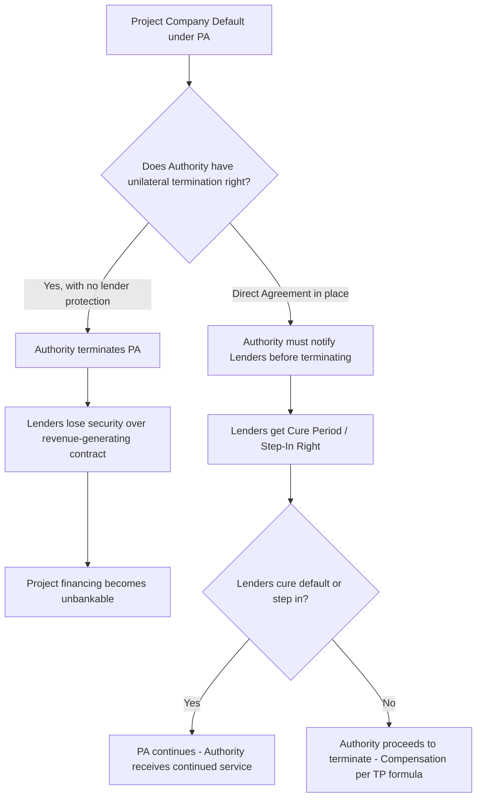

## Step-In Rights and Lender Direct Agreements

### Definition and Conceptual Framework

Step-in rights are contractual mechanisms allowing a party — typically the senior lenders, or in some cases the Contracting Authority — to intervene in the operation of a PPP project, temporarily or permanently assuming control (or the right to appoint a substitute operator) upon the occurrence of specified trigger events, primarily private-party default. Direct Agreements (also called Tripartite Deeds, Consent Deeds, or Collateral Deeds depending on jurisdiction) are the standalone contracts — executed between the Contracting Authority, the Project Company (SPV), and the Senior Lenders (or their Security Agent/Facility Agent) — that formalize and operationalize these rights.

The core economic function is **bankability**: lenders will not commit non-recourse or limited-recourse project finance debt unless they have a contractual mechanism to protect their security position by intervening before the Authority terminates the underlying Project Agreement (PA) and lenders lose their revenue stream and security over project assets/cash flows.

**Key Points**

- Direct Agreements do not create new substantive obligations between the Authority and Lenders — they modify the Authority's termination rights under the PA and create a parallel notice/cure regime for lenders.
- Step-in rights exist on two axes: (1) **Lender step-in** (financial protection) and (2) **Authority step-in** (public interest/continuity of service protection) — these are distinct and often appear in the same or parallel documents.
- The Direct Agreement is a risk-transfer/timing instrument, not a debt guarantee — lenders are not guaranteed recovery, only a structured opportunity to protect their position.

### Why Direct Agreements Exist — The Bankability Problem



Without a Direct Agreement, lenders face **event risk**: a default by the Project Company (which may stem from operational, not financial, mismanagement) could trigger termination of the PA, instantly destroying the security value of their loan (since the loan is secured against the SPV's rights under the PA, project cash flows, and shares — not physical collateral with standalone value in most PPP structures, e.g., a toll road or hospital facility management contract has limited resale value outside the concession).

### Parties and Instrument Structure

| Party | Role in Direct Agreement |
| --- | --- |
| Contracting Authority | Grantor of the underlying PA rights; agrees to notify Lenders and extend cure periods before terminating |
| Project Company (SPV) | Borrower; consents to the arrangement; often has limited active role once triggers occur |
| Senior Lenders (via Security/Facility Agent) | Beneficiary of step-in rights; holds security over SPV shares, project accounts, and PA rights |
| Security Trustee/Agent | Often the actual signatory exercising rights on behalf of a syndicate, per an Intercreditor Agreement |

### Typical Trigger Events for Lender Step-In

**Key Points**

- **Project Company default under the PA** — the most common trigger (e.g., failure to meet service standards, persistent breach, insolvency events).
- **Cross-default under the Financing Agreements** — a default under the loan documents that would separately entitle lenders to accelerate, even absent a PA breach.
- **Authority's intention to terminate** — the Authority must serve a "Notice of Intention to Terminate" or equivalent on both the Project Company and the Lenders (not just the Project Company) as a condition precedent to valid termination.
- **Insolvency-related events** — administration, liquidation, or analogous insolvency proceedings against the SPV.

### The Cure Period and Step-In Mechanics — Sequential Process

```mermaid
sequenceDiagram
    participant AU as Contracting Authority
    participant PC as Project Company (SPV)
    participant LN as Senior Lenders / Security Agent
    PC->>AU: Default event occurs under Project Agreement
    AU->>PC: Notice of Default served
    AU->>LN: Copy of Notice of Default (mandatory under Direct Agreement)
    Note over LN: Standstill Period begins - Authority cannot terminate yet
    LN->>AU: Election Notice (within Election Period)
    alt Lenders elect to step in
        LN->>PC: Appoint Step-In Entity / Substitute Operator
        LN->>AU: Cure remedial default within Cure Period
        AU->>LN: PA continues if cure achieved
    else Lenders elect not to step in
        LN->>AU: No election / declines
        AU->>PC: Proceeds to terminate PA
        AU->>LN: Termination Payment per TP formula (net of set-off)
    else Lenders request Novation
        LN->>AU: Propose Substitute Project Co / New SPV
        AU->>LN: Consent (often not unreasonably withheld) to novation
        Note over AU,LN: PA transferred to new entity; original SPV exits
    end
```

**Key Points**

- **Standstill period**: the Authority is contractually barred from exercising termination rights while the standstill is in effect, giving lenders time to assess the situation.
- **Election period**: a defined window (commonly 20–90 business days depending on jurisdiction/sector complexity) within which lenders must notify the Authority of their intended course of action.
- **Cure period**: often longer than the Project Company's own cure rights under the PA, reflecting that lenders/step-in entities need time to mobilize a substitute operator.
- Step-in does not mean the Lenders themselves operate the asset — practically, they appoint a **Step-In Entity** (often an experienced operator, sometimes the original contractor/sponsor under new management, or a specialist turnaround operator).

### Legal Character of Step-In

[Inference: The precise legal characterization below reflects common-law jurisdiction practice, particularly UK/PFI-derived structures; civil-law jurisdictions may achieve similar economic outcomes through different legal mechanisms such as pledge-over-contract-rights regimes.]

- **Direct step-in**: Lenders (via their nominee) assume the Project Company's rights and obligations under the PA directly, effectively substituting themselves (or their nominee) as the counterparty of record, usually temporarily, pending a permanent solution (cure, sale, or novation).
- **Indirect step-in (via share security)**: Lenders enforce their security over the shares of the SPV and replace the SPV's board/management, without directly substituting as PA counterparty — the PA remains with the same legal entity (SPV) but under new controlling ownership/management.
- Most Direct Agreements provide for **both mechanisms** as alternative or sequential options, giving lenders flexibility depending on the nature of the default and the state of the underlying business.

### Authority Step-In Rights (Distinguished)

Separately from lender step-in, most PPP contracts also grant the **Authority** a right to step in — typically for public-interest/continuity reasons rather than credit protection:

- Triggered by emergency circumstances threatening public health/safety or service continuity (e.g., a hospital PPP where patient safety is at risk).
- Authority step-in is usually temporary and cost-recoverable from the Project Company, and does not extinguish the Project Company's underlying obligations.
- Authority step-in and Lender step-in can occur sequentially or in parallel; well-drafted contracts sequence the relationship (e.g., Authority must notify Lenders before exercising its own step-in where feasible).

### Interaction with Termination Payments

If lenders ultimately decline to cure or step in successfully, and the Authority proceeds to terminate for Project Company default, the compensation payable typically follows a **discounted/reduced** formula relative to no-fault or Authority-default termination — but lenders' senior debt is often prioritized in the waterfall regardless of termination cause, subject to contract-specific caps.

$$TP_{\text{default}} = \max\left(0,\ \text{Fair Market Value or Senior Debt Outstanding} - \text{Deductions (rectification costs, deductions for defects)}\right)$$

[Inference: The specific formula, and whether senior debt is compensated in full ("100% debt cover") versus subject to deductions, varies significantly by sector, jurisdiction, and contract vintage — UK PFI and many World Bank/EPEC-influenced contracts favor near-full senior debt protection to preserve bankability, but this is a negotiated commercial outcome, not a universal legal default.]

### Standard Direct Agreement Clause Architecture

**Key Points**

- **Consent to security**: Authority consents to the Project Company granting security over its rights under the PA in favor of Lenders (since many PAs would otherwise prohibit assignment/charging without consent).
- **Notice and cure rights**: as described above — the procedural heart of the agreement.
- **No variation without consent**: Authority agrees not to materially amend, waive, or terminate the PA without notifying/consulting Lenders, protecting against side-deals that could prejudice lender security.
- **Novation/retendering mechanics**: pre-agreed process for transferring the PA to a substitute Project Company acceptable to the Authority, often with pre-qualification criteria agreed in advance to speed up execution during a stress scenario.
- **Confirmation of no waiver**: Lenders' step-in or forbearance does not constitute a waiver of the Authority's underlying rights, and vice versa.
- **Fees and step-in costs**: typically borne by the Lenders/Step-In Entity, not the Authority.

### Comparative Table: Lender Step-In vs. Authority Step-In

| Feature | Lender Step-In | Authority Step-In |
| --- | --- | --- |
| Purpose | Protect financial/security position | Protect public interest/service continuity |
| Trigger | PC default, insolvency, cross-default | Emergency/safety/service failure |
| Duration | Until cure, sale, or novation | Typically short-term/emergency only |
| Cost Allocation | Borne by Lenders/Step-In Entity | Recoverable from Project Company |
| Governing Instrument | Direct Agreement (Tripartite Deed) | Usually within the Project Agreement itself |
| Effect on PA | May involve substitution/novation | PA obligations continue; Authority operates temporarily |

### Worked Example

A water treatment PPP's Project Company breaches minimum effluent quality standards persistently over 3 months, constituting a material default under the PA.

1. Authority serves Notice of Default on the Project Company and, per the Direct Agreement, simultaneously copies the Security Agent representing a syndicate of 5 senior lenders.
2. A 60-business-day standstill period begins; Authority cannot terminate during this window.
3. Lenders, holding $180 million in outstanding senior debt, convene and elect (within a 30-business-day election period) to step in indirectly via share security enforcement, replacing the SPV's board and installing an interim CEO from an approved operator panel.
4. The new management implements a remediation plan; effluent standards are restored within the 90-day cure period agreed under the Direct Agreement (longer than the Project Company's original 30-day self-cure right under the PA).
5. Authority confirms the default is cured; the PA continues; lenders retain their security position without loss of the underlying asset value; no Termination Payment is triggered.

**Output**

| Stage | Outcome |
| --- | --- |
| Default declared | Yes — effluent standard breach |
| Termination avoided | Yes — via lender step-in and cure |
| Debt outstanding preserved | $180 million — no default-driven termination payment triggered |
| PA status | Continues uninterrupted with new management |

### Drafting and Negotiation Considerations

**Key Points**

- **Duration of standstill/cure periods** is a heavily negotiated point — Authorities push for shorter periods (faster resolution, less service disruption); Lenders push for longer periods (more time to mobilize a credible step-in solution).
- **Pre-qualification of substitute operators**: including an agreed list or criteria for acceptable Step-In Entities in advance materially speeds up crisis response and reduces Authority veto risk during a live default.
- **Interaction with Intercreditor Agreements**: in syndicated or multi-tranche financings (senior debt, mezzanine, sometimes public co-lenders/DFIs), the Direct Agreement step-in rights must align with the Intercreditor Agreement's decision-making thresholds (e.g., majority lender consent required to trigger step-in).
- **Cross-border/DFI-financed deals**: where Multilateral Development Banks or Export Credit Agencies are lenders, additional protections (e.g., preferred creditor status considerations, specific consent rights) are commonly layered into the Direct Agreement. [Unverified: the exact scope of such DFI-specific protections is deal-specific and not standardized across institutions.]
- **Novation vs. temporary step-in**: contracts should clearly distinguish a temporary operational fix from a permanent substitution of the Project Company, as the compensation, liability, and warranty implications differ substantially.

### Related Topics

- Termination Payment Structures and Formulas (No-Fault, Authority Default, Private Party Default)
- Intercreditor Agreements and Lender Syndication Structures
- Security Package Design in Project Finance (Share Pledges, Account Charges, Assignment of Contract Rights)
- Change in Law and Compensation Event Mechanics
- Force Majeure and Relief Event Provisions
- Refinancing Gain-Share Mechanisms in PPP Contracts
- Dispute Resolution Boards (DRBs) and Expert Determination in PPP Contracts