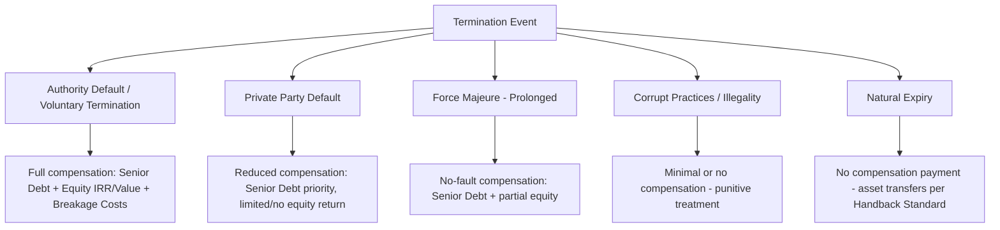

## Compensation on Termination and Handback Provisions


### Definition and Conceptual Framework

Compensation on Termination (CoT) provisions govern the financial settlement payable when a PPP Project Agreement (PA) ends prior to its natural expiry, or at natural expiry itself, while Handback Provisions govern the physical and operational transfer of the asset back to the Contracting Authority (or to a successor Project Company). Together, these clauses determine the "exit economics" of the project across every possible termination scenario, and are among the most heavily negotiated and financially significant provisions in any PPP contract, since they define the downside protection (or exposure) for both lenders and equity, and the residual value the public sector eventually receives.

**Key Points**

- Compensation is calculated differently depending on the **cause of termination** — the same physical asset can generate materially different payouts depending on whether termination arises from Authority default, private party default, Force Majeure, or natural expiry.
- Handback provisions are conceptually distinct from compensation but financially interlinked: condition/survey requirements at handback (or a handback reserve/sinking fund) directly affect the net amount payable or the asset's residual condition.
- These provisions are the primary mechanism by which lenders assess their downside recovery, making them central to project bankability and credit ratings.

### Taxonomy of Termination Events



### Standard Compensation Formulas by Termination Cause

The near-universal PPP drafting convention (traceable to UK PFI standardization and adopted/adapted by World Bank and EPEC toolkits) ties compensation to the cause of termination, with Authority-fault termination being most generous to the private party and private-party-fault termination being least generous.

| Termination Cause | Typical Basis | Senior Debt Treatment | Equity/Subordinated Debt Treatment |
| --- | --- | --- | --- |
| Authority Default / Voluntary Termination | Fair Value or Market Value (often via retendering the PA) | Full recovery | Full or near-full recovery, sometimes including forecast equity IRR |
| Private Party Default | Lower of Market Value or a discounted formula; sometimes retender-based with deductions | Substantially protected, subject to deductions for rectification | Limited to residual value after deductions; often materially reduced or nil |
| Force Majeure (Prolonged) | No-fault compensation, often senior debt plus partial equity | Full or near-full recovery | Partial recovery (shared risk principle) |
| Corrupt Practices/Fraud/Illegality | Minimal — often base equity or nil | May still be protected (policy choice to preserve bankability) | Typically nil |
| Natural Expiry | No compensation; asset transfers per Handback Standard | N/A (debt should be fully amortized by expiry) | N/A |

**Key Points**

- The convention of protecting senior debt across almost all termination scenarios (except sometimes fraud) is a deliberate policy choice to preserve bankability — lenders will not accept event risk on their principal even in default scenarios, since the Authority ultimately benefits from a financeable structure.
- Equity/subordinated debt bears the residual risk, consistent with capital structure seniority and the "first-loss" position equity holders occupy generally in project finance.
- [Inference: The exact deductions and discount mechanics in default scenarios are contract-specific negotiated outcomes; some jurisdictions apply a fixed percentage haircut, others use retender-proceeds-based mechanisms, and others use a full DCF-based Fair Value calculation with contractual adjustments.]

### Market Value / Retender-Based Compensation Mechanism

A widely used approach (especially in UK PFI-derived contracts) determines compensation via **actual retendering** of the PA to a new operator, using the highest bona fide offer received as the basis for compensation, rather than a theoretical valuation model.

```mermaid
sequenceDiagram
    participant AU as Contracting Authority
    participant PC as Original Project Company
    participant LN as Senior Lenders
    participant NB as New Bidders
    AU->>PC: Termination Notice issued
    AU->>NB: Retender process launched for remaining contract term
    NB->>AU: Bids submitted (capital sum payable to Authority, or subsidy required)
    AU->>LN: Highest compliant bid identified
    Note over AU,LN: Compensation = Retender Proceeds, adjusted per formula
    AU->>PC: Compensation paid per formula (net of deductions)
    PC->>LN: Senior debt repaid from proceeds; residual to equity if any
```

**Key Points**

- Retender-based mechanisms are considered more objective/market-tested than DCF valuation models, reducing dispute risk, but introduce timing risk (retender can take months) and market-condition risk (few bidders in a downturn depress proceeds).
- A **fallback formula-based valuation** (DCF of projected cash flows, or a fixed formula tied to Base Case Financial Model figures) is typically specified if retendering fails to produce a compliant bid within a defined period.
- Deductions from retender proceeds commonly include: outstanding rectification/defect costs, Authority's re-procurement costs, and any amounts owed by the Project Company to the Authority.

### Discounted Cash Flow (DCF) / Base Case Model Approach

Alternative to retendering, many contracts (particularly outside the UK, or for sectors where retendering is impractical, e.g., highly specialized infrastructure) use a formulaic valuation based on the project's Base Case Financial Model.

$$CoT = \sum_{t=1}^{n} \frac{CF_t}{(1+r)^t} - \text{Deductions}$$

Where $CF_t$ represents projected net cash flows for the remaining concession term $n$, $r$ is the discount rate (often the project's senior debt margin, weighted average cost of capital, or a contractually fixed rate), and Deductions capture rectification costs, outstanding penalties, and Authority re-procurement expenses.

**Example**

> A toll-road PPP terminates for Authority default with 8 years remaining on a 25-year concession. The Base Case Financial Model projects average annual net cash flow of $12 million for the remaining term, using a contractually specified discount rate of 7%.

$$CoT \approx \sum_{t=1}^{8} \frac{\$12\text{M}}{(1.07)^t} \approx \$71.6\text{M}$$

**Output**

| Input | Value |
| --- | --- |
| Remaining term | 8 years |
| Annual net cash flow (Base Case) | $12 million |
| Discount rate | 7% |
| Gross DCF compensation (pre-deductions) | ≈ $71.6 million |
| Deductions (illustrative rectification costs) | $3 million |
| Net compensation payable | ≈ $68.6 million |

[Inference: This is a simplified illustrative calculation; real Base Case Model compensation clauses often incorporate more granular period-by-period cash flow projections, tax effects, and specific contractual adjustment mechanisms rather than a flat annuity assumption.]

### Handback Provisions — Core Components

Handback (or "asset transfer") provisions govern the condition, documentation, and process by which the asset reverts to the Authority (or a successor operator) — most critically at **natural expiry**, but analogous mechanics often apply at early termination too.

**Key Points**

- **Handback condition/survey requirements**: the PA specifies minimum residual condition standards (e.g., remaining useful life thresholds for major components, compliance with technical standards current at handback) that the asset must meet.
- **Survey and rectification process**: typically involves a joint survey (often by an independent technical adviser) conducted at a specified period before expiry (e.g., 2–5 years prior), identifying any shortfall against the handback standard, followed by a rectification period.
- **Handback reserve/sinking fund**: many contracts require the Project Company to fund a reserve account in the years approaching expiry, ensuring funds are available for rectification works and reducing dispute risk at the point of handback.
- **Lifecycle/renewal obligations**: ongoing lifecycle replacement obligations throughout the contract term are designed to ensure the asset naturally approaches the handback standard without a large terminal capital injection, though a "tail" shortfall is common in practice.

### Handback Process — Sequential Timeline


**Key Points**

- Some contracts impose **liquidated damages for handback shortfall** — a pre-agreed formula converting a condition deficiency into a cash deduction from any final payment (or a standalone payment obligation) rather than requiring physical rectification, offering flexibility to the Authority.
- A **post-handback warranty/defects period** (commonly 12–24 months) is standard, during which the outgoing Project Company remains liable for latent defects not identified during the handback survey.
- Documentation handover (as-built drawings, maintenance records, warranties, licenses, spare parts inventories, software/IP licenses for building management systems) is frequently underweighted in early contract drafting but critical to a successful transition — modern contracts increasingly specify a detailed **Information/Documentation Schedule** as a condition of handback completion.

### Interaction Between Compensation and Handback at Early Termination

At early termination (as opposed to natural expiry), compensation and handback obligations interact directly: the asset is handed back regardless of termination cause (the Authority needs the asset/service to continue), but the **condition standard** and **valuation basis** differ.

| Aspect | Natural Expiry | Early Termination |
| --- | --- | --- |
| Compensation payable | None (asset transfers per Handback Standard) | Yes, per applicable termination formula |
| Condition standard applicable | Full contractual Handback Standard | Often "as-is" or a reduced standard, with deductions reflecting condition shortfall |
| Survey timing | Multi-year lead-in process | Compressed/ad hoc survey at termination |
| Reserve account treatment | Applied to fund rectification | Often released/credited against compensation calculation |

### Set-Off and Deduction Mechanics

**Key Points**

- Most CoT clauses permit the Authority to **set off** amounts owed by the Project Company (unpaid penalties, rectification costs, indemnity claims) against the gross compensation figure before payment.
- **Caps on set-off** are a common negotiation point — lenders typically seek to cap deductions to protect senior debt recovery, particularly in Authority-default or no-fault (FM) scenarios where the private party is not at fault.
- **Timing of payment**: compensation is rarely paid instantaneously; contracts specify a payment timeline (e.g., within 20–60 business days of final determination) and may provide for interest on late payment.
- **Currency and indexation**: in cross-border or inflation-volatile markets, compensation formulas often specify the currency of payment and whether amounts are indexed (e.g., CPI-linked) between the valuation date and actual payment date.

### Dispute Resolution Overlay

Given the financial magnitude typically involved, CoT determinations are a leading source of PPP disputes:

- Many contracts route valuation disputes to an **independent expert** (technical/financial) rather than full arbitration, for speed and cost efficiency, with arbitration/litigation reserved as a fallback or for disputes on legal interpretation (e.g., whether the termination cause was correctly classified).
- **Dispute Resolution Boards (DRBs)**, where used, may have standing jurisdiction throughout the contract term, but final CoT quantum disputes are frequently carved out to a separate, more formal expert or arbitral process given the stakes involved.

### Worked Comprehensive Example — Private Party Default Termination

A wastewater PPP (30-year term, 12 years elapsed) is terminated for persistent private-party default. Key figures:

- Outstanding senior debt: $95 million
- Retender process yields a highest compliant bid (capital sum payable by new operator to Authority) of $110 million
- Contractually permitted deductions: $8 million (rectification of deferred maintenance) + $3 million (Authority re-procurement costs)
- Contract stipulates senior debt is protected up to retender proceeds after deductions; equity receives residual only if any remains

$$\text{Net Proceeds} = \$110\text{M} - \$8\text{M} - \$3\text{M} = \$99\text{M}$$


$$\text{Senior Debt Repayment} = \min(\$95\text{M}, \$99\text{M}) = \$95\text{M (fully repaid)}$$


$$\text{Residual to Equity} = \$99\text{M} - \$95\text{M} = \$4\text{M}$$

**Output**

| Line Item | Amount |
| --- | --- |
| Retender proceeds (gross) | $110 million |
| Less: Rectification deductions | ($8 million) |
| Less: Authority re-procurement costs | ($3 million) |
| Net proceeds available | $99 million |
| Senior debt outstanding | $95 million |
| Senior debt recovery | $95 million (100%) |
| Residual to equity/subordinated lenders | $4 million |

This illustrates the typical capital structure waterfall applied even in a fault-based termination: senior lenders are substantially protected, while equity absorbs the primary economic consequence of the default — consistent with the risk-bearing hierarchy embedded in most PPP financing structures.

### Related Topics

- Force Majeure and Relief Event Provisions
- Step-In Rights and Lender Direct Agreements
- Refinancing Gain-Share Mechanisms in PPP Contracts
- Risk Matrix Design in PPP Feasibility Studies
- Dispute Resolution Boards (DRBs) and Expert Determination in PPP Contracts
- Change in Law and Compensation Event Mechanics
- Lifecycle Cost Modeling and Asset Replacement Reserves
- Base Case Financial Model Structuring in PPP Bids