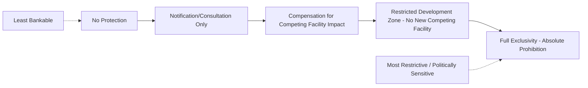
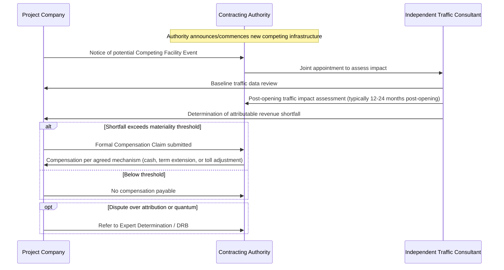

## Exclusivity, Non-Compete, and Competing Facility Clauses

### Definition and Conceptual Framework

Exclusivity, Non-Compete, and Competing Facility clauses are risk-allocation provisions that protect a PPP Project Company's revenue stream from erosion caused by the Contracting Authority (or state entities) developing, authorizing, or supporting competing infrastructure or services within the project's catchment area or market. These clauses are most economically significant in **demand-risk (user-pays)** PPP structures — toll roads, ports, airports, parking facilities — where project revenue is directly tied to traffic/usage volumes, but also appear in **availability-payment** structures to protect against service-substitution risk.

**Key Points**

- The core economic rationale is protecting the **revenue forecast underpinning the financial model** from government-induced demand diversion, which is a risk the private party cannot control or price without contractual protection.
- These clauses sit at the intersection of contract law and competition/public law — an overly broad exclusivity clause can raise antitrust concerns or conflict with a government's sovereign right to regulate and plan infrastructure, creating an inherent drafting tension.
- Absence of any exclusivity protection is a **major bankability risk factor** for demand-risk toll and user-fee projects; lenders typically require at minimum a compensation mechanism (if not an outright prohibition) for government-sponsored competing facilities.

### Spectrum of Protection Mechanisms

**Key Points**

- Contracts rarely sit at the extremes; most negotiated outcomes cluster around **restricted development zones** (geographic/temporal limits on new competing infrastructure) combined with a **compensation mechanism** if the Authority nonetheless proceeds.
- Full exclusivity (absolute prohibition on any competing infrastructure) is increasingly disfavored by multilateral lenders and public policy bodies due to distortive effects on long-term transport/infrastructure planning, and is more common in older-generation (1990s–2000s) toll concessions than modern PPP templates.

### Types of Clauses — Detailed Taxonomy

**1. Exclusivity Clauses**

Grant the Project Company the sole right to provide the defined service within a specified area, prohibiting the Authority from awarding a competing concession or license during the contract term.

**2. Non-Compete Clauses**

Restrict the Authority (and sometimes government-owned or government-supported entities) from constructing, funding, or authorizing new infrastructure that would materially divert traffic/usage from the project, typically defined by geographic proximity and functional similarity.

**3. Competing Facility Compensation Clauses**

Do not prohibit competing infrastructure outright but entitle the Project Company to compensation (revenue top-up, extended concession term, or lump-sum payment) if a defined "Competing Facility" is built within a specified zone/period and causes demonstrable revenue impact exceeding a materiality threshold.

**4. Network/System Integration Carve-Outs**

Common exclusions from non-compete protection: government's right to maintain, upgrade, or expand the *existing* road/rail network (as distinct from new parallel competing infrastructure), and emergency/public safety infrastructure.

### Standard Definitional Structure — "Competing Facility"

A well-drafted Competing Facility definition requires precision across several dimensions to be enforceable and to avoid disputes:

| Dimension | Typical Drafting Parameter |
| --- | --- |
| Geographic proximity | Defined radius or corridor (e.g., within 10 km parallel to the toll road alignment) |
| Functional similarity | Serves substantially the same origin-destination traffic/passenger flow |
| Capacity threshold | Materially increases capacity on a competing route (de minimis widening/maintenance excluded) |
| Sponsor | Constructed, funded, or authorized by the Authority or an affiliated state entity (privately-initiated unrelated projects often excluded) |
| Temporal scope | Restriction applies for the concession term, or a defined sub-period (e.g., first 15 years) |
| Materiality trigger | Revenue/traffic impact must exceed a stated percentage threshold (e.g., 5–10% traffic diversion) before compensation is triggered |

**Example**

> "Competing Facility means any new road, or material expansion of an existing road, constructed, financed, or authorized by the Authority or any Governmental Authority, that (a) is located within [10] kilometers of the Project Road measured perpendicular to its alignment, (b) is designed to accommodate through-traffic of a similar origin-destination profile, and (c) results in a reduction of Actual Traffic of more than [10]% against the Base Case Traffic Forecast in any Contract Year, as verified by the Independent Traffic Consultant."

### Compensation Mechanics for Competing Facility Impact

$$\Delta R = (T_{\text{forecast}} - T_{\text{actual}}) \times \bar{t} \times f$$

Where $\Delta R$ is the estimated revenue shortfall, $T_{\text{forecast}}$ and $T_{\text{actual}}$ are forecast versus actual traffic volumes (isolating the portion attributable to the Competing Facility, net of general market/economic variance), $\bar{t}$ is the average toll rate, and $f$ is an attribution factor (since not all shortfall may be attributable solely to the competing facility — economic downturns, pandemic effects, or other factors must be isolated).

**Key Points**

- **Attribution/causation** is the central dispute driver: distinguishing traffic diversion caused by the Competing Facility from general demand variance (economic cycles, fuel prices, pandemic-related travel reduction) requires an agreed methodology, typically involving an **Independent Traffic Consultant** conducting origin-destination surveys.
- Compensation remedies typically take one of three forms: (a) a direct cash payment/subsidy calibrated to the shortfall, (b) an extension of the concession term to restore the Base Case equity IRR, or (c) a toll adjustment mechanism (permitting an above-formula toll increase to offset lost volume with higher per-unit revenue).
- Some contracts cap the compensation period (e.g., compensation only payable for a defined number of years post-Competing-Facility-opening) rather than for the life of the concession, reflecting an assumption that traffic patterns eventually re-equilibrate.

### Sequential Process — Competing Facility Claim

### Interaction with Public Policy and Competition Law

**Key Points**

- Governments increasingly resist granting **absolute** non-compete rights because they constrain future network planning and can be challenged as anti-competitive or as an improper fetter on sovereign/legislative power (a government generally cannot permanently bind a future administration's regulatory or planning discretion, though it can agree to pay compensation for exercising that discretion — the "compensation, not prohibition" principle).
- Multilateral development banks (World Bank, ADB, IFC) and PPP policy units in many jurisdictions now favor the **compensation-based** approach over hard exclusivity, viewing it as a better balance between bankability and public interest flexibility. [Inference: this reflects observed shifts in more recent PPP toolkits and guidance notes; the degree of adoption varies by country and sector, and some jurisdictions/sectors, particularly greenfield toll roads in emerging markets, still use harder exclusivity provisions where deemed necessary for bankability.]
- In availability-payment PPPs (e.g., a government office building or school), competing facility risk is less financially critical since revenue is not usage-linked, so these clauses are typically narrower or absent, focused instead on protecting against service **substitution** by a competing government-provided alternative that would undermine the utilization assumptions behind facilities-management payment mechanisms (e.g., a hospital PPP payment linked partly to patient volumes).

### Carve-Outs and Limitations — Standard Exclusions

Even robust non-compete clauses typically exclude:

- Routine maintenance, safety upgrades, and capacity improvements to the **existing** network (as opposed to new parallel routes).
- Infrastructure required for **public safety, emergency response, or national security**.
- Projects already planned/announced and disclosed to bidders **prior to contract signature** (disclosed pipeline projects are priced into the original bid and are not "new" competing risk).
- Development undertaken by **private third parties without government funding/authorization** (pure private competition is generally not compensable, as it reflects ordinary market risk the Project Company is expected to bear).

### Comparative Table: Exclusivity vs. Non-Compete vs. Compensation-Only Approaches

| Feature | Full Exclusivity | Non-Compete (Restricted Zone) | Compensation-Only |
| --- | --- | --- | --- |
| Authority's development flexibility | None during term | Limited within defined zone/period | Full — pays compensation instead |
| Bankability impact | Strongest lender comfort | Strong, if zone/period well-defined | Moderate — depends on compensation certainty |
| Political/legal risk | High (public policy criticism, sovereign discretion concerns) | Moderate | Lower |
| Dispute likelihood | Low (bright-line prohibition) | Moderate (boundary/definition disputes) | High (attribution/quantum disputes) |
| Prevalence in modern PPP templates | Declining | Common | Increasingly favored |

### Worked Example

A 25-year toll road PPP includes a Competing Facility clause defining a 15 km exclusion corridor and a 10% traffic-diversion materiality threshold. In Year 8, the government constructs a new parallel arterial road 8 km from the toll road alignment, funded by the national infrastructure budget.

- Base Case Traffic Forecast for Year 9 (post-opening): 45,000 vehicles/day
- Actual traffic Year 9: 38,000 vehicles/day
- Independent Traffic Consultant attributes 80% of the shortfall to the new arterial road (remainder attributed to a regional economic slowdown)
- Average toll rate: $2.50/vehicle

$$\text{Attributable Shortfall} = (45{,}000 - 38{,}000) \times 0.80 = 5{,}600 \text{ vehicles/day}$$

$$\text{Diversion Percentage} = \frac{5{,}600}{45{,}000} \approx 12.4\%$$

Since 12.4% exceeds the 10% materiality threshold, a compensation claim is triggered.

$$\text{Annual Revenue Shortfall} \approx 5{,}600 \times \$2.50 \times 365 \approx \$5.11\text{ million/year}$$

**Output**

| Metric | Value |
| --- | --- |
| Forecast traffic (Year 9) | 45,000 vehicles/day |
| Actual traffic (Year 9) | 38,000 vehicles/day |
| Attributable diversion (80% of shortfall) | 5,600 vehicles/day |
| Diversion percentage | 12.4% (exceeds 10% threshold) |
| Estimated annual revenue shortfall | ≈ $5.11 million |
| Compensation trigger | Yes — claim proceeds to formal assessment |

### Related Topics

- Compensation on Termination and Handback Provisions
- Change in Law and Compensation Event Mechanics
- Demand Risk vs. Availability Payment Structures in PPP
- Traffic and Revenue Forecasting Methodologies
- Base Case Financial Model Structuring in PPP Bids
- Dispute Resolution Boards (DRBs) and Expert Determination in PPP Contracts
- Government Support Agreements and Sovereign Guarantees