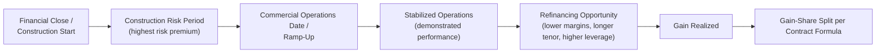
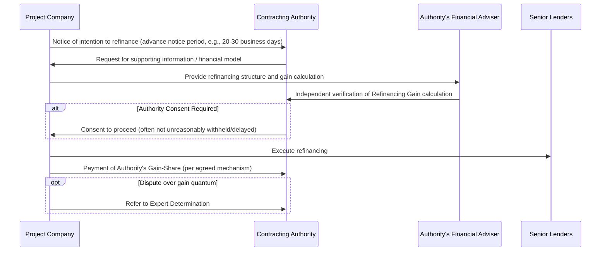

## Refinancing Gain-Share Mechanisms

### Definition and Conceptual Framework

Refinancing Gain-Share mechanisms are contractual provisions requiring the Project Company (SPV) to share a portion of the financial benefit realized from refinancing its project debt (or, less commonly, restructuring its equity/capital structure) with the Contracting Authority. The underlying economic rationale is that the original financing structure and pricing reflect the risk profile priced by lenders and equity **during the construction/early operational phase**, when project risk is highest. Once a project reaches stable operations (post-construction, ramp-up complete, performance track record established), the risk profile improves materially, often permitting the Project Company to refinance at lower interest margins, extended tenors, higher leverage, or relaxed covenants — generating a financial gain that was not contemplated in the original bid pricing.

**Key Points**

- The Authority's claim to a share of this gain rests on the principle that the **de-risking is partly attributable to the public sector's own performance and the contract's structural protections** (e.g., government payment obligations, regulatory stability, demonstrated project viability) — not solely to the Project Company's own effort.
- Gain-share provisions balance two competing objectives: (1) preventing the private party from capturing windfall gains unrelated to genuine value-added performance, while (2) preserving sufficient incentive for the Project Company to pursue refinancing that improves overall project efficiency (since refinancing can also benefit the Authority indirectly through improved project stability).
- These clauses became standardized largely following high-profile refinancing gains in UK PFI projects during the late 1990s/early 2000s, where early transactions completed without gain-share provisions generated significant private windfalls and substantial public criticism, prompting standardized model clauses in subsequent contracts and updated guidance (e.g., UK Treasury's Standardisation of PFI Contracts, later SoPC4).

### Why Refinancing Gains Arise — Risk Curve Logic

**Key Points**

- Construction-phase debt pricing embeds a premium for completion risk (cost overrun, delay, technical failure) that is largely eliminated once the asset is operational and performing to specification.
- Post-completion refinancing can take several forms: refinancing existing debt at a lower margin, extending debt tenor to better match the concession term (reducing refinancing/balloon risk and often enabling higher gearing), increasing leverage (releasing equity cash to sponsors), or a full capital structure restructuring (e.g., issuing project bonds to replace bank debt).

### Types of Refinancing Transactions Captured

| Refinancing Type | Description | Typical Gain-Share Trigger? |
| --- | --- | --- |
| Margin reduction refinancing | Same debt quantum, lower interest margin reflecting reduced risk | Yes |
| Tenor extension | Debt maturity extended, often reducing debt service coverage ratio (DSCR) pressure and enabling distributions | Yes |
| Leverage increase (gearing up) | Additional debt raised against improved cash flow stability, proceeds distributed to equity | Yes — usually the largest gain-share trigger |
| Bond issuance / capital markets refinancing | Bank debt replaced with project bonds, often at different pricing/structure | Yes |
| Routine amendment / waiver | Minor covenant waiver or technical amendment, no material economic benefit | Typically no (de minimis threshold applies) |

### Standard Definitional Structure — "Qualifying Refinancing"

Most contracts define a "Qualifying Refinancing" (or "Relevant Refinancing") narrowly to avoid capturing routine treasury management activity while catching genuine value-releasing transactions.

**Example**

> "Qualifying Refinancing means any amendment, variation, novation, or replacement of the Financing Agreements (or any part thereof) which (a) results in a Refinancing Gain calculated in accordance with Schedule [X], and (b) is not a Permitted Refinancing (being a refinancing required solely to remedy a default, or one where the Refinancing Gain, calculated on a reasonable estimate basis, does not exceed [£500,000/$1,000,000] or such other de minimis threshold)."

**Key Points**

- **De minimis thresholds** exclude minor/routine transactions from triggering the full gain-share calculation and approval process, reducing administrative burden.
- **Distress/default refinancings** (undertaken to cure a covenant breach or avoid insolvency) are typically excluded from gain-share obligations, since these do not represent a "gain" in the economic sense the clause is designed to capture — though contracts vary on precise treatment.
- Some contracts also address **voluntary vs. Authority-initiated refinancing** distinctly — where the Authority requests or requires a refinancing (e.g., to facilitate a change in scope), different sharing percentages or exemptions may apply.

### Gain Calculation Methodology

The core calculation compares the Project Company's financial position under the refinanced structure against a "counterfactual" — typically the original financial close base case, or the position immediately prior to refinancing — over the remaining concession term.

$$G = \sum_{t=1}^{n} \left[ \frac{D_t^{\text{original}}}{(1+r)^t} \right] - \sum_{t=1}^{n} \left[ \frac{D_t^{\text{refinanced}}}{(1+r)^t} \right] + \Delta \text{Upfront Distribution}$$

Where $G$ is the total Refinancing Gain, $D_t^{\text{original}}$ and $D_t^{\text{refinanced}}$ represent debt service (or equity distribution capacity) under the original versus refinanced structures for each period $t$ across the remaining term $n$, $r$ is the discount rate (commonly the pre-refinancing cost of equity or a contractually specified rate), and $\Delta$ Upfront Distribution captures any immediate cash released to equity from increased leverage (e.g., a one-time special dividend funded by new debt proceeds).

**Key Points**

- The calculation is typically performed by the Project Company and independently verified/audited by the Authority's financial adviser, given the complexity and the incentive misalignment (Project Company has an incentive to understate the gain).
- **Base Case comparison methodology** must be pre-agreed and locked at financial close (or updated at each approved refinancing) to avoid disputes over what counterfactual applies — a moving or ambiguous baseline is a common source of dispute.
- Gains can arise both from **debt service savings** (lower ongoing interest cost, benefiting equity cash flow over time) and from **immediate cash extraction** (upfront distribution funded by increased debt principal) — most model clauses capture both components.

### Standard Sharing Ratios and Mechanisms

**Key Points**

- Common sharing ratios in mature PPP markets (particularly UK PFI-derived templates) range from **50/50** to sliding scales that shift progressively more favorably to the Authority as the gain size increases (e.g., 50/50 up to a threshold, then 70/30 in the Authority's favor above it), reflecting a policy view that very large gains are less attributable to the private party's skill and more to structural/market factors.
- The **method of payment** to the Authority can take several forms: (a) a lump-sum cash payment, (b) a reduction in the Authority's ongoing unitary/availability payments over the remaining term, (c) an extension of the concession term in the Authority's favor (rare, since it doesn't directly monetize the gain), or (d) improved service specifications/performance standards at no extra cost.
- [Inference: While the 50/50 baseline is widely cited as a market convention in UK-influenced PPP jurisdictions, actual negotiated ratios vary by country, sector, deal vintage, and the relative bargaining power/precedent available at the time of contract negotiation — treating any single ratio as universal would overstate consistency across global PPP markets.]

### Sequential Process — Refinancing Gain-Share Determination

### Authority Consent Rights

**Key Points**

- Beyond the financial sharing mechanism, most contracts also grant the Authority a **consent right** (often "not to be unreasonably withheld or delayed") over the refinancing itself, distinct from the gain-share calculation — protecting the Authority's interest in ensuring the refinanced structure does not introduce excessive leverage or covenant weakness that could increase default/termination risk over the remaining term.
- Consent rights typically focus on ensuring the refinancing does not materially **increase the Authority's termination liability** (since Compensation on Termination is often linked to outstanding senior debt — see Compensation on Termination and Handback Provisions) or **weaken step-in/cure protections** under the Direct Agreement.
- Some contracts cap the **permitted gearing ratio** post-refinancing, or require lender/rating agency confirmation that the refinanced structure maintains an investment-grade-equivalent profile, to prevent the gain-share mechanism from incentivizing excessively aggressive leveraging that shifts risk back to the public sector via increased termination exposure.

### Worked Example

A social infrastructure PPP (25-year availability-payment school project) reaches Commercial Operations Date in Year 2. In Year 5, having established a strong operational track record, the Project Company refinances its senior debt: extending tenor from a 15-year to a 23-year bullet-matched structure and reducing the interest margin from 250bps to 150bps over the reference rate, while also increasing leverage to release an upfront distribution to equity.

- Original financial close base case: projected equity distributions with a Net Present Value (NPV) of $40 million over the remaining term (using the original 12% equity discount rate)
- Refinanced structure: projected equity distributions with an NPV of $58 million over the same remaining term, discounted at the same rate, plus a $6 million immediate upfront distribution funded by increased debt proceeds

$$G = (\$58\text{M} + \$6\text{M}) - \$40\text{M} = \$24\text{M}$$

Applying a contractually specified 50/50 sharing ratio:

$$\text{Authority Share} = \$24\text{M} \times 0.50 = \$12\text{M}$$

**Output**

| Component | Value |
| --- | --- |
| Original Base Case equity NPV | $40 million |
| Refinanced structure equity NPV | $58 million |
| Upfront distribution (increased leverage) | $6 million |
| Total Refinancing Gain | $24 million |
| Sharing ratio | 50/50 |
| Authority's share | $12 million |
| Payment mechanism (illustrative) | Applied as a reduction to future unitary charge payments over remaining term |

### Comparative Table: Payment Mechanism Trade-Offs

| Mechanism | Advantage | Disadvantage |
| --- | --- | --- |
| Lump-sum cash payment | Immediate, clean, simple to administer | Project Company may need to fund from limited liquidity; can strain post-refinancing cash position |
| Reduction in future unitary/availability payments | Smooths impact over time; no immediate cash strain | Value to Authority is discounted/deferred; requires ongoing tracking over remaining term |
| Service enhancement in lieu of payment | Aligns with public value/service improvement objectives | Harder to value precisely; risk of under-delivery relative to notional cash value |

### Related Topics

- Compensation on Termination and Handback Provisions
- Step-In Rights and Lender Direct Agreements
- Base Case Financial Model Structuring in PPP Bids
- Debt Service Coverage Ratios and Financial Covenants in Project Finance
- Change in Law and Compensation Event Mechanics
- Equity IRR Modeling Across the Project Lifecycle
- Dispute Resolution Boards (DRBs) and Expert Determination in PPP Contracts