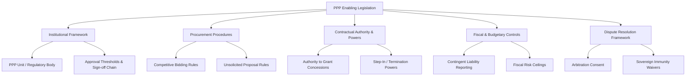
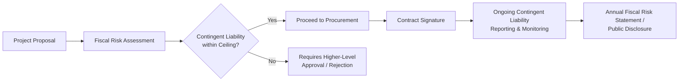

## PPP Enabling Legislation and Concession Law

### Definition and Conceptual Framework

PPP Enabling Legislation refers to the primary statutory and regulatory framework a jurisdiction adopts to authorize, govern, and standardize the procurement, structuring, and administration of Public-Private Partnerships. Concession Law is the broader (often older and more established) body of legal doctrine — frequently rooted in civil-law administrative law traditions — governing the grant of rights by the state to a private party to build, operate, and/or finance public infrastructure or services for a defined period in exchange for the right to collect revenue or receive payment.

**Key Points**

- PPP Enabling Legislation is typically a modern statutory overlay; Concession Law is often a pre-existing doctrinal foundation (especially in civil-law jurisdictions with roots in French *droit administratif* concession theory) that PPP legislation builds upon, modifies, or partially displaces.
- The presence, quality, and completeness of enabling legislation is a primary determinant of a jurisdiction's PPP market maturity and bankability, since it establishes legal certainty for private investors and lenders regarding contract enforceability, dispute resolution, and government powers.
- Legal frameworks vary substantially between **common-law jurisdictions** (which often rely more heavily on general contract law plus sector-specific regulation, with less codified "PPP law" as such — e.g., historically the UK) and **civil-law jurisdictions** (which often adopt a dedicated PPP/Concession Law as a codified statute — common across much of Latin America, francophone Africa, and parts of Asia and Eastern Europe).

### Core Components of PPP Enabling Legislation

### Institutional Framework — PPP Units and Approval Architecture

**Key Points**

- Most mature PPP frameworks establish a dedicated **PPP Unit** (sometimes housed in the Ministry of Finance, sometimes a standalone agency) responsible for project screening, standardization of contract templates, technical assistance to line ministries/contracting authorities, and often central approval/gatekeeping functions.
- **Approval thresholds** typically scale scrutiny with project value or contingent liability exposure — larger or fiscally riskier projects require Cabinet, Ministry of Finance, or even legislative approval, while smaller projects may be approved at the line-ministry or sub-national level.
- A well-functioning institutional framework addresses the tension between **project-level flexibility** (allowing sector expertise and tailored risk allocation) and **central fiscal oversight** (preventing uncoordinated proliferation of contingent liabilities across ministries/sub-national entities).

### Procurement Framework — Competitive vs. Unsolicited Proposals

| Procurement Route | Description | Typical Legal Treatment |
| --- | --- | --- |
| Competitive Bidding (solicited) | Authority initiates tender; multiple bidders compete on defined criteria | Default/preferred route in most modern frameworks; governed by detailed procedural rules (pre-qualification, RFP, evaluation criteria) |
| Unsolicited Proposals (USPs) | Private party proposes a project idea to government | Increasingly regulated with "Swiss Challenge" or similar competitive matching mechanisms to preserve competitive tension and avoid favoritism |
| Direct Negotiation | Government negotiates directly with a single party, no competitive process | Generally restricted to narrow exceptions (national security, genuine sole-source technical circumstances, emergency) under modern frameworks |

**Key Points**

- **Swiss Challenge mechanisms** allow an unsolicited proposal originator to retain a right of first refusal or bid-matching advantage after the project is opened to competing bids, balancing innovation incentives against competitive fairness — a widely adopted but debated mechanism in unsolicited proposal frameworks. [Inference: The precise design and prevalence of Swiss Challenge mechanisms varies significantly across jurisdictions and is subject to ongoing policy debate regarding whether it genuinely preserves competitive tension or systematically favors the original proponent.]
- Procurement law frameworks must also address their interaction with **general public procurement law** — PPP legislation often operates as a *lex specialis* (specific law) that displaces or supplements general procurement statutes for PPP-specific transactions, given the unique long-term, complex nature of PPP contracts relative to standard goods/works/services procurement.

### Contractual and Sovereign Powers — Key Legal Enablement Provisions

**Key Points**

- **Authority to contract**: enabling legislation must clearly confer legal authority on the specific Contracting Authority (ministry, agency, state-owned enterprise, sub-national government) to enter into long-term concession/PPP agreements — without this, contracts risk being *ultra vires* (beyond legal power) and unenforceable, a critical due diligence point for lenders.
- **Tariff/tolling authority**: for revenue-risk projects, legislation must establish the legal basis for the Project Company (or the Authority on its behalf) to levy tolls, tariffs, or user fees, including the mechanism for periodic adjustment (indexation, formula-based revision).
- **Expropriation/land acquisition powers**: enabling frameworks typically grant or clarify the Authority's power (exercised on behalf of or for the benefit of the project) to acquire land through eminent domain/compulsory purchase, a frequent source of delay risk in PPP delivery — see also Land Acquisition and Right-of-Way Risk Allocation as an adjacent topic.
- **Government support instruments**: legislation often authorizes specific credit enhancement tools — sovereign guarantees, availability payment commitments, minimum revenue guarantees, or viability gap funding — subject to fiscal ceilings and Ministry of Finance approval, addressed further under Government Support Agreements and Sovereign Guarantees.

### Fiscal and Budgetary Control Mechanisms

**Key Points**

- Modern PPP legislation increasingly requires **contingent liability accounting and disclosure** — recognizing that government payment obligations (availability payments, guarantees, termination liabilities) represent real fiscal exposure even when off-balance-sheet under certain accounting treatments, and requiring periodic public reporting (often coordinated with IMF/World Bank fiscal risk management guidance).
- **Fiscal ceilings/ceilings on aggregate PPP commitments** (e.g., a cap on total PPP payment obligations as a percentage of GDP or annual budget) are used in some jurisdictions to prevent PPP structures being used to circumvent conventional public debt limits — a recognized policy risk where PPPs are used primarily for **fiscal space** reasons rather than genuine value-for-money reasons.
- **Value-for-Money (VfM) assessment requirements**: many frameworks mandate a formal comparison (often a Public Sector Comparator methodology) demonstrating that PPP delivery offers better value than conventional public procurement before a project can proceed — addressed in depth under Value-for-Money Assessment Methodologies.

### Dispute Resolution and Legal Enforceability Provisions

**Key Points**

- **Consent to arbitration**: a critical enabling provision is the government's statutory or contractual consent to submit disputes to international arbitration (e.g., ICSID, UNCITRAL, ICC rules), since without clear consent, sovereign immunity doctrines could otherwise bar private party enforcement.
- **Waiver of sovereign immunity**: enabling legislation or the concession contract itself typically includes an express, limited waiver of sovereign immunity from suit and, critically, from **execution/enforcement** against state assets — the latter is often more narrowly waived (e.g., excluding certain categories of state assets) and is a key point of lender/investor scrutiny.
- **Choice of law and forum**: cross-border/DFI-financed PPPs frequently specify a neutral governing law and arbitral seat (e.g., English law, Singapore or Paris-seated arbitration) distinct from the host jurisdiction's domestic courts, to enhance investor confidence — although domestic law typically still governs public law aspects (e.g., validity of the grant of the concession itself).
- **Stabilization clauses**: some concession laws or individual contracts include clauses seeking to freeze or provide compensation for changes in the regulatory/fiscal regime applicable to the project (closely related to, but distinct from, standard Change in Law compensation mechanisms in the contract itself) — these raise particular legal complexity regarding their enforceability against future legislative sovereignty.

### Civil-Law Concession Theory vs. Common-Law Contractual Approach

| Feature | Civil-Law Concession Tradition | Common-Law Contractual Approach |
| --- | --- | --- |
| Legal characterization | Concession as an act of public authority (administrative act) granting a privilege, alongside a contractual component | Primarily a contract, interpreted under general contract law principles |
| Government's unilateral powers | Often retains inherent unilateral modification/termination powers (*pouvoir de modification unilatérale*) even absent express contract terms, subject to compensation | Government's powers generally limited to what is expressly reserved in the contract |
| Dispute forum | Often administrative courts have jurisdiction over public-law aspects | Ordinary courts or arbitration, per contract terms |
| Codification | Frequently a dedicated Concession Law/Code (e.g., many Francophone and Latin American jurisdictions) | Often no single codified "concession law" — sector statutes plus general contract/administrative law (historically true of the UK, evolving in various forms elsewhere) |

**Key Points**

- The civil-law concept of the state's **inherent unilateral modification power** (sometimes called *ius variandi*) — allowing the government to modify concession terms unilaterally in the public interest, subject to compensating the concessionaire for resulting financial harm — is a doctrinally significant feature absent from most common-law contractual frameworks, where any modification right must be expressly negotiated into the contract.
- [Inference: The practical application and strength of *ius variandi*-type doctrines varies considerably across civil-law jurisdictions and is subject to ongoing legal scholarship and case-law development; it should not be treated as a uniform rule applicable identically across all civil-law systems.]
- Modern PPP contracts in civil-law jurisdictions frequently seek to **contractually define and limit** the scope of any residual unilateral modification power (converting an open-ended public-law doctrine into a more predictable, compensation-triggering contractual mechanism), reflecting convergence toward internationally bankable contract standards.

### International Standard-Setting Influences

**Key Points**

- The **UNCITRAL Legislative Guide on Privately Financed Infrastructure Projects** and the related **UNCITRAL Model Legislative Provisions on Privately Financed Infrastructure Projects** are widely referenced international soft-law instruments that many jurisdictions have drawn upon when drafting domestic PPP enabling legislation, covering procurement, contract content, and dispute resolution guidance.
- The **World Bank Group's PPP Legal and Regulatory Framework** guidance materials and the associated PPP Knowledge Lab resources provide comparative benchmarking and model provisions frequently referenced in legislative drafting, particularly in emerging-market reform programs.
- Regional development banks (ADB, IDB, AfDB) and bilateral technical assistance programs have similarly supported the development of national PPP laws across multiple jurisdictions, contributing to a degree of **international convergence** in core structural features (dedicated PPP units, VfM assessment requirements, contingent liability reporting) even as significant jurisdiction-specific variation persists in implementation detail and doctrinal foundation.

### Common Legal Risk Areas and Drafting Gaps

**Key Points**

- **Retroactivity and grandfathering ambiguity**: unclear transitional provisions when new PPP legislation is enacted can create uncertainty for concessions granted under prior legal regimes.
- **Overlapping/conflicting sectoral regulation**: enabling legislation must clearly establish precedence where sector-specific regulatory regimes (e.g., energy regulator tariff-setting powers, environmental permitting regimes) intersect with the PPP contract's own economic terms, to avoid regulatory risk undermining contractual certainty.
- **Sub-national/federal authority gaps**: in federal systems, unclear division of authority between national PPP legislation and sub-national/state/provincial powers to enter concessions can create enforceability and jurisdictional risk — particularly relevant for municipal-level infrastructure PPPs.
- **Absence of, or weak, step-in and direct agreement enabling provisions**: legislation silent on whether/how a government entity may legally consent to lender step-in rights (see Step-In Rights and Lender Direct Agreements) can undermine bankability even where the underlying contract attempts to grant such rights.

### Related Topics

- Value-for-Money Assessment Methodologies
- Government Support Agreements and Sovereign Guarantees
- Dispute Resolution Boards (DRBs) and Expert Determination in PPP Contracts
- Land Acquisition and Right-of-Way Risk Allocation
- Change in Law and Compensation Event Mechanics
- Sovereign Immunity and Enforcement of Arbitral Awards Against States
- Contingent Liability Management and Fiscal Risk Reporting