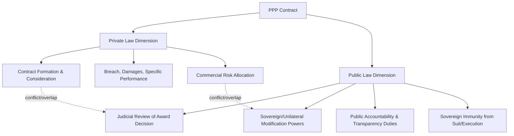
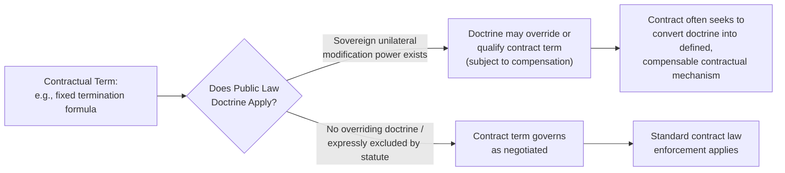

## Interaction Between PPP Law and General Contract and Administrative Law

### Definition and Conceptual Framework

PPP contracts do not exist in a legal vacuum — they operate within, and are shaped by, the surrounding layers of general contract law (private law principles of formation, breach, remedies) and administrative law (public law principles governing the exercise of government power, judicial review, and public accountability). This topic examines how these three legal layers — dedicated PPP/Concession Law, general contract law, and administrative law — interact, overlap, conflict, and are reconciled within a single PPP transaction.

**Key Points**

- A PPP contract is simultaneously a **private-law instrument** (creating reciprocal contractual obligations enforceable through ordinary contract remedies) and, in most jurisdictions, an exercise of **public-law authority** (the grant of a concession/right to deliver a public service, subject to public accountability norms) — this dual character is the central analytical tension in this area.
- The degree to which administrative law principles "intrude" into or modify ordinary contract law treatment of a PPP contract varies substantially by legal tradition — civil-law systems tend toward greater administrative law intrusion (concession as *contrat administratif*); common-law systems tend to treat the PPP contract as governed primarily by ordinary contract law, with administrative law relevant mainly to the *process* by which the contract was awarded (judicial review of the procurement decision) rather than its ongoing performance.
- Understanding this interaction is critical for risk allocation drafting, because certain public-law doctrines (sovereign immunity, unilateral variation powers, judicial review grounds) can override or qualify contractual terms that would otherwise be treated as final and binding under pure contract law.

### The Dual-Character Problem — Conceptual Map

### General Contract Law Principles Applicable to PPPs

**Key Points**

- **Formation and capacity**: ordinary contract law principles of offer, acceptance, and consideration generally apply to PPP agreements, but are overlaid with a public-law requirement that the Contracting Authority possess the **legal capacity/vires** to enter the specific transaction — a private party cannot rely on ordinary contract law estoppel principles to bind a government entity that lacked legal authority to contract in the first place (the doctrine of *ultra vires*), making statutory authority verification a critical legal due diligence step (see PPP Enabling Legislation and Concession Law).
- **Interpretation principles**: PPP contracts are generally interpreted under the same canons of construction as commercial contracts (textual interpretation, contra proferentem, commercial purpose), though courts in some jurisdictions apply a degree of public-interest-oriented interpretation where ambiguity affects public service delivery.
- **Remedies for breach**: standard contract remedies (damages, in rare cases specific performance) apply in principle, but are frequently **displaced or heavily modified by the bespoke termination and compensation regime** negotiated into the PPP contract itself (see Compensation on Termination and Handback Provisions) — most well-drafted PPP contracts intend their termination payment mechanisms to be a complete code, displacing general contract law damages remedies, though the enforceability of such exclusion clauses depends on the governing law.
- **Good faith and cooperation obligations**: many PPP contracts include express good-faith or cooperation clauses (particularly common in civil-law-influenced drafting, and increasingly in common-law contracts for long-term relational agreements), supplementing or clarifying the default position under the applicable governing law, which varies as to whether an implied duty of good faith exists in commercial contracts generally.

### Administrative Law Principles Applicable to PPPs

**Key Points**

- **Judicial review of the award decision**: the process by which a PPP contract is procured and awarded is typically subject to public-law judicial review (or equivalent statutory procurement challenge mechanisms), allowing unsuccessful bidders or affected third parties to challenge the legality of the award process on grounds such as procedural unfairness, bias, or failure to follow mandated procurement rules — this is distinct from, and separate in timing from, any later contractual dispute about performance.
- **Legitimate expectation doctrine**: in some jurisdictions, private parties who have relied on government representations (e.g., during bid negotiations or informal assurances) may have a public-law claim based on legitimate expectation, independent of whether those representations were formally incorporated into the contract — an important consideration in the many jurisdictions where courts have recognized such doctrine, though its scope and availability against contractual counterparties (as opposed to purely regulatory decisions) is a genuinely unsettled and evolving area. [Unverified: the application of legitimate expectation doctrine specifically to PPP contractual counterparties, as opposed to third parties challenging general regulatory decisions, is not uniformly settled across jurisdictions and depends heavily on domestic administrative law doctrine.]
- **Proportionality and reasonableness review**: where a Contracting Authority exercises a discretionary power under the contract (e.g., a right to serve a default notice, exercise step-in, or make a determination), that exercise may in some jurisdictions be additionally subject to public-law standards of reasonableness/proportionality, over and above the contractual standard (e.g., "acting reasonably") — potentially creating a dual standard of review.
- **Transparency and accountability obligations**: freedom of information, public procurement transparency, and auditor-general oversight regimes generally continue to apply to the Contracting Authority notwithstanding the existence of the PPP contract, occasionally creating tension with commercial confidentiality provisions the private party may seek to negotiate.

### Points of Conflict and Reconciliation

**Key Points**

- **Contractualization of public-law risk**: a core drafting strategy in modern PPP contracts is to expressly and comprehensively address matters that might otherwise be governed by uncertain background public-law doctrine (e.g., converting an open-ended sovereign modification power into a defined "Change in Law" compensation clause — see Compensation on Termination and Handback Provisions and the Change in Law mechanics referenced throughout this chapter), thereby reducing reliance on uncertain doctrinal outcomes and increasing bankability.
- **Statutory displacement clauses**: some PPP enabling legislation expressly states that once a concession contract is validly entered, the ordinary rules of contract law (rather than general administrative law discretion) govern its performance and termination — effectively "immunizing" the contract from certain public-law interventions, subject to constitutional limits on legislative power to bind future governments.
- **Residual public-law risk cannot always be fully contracted away**: particularly regarding constitutional-level powers (eminent domain, national security powers, fundamental legislative sovereignty), no contract term can wholly eliminate the government's underlying public-law authority — the contract can only define the **compensation consequence** of the government exercising such power, not prevent the exercise itself. This is the conceptual foundation of why Change in Law and similar clauses are compensation-based rather than prohibition-based.

### Comparative Table: Civil-Law vs. Common-Law Treatment

| Issue | Civil-Law (Concession/*Contrat Administratif* Tradition) | Common-Law (Contractual Tradition) |
| --- | --- | --- |
| Underlying legal character | Administrative act + contract hybrid | Primarily contract, interpreted under general contract law |
| Government's inherent modification power | Often recognized as inherent, even without express contract term (subject to compensation) | Generally requires express contractual reservation; no broad inherent doctrine |
| Forum for public-law aspects of the contract | Often specialized administrative courts | Ordinary courts (judicial review for award process; commercial courts/arbitration for contract disputes) |
| Termination for public interest reasons absent breach | Often an inherent public-law power (*rachat*/buy-back), subject to compensation | Requires an express "Voluntary Termination" or "Termination for Convenience" clause |
| Reliance on legislative override vs. contract drafting | Greater reliance on codified concession law doctrine | Greater reliance on comprehensive, self-contained contract drafting |

### Practical Implications for Contract Drafting

**Key Points**

- **Governing law selection** is not merely a technical choice — it determines which body of background doctrine (with its associated public-law overlay) fills gaps left by the express contract terms, making this a substantively significant negotiation point, particularly for cross-border/DFI-financed transactions.
- **Entire agreement / exclusion of general law remedies clauses**: PPP contracts commonly include clauses seeking to establish the negotiated termination/compensation regime as an exhaustive code, excluding general contract law damages claims — the enforceability of such exclusions varies by jurisdiction and is a genuine area of legal uncertainty that requires local law advice. [Inference: The general validity of such exclusion clauses is well-established in many common-law commercial contract contexts, but their effectiveness against background public-law doctrines (as opposed to private contract law remedies) is less settled and jurisdiction-dependent.]
- **Consistency between enabling legislation and contract terms**: where PPP enabling legislation is silent or ambiguous on a specific issue (e.g., whether the Authority may validly agree to international arbitration, or validly waive sovereign immunity), the contract's provisions on that issue carry significant legal risk if not clearly grounded in explicit statutory authority — a frequent focus of lender legal due diligence and legal opinions required as conditions precedent to financial close.
- **Legal opinions as a risk-mitigation mechanism**: lenders typically require formal legal opinions (from both government/Attorney-General's office and independent counsel) confirming the Contracting Authority's capacity, the validity of contractual waivers (arbitration consent, sovereign immunity), and the absence of conflicting general law/administrative law impediments — these opinions are a standard condition precedent in project finance documentation precisely because of the legal uncertainty this topic addresses.

### Worked Illustrative Scenario

A government agency terminates a PPP contract early, citing a public-interest policy change (a decision to bring the service back in-house), where the contract itself contains no express "Termination for Convenience" clause.

- **Pure contract law analysis (common-law approach)**: absent an express termination right, the Authority likely has no lawful basis to terminate without cause; doing so would constitute repudiatory breach, entitling the Project Company to full contractual damages (or the Authority Default compensation formula, if broadly enough drafted to capture this scenario).
- **Civil-law concession theory analysis**: the Authority may be able to invoke an inherent public-law power to terminate in the public interest (*résiliation pour motif d'intérêt général* in French administrative law tradition, or analogous doctrines elsewhere), but subject to a **mandatory compensation obligation** to the concessionaire covering, typically, unamortized investment and lost profit — the termination is lawful, but not free.
- **Reconciliation in modern drafting**: to avoid this doctrinal uncertainty entirely, most modern PPP contracts (across both traditions) now include an **express Voluntary Termination / Termination for Convenience clause** with a pre-agreed compensation formula (frequently mirroring the Authority Default compensation basis), converting an uncertain background-law question into a defined contractual outcome.

**Output**

| Legal Approach | Outcome if No Express Clause | Practical Solution Adopted |
| --- | --- | --- |
| Common-law contract theory | Breach of contract; damages claim | Express Termination for Convenience clause added |
| Civil-law concession theory | Lawful inherent power; compensation still owed | Contractual compensation formula pre-agreed to avoid doctrinal dispute |
| Modern convergent practice | N/A — clause now standard | Both traditions increasingly rely on express contractual drafting over background doctrine |

### Related Topics

- PPP Enabling Legislation and Concession Law
- Compensation on Termination and Handback Provisions
- Sovereign Immunity and Enforcement of Arbitral Awards Against States
- Change in Law and Compensation Event Mechanics
- Dispute Resolution Boards (DRBs) and Expert Determination in PPP Contracts
- Government Support Agreements and Sovereign Guarantees
- Judicial Review of Public Procurement Decisions