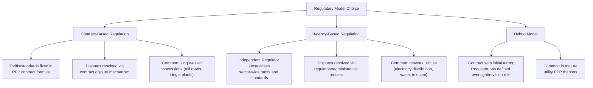

## Sector Regulation and Independent Regulatory Agencies


### Definition and Conceptual Framework

Sector Regulation refers to the ongoing rules, standards, and oversight mechanisms governing how infrastructure and utility services are delivered, priced, and monitored — distinct from, but deeply interconnected with, the PPP contract itself. Independent Regulatory Agencies (IRAs) are specialized public bodies, structurally and operationally separated from both the political executive and the regulated entities, established to administer this regulatory framework with a degree of insulation from short-term political interference.

**Key Points**

- The relationship between a PPP contract and sector regulation can take two structurally distinct forms: (1) **contract-based regulation**, where the PPP agreement itself is the primary regulatory instrument (common in single-asset concessions like a toll road or a single power plant PPA), or (2) **agency-based regulation**, where an independent regulator sets sector-wide rules (tariffs, service standards, licensing) that apply to the PPP project alongside or instead of bespoke contract terms (common in network utilities — electricity distribution, water, telecoms).
- A central design question in any PPP framework is **which body controls tariff-setting and service-standard enforcement over time** — the original contract negotiators (fixed by contract formula) or an ongoing regulator (with discretion to revise) — and this choice fundamentally shapes the risk allocation and bankability profile of the project.
- Independent regulatory agencies exist to solve a specific credibility problem: without insulation from political pressure, governments face a strong temporal incentive to renege on agreed tariff/pricing commitments after private capital has been sunk (the classic "time inconsistency" or "regulatory opportunism" problem in infrastructure economics), which increases the cost of capital or deters investment altogether if unaddressed.

### Contract-Based vs. Agency-Based Regulatory Models



**Key Points**

- Contract-based regulation offers greater **certainty and bankability at financial close** (the formula is fixed and known), but is less adaptable to changing circumstances over a long concession term and can become politically or economically untenable if fixed terms diverge significantly from evolving conditions.
- Agency-based regulation offers greater **long-term flexibility and consumer protection responsiveness**, but introduces **regulatory risk** — the possibility that future regulatory decisions diverge from the assumptions underpinning the original investment case, which lenders and investors must price into their required returns.
- Many mature markets have moved toward **hybrid models**: the PPP contract establishes the initial framework and key protections (e.g., a guaranteed minimum revenue mechanism or a defined tariff review methodology), while an independent regulator administers ongoing implementation within those contractually or statutorily defined parameters.

### Core Functions of Independent Regulatory Agencies

| Function | Description |
| --- | --- |
| Tariff/Price Setting | Determining or approving allowable prices/tariffs, often via cost-of-service, price-cap (RPI-X), or revenue-cap methodologies |
| Service Standard Setting & Monitoring | Establishing minimum quality/performance standards and monitoring compliance, often with penalty mechanisms for non-compliance |
| Licensing | Granting, renewing, or revoking licenses/permits required to operate regulated infrastructure or services |
| Dispute Adjudication | Resolving disputes between the regulated entity and consumers, or between competing operators, within its statutory jurisdiction |
| Market Monitoring & Competition Oversight | Overseeing market structure, preventing anti-competitive conduct, particularly in partially liberalized sectors |
| Technical Standard-Setting | Establishing engineering, safety, environmental, and interconnection standards |

### Regulatory Independence — Structural Design Elements

**Key Points**

- **Appointment and tenure protections**: fixed-term appointments for regulatory board members/commissioners, with removal only for defined cause (not at political discretion), are a core structural safeguard against short-term political capture.
- **Funding independence**: regulators funded through a dedicated levy on regulated entities or a ring-fenced budget line (rather than annual discretionary government appropriation) reduces the risk of budgetary pressure being used as a lever of political control.
- **Decision-making transparency**: statutory requirements for public consultation, reasoned decisions, and published methodologies increase predictability and reduce the scope for arbitrary intervention, directly supporting investor confidence.
- **Appeal mechanisms**: a defined right of appeal (to courts, a specialized appellate tribunal, or in some sectors an international arbitration mechanism for particularly significant tariff disputes) provides a check on regulatory decisions while preserving the regulator's primary decision-making authority.
- [Inference: The degree of *de facto* independence achieved by any given regulatory agency often diverges from its *de jure* statutory independence — empirical governance research generally finds substantial variation in practical regulatory autonomy even among agencies with similar formal independence provisions, depending on broader institutional and political context in each jurisdiction.]

### Tariff-Setting Methodologies

**Key Points**

- **Cost-of-Service (Rate-of-Return) Regulation**: tariffs set to recover efficient operating costs plus a regulated return on the asset base (Regulatory Asset Base, or RAB); provides revenue certainty but can weaken cost-efficiency incentives (the classic "Averch-Johnson effect" of over-capitalization incentive under pure rate-of-return regulation).
- **Price-Cap (RPI-X) Regulation**: tariffs are capped and adjusted periodically by an inflation index minus an efficiency factor (X), placing efficiency risk on the operator (cost savings beyond the assumed X factor are retained as profit until the next review), commonly used in UK-influenced regulatory frameworks for network utilities.
- **Revenue-Cap Regulation**: similar to price-cap but caps total allowed revenue rather than per-unit price, better suited to sectors with significant fixed costs and volume variability.
- **Hybrid/Incentive Regulation**: increasingly common approaches combine elements of the above, layering specific performance-based incentive mechanisms (e.g., reliability bonuses/penalties, innovation funding allowances) onto a base price- or revenue-cap structure.

$$P_t = P_{t-1} \times (1 + \text{RPI}_t - X)$$

Where $P_t$ is the allowed price/tariff in period $t$, $\text{RPI}_t$ is the relevant inflation index for the period, and $X$ is the regulator-determined efficiency factor requiring real-terms price reduction (or, if $X$ is negative, permitting real-terms increases to fund required investment).

### Interaction Between the PPP Contract and the Regulator — Interface Design

```mermaid
sequenceDiagram
    participant PC as Project Company
    participant AU as Contracting Authority
    participant REG as Independent Regulator
    Note over AU,REG: PPP Contract sets initial framework;<br/>Regulator has ongoing implementation authority
    PC->>REG: Periodic Tariff/Price Review Submission
    REG->>PC: Public consultation and determination
    alt Regulatory decision consistent with Contract terms
        REG->>PC: Tariff approved per methodology
    else Regulatory decision diverges from Contract assumptions
        PC->>AU: Claim under Change in Law / Regulatory Risk clause
        AU->>PC: Compensation assessment per contract mechanism
    end
    PC->>REG: Appeal (if permitted) against adverse determination
```

**Key Points**

- A critical drafting question is how the PPP contract treats **adverse regulatory decisions** that diverge from the assumptions in the original financial model — well-drafted contracts explicitly classify certain categories of regulatory change (e.g., a change in the regulator's tariff methodology itself, as distinct from a routine periodic tariff review applying an already-agreed methodology) as a **Change in Law/Compensation Event**, while routine methodology-consistent tariff reviews remain a risk borne by the Project Company as ordinary regulatory/market risk.
- The distinction between **"regulatory risk the Project Company is expected to manage"** (e.g., normal cost-efficiency pressure under an agreed price-cap formula) and **"regulatory risk that triggers compensation"** (e.g., a fundamental change to the regulatory methodology itself, or a politically-motivated departure from an independent regulator's own established practice) is one of the most consequential and heavily negotiated boundaries in utility-sector PPP contracts.
- Where a project is regulated by an **independent agency separate from the Contracting Authority**, the PPP contract cannot directly bind the regulator (which is typically a distinct legal entity exercising statutory, not contractual, powers) — meaning the contract can only allocate the **financial consequences** of regulatory decisions between Authority and Project Company, not control the regulator's substantive decisions themselves.

### Comparative Table: Contract-Based vs. Agency-Based Risk Allocation

| Feature | Contract-Based Regulation | Agency-Based Regulation |
| --- | --- | --- |
| Tariff certainty at financial close | High — formula fixed in contract | Lower — subject to periodic regulatory review |
| Adaptability to changing conditions | Low — requires contract amendment | High — built-in periodic review process |
| Political interference risk | Lower once contract signed (subject to general Change in Law risk) | Present but mitigated by regulator's independence safeguards |
| Dispute forum | Contractual dispute resolution (DRB, expert, arbitration) | Regulatory appeal process, potentially separate from contract dispute mechanism |
| Typical sector application | Single-asset, revenue-risk concessions (toll roads, single power plants) | Network utilities with multiple operators/ongoing tariff complexity (electricity distribution, water networks, telecoms) |

### Regulatory Risk in Emerging Market Context

**Key Points**

- In many emerging-market PPP programs, regulatory agencies are relatively young institutions, and questions about their practical independence, technical capacity, and resistance to political pressure are common due-diligence concerns for international lenders and investors, often addressed through additional credit enhancement (partial risk guarantees from multilateral development banks, or government-backed minimum revenue guarantees that reduce reliance on the regulator's ongoing tariff decisions alone).
- **Regulatory capture risk** — where the regulated entity or industry unduly influences the regulator's decisions in its own favor — is a recognized governance concern in both mature and emerging markets, generally mitigated through transparency, public consultation requirements, and conflict-of-interest rules for regulatory appointees, though the effectiveness of these safeguards varies.
- Some PPP structures in weaker regulatory environments deliberately favor the **contract-based model** specifically to reduce reliance on an as-yet-unproven independent regulator, accepting reduced long-term flexibility in exchange for greater bankability certainty at financial close — a pragmatic risk-allocation trade-off frequently seen in first-generation PPP programs before regulatory institutions mature.

### Worked Illustrative Example

A water distribution PPP operates under an independent Water Regulatory Agency using a 5-year price-cap (RPI-X) methodology, established under sector legislation predating the PPP contract. At Year 5, the regulator conducts its periodic review and, applying its established methodology, determines a revised X factor of 2% (requiring a real-terms tariff reduction) based on updated efficiency benchmarking.

- **Contractual classification**: since the regulator applied its **pre-existing, contractually-referenced methodology** (RPI-X periodic review, as anticipated at financial close), this falls within ordinary regulatory risk borne by the Project Company — no compensation event arises under the PPP contract.
- **Contrast scenario**: if, instead, the regulator had unilaterally changed its underlying methodology (e.g., switching from RPI-X to an entirely different cost-of-service approach not contemplated in the original contract's risk allocation), this would likely fall within a **Change in Law/Regulatory Change compensation event**, entitling the Project Company to claim compensation for the resulting financial impact.

**Output**

| Scenario | Regulatory Action | Contractual Treatment |
| --- | --- | --- |
| Routine periodic review | Regulator applies existing agreed methodology, results in tariff reduction | Ordinary regulatory risk — no compensation |
| Methodology change | Regulator adopts a fundamentally different tariff-setting approach | Compensation Event — Project Company entitled to claim |

### Related Topics

- Change in Law and Compensation Event Mechanics
- PPP Enabling Legislation and Concession Law
- Interaction Between PPP Law and General Contract and Administrative Law
- Government Support Agreements and Sovereign Guarantees
- Value-for-Money Assessment Methodologies
- Tariff Design and Cost-Reflective Pricing in Infrastructure
- Dispute Resolution Boards (DRBs) and Expert Determination in PPP Contracts