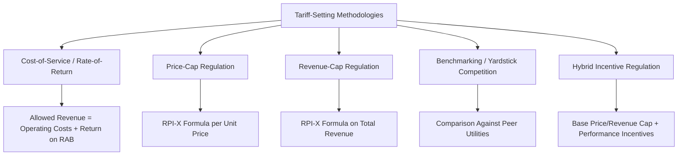
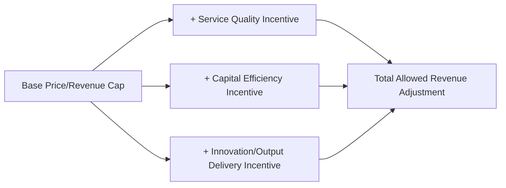

## Tariff-Setting and Price Regulation Methodologies

### Definition and Conceptual Framework

Tariff-Setting and Price Regulation Methodologies are the analytical frameworks and formulas used to determine the prices or revenues a PPP operator is permitted to charge or collect for regulated infrastructure services. These methodologies sit at the technical core of economic regulation, translating broad regulatory objectives (cost recovery, efficiency incentives, affordability, investment adequacy) into specific, applicable pricing formulas that directly determine project revenue and, consequently, bankability.

**Key Points**

- Every tariff methodology must resolve a fundamental tension: **cost recovery certainty** (needed for investor bankability and to attract private capital) versus **efficiency incentives and consumer protection** (needed to prevent overcharging and ensure service improves over time).
- The choice of methodology has direct, quantifiable effects on the risk allocation between the Project Company and consumers/government — some methodologies transfer cost risk to the operator (incentivizing efficiency), others transfer it to consumers/government (providing revenue certainty to the operator).
- Tariff methodology is distinct from, but interacts closely with, the broader regulatory institutional design discussed under Sector Regulation and Independent Regulatory Agencies — the methodology is the technical formula; the regulator (or contract) is the institutional mechanism applying it.

### Taxonomy of Core Methodologies

### Cost-of-Service (Rate-of-Return) Regulation

The traditional utility regulation methodology, still widely used, particularly in the United States and in many emerging-market first-generation regulatory frameworks.

$$R = O + d \cdot A + r \cdot RAB$$

Where $R$ is total allowed revenue, $O$ is allowed operating expenditure, $d \cdot A$ represents depreciation on the asset base, $r$ is the allowed rate of return, and $RAB$ is the Regulatory Asset Base (the value of capital investment on which the return is calculated).

**Key Points**

- The **Regulatory Asset Base (RAB)** valuation methodology (historical cost, replacement cost, or a hybrid) is itself a major technical and negotiated determination, since it directly drives the revenue the operator is permitted to earn — RAB valuation disputes are a common source of regulatory litigation.
- **Weaknesses**: pure cost-of-service regulation provides limited incentive for operating cost efficiency, since costs are largely passed through to the allowed revenue calculation (the "cost-plus" problem); it can also incentivize over-investment in capital assets relative to operating expenditure, since capital is the base on which the guaranteed return is earned (the well-documented Averch-Johnson over-capitalization effect in regulatory economics literature).
- **Strengths**: provides high revenue certainty for the regulated entity, generally supporting lower cost of capital and stronger investor confidence, particularly valuable in early-stage regulatory environments or capital-intensive sectors requiring large upfront investment.

### Price-Cap (RPI-X) Regulation

Developed initially in the UK utility privatization context and widely adopted internationally as an alternative designed to strengthen efficiency incentives relative to cost-of-service regulation.

$$P_t = P_{t-1} \times \left(1 + \frac{\Delta RPI}{100} - \frac{X}{100}\right)$$

Where $P_t$ is the allowed price in period $t$, $\Delta RPI$ is the percentage change in the relevant retail/consumer price index (or other agreed inflation measure), and $X$ is the regulator-determined efficiency factor (a percentage real-terms price reduction the operator must absorb through efficiency gains).

**Key Points**

- The price cap is typically set for a fixed **regulatory period** (commonly 3–5 years), during which the operator retains any efficiency gains beyond the assumed $X$ factor as profit — creating a strong incentive to reduce costs, since savings are not immediately passed through to consumers until the next periodic review resets the baseline.
- **X-factor determination** is the central technical/analytical challenge: regulators typically use a combination of total factor productivity (TFP) analysis, benchmarking against comparator utilities, and engineering cost models to estimate an achievable efficiency improvement rate — this determination is frequently the subject of extensive regulatory consultation and, in contested cases, appeal.
- **The "regulatory ratchet" problem**: because efficiency gains achieved in one period inform the regulator's assumptions for the next period's price cap reset, operators face a disincentive to reveal the full extent of achievable efficiency gains early, anticipating the regulator will simply tighten the cap further at the next review — a recognized dynamic incentive problem in the price-cap regulation literature.

### Revenue-Cap Regulation

A close variant of price-cap regulation, capping total allowed revenue rather than the per-unit price, which better accommodates sectors where fixed costs dominate and volume/demand can be volatile or price-inelastic (e.g., electricity/water network distribution, where most costs are fixed infrastructure costs largely independent of usage volume).

$$TR_t = TR_{t-1} \times \left(1 + \frac{\Delta RPI}{100} - \frac{X}{100}\right) \pm \text{Volume Adjustment}$$

**Key Points**

- Under a pure price cap, an operator whose volumes fall (e.g., due to a mild winter reducing energy demand, or successful conservation programs reducing water consumption) suffers a revenue shortfall despite complying with its cost efficiency obligations — revenue-cap regulation removes this volume-risk exposure by capping total revenue directly, often with a **true-up/reconciliation mechanism** adjusting future tariffs to correct for any under- or over-recovery in the current period relative to the capped revenue target.
- This methodology is particularly favored for network monopoly infrastructure where demand-side volume risk is not meaningfully within the operator's control and where decoupling revenue from volume can also support conservation/efficiency policy objectives (since the operator has less incentive to encourage overconsumption purely to protect revenue).

### Comparative Table: Core Methodology Trade-Offs

| Methodology | Efficiency Incentive | Revenue Certainty for Operator | Consumer Price Volatility | Volume/Demand Risk Allocation |
| --- | --- | --- | --- | --- |
| Cost-of-Service | Low | High | Low (stable, cost-linked) | Largely borne by consumers/regulator |
| Price-Cap (RPI-X) | High | Moderate (fixed for review period) | Moderate | Borne by operator |
| Revenue-Cap | High | High (with true-up) | Moderate | Largely neutralized via true-up |
| Benchmarking/Yardstick | Very High | Lower (dependent on peer performance) | Variable | Borne by operator, informed by peers |

### Benchmarking / Yardstick Competition

Used particularly where a sector has multiple comparable regional operators (e.g., multiple electricity distribution companies within one country), allowing the regulator to set allowed costs/tariffs for one operator partly by reference to the demonstrated efficient cost performance of comparable peers, rather than relying solely on that operator's own historical costs.

**Key Points**

- This approach mitigates the **information asymmetry problem** inherent in regulation — since the regulator typically has less information about the operator's true achievable efficiency than the operator itself, comparing across multiple similar entities provides an independent efficiency benchmark that is harder for any single operator to game.
- Requires a sufficient number of genuinely comparable operators (similar scale, geography, technology, customer density) to produce statistically meaningful comparisons — a significant practical limitation in smaller markets or for genuinely unique/natural-monopoly single-asset PPP projects (e.g., a single toll bridge has no meaningful peer group), where benchmarking is correspondingly less applicable and cost-of-service or price-cap approaches dominate instead.

### Hybrid Incentive Regulation

Modern regulatory practice increasingly layers specific incentive mechanisms onto a base price-cap or revenue-cap structure, rather than relying on a single pure methodology.

**Key Points**

- **Service quality incentives**: bonus/penalty adjustments to allowed revenue tied to measured performance against service standards (e.g., outage duration for electricity distribution, water leakage rates, journey-time reliability for transport concessions).
- **Totex (total expenditure) approaches**: increasingly, regulators evaluate operating and capital expenditure together (rather than treating capex and opex under separate incentive logics as in traditional rate-of-return regulation), aiming to remove the historical bias toward over-capitalization and encourage genuinely least-cost solutions regardless of whether they are capital- or operating-expenditure-intensive.
- **Output-based/outcome-based regulation**: some advanced frameworks shift the regulatory conversation from input cost allowances toward the delivery of defined service outputs/outcomes (e.g., UK Ofwat's PR19 methodology explicitly incorporating outcome delivery incentives) — representing a more recent evolution in regulatory design philosophy. [Inference: The specific adoption and maturity of outcome-based regulatory frameworks varies significantly across jurisdictions and sectors; this represents an evolving area of regulatory practice rather than a uniformly established global standard.]

### Interaction with PPP Contract Structuring

**Key Points**

- In **contract-based** PPP structures (see Sector Regulation and Independent Regulatory Agencies), the tariff methodology itself is typically fixed as a specific formula within the PPP contract at financial close, with limited or no discretion for subsequent regulatory reinterpretation — providing maximum bankability certainty but limited adaptability.
- In **agency-regulated** PPP structures, the PPP contract typically references the applicable sector regulatory methodology (rather than restating it) and focuses instead on allocating the **financial consequences** if the regulator's future application of that methodology diverges materially from the assumptions underpinning the original financial model (addressed via Change in Law/regulatory risk compensation provisions).
- **Minimum Revenue Guarantees (MRGs)** are sometimes layered onto either methodology as an additional bankability enhancement, providing a government-backed floor on operator revenue if actual tariff-derived revenue (however calculated) falls below a pre-agreed threshold — commonly used in demand-risk transport PPPs to supplement, rather than replace, the underlying tariff/toll-setting formula.

### Worked Numerical Example — RPI-X Application

A regulated water utility PPP has a Year 0 average tariff of $1.20 per cubic meter. The regulator sets a 5-year price control period with an annual X-factor of 1.5% (real-terms reduction target), while RPI inflation averages 3.0% per year over the period.

$$P_t = P_{t-1} \times (1 + 0.030 - 0.015) = P_{t-1} \times 1.015$$

| Year | Calculation | Allowed Tariff ($/m³) |
| --- | --- | --- |
| 0 (base) | — | 1.200 |
| 1 | $1.200 \times 1.015$ | 1.218 |
| 2 | $1.218 \times 1.015$ | 1.236 |
| 3 | $1.236 \times 1.015$ | 1.255 |
| 4 | $1.255 \times 1.015$ | 1.274 |
| 5 | $1.274 \times 1.015$ | 1.293 |

**Output**

| Metric | Value |
| --- | --- |
| Base tariff (Year 0) | $1.20/m³ |
| X-factor | 1.5% |
| Average RPI assumption | 3.0% |
| Net nominal annual adjustment | +1.5% |
| Cumulative tariff after 5 years | ≈ $1.293/m³ (7.8% nominal increase) |
| Real-terms change over period | Approximately -7.2% relative to inflation (reflecting cumulative efficiency requirement) |

This illustrates the core mechanic: consumers see nominal price increases tracking below inflation, meaning a real-terms price reduction over time, while the operator retains any efficiency gains beyond the mandated 1.5% annual target as additional profit until the next periodic review resets the baseline.

### Related Topics

- Sector Regulation and Independent Regulatory Agencies
- Change in Law and Compensation Event Mechanics
- Government Support Agreements and Sovereign Guarantees
- Demand Risk vs. Availability Payment Structures in PPP
- Value-for-Money Assessment Methodologies
- Traffic and Revenue Forecasting Methodologies
- Base Case Financial Model Structuring in PPP Bids