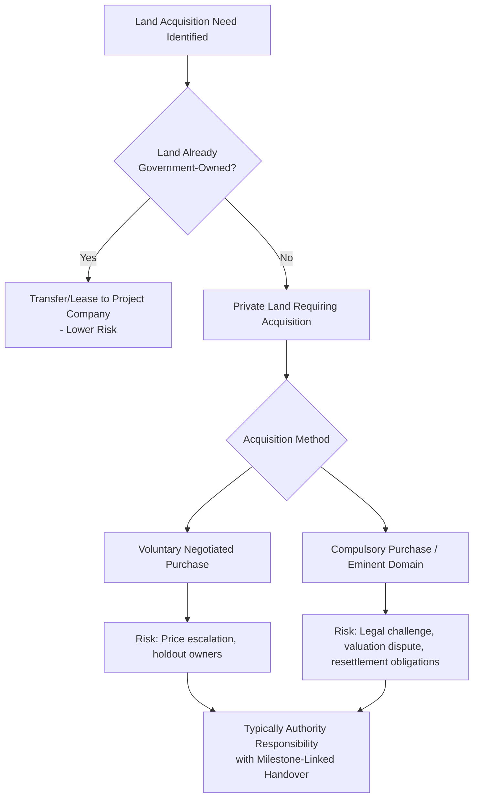
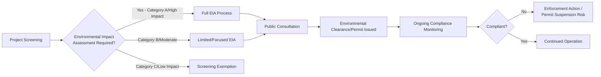

## Land Acquisition, Rights of Way, and Environmental Permitting

### Definition and Conceptual Framework

Land Acquisition, Rights of Way, and Environmental Permitting encompass the legal processes and risk-allocation mechanisms governing a PPP project's access to the physical land and regulatory clearances necessary for construction and operation. These are consistently ranked among the leading causes of construction delay and cost overrun in PPP infrastructure projects globally, making their contractual and legal treatment a central bankability and due-diligence concern.

**Key Points**

- Land acquisition risk, right-of-way risk, and environmental permitting risk are conceptually distinct but operationally intertwined — a project can be fully compliant on environmental approvals yet still stalled by incomplete land acquisition, or vice versa, and delays in one frequently cascade into the other (e.g., environmental clearance conditions requiring specific land use restrictions that affect acquisition scope).
- The core risk-allocation question is the same across all three areas: **which party bears the cost and schedule consequence of delay or failure** in obtaining land, right-of-way, or permits — and this is typically resolved by allocating the risk to whichever party has legal authority and practical capability to secure the relevant approval (usually the government for land acquisition and primary environmental clearances; the private party for site-specific/project-design-dependent permits).
- These risks disproportionately affect **greenfield linear infrastructure** (roads, railways, transmission lines, pipelines) which require acquiring or securing rights over numerous parcels along an extended corridor, each potentially involving separate owners, competing claims, or resettlement issues — compared to single-site projects (a hospital, a power plant on already-owned government land) where the risk is more contained.

### Land Acquisition — Legal Mechanisms and Risk Allocation

**Key Points**

- **Compulsory purchase/eminent domain powers** are almost universally reserved to the state (see PPP Enabling Legislation and Concession Law) — the Project Company itself typically cannot exercise sovereign expropriation authority, meaning land acquisition risk is structurally difficult to transfer fully to the private party even where the contract nominally tries to do so.
- **Standard risk allocation convention**: the Contracting Authority typically bears primary responsibility for delivering land free of encumbrances by defined contractual milestones (often tied to the construction program), since it alone holds the legal powers and political standing to complete acquisition — deviations from this convention (requiring the private party to acquire land itself) generally command a significant risk premium and are less common outside limited/small-scale acquisitions.
- **Milestone-linked handover mechanisms**: contracts commonly specify a phased land handover schedule aligned with the construction sequence, with defined consequences (extension of time, compensation, or in severe cases termination rights) if the Authority fails to deliver land parcels by the specified dates — directly linking land acquisition performance to the broader Relief Event/Compensation Event framework (see Force Majeure and Relief Event Provisions).

### Resettlement and Social Safeguards

**Key Points**

- Where land acquisition involves **physical or economic displacement of existing occupants** (whether or not they hold formal legal title), international best-practice frameworks — most notably the **IFC Performance Standard 5** and the **World Bank Environmental and Social Framework (ESS5)** — require a Resettlement Action Plan (RAP) addressing compensation, livelihood restoration, and, where feasible, improvement of living standards for affected persons, applicable particularly where multilateral/DFI financing is involved.
- **Informal occupants/encroachers without formal title** present a particularly complex legal and social challenge, since domestic expropriation law may not require compensation for those without recognized legal rights, while international safeguard standards (where applicable via DFI financing conditions) typically require assistance regardless of formal title status — creating a potential gap between domestic legal minimum requirements and international lender expectations that project sponsors must navigate.
- **Resettlement timing risk**: RAP implementation (community consultation, grievance mechanisms, physical relocation, livelihood restoration measures) is frequently one of the longest-lead-time and most schedule-uncertain components of project preparation, and is a common source of both construction delay and reputational/social risk for the project.

### Rights of Way (RoW) — Distinct from Outright Acquisition

Rights of Way refer to the legal entitlement to use land for a specific purpose (typically linear infrastructure passage — roads, transmission corridors, pipelines) without necessarily acquiring full ownership title, often through easements, servitudes, or statutory way-leave mechanisms.

| Mechanism | Description | Typical Use Case |
| --- | --- | --- |
| Statutory Way-Leave/Easement | Legal right to install/maintain infrastructure across land without transferring ownership | Transmission lines, pipelines, telecom cables |
| Permanent Acquisition | Full title transfer for the land footprint | Road/rail corridor requiring exclusive physical occupation |
| Temporary Working Right-of-Way | Time-limited access for construction activities (e.g., laydown areas), reverting to landowner post-construction | Pipeline construction corridors beyond the permanent easement strip |
| Encroachment/Squatter Clearance | Removal of unauthorized occupants from existing government-owned right-of-way corridors | Widening of existing roads within already-designated but encroached corridors |

**Key Points**

- **Encroachment clearance on existing corridors** is a frequently underestimated risk category — even where the Authority technically already owns the right-of-way (e.g., an existing road reserve), informal occupation/encroachment over time can create practical and politically sensitive clearance challenges functionally similar to fresh land acquisition.
- **Utility relocation/diversion**: rights-of-way frequently contain pre-existing utility infrastructure (water mains, power lines, telecom cables) belonging to third parties that must be relocated before construction can proceed — coordination with multiple utility owners, each with their own approval processes and timelines, is a recurring source of interface risk and delay, often contractually addressed as a specific Relief Event category.

### Environmental Permitting Framework

**Key Points**

- Most jurisdictions and all major DFIs use a **risk-based categorization system** (commonly Category A/B/C, following World Bank/IFC-style classification) to determine the intensity of environmental (and social) assessment required, based on the scale and reversibility of potential project impacts.
- **Environmental Impact Assessment (EIA)** processes typically require: baseline environmental studies, impact prediction and mitigation planning, public consultation, and submission to the relevant environmental authority for approval — timelines for this process are a major source of schedule risk and are frequently underestimated in project planning, particularly for large linear or high-impact projects.
- **Environmental and Social Management Plans (ESMPs)**: the operational counterpart to the EIA, setting out ongoing mitigation, monitoring, and compliance obligations throughout construction and operations — these are commonly incorporated as binding contractual obligations on the Project Company under the PPP agreement, with non-compliance potentially triggering performance deductions or, in serious cases, default provisions.
- **Cumulative and transboundary impact assessment**: for larger infrastructure programs (e.g., hydropower on shared river basins, transmission corridors crossing multiple jurisdictions), environmental permitting may need to address cumulative impacts across multiple projects or transboundary effects, involving additional regulatory complexity and, in transboundary cases, potential international legal obligations.

### Risk Allocation Matrix — Land, RoW, and Environmental Permitting

| Risk Category | Typical Default Allocation | Rationale |
| --- | --- | --- |
| Primary land acquisition (compulsory purchase) | Contracting Authority | Only the state holds eminent domain powers |
| Land price escalation during acquisition | Contracting Authority | Outside Project Company's control |
| Resettlement/RAP implementation delay | Contracting Authority (often with DFI oversight) | Requires sovereign authority and social/political engagement |
| Utility relocation coordination | Shared/negotiated — often Authority-led with Project Company cost participation | Requires government coordination across multiple utility owners |
| Primary/strategic environmental clearance (EIA approval) | Contracting Authority (often obtained pre-tender) or shared | Regulatory approval process requiring government-level engagement |
| Site-specific/design-dependent permits (construction permits, discharge permits) | Project Company | Depends on final project design, within private party's control |
| Ongoing environmental compliance during operations | Project Company | Operational responsibility, within private party's control |

**Key Points**

- A well-regarded practice (reflected in many modern PPP toolkits) is for the Contracting Authority to secure the **primary environmental clearance and substantially complete land acquisition prior to launching the tender/bid process** — reducing pre-financial-close uncertainty for bidders and significantly improving the bankability and pricing competitiveness of the resulting bids, though this front-loads schedule and cost risk onto the government's pre-procurement preparation phase.
- Where full pre-tender land acquisition is not practically achievable (common in resource-constrained emerging-market contexts), contracts typically include detailed **milestone-linked delivery schedules** with corresponding relief/compensation mechanisms, shifting the practical (though not the legal) responsibility management into the operational phase of the contract relationship.

### Interface with Construction Program and Delay Consequences

**Key Points**

- Land acquisition, RoW, and permitting delays are typically addressed contractually as **Relief Events** (extending time without penalty) when caused by the Authority, or as **Compensation Events** where the delay is directly attributable to Authority default in fulfilling its land-delivery or permitting-support obligations (see Force Majeure and Relief Event Provisions for the broader taxonomy).
- **Partial handover/phased access provisions**: sophisticated contracts anticipate that 100% land availability at financial close is often unrealistic, structuring instead a phased handover schedule calibrated to the construction sequence, with defined thresholds (e.g., "at least 80% of land by length must be available before commencement" or specific milestone dates for defined sections) — reducing but not eliminating the risk of a mismatch between land delivery and construction readiness.
- **Environmental permit modification risk during operations**: changes to environmental regulatory requirements after financial close (e.g., new emissions standards, updated discharge limits) are typically treated under the broader Change in Law framework, distinguishing between generally applicable regulatory tightening (often a shared or Project-Company-borne risk, depending on the contract) and project-specific/discriminatory regulatory action (more commonly a compensable Authority-side risk).

### Worked Illustrative Scenario

A 60 km toll road PPP requires land acquisition along the full corridor. At financial close, the Authority has secured 70% of the required land parcels; the remaining 30% (18 km) is subject to ongoing compulsory purchase proceedings, with contractual milestones requiring full handover within 12 months of financial close.

- **Month 6**: Authority has delivered an additional 15% (9 km), bringing total availability to 85%; the outstanding 15% is delayed due to a legal challenge from affected landowners disputing compensation valuation.
- **Month 12 (milestone date)**: 15% of land (9 km) remains undelivered; Project Company issues a formal notice invoking the Relief Event/Compensation Event provisions for Authority delay in land delivery.
- **Contractual consequence**: construction completion date is extended by the period of continuing delay (Relief Event treatment for the schedule impact), and the Project Company additionally claims compensation for demonstrated additional costs (idle equipment, extended overheads on affected sections) under the Compensation Event provisions, since the delay is directly attributable to Authority default in fulfilling its land-delivery obligation.

**Output**

| Milestone | Land Delivered | Contractual Status |
| --- | --- | --- |
| Financial Close | 70% | Baseline |
| Month 6 | 85% | On track, partial delay on remaining 15% |
| Month 12 (contractual deadline) | 85% (15% outstanding) | Authority default triggers Compensation Event |
| Consequence | — | Extension of Time + cost compensation for demonstrated impact on affected sections |

### Related Topics

- PPP Enabling Legislation and Concession Law
- Force Majeure and Relief Event Provisions
- Compensation on Termination and Handback Provisions
- Change in Law and Compensation Event Mechanics
- Government Support Agreements and Sovereign Guarantees
- Construction Risk Allocation and EPC Contract Interface
- Sector Regulation and Independent Regulatory Agencies