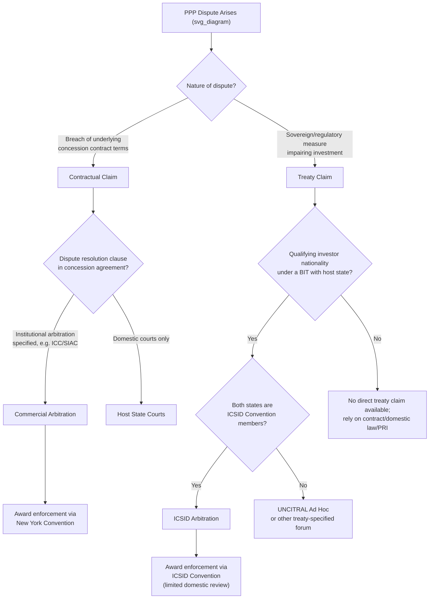

## International Arbitration and Investment Treaty Protection

### Overview

International arbitration and investment treaty protection form the dispute-resolution and legal-risk-mitigation layer underpinning cross-border PPP investment. Because PPP concessions are long-duration contracts (often 20–30+ years) between a private investor (frequently a foreign consortium) and a sovereign or sub-sovereign public authority, they carry distinctive **political risk** — the risk that the state, in its sovereign capacity, alters the regulatory or contractual environment in ways that impair the investment. International arbitration mechanisms and investment treaties exist primarily to constrain this risk and provide a neutral, enforceable forum for redress outside domestic courts.

### The Core Problem: Sovereign Risk and Contractual Asymmetry

**Key Points**

- A PPP contract with a government counterparty is inherently asymmetric: the state is simultaneously a **contracting party** and the **sovereign regulator** capable of unilaterally changing the laws, taxes, or regulations that govern the contract.
- This creates the risk of the state exercising its regulatory power to effectively expropriate or degrade the value of the investment without formally breaching the contract's explicit terms — a family of risks generally termed **political risk** or **regulatory risk**, encompassing direct expropriation, indirect/creeping expropriation, discriminatory treatment, and failure to honor contractual/legal commitments.
- Absent an external enforcement mechanism, an investor's only recourse against sovereign breach would typically be domestic courts of the host state — courts whose independence, in many jurisdictions, cannot be assumed to be free of executive influence when the government itself is the defendant. This asymmetry is the central rationale for investment treaty protection and international arbitration as PPP risk-mitigation tools.

### Investment Treaties: BITs and Multilateral Frameworks

**Bilateral Investment Treaties (BITs)** are agreements between two states under which each commits to specific standards of treatment for investors from the other state. Multilateral equivalents (regional or sector-specific) perform a similar function.

**Key Points**

- A BIT typically grants a **qualifying foreign investor** (nationality/ownership-structure requirements apply, often tested via the corporate nationality of the special purpose vehicle, SPV, that holds the PPP concession) the right to bring a claim **directly against the host state** before an international arbitral tribunal, bypassing domestic courts entirely — a mechanism known as **Investor-State Dispute Settlement (ISDS)**.
- Common substantive protections found in BITs include:
  - **Fair and Equitable Treatment (FET)**: prohibits arbitrary, discriminatory, or fundamentally unfair state conduct toward the investment; frequently the most litigated standard.
  - **Full Protection and Security (FPS)**: obliges the state to exercise due diligence to protect the investment from harm, including from third parties.
  - **Protection Against Expropriation**: prohibits both direct expropriation (formal seizure/nationalization) and indirect/"creeping" expropriation (regulatory measures that substantially deprive the investment of its value without formal taking) without prompt, adequate, and effective compensation.
  - **National Treatment / Most-Favoured-Nation (MFN) Treatment**: prohibits treating the foreign investor less favourably than domestic investors, or than investors from third countries under other treaties.
  - **Free Transfer of Funds**: guarantees the ability to repatriate profits, dividends, and capital.
  - **Umbrella Clauses**: in some treaties, elevate a breach of the underlying PPP *contract* itself into a breach of the *treaty*, effectively allowing contractual disputes to be litigated as treaty claims.
- [Unverified] The precise wording, scope, and interpretation of these standards vary significantly across individual treaties and have been the subject of considerable, sometimes conflicting, arbitral jurisprudence; general principles are described here, not the terms of any specific treaty.

### Structuring Investments for Treaty Protection

**Key Points**

- Because treaty protection is typically only available to investors possessing the nationality of a state party to a BIT with the host state, PPP sponsors frequently engage in **treaty shopping** or **nationality planning**: structuring the investment through a holding company incorporated in a jurisdiction with a favorable BIT network relative to the host state (a strategy that has itself generated significant arbitral controversy regarding abuse-of-process and denial-of-benefits doctrines).
- Multilateral development bank involvement (e.g., IFC, ADB, EBRD equity or debt participation) in a PPP's capital structure can provide an additional layer of informal political risk mitigation, since host states are generally more reluctant to take adverse action against a project involving a multilateral institution.
- **Political Risk Insurance (PRI)**, notably from the Multilateral Investment Guarantee Agency (MIGA) or national export credit agencies, functions as a complementary (not alternative) risk-mitigation tool, insuring against specific perils (expropriation, currency inconvertibility, breach of contract, war/civil disturbance) and is frequently used alongside, rather than instead of, treaty protection.

### Arbitral Institutions and Procedural Frameworks

**Key Points**

- **ICSID (International Centre for Settlement of Investment Disputes)**: Established under the 1965 ICSID Convention (a World Bank Group institution), ICSID is the most commonly designated forum for investor-state PPP disputes where both the investor's home state and the host state are Convention signatories. ICSID awards benefit from a distinctive enforcement regime under the Convention itself, generally limiting the grounds for domestic court review of awards among Convention member states.
- **UNCITRAL Arbitration Rules**: A procedural framework (not a standing institution) frequently used for ad hoc investor-state arbitration, often administered by an appointing authority such as the Permanent Court of Arbitration (PCA).
- **ICC (International Chamber of Commerce)**, **SCC (Stockholm Chamber of Commerce)**, and **SIAC/HKIAC** (Singapore/Hong Kong): Commonly used institutional forums for **commercial** (as opposed to purely treaty-based investor-state) arbitration arising directly from PPP concession agreements, particularly disputes between the SPV and its private-sector counterparties, or in some cases contractually designated for investor-state commercial disputes.
- Recognition and enforcement of arbitral awards across borders (for non-ICSID awards) generally relies on the **1958 New York Convention on the Recognition and Enforcement of Foreign Arbitral Awards**, to which the vast majority of the world's jurisdictions are signatories, providing broad (though not unconditional) enforceability against state assets located in signatory states.

### Diagram: PPP Dispute Resolution Pathway (svg_diagram)

### Key Substantive Doctrines in PPP-Relevant Arbitral Jurisprudence

**Key Points**

- **Legitimate Expectations**: A frequently invoked component of the FET standard — investors may argue that specific representations or a stable regulatory framework at the time of investment created legitimate expectations that a subsequent adverse regulatory change breaches. This doctrine has particular relevance to PPPs given their heavy reliance on tariff/toll regulation, subsidy commitments, or exclusivity guarantees made at contract signing.
- **Indirect Expropriation Analysis**: Tribunals generally examine factors such as the economic impact of the measure, its duration, its interference with reasonable investment-backed expectations, and the character of the government action (e.g., whether it was a bona fide, non-discriminatory regulatory measure — the latter often invoking a **police powers doctrine** exception that can defeat an expropriation claim even where economic impact is severe).
- **Umbrella Clause Interpretation**: Tribunals have historically been divided (this is a genuinely unsettled area — [Unverified] outcomes are treaty- and tribunal-specific) on whether an umbrella clause elevates *any* contractual breach to a treaty violation, or only breaches of specific "investment" obligations, or requires the state (rather than a state-owned enterprise) to be the direct contracting party.
- **Fork-in-the-Road and Waiver Clauses**: Many BITs require investors to elect between pursuing local court remedies or international arbitration, and many PPP contracts and treaties contain provisions requiring investors to waive domestic remedies as a condition of accessing treaty arbitration — these procedural gateway issues frequently determine tribunal jurisdiction before any merits are reached.

### Contractual Dispute Resolution Clause Design in PPP Agreements

**Key Points**

- Well-drafted PPP concession agreements typically incorporate **tiered/multi-step dispute resolution clauses**: (1) good-faith negotiation between senior representatives, (2) referral to a technical/expert panel or **Dispute Review Board (DRB)** for construction/operational disputes, (3) mediation, and only then (4) binding arbitration — designed to resolve routine operational disputes without resorting to costly international arbitration.
- **Governing law clauses** in PPP contracts commonly specify host-state law for matters closely tied to sovereign regulatory functions (e.g., tariff-setting procedures under local administrative law) while designating international arbitration for the resolution of the resulting disputes — a structure intended to balance sovereign regulatory legitimacy with investor confidence in impartial adjudication.
- **Stabilization clauses** (freezing the regulatory/fiscal regime applicable to the project at signing, or requiring compensation for adverse changes) are a direct contractual complement to treaty-based legitimate-expectations protection, though their enforceability against a sovereign's regulatory power varies significantly by jurisdiction and has been a subject of debate regarding the appropriate limits of contractually constraining sovereign regulatory authority.

### Costs, Duration, and Practical Considerations

**Key Points**

- Investor-state arbitration proceedings are typically **multi-year** processes (commonly 3–5+ years from filing to final award, sometimes longer with annulment/enforcement proceedings) and **costly** (legal fees, tribunal costs, and expert evidence commonly running into the tens of millions of US dollars for complex infrastructure disputes), which materially affects the practical calculus of pursuing a claim, particularly for smaller PPP sponsors.
- **Third-party funding** of investment arbitration claims has become an increasingly prominent feature of the practice, allowing investors to pursue claims without bearing full upfront costs in exchange for a share of any award — a development that has itself prompted procedural reforms (e.g., funding-disclosure requirements) in several arbitral institutions' rules.
- [Speculation] There is an active and unresolved policy debate — reflected in ongoing reform processes at UNCITRAL Working Group III and in some states' treaty renegotiation practices — over whether the traditional ISDS/ICSID model appropriately balances investor protection against host states' legitimate regulatory autonomy (the "regulatory chill" critique), a debate directly relevant to how future PPP-enabling legal frameworks may evolve; this remains a matter of ongoing policy contestation rather than settled doctrine.

### Related Topics

- Political Risk Insurance (MIGA, ECAs) and Complementary Risk-Mitigation Instruments
- Stabilization Clauses and Regulatory Freeze Mechanisms in Concession Agreements
- UNCITRAL Working Group III Reform of Investor-State Dispute Settlement
- Force Majeure and Material Adverse Government Action (MAGA) Clauses
- Sovereign Immunity and Enforcement of Arbitral Awards Against State Assets
- Comparative Analysis: ICSID versus UNCITRAL versus Institutional Commercial Arbitration
- Dispute Review Boards and Multi-Tiered Dispute Resolution in Construction Contracts
- Treaty Shopping, Corporate Nationality Planning, and Denial-of-Benefits Clauses