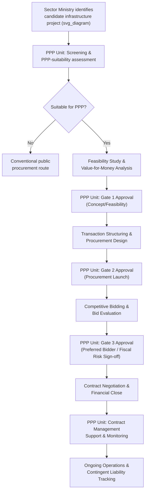

## Role and Design of Dedicated PPP Units

### Overview

A dedicated PPP Unit is a specialized institutional body — typically housed within or adjacent to a Ministry of Finance, Planning, or the Executive — established to build, centralize, and deploy the specific technical, financial, and legal capacity required to originate, evaluate, procure, and manage Public-Private Partnerships. PPP Units emerged as a near-universal institutional response to the recognition that PPP transactions demand a combination of skills (project finance, risk allocation, contract law, procurement regulation, fiscal risk management) that is rarely concentrated in conventional public procurement or infrastructure line ministries.

### Rationale for Establishing a PPP Unit

**Key Points**

- **Capacity concentration**: PPP transactions require specialized skills (financial modeling, risk-transfer structuring, contract drafting, value-for-money analysis) that are scarce and expensive; centralizing this capacity in one unit is more efficient than each line ministry attempting to build it independently.
- **Consistency and standardization**: A central unit can develop standardized contract templates, procurement guidelines, and evaluation methodologies, reducing transaction costs and improving comparability across projects and sectors.
- **Fiscal risk oversight**: Because PPPs can create significant **contingent liabilities** (government guarantees, termination payments, minimum revenue guarantees) that do not always appear as conventional public debt, a central unit positioned within or close to the Ministry of Finance can provide a check against fiscally imprudent projects being approved by sector ministries eager to deliver infrastructure without apparent budgetary cost.
- **Signaling and market credibility**: A well-resourced, technically credible PPP Unit signals to international investors and lenders that the government has institutionalized PPP processes, which can lower the perceived risk premium and improve the pipeline's overall bankability.
- **Reducing principal-agent problems within government**: A sector ministry that will operationally interact with the private partner for decades may have weaker incentives to negotiate hard terms upfront (or may be more susceptible to being outmaneuvered by more sophisticated private bidders) than an independent, specialized unit whose institutional mandate is precisely to protect the state's long-term interest.

### Core Functional Mandates

Most PPP Units are structured around some combination of the following functions, though the precise mix varies significantly by jurisdiction:

**Key Points**

1. **Policy and Legal/Regulatory Framework Development**: Drafting PPP legislation, procurement regulations, and policy guidelines governing which projects qualify as PPPs and what processes must be followed.
2. **Project Screening and Prioritization**: Establishing criteria for identifying which proposed infrastructure projects are suitable candidates for PPP delivery versus traditional public procurement.
3. **Feasibility Study and Value-for-Money (VfM) Review**: Reviewing or conducting feasibility studies, including Public Sector Comparator (PSC) analysis or equivalent VfM assessments, to determine whether PPP delivery offers genuine efficiency gains over conventional procurement.
4. **Transaction Advisory Support**: Providing or coordinating technical, financial, and legal advisory support to sector ministries/agencies during procurement, bid evaluation, and contract negotiation.
5. **Fiscal Risk Assessment and Contingent Liability Management**: Quantifying and monitoring contingent liabilities arising from PPP commitments (guarantees, MRGs, termination payments) against overall fiscal risk limits, often maintaining a **PPP fiscal risk register**.
6. **Approval Gate-Keeping**: Serving as a mandatory clearance point at defined stages of the project cycle (e.g., concept approval, feasibility approval, procurement approval, financial close approval) before a project can proceed.
7. **Contract Management and Monitoring Support**: Post-financial-close, providing oversight, standardized monitoring frameworks, or direct support to contracting authorities managing operational PPP contracts, including renegotiation guidance.
8. **Capacity Building and Knowledge Management**: Training sector ministry staff, maintaining a repository of lessons learned, standard contract clauses, and past project data.

### Institutional Location and Design Models

**Key Points**

| Model | Description | Typical Strengths | Typical Weaknesses |
| --- | --- | --- | --- |
| **Ministry of Finance-housed unit** | PPP Unit is a department/directorate within the Ministry of Finance | Strong fiscal discipline linkage; direct authority over contingent liability approval | May lack sector-specific technical expertise; can be perceived as a bottleneck by line ministries |
| **Independent statutory agency** | Established by dedicated legislation as a separate legal entity, sometimes with its own board | Greater operational autonomy and ability to attract specialized (often higher-paid) staff; institutional continuity across political cycles | Requires enabling legislation; can create coordination challenges with Finance Ministry oversight |
| **Inter-ministerial unit/committee hybrid** | A coordinating body drawing staff/authority from multiple ministries (Finance, Planning, Justice) | Broader buy-in and interdisciplinary expertise | Coordination costs; unclear ultimate decision authority; risk of diffused accountability |
| **Sector-specific PPP cells** (in addition to central unit) | Individual line ministries (e.g., Transport, Health) maintain their own PPP cells that interact with a central unit | Deep sector-specific technical knowledge | Risk of inconsistent standards/practices; potential duplication of central unit functions |

[Inference] Empirical surveys of PPP Units across jurisdictions (e.g., World Bank Group's periodic global PPP unit surveys) generally find that units housed within or with strong formal authority linked to the Ministry of Finance tend to exercise more effective fiscal gate-keeping, though this correlation does not establish that Finance-Ministry location is uniformly optimal across all country contexts, since political economy factors and available technical talent pools vary substantially by jurisdiction.

### Diagram: PPP Unit Position in the Project Cycle (svg_diagram)

### Approval Gate Authority and Fiscal Risk Control

**Key Points**

- Many jurisdictions grant the PPP Unit (or, more precisely, the Ministry of Finance acting on the unit's technical recommendation) a formal **veto or mandatory clearance authority** over projects that would create material contingent liabilities, distinct from any sector ministry's own project-approval authority.
- **Fiscal Risk Registers/Statements**: A recurring international good-practice recommendation (reflected in IMF and World Bank PPP fiscal risk management guidance) is for PPP Units to maintain a consolidated register of PPP-related contingent liabilities, reported alongside conventional public debt disclosures in fiscal risk statements accompanying the annual budget.
- **Ceilings/limits on aggregate PPP exposure**: Some jurisdictions impose formal quantitative limits (e.g., a cap on aggregate committed availability payments as a percentage of GDP or of total budget expenditure) to prevent PPP structures being used to circumvent conventional fiscal/debt limits — a practice directly responsive to the well-documented risk that PPPs can be used for "fiscal illusion" (moving capital expenditure off the government's immediate balance sheet while creating equivalent or greater long-term fiscal commitments).

### Staffing, Funding, and Capacity Considerations

**Key Points**

- Effective PPP Units typically require staff with backgrounds in **investment banking/project finance, commercial and public law, engineering/sector-specific technical expertise, and public financial management** — a combination that is difficult to recruit and retain within standard civil service pay scales in many jurisdictions.
- **Funding models** vary: direct budget allocation, a dedicated project preparation facility/fund (sometimes capitalized with development partner support), or cost-recovery mechanisms (e.g., a small fee charged to winning bidders or included in transaction advisory costs).
- [Speculation] A frequently cited (though not universally proven) design recommendation in the practitioner literature is to allow PPP Units some form of enhanced compensation flexibility or secondment arrangements from the private sector/development finance institutions to bridge the public-private pay gap for specialized technical roles — the effectiveness of specific compensation models has not been rigorously benchmarked across a large comparable sample of jurisdictions.
- **Project Preparation Facilities (PPFs)**: Many PPP Units operate alongside or administer a dedicated PPF — a revolving fund used to finance the (often substantial) upfront costs of feasibility studies, transaction advisors, and legal counsel needed to bring a project to market, frequently replenished from a small success fee charged upon financial close.

### Legal Basis and Enabling Framework

**Key Points**

- PPP Units generally derive their authority from either (a) a **dedicated PPP Law** that explicitly establishes the unit, defines its powers, and mandates its role in the project cycle, or (b) **executive/administrative regulation** (a Presidential Decree, Cabinet Order, or Ministerial Circular) absent standalone legislation.
- A dedicated PPP Law model generally provides greater institutional durability (harder to dissolve or bypass through ordinary administrative action) and clearer legal standing for the unit's approval authority to be enforceable against sector ministries, whereas an administrative-regulation model offers greater flexibility to adjust the unit's mandate without legislative amendment, at the cost of institutional fragility across political transitions.
- The enabling framework typically also addresses the unit's relationship to the general **public procurement law**, since PPPs often require carve-outs or specific procedural adaptations (e.g., provisions for unsolicited proposals, competitive dialogue procedures, or negotiated procedures) that differ from standard public works or goods/services procurement.

### Common Institutional Challenges

**Key Points**

- **Political interference and bypass risk**: Even where a PPP Unit holds formal gate-keeping authority, high-profile or politically prioritized projects can be fast-tracked or exempted from standard scrutiny processes, undermining the unit's fiscal-discipline function.
- **Capacity turnover**: Because PPP Unit staff develop highly marketable private-sector skills, retention is a persistent challenge, particularly in jurisdictions without compensation flexibility.
- **Mandate overlap and turf conflicts**: Ambiguity between a central PPP Unit's authority and sector ministries' own project ownership can generate friction, particularly during procurement and negotiation phases.
- **Unsolicited proposals management**: PPP Units frequently must design and enforce a formal process for handling privately-initiated ("unsolicited") project proposals, balancing the value of leveraging private-sector origination capacity against the competitive-neutrality and transparency risks associated with non-competitively-originated projects (e.g., through a "Swiss challenge" mechanism or similar competitive matching process).

### Related Topics

- Public Sector Comparator (PSC) and Value-for-Money Assessment Methodology
- Fiscal Risk Management and Contingent Liability Reporting Frameworks
- Project Preparation Facilities and Upfront Transaction Cost Financing
- Unsolicited Proposals and Swiss Challenge Procurement Mechanisms
- Comparative PPP Institutional Models (UK Infrastructure and Projects Authority, South Africa's National Treasury PPP Unit, Philippines PPP Center)
- PPP Enabling Legislation Design and Procurement Law Interfaces
- IMF/World Bank PPP Fiscal Risk Assessment Model (PFRAM)
- Contract Management and Post-Financial-Close Monitoring Institutions