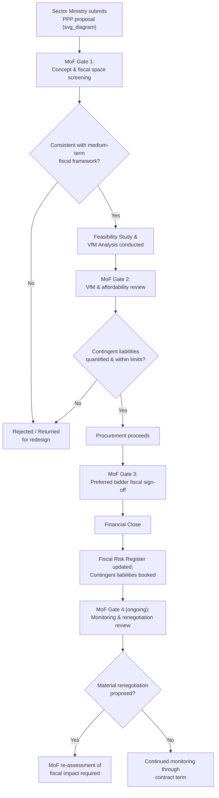

## Ministry of Finance Oversight and Fiscal Gatekeeping

### Overview

Ministry of Finance (MoF) oversight and fiscal gatekeeping refers to the set of institutional controls, approval requirements, and risk-monitoring functions through which a country's central fiscal authority manages the budgetary and macro-fiscal implications of Public-Private Partnerships. Because PPPs generate long-term financial commitments — direct (availability payments) and contingent (guarantees, termination liabilities) — that can substitute for or resemble conventional public borrowing, the MoF's gatekeeping role is the primary institutional safeguard against PPPs being used to circumvent fiscal discipline, debt ceilings, or budget transparency norms.

### Rationale: Why Fiscal Gatekeeping Is Necessary

**Key Points**

- **Fiscal illusion risk**: PPPs can create genuine political incentives to move capital expenditure "off-budget" or "off-balance-sheet," allowing governments to deliver infrastructure that appears cost-free in the near term while committing future budgets to substantial payment obligations — a dynamic documented extensively in public finance literature on PPP accounting incentives.
- **Contingent liability accumulation**: Guarantees (minimum revenue guarantees, exchange rate guarantees, debt guarantees), termination compensation clauses, and other contractual protections extended to private partners represent liabilities that may not crystallize for years, but that can generate sudden, large fiscal shocks if triggered — precisely the kind of risk that standard budget processes (built around current-year cash accounting) are poorly equipped to capture without dedicated oversight.
- **Long-term budget rigidity**: Availability payments and other committed PPP cash flows create multi-decade claims on future budgets that reduce fiscal flexibility for subsequent governments, raising intergenerational equity and democratic-accountability considerations that a central fiscal authority is institutionally positioned to weigh against sector-specific project enthusiasm.
- **Information asymmetry between sector ministries and Finance**: Sector ministries championing a specific PPP project have institutional incentives to present favorable assumptions (optimistic demand forecasts, understated risk premiums) since they capture the political credit for project delivery while the fiscal costs are often realized outside their own budget line or after their tenure — a principal-agent dynamic that formal MoF review is designed to counteract.

### Core Fiscal Gatekeeping Functions

**Key Points**

1. **Ex Ante Project Appraisal Review**: Independent review of Value-for-Money (VfM) analysis, Public Sector Comparator (PSC) comparisons, and underlying financial models submitted by sector ministries/PPP Units, testing assumptions (discount rates, risk valuations, demand forecasts) for reasonableness before granting approval to proceed.
2. **Affordability Assessment**: Evaluating whether the projected stream of payment obligations (availability payments, subsidies) is consistent with medium-term budget frameworks and does not crowd out other spending priorities.
3. **Contingent Liability Quantification and Approval**: Requiring actuarial or probabilistic quantification of guarantees and other contingent obligations before granting sign-off, often using standardized fiscal risk assessment tools.
4. **Fiscal Risk Register Maintenance**: Consolidating all approved PPP-related direct and contingent liabilities into a central register, typically disclosed (in aggregate or project-level detail, depending on jurisdictional transparency practice) in fiscal risk statements accompanying the annual budget.
5. **Aggregate Exposure Limits**: Setting and monitoring compliance with quantitative ceilings on total PPP commitments (e.g., a cap on aggregate committed payments as a percentage of GDP, of total revenue, or of capital budget).
6. **Renegotiation and Amendment Sign-Off**: Requiring MoF clearance for material contract renegotiations post-financial-close, since renegotiations are a well-documented channel through which contingent or hidden liabilities can be increased after initial approval.
7. **Statistical/Accounting Classification Determination**: Applying (or coordinating with the national statistics office's application of) accounting standards to determine on-/off-balance-sheet treatment of each PPP.

### Formal Approval Gate Structure

Most fiscal gatekeeping frameworks operate through a series of mandatory sequential approval gates, with MoF sign-off required to pass each gate before the project can proceed:

$$\text{Project Cycle: } G_1 \xrightarrow{\text{MoF Review}} G_2 \xrightarrow{\text{MoF Review}} G_3 \xrightarrow{\text{MoF Review}} G_4 \xrightarrow{\text{MoF Monitoring}} G_5$$

where a typical gate sequence corresponds to: $G_1$ = concept/pre-feasibility, $G_2$ = full feasibility and VfM completion, $G_3$ = procurement launch, $G_4$ = preferred bidder/financial close, $G_5$ = post-financial-close monitoring.

### Diagram: Fiscal Gatekeeping Decision Flow (svg_diagram)

### Contingent Liability Quantification Tools

**Key Points**

- **PFRAM (PPP Fiscal Risk Assessment Model)**: A jointly developed IMF–World Bank analytical tool used by many MoFs to estimate the fiscal impact of PPP projects on the government's cash flow and balance sheet under various macroeconomic and project-specific scenarios, including stress-testing for guarantee triggers.
- **Value-at-Risk (VaR) / Probabilistic Simulation Approaches**: Some MoFs apply Monte Carlo or scenario-based simulation to a portfolio of PPP guarantees to estimate the probability-weighted expected fiscal cost and the tail-risk exposure at a given confidence level, analogous to VaR methodologies used in financial risk management.

$$\text{Expected Contingent Cost} = \sum_{s} p_s \times L_s$$

where $p_s$ is the probability of a given triggering scenario $s$ (e.g., traffic falling below the MRG floor) and $L_s$ is the resulting government payout under that scenario.

- **Guarantee Fee/Provisioning Approaches**: Some jurisdictions require sector ministries or the PPP itself to pay an actuarially-informed "guarantee fee" into a central contingency/reserve fund at the time a guarantee is issued, both pricing the fiscal risk explicitly and pre-funding a portion of potential future payouts.

### Fiscal Rules and Ceilings Applied to PPPs

**Key Points**

- **Aggregate PPP payment ceilings**: Some jurisdictions (e.g., several Latin American and some emerging Asian economies, per World Bank/IMF surveys of PPP fiscal frameworks) impose an explicit statutory or policy cap limiting the total stock of committed future availability payments to a defined percentage of GDP or of annual budget expenditure, intended to prevent excessive intertemporal budget commitment.
- **Debt-equivalent treatment for fiscal rule compliance**: Some fiscal rule frameworks require PPP commitments meeting certain risk-transfer thresholds to be counted, in whole or part, against conventional public debt or deficit ceilings — directly closing the "fiscal illusion" loophole by ensuring PPPs cannot be used purely to circumvent numerical fiscal rules.
- [Unverified] The stringency, legal enforceability, and actual compliance record of such ceilings vary considerably across jurisdictions, and specific figures/thresholds should be verified against the current legal framework of the jurisdiction in question rather than assumed to be a universal standard.

### Relationship to National Statistical/Accounting Classification

**Key Points**

- The MoF's fiscal gatekeeping function frequently intersects with (though is analytically distinct from) the statistical classification question of whether a PPP asset/liability appears on the government's balance sheet under frameworks such as **ESA 2010/Eurostat rules** (EU context), **GFSM 2014** (IMF's Government Finance Statistics Manual), or national equivalents.
- A common Eurostat-style test evaluates whether the government bears the majority of **construction risk**, **availability risk**, and **demand risk**; transfer of at least the latter two to the private partner typically supports off-balance-sheet classification — but the MoF's own internal fiscal risk assessment for gatekeeping purposes is generally more conservative and comprehensive than pure statistical balance-sheet classification, since a project can be legitimately classified as "off-balance-sheet" under statistical rules while still representing meaningful fiscal risk that prudent MoF oversight should capture (e.g., through guarantee exposure not captured by the on/off-balance-sheet test itself).

### Institutional Design Variants for MoF Gatekeeping Authority

**Key Points**

| Design Variant | Description | Key Trade-off |
| --- | --- | --- |
| Direct MoF department exercises veto | A dedicated unit/directorate within MoF itself holds binding sign-off authority | Strong fiscal discipline; risk of being perceived as a bureaucratic bottleneck by sector ministries |
| MoF provides binding technical recommendation to Cabinet/Head of State | MoF assessment is formally advisory but politically difficult to override | Preserves ultimate political accountability; risk of political override undermining fiscal discipline in practice |
| Statutory Debt/Fiscal Council with PPP mandate | An independent fiscal council (separate from MoF) reviews PPP fiscal implications as part of a broader fiscal-sustainability mandate | Enhanced independence and credibility; requires a mature, separately resourced fiscal council institution to exist |
| Legislative approval threshold | Above a specified project size or guarantee value, parliamentary approval is required in addition to MoF clearance | Strengthens democratic accountability for large fiscal commitments; can slow down project timelines significantly |

### Common Weaknesses and Practical Challenges

**Key Points**

- **Optimistic bias in submitted assumptions**: Even with formal MoF review, sector ministries and their transaction advisors may have incentives to submit demand forecasts, discount rates, or risk valuations favorable to project approval; effective gatekeeping requires MoF technical capacity sufficient to independently interrogate these assumptions rather than merely process submitted paperwork.
- **Off-register guarantees and informal comfort letters**: A recurring practical risk is the issuance of informal government assurances, comfort letters, or side arrangements outside the formal guarantee-approval process, which can create de facto contingent liabilities not captured in the official fiscal risk register.
- **Political override at critical junctures**: High-profile or politically prioritized projects may receive expedited approval or exemption from standard gatekeeping scrutiny, a governance risk that formal institutional design alone cannot fully eliminate without sustained political commitment to the process.
- **Retroactive fiscal risk crystallization**: Because many contingent liabilities (particularly MRGs and termination payments) may not crystallize for a decade or more after approval, the MoF officials who approved the original project are frequently no longer in position when the fiscal cost materializes, weakening the accountability feedback loop that might otherwise discipline overly optimistic initial approvals.

### Related Topics

- IMF/World Bank PPP Fiscal Risk Assessment Model (PFRAM) Methodology
- Public Sector Comparator and Value-for-Money Analysis Techniques
- Contingent Liability Reporting and Fiscal Risk Statements
- ESA 2010/Eurostat and GFSM 2014 Statistical Classification of PPPs
- Fiscal Rules, Debt Ceilings, and Off-Balance-Sheet Financing Incentives
- Minimum Revenue Guarantees and Government Guarantee Fee Structures
- Role and Design of Dedicated PPP Units (institutional counterpart function)
- Renegotiation Governance and Post-Financial-Close Fiscal Monitoring