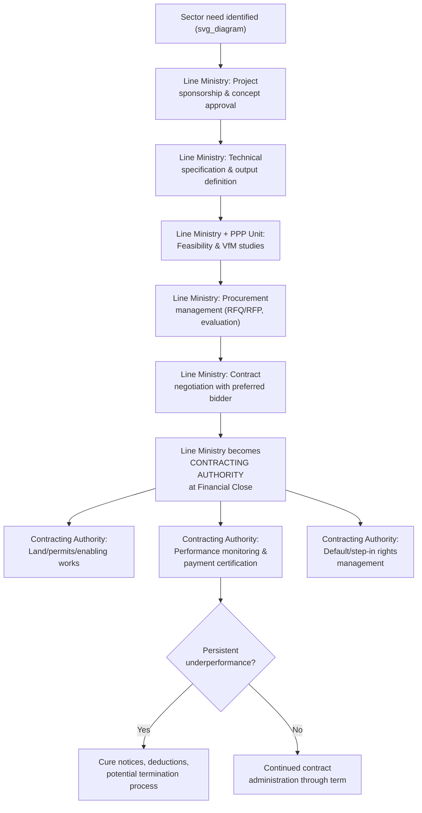

## Line Ministry and Contracting Authority Responsibilities

### Overview

The line ministry (also referred to as the sponsoring agency, sector ministry, or, once it formally signs the concession agreement, the "Contracting Authority") is the sector-specific public body responsible for originating, sponsoring, and ultimately being the direct legal counterparty to a Public-Private Partnership contract. While the Ministry of Finance and any dedicated PPP Unit provide fiscal gatekeeping and technical support, the line ministry retains primary ownership of the project's sectoral rationale, technical specifications, day-to-day contract administration, and — critically — the direct legal relationship with the private partner throughout the life of the contract.

### Distinguishing "Sponsoring Ministry" from "Contracting Authority"

**Key Points**

- In the early project cycle (identification, feasibility, procurement design), the sector body is generally referred to as the **sponsoring ministry** or **sponsoring agency** — the entity that identifies the infrastructure need and champions the project.
- Once the concession or PPP agreement is executed, that same body (or occasionally a specifically designated implementing agency, state-owned enterprise, or sub-national government unit) becomes the **Contracting Authority** — the named legal party bound by the agreement, holding both the rights (step-in rights, monitoring rights, termination rights) and obligations (payment obligations, cooperation duties, permitting support) specified in the contract.
- In some jurisdictions, particularly for large infrastructure sectors, a specialized parastatal or implementing agency (e.g., a national roads authority, a water and sewerage authority, or a specific project-delivery unit) serves as the Contracting Authority rather than the ministry itself, with the ministry retaining a supervisory/policy role above it.

### Core Responsibilities Across the Project Lifecycle

**Key Points**

**1. Project Origination and Sponsorship**

- Identifying the underlying public service need or infrastructure gap the project is intended to address.
- Establishing the project's sectoral policy rationale and alignment with sector development plans.
- Securing initial internal ministerial approval and any required political/cabinet-level endorsement to proceed.

**2. Technical Specification and Output Definition**

- Defining the required technical specifications, service standards, and — critically, under modern PPP procurement practice — **output-based specifications** rather than input-based specifications, i.e., defining *what* service outcome is required (e.g., "road available with less than X minutes of unplanned closure per month, meeting Y safety standard") rather than prescribing *how* the private partner must achieve it, thereby preserving the private partner's operational flexibility to innovate.
- Coordinating with technical regulators (safety, environmental, sector-specific regulatory bodies) to ensure specifications are consistent with applicable regulatory requirements.

**3. Feasibility Study Coordination**

- Commissioning or directly managing technical, financial, legal, environmental, and social feasibility studies (often with support from a PPP Unit's transaction advisory function or externally procured transaction advisors).
- Providing sector-specific data (demand studies, asset condition surveys, right-of-way/land status) that only the line ministry, as the incumbent sector authority, typically possesses.

**4. Procurement Management**

- Leading (or co-leading with the PPP Unit, depending on institutional design) the competitive procurement process: drafting the Request for Qualifications (RFQ) and Request for Proposals (RFP), managing bidder queries, conducting bid evaluation, and recommending a preferred bidder.
- Ensuring procurement compliance with applicable public procurement law, including transparency, non-discrimination, and conflict-of-interest safeguards.

**5. Contract Negotiation and Execution**

- Negotiating final contractual terms with the preferred bidder (often within parameters or "negotiation red lines" pre-cleared with the Ministry of Finance/PPP Unit for any terms with fiscal implications).
- Executing the concession/PPP agreement as the named Contracting Authority, thereby assuming direct legal liability and rights under the contract.

**6. Land Acquisition, Permitting, and Enabling Works**

- Securing rights of way, land acquisition, resettlement (where applicable), and environmental/social safeguard compliance — obligations frequently retained by the public sector even in fully privately-financed PPPs, since these require sovereign/administrative powers (eminent domain, inter-agency coordination) that a private party cannot exercise.
- Coordinating necessary permits, licenses, and inter-agency approvals (utility relocations, connecting infrastructure) that fall outside the private partner's direct control.

**7. Contract Administration and Performance Monitoring**

- Establishing (or operating, if provided by the PPP Unit) a contract management function responsible for monitoring the private partner's compliance with performance/availability standards, processing payment certifications, and applying deduction regimes for non-performance.
- Managing the formal **step-in rights**, **cure period** provisions, and **default/termination** processes specified in the contract should the private partner underperform materially.

**8. Renegotiation Management**

- Serving as the primary interlocutor for contract variation or renegotiation requests, subject to Ministry of Finance clearance where fiscal implications arise, and subject to procurement-law constraints on the scope of permissible variations without a new competitive process.

**9. Stakeholder and Public Communication**

- Managing public consultation, community relations, and political communication regarding the project — particularly important in demand-based/user-pay structures where tariff-setting can generate public opposition.

### Diagram: Line Ministry Role Across the Project Lifecycle (svg_diagram)

### Capacity Requirements and Common Gaps

**Key Points**

- Line ministries typically possess strong **technical/sectoral expertise** (engineering standards, service delivery norms) but often lack in-house **commercial, financial, and legal negotiation capacity** comparable to that of sophisticated private bidders and their advisors — a capacity asymmetry that is a primary justification for centralized PPP Unit transaction-advisory support.
- **Contract management capacity** (as opposed to procurement/negotiation capacity) is a frequently under-resourced function: many jurisdictions invest heavily in transaction advisory support to reach financial close but under-invest in the long-term institutional capacity needed to competently monitor performance and manage the contract over its 20–30 year life — a gap increasingly recognized in PPP institutional-strengthening programs (e.g., World Bank and regional development bank technical assistance focused specifically on post-financial-close contract management capacity).
- [Inference] This capacity asymmetry between the transaction/deal-making phase and the operations/monitoring phase is widely cited in practitioner and academic literature as a structural risk factor contributing to weak enforcement of performance standards and contract "drift" over the life of long-duration PPPs, though the severity of this gap varies considerably by jurisdiction and sector.

### Relationship with the PPP Unit and Ministry of Finance

**Key Points**

- The line ministry generally retains **project ownership and sectoral decision-making authority**, while the PPP Unit provides **technical/transactional support and process standardization**, and the Ministry of Finance exercises **fiscal gatekeeping** — a three-way division of labor that, when well-designed, balances sectoral expertise, technical rigor, and fiscal discipline, but that can also generate coordination friction and unclear ultimate accountability if roles are not clearly delineated in the enabling legal framework.
- Formal Memoranda of Understanding (MoUs) or protocol agreements between the line ministry, PPP Unit, and Ministry of Finance are a common institutional design tool used to clarify respective roles, approval sequencing, and information-sharing obligations at each project-cycle stage.

### Legal Liability and Risk Exposure as Contracting Authority

**Key Points**

- As the named legal party to the concession agreement, the Contracting Authority (line ministry or its designated implementing agency) bears **direct legal liability** for the government's contractual obligations — including payment obligations under availability payment structures, compensation obligations upon termination for convenience or government default, and cooperation obligations (e.g., timely permit issuance) whose breach can itself trigger compensation claims by the private partner.
- This direct liability exposure is a key reason many jurisdictions require Ministry of Finance or Attorney-General/Solicitor-General legal review and sign-off on final contract terms before execution, since the line ministry alone may not have full visibility into the aggregate fiscal or legal risk the government is assuming.
- Where the Contracting Authority is a sub-sovereign entity (a municipal or state/provincial government) rather than the national line ministry, additional considerations arise regarding whether national government guarantees or credit support are needed to make the sub-sovereign counterparty's obligations bankable to private lenders — a structuring issue distinct from, but often coordinated with, national-level fiscal gatekeeping.

### Related Topics

- Role and Design of Dedicated PPP Units (technical/transactional support function)
- Ministry of Finance Oversight and Fiscal Gatekeeping (fiscal risk control function)
- Output-Based Specifications versus Input-Based Specifications in PPP Contracts
- Land Acquisition, Resettlement, and Environmental Safeguard Compliance in PPPs
- Step-In Rights, Cure Periods, and Default/Termination Provisions
- Contract Management Institutional Capacity and Post-Financial-Close Monitoring
- Sub-Sovereign PPPs and National Government Credit Support Mechanisms
- Public Procurement Law Interfaces with PPP-Specific Procurement Procedures