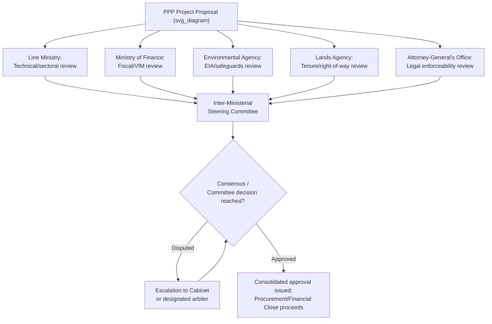

## Inter-Agency Coordination and Approval Processes

### Overview

Inter-agency coordination and approval processes refer to the formal and informal mechanisms through which multiple government bodies — the line ministry/Contracting Authority, the Ministry of Finance, a dedicated PPP Unit, sector regulators, environmental and planning authorities, the Attorney-General/Solicitor-General's office, sub-national governments, and sometimes the legislature or Cabinet — jointly process a PPP proposal through sequential or parallel approval requirements. Because no single agency typically holds complete authority over every dimension of a PPP (fiscal, legal, technical, environmental, land-use), effective inter-agency coordination is a critical determinant of transaction timelines, decision quality, and ultimately whether a well-structured project reaches financial close without being derailed by fragmented or contradictory institutional signals.

### The Coordination Problem

**Key Points**

- PPPs are inherently **multi-dimensional transactions** requiring sign-off across domains that are institutionally separated in most governments: fiscal sustainability (Finance), sectoral policy and technical standards (Line Ministry), legal enforceability (Attorney-General/Justice), environmental and social safeguards (Environment Ministry/Agency), land tenure (Lands Ministry/Agency), competition and regulatory compliance (sector regulator, competition authority), and sometimes national security or strategic-asset considerations.
- Each agency typically has **distinct statutory mandates, risk tolerances, and decision timelines**, creating a structural coordination challenge: a project can be technically sound and fiscally prudent yet stall indefinitely due to unresolved land tenure disputes, pending environmental clearances, or unclear jurisdictional authority between overlapping regulators.
- Absent a clearly sequenced and time-bound approval framework, PPP transactions are vulnerable to what is often termed **"approval gridlock"** or **sequential veto risk** — where any single agency in the approval chain can indefinitely delay a project through inaction, conflicting requirements, or jurisdictional disputes with another agency, without any single body bearing accountability for the resulting delay.

### Core Coordination Mechanisms

**Key Points**

**1. Inter-Ministerial Committees (IMCs) / Steering Committees**

- A standing or project-specific committee comprising senior representatives (often at Permanent Secretary/Deputy Minister level) from Finance, the line ministry, Planning, Justice, and the PPP Unit, convened to review and approve projects at defined gates, resolve inter-agency disagreements, and provide a single point of political/administrative accountability for coordinated decision-making.
- Typically chaired by a senior figure (Finance Minister, Cabinet Secretary, or Head of the PPP Unit, depending on institutional design) with sufficient authority to bind participating agencies to committee decisions.

**2. One-Stop-Shop / Single-Window Coordination Bodies**

- Some jurisdictions establish a designated coordinating body (sometimes housed within the PPP Unit itself, sometimes a separate investment-promotion or ease-of-doing-business agency) tasked with sequencing and expediting the various permits, licenses, and clearances a PPP project requires, functioning as a single point of contact for the private bidder/sponsor rather than requiring the sponsor to separately navigate each agency.

**3. Memoranda of Understanding (MoUs) and Inter-Agency Protocols**

- Formal bilateral or multilateral agreements between agencies (e.g., between the PPP Unit and the Ministry of Environment) specifying information-sharing obligations, review timelines, and escalation procedures for unresolved disagreements — used to pre-establish coordination rules before disputes arise on a live transaction.

**4. Statutory Time-Bound Review Periods**

- Legally mandated maximum review/response periods for each agency's input at a given approval gate (e.g., "the Environmental Authority shall issue its determination within 60 days of a complete application, absent which approval is deemed granted"), designed to prevent indefinite delay while preserving each agency's substantive review authority.

**5. Parallel Processing Protocols**

- Structuring approval requirements so that independent agencies review different dimensions of a project **simultaneously** rather than sequentially wherever the dimensions are genuinely independent (e.g., environmental review and financial feasibility review proceeding in parallel rather than one waiting for the other to complete), reducing overall transaction timeline without compromising the substantive independence of each review.

### Diagram: Inter-Agency Approval Architecture (svg_diagram)

### Approval Gate Sequencing Models

**Key Points**

| Model | Description | Advantage | Risk |
| --- | --- | --- | --- |
| **Strict sequential gates** | Each agency approval must be fully completed before the next agency begins review | Clear accountability chain; each review benefits from prior findings | Slow; single-agency delay blocks entire pipeline |
| **Parallel independent review with consolidated sign-off** | Agencies review simultaneously; a coordinating body consolidates findings at a single decision point | Faster overall timeline | Requires strong coordination capacity to synthesize potentially conflicting findings |
| **Delegated/devolved authority with reporting obligation** | A lead agency (e.g., PPP Unit) is granted authority to approve on behalf of the government, subject to a duty to consult and report to other agencies | Fast, clear accountability | Risk that specialized agencies (environment, land) lack sufficient influence over final decisions |
| **Legislative/Cabinet ratification threshold** | Above a materiality threshold (project size, guarantee value), full Cabinet or Parliamentary ratification is required regardless of technical agency sign-off | Strong democratic accountability | Can introduce significant political-cycle-driven delay and unpredictability |

### Common Sources of Inter-Agency Friction

**Key Points**

- **Jurisdictional overlap**: Ambiguity regarding which agency has final authority over a specific decision (e.g., whether a sector regulator's tariff-setting authority or the PPP Unit's contract-approval authority takes precedence over tariff terms embedded in a PPP contract).
- **Divergent risk appetites**: A line ministry eager to deliver a politically prioritized project may have a materially different risk tolerance than the Ministry of Finance's fiscal conservatism, or than an environmental agency's precautionary approach to safeguard compliance — generating institutionally-rooted (not merely personality-driven) disagreement.
- **Information asymmetry between agencies**: Technical financial models, risk allocations, or environmental assessments prepared by or for one agency may not be readily accessible or comprehensible to reviewers in another agency, slowing effective cross-agency review.
- **Timing misalignment with private sector expectations**: Private bidders and lenders typically operate on commercial timelines with real transaction costs tied to delay (bid bond costs, opportunity costs of committed capital); prolonged inter-agency coordination failures can deter serious bidder participation or increase the risk premium reflected in bid pricing.
- **Sub-national/national coordination**: Where a project spans or is delivered by a sub-national government but requires national government support (guarantees, national regulatory clearances, or cross-jurisdictional infrastructure like inter-state transmission lines), additional vertical (not just horizontal) coordination challenges arise, often requiring distinct institutional mechanisms (national-subnational coordination councils, specific enabling legislation).

### Escalation and Dispute Resolution Mechanisms

**Key Points**

- Well-designed inter-agency frameworks typically specify a **clear escalation path** for unresolved disagreements: from working-level technical staff, to senior officials/Permanent Secretaries, to a designated Inter-Ministerial Committee, and ultimately (for genuinely unresolvable disputes) to Cabinet or the Head of Government/State for final political-level determination.
- Some jurisdictions designate a specific **lead coordinating authority** (frequently the PPP Unit or a Cabinet Office/Prime Minister's Office coordination function) with explicit convening authority to bring disputing agencies together and, in some designs, with tie-breaking or override authority to prevent indefinite gridlock.
- [Speculation] Practitioner guidance (e.g., from World Bank PPP institutional-strengthening programs) frequently recommends establishing these escalation mechanisms *before* the first major project enters the pipeline, since attempting to design dispute-resolution protocols reactively, in the midst of a live inter-agency disagreement over a specific project, tends to produce weaker, more ad hoc outcomes — though the comparative effectiveness of ex ante versus reactive institutional design has not been rigorously measured across a large sample of countries and should be treated as informed practitioner judgment rather than an established empirical finding.

### Digital and Process Innovations in Coordination

**Key Points**

- Some jurisdictions have implemented **electronic single-window platforms** that allow simultaneous submission of a PPP project's documentation to all relevant reviewing agencies, with automated tracking of each agency's review status, statutory deadline compliance, and consolidated status reporting to the PPP Unit or Steering Committee — reducing the administrative burden of coordinating parallel reviews across paper-based or siloed agency systems.
- **Shared project data rooms**: Establishing a common repository of project documentation (feasibility studies, financial models, environmental assessments) accessible to all reviewing agencies reduces duplicated information requests to the sponsoring ministry/private bidder and improves the consistency of the factual basis on which each agency conducts its review.

### Related Topics

- Role and Design of Dedicated PPP Units (frequent coordination convening body)
- Ministry of Finance Oversight and Fiscal Gatekeeping (one node in the coordination chain)
- Line Ministry and Contracting Authority Responsibilities (project-originating node)
- Environmental and Social Safeguard Compliance Processes in PPP Approval
- Land Acquisition and Resettlement Coordination Mechanisms
- Sub-National PPP Governance and National-Subnational Coordination Councils
- One-Stop-Shop Investment Facilitation Models
- Cabinet/Parliamentary Ratification Thresholds for Major Infrastructure Projects