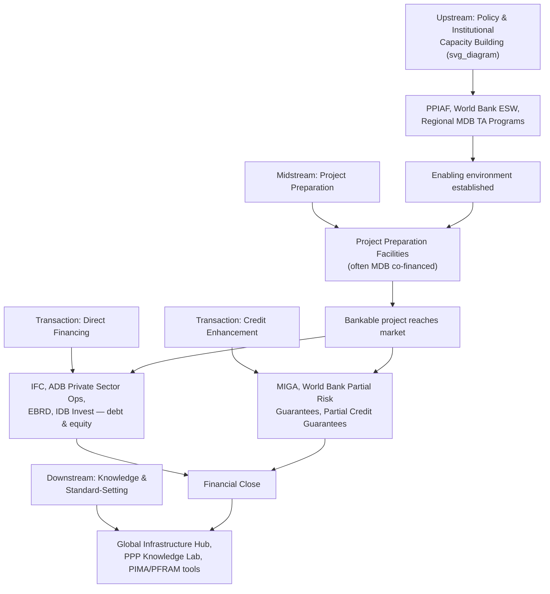

## Role of Multilateral Development Banks and PPIAF

### Overview

Multilateral Development Banks (MDBs) — the World Bank Group, regional development banks (Asian Development Bank, Inter-American Development Bank, African Development Bank, European Bank for Reconstruction and Development), and specialized multi-donor facilities such as PPIAF — play a structurally distinct and largely complementary role to domestic government institutions in enabling PPP programs. Their functions span upstream policy/institutional capacity building, project preparation financing, direct project financing (debt and equity), credit enhancement and guarantee provision, and knowledge/standard-setting, addressing market failures and capacity gaps that purely domestic institutions and private capital markets often cannot resolve alone.

### Categories of MDB Involvement in PPPs

**Key Points**

MDB engagement in PPPs generally falls into four broad, non-mutually-exclusive categories:

1. **Upstream policy and institutional capacity building**: Technical assistance to help governments establish PPP legal frameworks, PPP Units, and procurement guidelines (the domain most closely associated with PPIAF).
2. **Project preparation support**: Financing (typically grant-based) for feasibility studies, transaction advisory services, and other upfront costs required to bring a bankable project to market.
3. **Direct project financing**: MDB participation as a lender (senior or subordinated debt) or, in the case of institutions with private-sector arms (IFC, ADB Private Sector Operations, EBRD), as an equity investor directly in the project company (SPV).
4. **Credit enhancement and risk mitigation**: Partial risk guarantees, partial credit guarantees, and political risk insurance products designed to improve a project's bankability by absorbing specific risks that commercial lenders are unwilling or unable to price efficiently.

### PPIAF: Institutional Structure and Mandate

**Key Points**

- The **Public-Private Infrastructure Advisory Facility (PPIAF)** is a multi-donor technical assistance facility, established in 1999 as a joint initiative of the governments of Japan and the United Kingdom, and housed within and administered by the World Bank Group, though it operates as a distinct facility financed by multiple multilateral and bilateral donors rather than being a World Bank-funded program per se.
- PPIAF's core mission is to help developing-country governments strengthen the policies, regulations, and institutions that enable sustainable infrastructure with private-sector participation, positioning it specifically at the upstream, enabling-environment end of the PPP value chain rather than as a project financier. [PPIAF](https://www.ppiaf.org/)
- PPIAF acts as a catalyst for increasing private-sector participation in emerging markets, with a mission centered on facilitating private-sector involvement in infrastructure to help reduce poverty and increase shared prosperity in developing countries. [Devex](https://www.devex.com/organizations/public-private-infrastructure-advisory-facility-ppiaf-123452)
- PPIAF is financed by a group of multilateral and bilateral donors, and works to help its clients build and strengthen institutions, develop capacity, and increase creditworthiness, addressing blockages that impede effective private participation in infrastructure. [Gogla](https://bridge.gogla.org/node/4692)
- PPIAF's clients include national governments and regional institutions, as well as sub-national entities such as special-purpose government infrastructure entities (utilities, authorities, state-owned enterprises), general-purpose sub-national governments (municipalities, provinces, states), and financial intermediaries with a primary focus on sub-national infrastructure lending. [NDC Partnership](https://ndcpartnership.org/knowledge-portal/project-preparation-support-database/public-private-infrastructure-advisory-facility-ppiaf)

### PPIAF's Core Service Lines

**Key Points**

- PPIAF eligible sectors span water and sanitation, solid waste management, irrigation, transport, energy, and telecommunications, with priority given to activities supporting strategies designed to expand infrastructure access for the poor at affordable prices. [Gogla](https://bridge.gogla.org/node/4692)
- Technical assistance is delivered through Program Grants — a comprehensive series of activities grouped under a strategic umbrella and developed in close coordination with development partners to achieve greater impact — alongside other grant instruments. [Gogla](https://bridge.gogla.org/node/4692)
- PPIAF's technical assistance is delivered using a demand-led approach, and PPIAF works in collaboration with World Bank Country Units to deliver its assistance to national governments, PPP units, regulators, and sub-national entities. [Gogla](https://bridge.gogla.org/node/4692)
- PPIAF promotes knowledge transfer by capturing lessons learned and funding research and tools made available on its knowledge platform, the Global Infrastructure Hub, and it also assists sub-national entities in accessing financing without requiring sovereign guarantees. [PPIAF](https://www.ppiaf.org/about-us)
- The Global Infrastructure Hub itself was established in 2014 by the G20 and draws on an extensive network of private-sector partners, working alongside PPIAF's donors and clients to generate actionable infrastructure-delivery insights. [RocketReach](https://rocketreach.co/public-private-infrastructure-advisory-facility-ppiaf-profile_b5dd887df42e551d)

### PPIAF Track Record and Scale

**Key Points**

- Over its history, PPIAF has implemented more than 1,700 activities across 130 countries, deploying approximately $400 million in grant resources to catalyze roughly $29 billion in infrastructure investments. [worldbank](https://www.worldbank.org/en/topic/infrastructure/publication/ppiaf-celebrating-25-years-of-transformative-impact)
- Country-level examples of PPIAF impact include supporting the development of Kenya's PPP framework (which led to a project facilitation fund supporting a $10.9 billion project pipeline), strengthening climate-resilient and inclusive project screening capacity at Indonesia's Infrastructure Finance institution, and supporting Ghana's Infrastructure Investment Fund. [worldbank](https://www.worldbank.org/en/topic/infrastructure/publication/ppiaf-celebrating-25-years-of-transformative-impact)
- PPIAF has also helped sub-national entities secure close to $1.5 billion in infrastructure financing without relying on sovereign guarantees, directly illustrating its role in building creditworthiness at the municipal/utility level rather than solely at the national government level. [worldbank](https://www.worldbank.org/en/topic/infrastructure/publication/ppiaf-celebrating-25-years-of-transformative-impact)
- As of publicly available reporting, PPIAF continues to publish annual reports and updated guidance materials (including an updated PPP Certification Program Guide and a G20 note on improving accessibility of key market data), indicating an active, ongoing program rather than a legacy or wound-down facility. [Unverified] Current-year budget figures, donor composition, and specific active initiatives should be verified against PPIAF's own published annual reports for the most precise up-to-date figures, since facility scale and donor participation can shift year to year. [PPIAF](https://www.ppiaf.org/)

### Diagram: MDB Roles Across the PPP Value Chain (svg_diagram)

### World Bank Group Beyond PPIAF

**Key Points**

- **IBRD/IDA (sovereign lending arms)**: Provide policy-based lending and investment project financing that can directly support sector reforms enabling PPPs (e.g., loans supporting utility sector restructuring as a precondition for PPP tariff structures) and can co-finance public-sector components of hybrid PPP/public-investment projects.
- **International Finance Corporation (IFC)**: The World Bank Group's private-sector arm, providing direct debt and equity investment into PPP project companies, alongside advisory services on transaction structuring — distinct from PPIAF's grant-based, policy/institutional focus.
- **Multilateral Investment Guarantee Agency (MIGA)**: Provides political risk insurance and credit enhancement specifically to private investors and lenders in PPP and other cross-border investment projects, covering perils such as expropriation, currency inconvertibility, breach of contract, and war/civil disturbance.
- **World Bank's PPP Knowledge Lab and PPP Legal Resource Center**: Maintain standardized guidance materials, model contract clauses, and legal/regulatory framework toolkits used globally by governments structuring PPP programs.

### Regional Development Banks

**Key Points**

- **Asian Development Bank (ADB)**: Maintains dedicated PPP advisory and transaction support functions alongside private-sector direct financing operations, with a specific regional focus on Asia-Pacific infrastructure; historically a co-funder and administrator of PPIAF-aligned technical assistance in the region.
- **Inter-American Development Bank (IDB) / IDB Invest**: Provides similar sovereign policy-lending and private-sector direct-financing functions for Latin American and Caribbean PPP markets, alongside its own institutional capacity-building diagnostic tools.
- **African Development Bank (AfDB)**: Engages in project preparation support (including through the Africa50 infrastructure investment platform, in which AfDB is a founding shareholder) and technical assistance targeted at African PPP institutional development.
- **European Bank for Reconstruction and Development (EBRD)**: Provides both sovereign-adjacent policy engagement and direct private-sector project financing across its countries of operation, with a strong institutional emphasis on regulatory/legal framework development as a precondition for its PPP-related investments.

### Rationale for MDB Involvement: Addressing Market and Institutional Failures

**Key Points**

- **Addressing information asymmetry and capacity gaps**: MDB technical assistance directly targets the capacity constraints described under institutional maturity — governments in earlier stages of PPP program development often cannot finance or access world-class transaction advisory expertise without external grant support.
- **Signaling and credibility effects**: MDB involvement (whether through PPIAF-funded institutional strengthening, direct co-financing, or MIGA guarantees) can signal to private investors and commercial lenders that a project or program has been subject to a degree of independent scrutiny, potentially reducing the risk premium demanded by private capital.
- **Filling private-market gaps in risk appetite**: Commercial lenders and investors are frequently unwilling or unable to price certain risks (long-tenor political risk, first-of-a-kind sector reform risk, currency risk in frontier markets) at levels that would make a project financeable; MDB guarantee and insurance products are specifically designed to absorb or share these risks, "crowding in" private capital that would not otherwise participate.
- [Inference] The broader development-finance rationale for concentrating this function in MDBs rather than expecting individual governments to independently build equivalent capacity is that MDBs can achieve economies of scale and cross-country knowledge transfer (lessons from one country's PPP program informing technical assistance design in another) that would be difficult for any single government to replicate unilaterally — though the actual efficiency and impact of this model relative to alternative capacity-building architectures is a matter of ongoing development-policy discussion rather than a settled empirical conclusion.

### Interaction with Domestic PPP Units and Fiscal Gatekeeping

**Key Points**

- MDB-funded technical assistance (whether via PPIAF or a regional bank's own facility) typically operates *in support of*, rather than as a substitute for, the domestic institutional architecture described elsewhere in this chapter (PPP Units, Ministry of Finance gatekeeping, line ministry contract administration) — the explicit objective is to build durable domestic capacity, not to permanently outsource the government's own PPP institutional functions.
- Analytical tools jointly developed by the IMF and World Bank, such as **PFRAM** (referenced under fiscal gatekeeping), are frequently disseminated and embedded into government practice through MDB-supported technical assistance programs, illustrating the direct linkage between MDB knowledge products and domestic fiscal risk management capacity.
- [Speculation] A recurring tension noted in development-practitioner discourse is the risk that heavy, sustained reliance on MDB-funded transaction advisory support for successive projects can inadvertently delay the development of independent domestic capacity (the "capacity substitution" risk referenced under capacity building), making the explicit design of knowledge-transfer and sunset provisions within MDB technical assistance programs an important, if imperfectly and inconsistently implemented, design consideration.

### Related Topics

- Role and Design of Dedicated PPP Units (primary domestic counterpart to MDB technical assistance)
- Capacity Building and Institutional Maturity Models (the developmental trajectory MDB support aims to accelerate)
- Political Risk Insurance and MIGA Guarantee Products
- Project Preparation Facilities and Upfront Transaction Cost Financing
- IMF/World Bank PPP Fiscal Risk Assessment Model (PFRAM)
- Africa50 and Regional Infrastructure Investment Platforms
- International Arbitration and Investment Treaty Protection (complementary risk-mitigation layer)
- Sub-National Creditworthiness and Financing Without Sovereign Guarantees