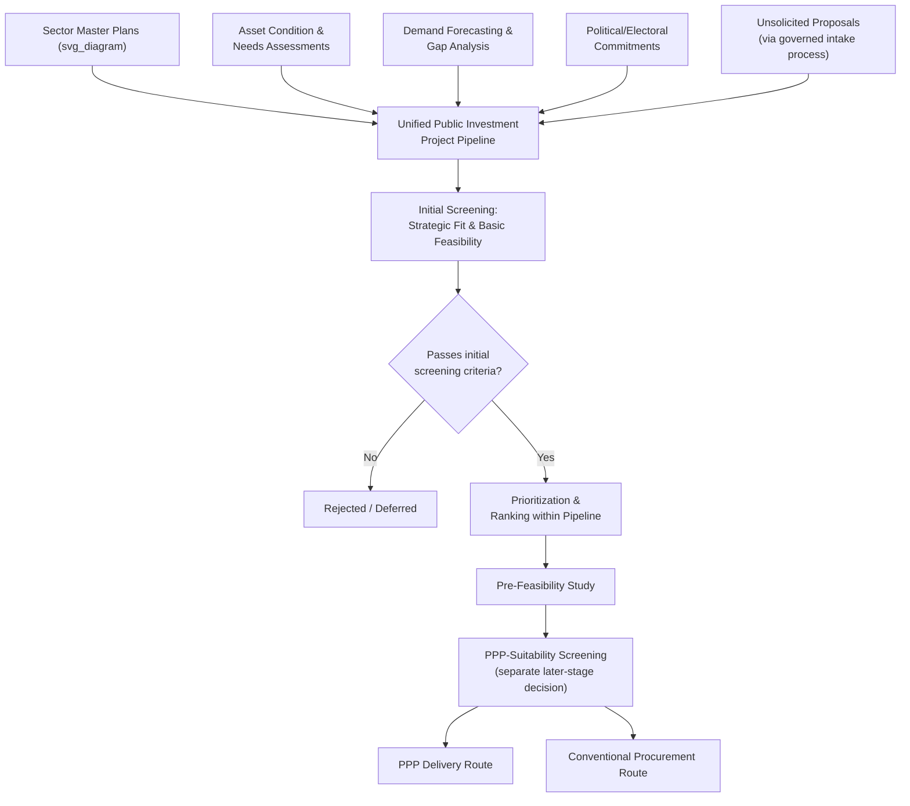

## Identifying Priority Public Investment Projects

### Overview

Identifying priority public investment projects is the initial stage of the PPP project cycle, in which candidate infrastructure needs are systematically identified, screened, and ranked to build a credible pipeline of investment opportunities before any determination is made about the appropriate delivery mechanism (PPP versus conventional public procurement). This stage sits upstream of PPP-specific analysis entirely — it is fundamentally a **public investment management (PIM)** function, since the underlying question ("what infrastructure does the country need, and in what order?") is prior to and independent of the later question of "how should this specific project be financed and delivered?"

### The Relationship Between Public Investment Management and PPP Project Identification

**Key Points**

- A well-functioning PIM system provides the foundational pipeline from which PPP candidates are subsequently drawn; PPPs should not, in principle, be identified through a parallel or separate process from conventional public investment planning, since doing so risks selecting projects based on their financing structure's political attractiveness rather than genuine sectoral need or economic merit.
- [Inference] A recurring institutional weakness identified in public investment management diagnostics (such as the IMF's Public Investment Management Assessment, PIMA) is the existence of a **"two-track" system**, where PPP projects are identified and appraised through a separate process from conventional public investment projects — increasing the risk that projects are selected as PPPs primarily to access off-balance-sheet financing treatment rather than because a PPP delivery mechanism offers genuine value-for-money advantages for that specific project.
- Good practice, as reflected in PIM guidance from the IMF and World Bank, is for project identification to occur through a **unified pipeline process** covering all public investment regardless of intended financing modality, with the PPP-versus-conventional-procurement decision made as a distinct, later-stage screening step (see Value-for-Money analysis) rather than as a determinant of which projects enter the pipeline in the first place.

### Sources of Project Identification

**Key Points**

1. **Sector strategic and master plans**: Long-term sector development plans (national transport master plans, power sector development plans, water and sanitation strategies) prepared by line ministries, which identify infrastructure gaps against projected demand growth and policy objectives.
2. **National development plans and medium-term expenditure frameworks**: Cross-sectoral national planning documents that establish overall investment priorities and resource envelopes, within which individual sector proposals must be justified.
3. **Asset condition and needs assessments**: Systematic surveys of existing infrastructure condition (road network condition surveys, hospital facility audits, water system leakage/capacity assessments) that identify rehabilitation, expansion, or replacement needs.
4. **Demand forecasting and gap analysis**: Projections of future service demand (population growth, urbanization, economic growth trajectories, sector-specific demand drivers) compared against current and planned infrastructure capacity to identify future capacity gaps.
5. **Unsolicited proposals**: Privately-initiated project proposals submitted directly by potential investors or developers, which require a distinct, carefully governed intake and evaluation process (typically involving competitive matching mechanisms such as a "Swiss challenge") to preserve procurement integrity and competitive neutrality.
6. **Political/electoral commitments**: Infrastructure commitments made through political processes (manifesto commitments, budget speeches), which, while a legitimate input reflecting democratic accountability, require the same rigorous technical screening as any other candidate project to avoid politically-driven but economically unjustified project selection.
7. **Donor and development partner priorities**: In many developing-country contexts, development partners (bilateral donors, MDBs) may propose or co-identify projects aligned with their own sectoral priorities, requiring integration into the national pipeline rather than parallel, uncoordinated project development.

### Diagram: Project Identification and Pipeline Development Flow (svg_diagram)

### Initial Screening Criteria

**Key Points**

Before detailed feasibility work is commissioned (a costly and time-consuming step), candidate projects are typically subjected to a lighter-weight initial screening against criteria such as:

- **Strategic alignment**: Consistency with national development plans, sector master plans, and stated policy objectives.
- **Basic technical feasibility**: A preliminary assessment of whether the project is technically achievable given known site conditions, technology availability, and engineering constraints.
- **Order-of-magnitude cost and affordability**: A rough cost estimate sufficient to assess whether the project is plausibly within the range of available or mobilizable financing, without yet requiring a full financial model.
- **Preliminary demand justification**: Basic evidence that a genuine service gap or demand exists (e.g., existing congestion data, unmet service coverage statistics), sufficient to justify proceeding to more detailed study.
- **Environmental and social red-flag screening**: An early check for potentially disqualifying environmental or social risks (protected areas, significant involuntary resettlement implications, indigenous land rights) that could render a project infeasible or highly contentious regardless of its economic merit.
- **Absence of superior alternatives**: A preliminary consideration of whether a non-infrastructure or lower-cost alternative (demand management, regulatory reform, rehabilitation versus new-build) might address the identified need more efficiently.

### Prioritization and Ranking Methodologies

**Key Points**

- **Multi-criteria decision analysis (MCDA)**: A structured framework assigning weighted scores across multiple criteria (economic impact, social impact, strategic alignment, implementation readiness, risk profile) to rank competing candidate projects on a common, comparable basis — particularly useful given that different infrastructure sectors are not always directly comparable using a single financial metric alone.
- **Preliminary economic rate of return screening**: Where sufficient data exists, an early-stage estimate of a project's economic internal rate of return (EIRR) or benefit-cost ratio can be used as a quantitative prioritization filter, deferring full cost-benefit analysis rigor to the feasibility study stage.

$$\text{NPV}_{\text{economic}} = \sum_{t=0}^{T} \frac{B_t - C_t}{(1+r)^t}$$

where $B_t$ and $C_t$ are the economic (as opposed to purely financial) benefits and costs in period $t$, and $r$ is the social discount rate.

- **Readiness filters**: Screening for practical implementation readiness factors (land availability status, absence of major unresolved legal/regulatory obstacles, availability of the necessary technical data to proceed to feasibility study) — a project may be highly desirable on strategic and economic grounds yet remain low-priority for near-term action if fundamental readiness prerequisites are unmet.
- **Sequencing and interdependency analysis**: Explicit consideration of whether a candidate project depends on, or is a prerequisite for, other pipeline projects (e.g., a port expansion project's economic case may depend on a connecting road or rail project also proceeding), requiring pipeline-level rather than purely project-level prioritization logic.

### Institutional Responsibility for Project Identification

**Key Points**

- Primary responsibility for identifying candidate projects typically rests with **line ministries and sector agencies**, given their possession of sector-specific technical data, demand information, and policy mandate — consistent with the line ministry's role as project sponsor described in the institutional architecture chapter.
- A **central planning authority** (a Ministry of Planning, National Development Planning Commission, or equivalent) frequently holds responsibility for consolidating individual sector proposals into a coherent, prioritized national public investment pipeline, resolving cross-sectoral competition for limited fiscal space.
- The **Ministry of Finance** typically has a parallel interest at this early stage — even before detailed fiscal risk assessment of a specific PPP structure becomes relevant — in ensuring the aggregate pipeline of candidate projects (across both conventional and prospective PPP delivery) remains consistent with the overall medium-term fiscal framework and does not implicitly commit the government beyond sustainable fiscal capacity.
- A **PPP Unit's role at this stage** (where one exists) is generally more limited than at later procurement/structuring stages — chiefly providing early guidance on which types of candidate projects might plausibly be suitable for PPP delivery (informing, but not determining, prioritization), rather than directly identifying projects itself, which properly remains a sector/planning function.

### Common Weaknesses in Project Identification Practice

**Key Points**

- **Weak linkage to sector master plans**: In less mature public investment management systems, individual projects are sometimes identified in an ad hoc manner disconnected from any systematic sector-wide needs assessment, increasing the risk of selecting projects based on political visibility rather than genuine priority ranking.
- **Insufficient early-stage economic/technical screening**: Committing significant feasibility-study resources to projects that a more rigorous initial screening would have identified as low-priority or infeasible, resulting in wasted preparation costs and pipeline congestion with weak candidate projects.
- **Premature PPP-mode determination**: Deciding a project will be delivered as a PPP at the identification stage, before the value-for-money and PPP-suitability analysis that should properly determine delivery mode has been conducted — a sequencing error that can bias subsequent feasibility work toward justifying a predetermined financing structure rather than objectively assessing it.
- **Fragmented unsolicited proposal handling**: Absent a clearly governed intake process, unsolicited proposals can enter the pipeline through informal channels that bypass the standard prioritization and screening process applied to publicly-originated projects, creating both integrity risks and pipeline-quality inconsistencies.
- [Speculation] Some public investment management literature suggests that political-economy incentives (the electoral visibility of announcing new infrastructure projects relative to the comparatively low visibility of rigorous ex ante screening) create a structural bias toward under-investing in the project identification and screening stage relative to its importance for overall public investment efficiency — though isolating this specific causal mechanism from other contributing institutional weaknesses is difficult to establish with precision across diverse country contexts.

### Related Topics

- Public Investment Management (PIM) Systems and the IMF PIMA Framework
- Pre-Feasibility versus Full Feasibility Study Design
- PPP Suitability Screening and the Decision to Proceed with PPP versus Conventional Procurement
- Value-for-Money Analysis and the Public Sector Comparator
- Multi-Criteria Decision Analysis for Infrastructure Prioritization
- Unsolicited Proposals and Swiss Challenge Procurement Mechanisms
- Medium-Term Expenditure Frameworks and Fiscal Space Constraints
- Role and Design of Dedicated PPP Units (later-stage involvement in the project cycle)