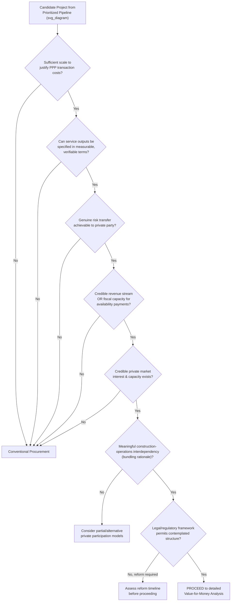

## Screening Criteria for PPP Suitability

### Overview

PPP suitability screening is the structured decision point at which a candidate public investment project — already identified and prioritized within the broader pipeline — is evaluated to determine whether Public-Private Partnership delivery is likely to offer genuine advantages over conventional public procurement, before significant resources are committed to full PPP transaction structuring. This screening step is analytically distinct from, and logically prior to, the full quantitative Value-for-Money (VfM) analysis conducted later in the project cycle: it functions as an efficient early filter, sparing both government and prospective private bidders the cost of pursuing PPP structuring on projects fundamentally unsuited to this delivery mode.

### Purpose and Positioning in the Project Cycle

**Key Points**

- Full VfM analysis (including detailed Public Sector Comparator construction) is resource-intensive and time-consuming; suitability screening exists to avoid expending this effort on projects where basic characteristics make PPP delivery clearly inappropriate or unlikely to be viable, regardless of the eventual detailed VfM outcome.
- Suitability screening should occur **after** a project has been identified and prioritized as a genuine public investment need (see project identification), but **before** significant investment in PPP-specific feasibility work, procurement design, or transaction advisory engagement.
- A negative suitability screening outcome does not necessarily mean the project itself is unjustified — only that conventional public procurement, rather than PPP structuring, is the more appropriate delivery mechanism for that specific project.

### Core Suitability Screening Criteria

**Key Points**

**1. Project Scale and Materiality**

- PPP structuring carries substantial fixed transaction costs (legal, financial, and technical advisory fees, procurement management time) that must be justified by project scale; very small projects are frequently found to be poor PPP candidates because these fixed costs consume a disproportionate share of total project value.
- Many jurisdictions apply an explicit minimum project size threshold (varying significantly by country and typically set in policy guidance rather than universal international standard) below which PPP delivery is presumptively discouraged absent a specific justification.

**2. Output/Service Definability**

- The required service or asset performance must be capable of being specified in **measurable, verifiable, output-based terms** (see output-based specifications), since the entire private-sector performance incentive structure in a PPP depends on the ability to objectively monitor and penalize non-performance against defined standards.
- Projects involving highly discretionary, difficult-to-specify, or rapidly evolving service requirements are generally poor PPP candidates, since incomplete or ambiguous output specifications increase renegotiation risk and can create the non-contractible quality-shading problems associated with the property rights approach to incomplete contracts.

**3. Risk Transfer Potential**

- A meaningful screening question is whether genuine, efficient risk transfer to the private sector is actually achievable for this project type — not merely nominally allocated in a contract, but genuinely transferable to a party capable of managing it.
- Projects where the dominant risks (e.g., demand risk driven primarily by macroeconomic conditions or competing public policy the government itself controls) cannot realistically be managed by a private party are weaker candidates for full risk-transfer PPP structures, though they may still be suitable for availability-based or hybrid structures with different risk allocation.

**4. Revenue Generation Potential or Fiscal Space for Payments**

- For demand-based/user-pay structures: is there a credible, measurable revenue stream (tolls, tariffs, user fees) sufficient to attract private investment, and is the political/social acceptability of user charging established for this service type?
- For availability-based structures: does the government have credible fiscal capacity and budgetary commitment mechanisms to sustain long-term payment obligations, consistent with the medium-term fiscal framework and any aggregate PPP exposure ceilings?

**5. Private Sector Market Interest and Capacity**

- Is there a credible pool of private sector sponsors, contractors, and lenders with relevant sector experience and appetite to bid competitively for this type of project in this jurisdiction? A project may be theoretically well-suited to PPP structuring in principle yet practically unviable if the domestic or international market lacks interest, experience, or risk appetite for the specific sector, country, or project type.

**6. Complexity and Bundling Rationale**

- Following the property rights/incomplete contracts logic, PPP delivery offers the greatest theoretical advantage where **construction and operations phases are meaningfully interdependent** (lifecycle cost trade-offs exist between design/build quality and long-term operating/maintenance costs) — projects lacking this interdependency may capture little genuine benefit from bundling relative to simpler, separately-procured construction and operations contracts.

**7. Legal and Regulatory Enablement**

- Does the existing legal and regulatory framework permit the specific PPP structure contemplated (private ownership/operation of the relevant asset class, tariff-setting authority delegation, land tenure arrangements), or would fundamental legal reform be required as a precondition — a consideration that can significantly affect project timeline and feasibility.

### Diagram: PPP Suitability Screening Decision Flow (svg_diagram)

### Sector-Level Suitability Patterns

**Key Points**

| Sector Characteristic | PPP Suitability Implication |
| --- | --- |
| Well-defined, measurable physical infrastructure with clear performance standards (roads, bridges, water treatment) | Generally high suitability |
| Services with significant discretionary/professional judgment content (core clinical care, curriculum-setting in education) | Generally low suitability for full service delivery PPP; may still suit ancillary/facilities-management bundling (e.g., hospital "hard FM" PPPs excluding clinical services) |
| Rapidly evolving technology requirements (some ICT/digital infrastructure) | Mixed — long contract terms can create technological lock-in risk; shorter-term or more flexible structures may be preferable |
| Natural monopoly utility services with established tariff regulation | Generally suitable, particularly where an independent sector regulator already exists to provide credible tariff commitment |
| Small-scale, geographically dispersed assets (rural feeder roads, small clinics) | Generally low suitability individually; may achieve suitability only through aggregation/bundling into portfolio-scale PPPs |
| National security-sensitive or strategic assets | Often excluded from PPP consideration on policy grounds regardless of technical suitability |

### Quantitative versus Qualitative Screening Approaches

**Key Points**

- Many jurisdictions apply a **structured checklist or scorecard approach**, assigning qualitative ratings (or simple point scores) across the criteria above to produce a preliminary suitability determination without requiring full financial modeling — designed explicitly to be conducted quickly and at low cost relative to full feasibility work.
- Some more mature PPP frameworks incorporate a **preliminary quantitative screen**, such as a rough indicative comparison of estimated PPP-adjusted lifecycle costs against a high-level conventional procurement cost estimate, though this remains distinct from (and less rigorous than) the full PSC-based VfM analysis conducted at the next project-cycle stage.
- [Inference] Practitioner guidance generally recommends that suitability screening criteria be documented in **publicly available PPP policy guidelines** (rather than applied on an ad hoc, case-by-case basis) both to promote consistency across projects and sectors and to provide private-sector market participants with predictability regarding which types of projects the government is likely to bring to market as PPPs — though the extent to which any given jurisdiction's guidelines are actually followed consistently in practice is a separate implementation question from the existence of the guidelines themselves.

### Common Screening Pitfalls

**Key Points**

- **Conflating suitability with desirability**: A project can be highly desirable from a public policy standpoint while being poorly suited to PPP delivery specifically — suitability screening should not be used as a proxy for overall project justification, which is properly addressed at the identification/prioritization stage.
- **Fiscal-motivation bias**: Applying suitability screening loosely or inconsistently when a project's PPP structuring is primarily motivated by a desire to access off-balance-sheet fiscal treatment rather than genuine value-for-money potential — a risk the screening process itself should be explicitly designed to guard against, in conjunction with Ministry of Finance fiscal gatekeeping.
- **Insufficient market sounding**: Proceeding on the assumption of private market interest without conducting genuine market sounding/consultation, only to discover during procurement that insufficient qualified bidders exist — a risk that formal **market sounding exercises** (structured pre-procurement consultations with potential sponsors, lenders, and contractors) are specifically designed to mitigate.
- **Static screening in dynamic markets**: Applying suitability criteria calibrated to market conditions or investor risk appetite that may have shifted materially by the time procurement actually launches, particularly relevant for projects with long gaps between initial screening and eventual market launch.

### Related Topics

- Identifying Priority Public Investment Projects (upstream pipeline stage)
- Value-for-Money Analysis and the Public Sector Comparator (subsequent detailed analytical stage)
- Output-Based Specifications versus Input-Based Specifications in PPP Contracts
- Market Sounding and Pre-Procurement Private Sector Consultation
- Availability-Based versus Demand-Based Contract Structures (informed by risk-transfer screening)
- Incomplete Contract Theory and the Property Rights Approach (theoretical basis for bundling suitability)
- Ministry of Finance Oversight and Fiscal Gatekeeping (guarding against fiscally-motivated PPP selection)
- Sector-Specific PPP Policy Guidelines and Suitability Checklists