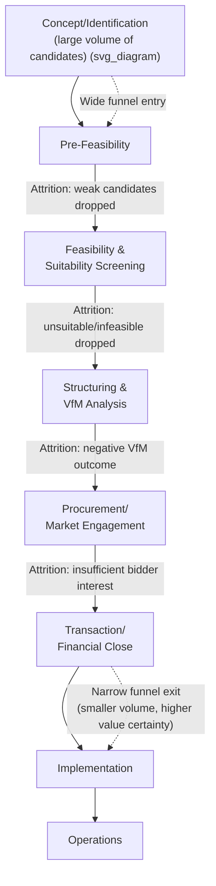

## Building and Managing an Infrastructure Project Pipeline

### Overview

Building and managing an infrastructure project pipeline refers to the systematic institutional processes for maintaining a structured, continuously-updated portfolio of candidate infrastructure projects at varying stages of development — from initial concept through feasibility, procurement, and financial close. A well-managed pipeline provides visibility to government decision-makers, financing institutions, and private-sector market participants, enables more efficient resource allocation across competing project preparation demands, and is a key determinant of whether a government's PPP program can achieve consistent deal flow rather than sporadic, unpredictable transaction activity.

### Purpose and Strategic Value of Pipeline Management

**Key Points**

- **Market signaling to private investors and lenders**: A transparent, credible pipeline allows private-sector sponsors, contractors, and financiers to plan their own resource allocation and bidding strategies, and is frequently cited by investors as a key factor in assessing the seriousness and continuity of a country's PPP program — one-off or unpredictable project announcements generally attract less competitive interest and higher risk premiums than a demonstrated, sustained pipeline.
- **Resource allocation efficiency**: Explicit pipeline management allows scarce project-preparation resources (PPP Unit staff time, project preparation facility funding, transaction advisory budgets) to be allocated according to a considered prioritization rather than ad hoc, reactive responses to whichever project generates the most immediate political pressure.
- **Portfolio-level fiscal risk visibility**: Aggregating pipeline data allows the Ministry of Finance to assess the cumulative future fiscal exposure (contingent liabilities, committed payment obligations) the pipeline represents, supporting the aggregate exposure limits and fiscal risk management functions described under Ministry of Finance oversight.
- **Continuity across political cycles**: A formally documented, institutionally-owned pipeline (as opposed to one existing primarily in the knowledge of specific individuals) provides institutional memory and continuity that helps preserve project development momentum through changes in government or senior officials.

### Pipeline Structure: Stages and Stage-Gates

**Key Points**

A managed infrastructure pipeline is typically organized around discrete stages, each separated by a formal stage-gate requiring specific deliverables or approvals before a project advances:

| Pipeline Stage | Typical Content | Advancement Criterion |
| --- | --- | --- |
| **Concept/Identification** | Basic project concept, sponsoring ministry, strategic rationale | Passes initial screening (see project identification) |
| **Pre-Feasibility** | High-level technical, cost, and demand assessment | Sufficiently promising to justify full feasibility study investment |
| **Feasibility & Suitability Screening** | Detailed technical, financial, environmental/social feasibility; PPP suitability determination | Positive feasibility outcome; PPP suitability confirmed (or conventional procurement route selected) |
| **Structuring & VfM Analysis** | Detailed risk allocation, PSC construction, financial model, procurement strategy | VfM analysis supports proceeding; MoF/PPP Unit gate approval obtained |
| **Procurement/Market Engagement** | RFQ/RFP issued, bidder engagement, evaluation | Preferred bidder selected |
| **Transaction/Financial Close** | Contract negotiation, financing arranged | Financial close achieved |
| **Implementation/Construction** | Active construction monitoring | Substantial completion / service commencement |
| **Operations** | Ongoing contract management and performance monitoring | Contract term completion or handback |

### Diagram: Pipeline Stage-Gate Structure with Attrition (svg_diagram)

### Pipeline Data Management and Tracking Systems

**Key Points**

- Effective pipeline management requires a **centralized tracking system** (ranging from a well-maintained spreadsheet in less mature programs to dedicated project-management software or a public investment management information system, PIMIS, in more advanced programs) capturing, at minimum: project identity, sponsoring agency, current stage, key dates/milestones, estimated project value, and responsible officials.
- Some jurisdictions maintain **public-facing pipeline disclosure** (a published, periodically updated list of projects under consideration or in active preparation, sometimes distinguishing between confirmed pipeline projects and earlier-stage concepts), serving the market-signaling function described above while balancing the need for discretion regarding commercially or politically sensitive early-stage information.
- **Portfolio dashboards** aggregating pipeline data by sector, stage, estimated value, and geographic distribution support both government decision-making (identifying sector concentration risk, resource bottlenecks at specific stages) and external stakeholder communication (development partners, credit rating agencies, prospective investors).

### Pipeline Prioritization and Resource Allocation Mechanics

**Key Points**

- Because project preparation resources (Project Preparation Facility funding, PPP Unit staff capacity, transaction advisory budgets) are typically constrained relative to the volume of candidate projects, pipeline management necessarily involves **active prioritization decisions** about which projects receive resourcing to advance through successive stages.
- Prioritization criteria at the pipeline-management level typically combine the project-level criteria discussed under project identification and suitability screening with **portfolio-level considerations**: sector diversification objectives, geographic equity considerations, avoiding excessive concentration of near-term financial close dates that could saturate market/lender capacity, and sequencing interdependent projects appropriately.
- Some pipeline management frameworks apply an explicit **"funnel" or "gate review" governance model**, where a designated body (an Inter-Ministerial Steering Committee, a PPP Unit's internal review board, or equivalent) formally reviews and approves pipeline advancement decisions at each stage-gate, rather than allowing advancement to occur through informal or purely bilateral line-ministry/advisor decisions.

### Common Pipeline Management Challenges

**Key Points**

- **"Pipeline inflation" / unrealistic project volume**: A common weakness is maintaining an excessively long list of nominally "pipeline" projects with little realistic prospect of near-term advancement, which can mislead external stakeholders about actual deal flow and dilute institutional attention across too many low-priority candidates rather than concentrating effort on genuinely advancing high-priority projects.
- **Stage-gate bottlenecks**: Insufficient capacity at specific stages (frequently the feasibility study and structuring stages, which require the most specialized technical skills) can create a persistent backlog, with projects accumulating at a bottleneck stage faster than they can be advanced — a symptom often traceable to the institutional capacity constraints discussed under capacity building.
- **Poor coordination between pipeline management and annual budget cycles**: Misalignment between the multi-year nature of infrastructure project preparation and the typically annual public budget cycle can create funding discontinuities for project preparation activities, particularly where project preparation costs are not ring-fenced through a dedicated facility.
- **Loss of pipeline momentum through political transitions**: Without strong institutionalization (dedicated legal/organizational structures, documented processes, public pipeline disclosure creating external accountability), pipeline continuity is vulnerable to disruption when political administrations change and priorities shift, particularly for projects still in early, less capital-committed stages.
- **Inadequate distinction between pipeline stages in public communications**: Presenting early-concept-stage projects with the same apparent confidence/certainty as projects that have completed feasibility studies or reached procurement can create credibility problems with the private market if a significant share of announced "pipeline" projects subsequently stall or are abandoned — a pattern that, if repeated, can degrade investor confidence in a program's stated pipeline more broadly.

### Pipeline Management and Development Partner Coordination

**Key Points**

- Where multiple development partners (bilateral donors, multiple MDBs) are engaged in project preparation support across different pipeline projects, effective pipeline management requires coordination mechanisms to avoid duplicated preparation efforts, conflicting technical assistance, or donor-driven distortion of pipeline prioritization toward projects aligned with a particular donor's own sectoral priorities rather than the government's own prioritization framework.
- Pipeline management systems in some jurisdictions explicitly track **development partner engagement status** alongside core project data, supporting more deliberate sequencing and allocation of external technical assistance resources (including PPIAF and MDB-funded project preparation support) across the pipeline.

### Related Topics

- Identifying Priority Public Investment Projects (pipeline entry point)
- Screening Criteria for PPP Suitability (a key stage-gate within pipeline management)
- Role and Design of Dedicated PPP Units (typical pipeline management institutional home)
- Project Preparation Facilities and Upfront Transaction Cost Financing
- Public Investment Management Information Systems (PIMIS)
- Ministry of Finance Oversight and Fiscal Gatekeeping (portfolio-level fiscal risk visibility)
- Role of Multilateral Development Banks and PPIAF (external pipeline support coordination)
- Capacity Building and Institutional Maturity Models (addressing stage-gate bottleneck causes)