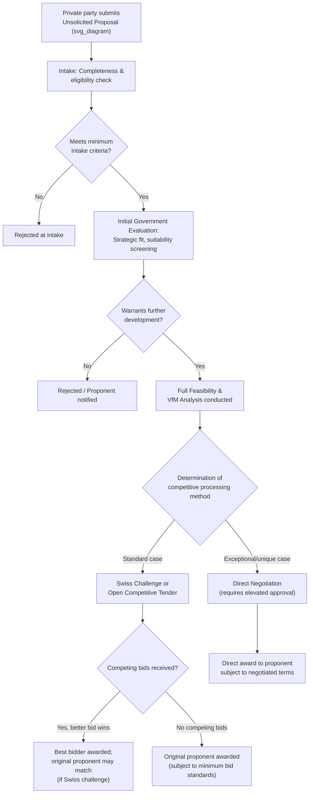

## Governance of Unsolicited Proposals

### Overview

Unsolicited proposals (USPs) are PPP project concepts privately initiated and submitted by a potential investor, developer, or consortium — rather than originating from a government-led project identification process — proposing to design, finance, build, and/or operate a specific piece of infrastructure. Governance of unsolicited proposals refers to the formal policy and procedural framework governments establish to receive, evaluate, and (where appropriate) competitively process such proposals in a manner that preserves procurement integrity, competitive neutrality, and value-for-money, while still capturing the genuine benefits that private-sector-originated project ideas can offer.

### Rationale for a Distinct USP Governance Framework

**Key Points**

- Unsolicited proposals can provide genuine value by leveraging private-sector origination capacity, technical innovation, and market knowledge that the public sector's own project identification processes (dependent on government planning capacity) may not independently generate — particularly valuable in jurisdictions with limited public-sector project development capacity.
- However, USPs create distinctive governance risks not present in conventionally government-originated projects:
  - **First-mover information advantage**: The proposing party possesses detailed knowledge of the project concept, technical approach, and often preliminary financial modeling before any competing bidder, creating a structural information asymmetry that can undermine genuine competition if not carefully managed.
  - **Competitive neutrality concerns**: Absent a properly designed process, USPs risk being awarded without meaningful competition, potentially violating public procurement principles of transparency, non-discrimination, and value-for-money.
  - **Adverse selection in proposal timing/content**: Private proponents have an incentive to propose projects and terms most favorable to themselves, and may selectively bring forward opportunities where they anticipate weaker public-sector scrutiny.
  - **Fiscal risk from inadequately screened proposals**: Absent the same rigor applied to government-originated projects (VfM analysis, suitability screening, fiscal gatekeeping), USPs could bypass standard fiscal risk controls if a distinct governance framework does not explicitly subject them to equivalent scrutiny.
- [Inference] The international PPP practitioner consensus, reflected in guidance from institutions such as the World Bank Group, generally holds that USPs are not inherently problematic and can be a valuable pipeline source, but require an explicit, transparent, and consistently applied governance framework rather than either a blanket prohibition or unstructured, case-by-case handling.

### Core Policy Design Choices

**Key Points**

Governments face several fundamental design choices in establishing a USP framework:

**1. Eligibility and Intake Criteria**

- Defining what types of projects, sectors, or minimum characteristics qualify for USP consideration (some jurisdictions exclude certain strategic sectors or impose minimum project size thresholds).
- Establishing formal intake requirements (a defined minimum level of technical/financial detail the proposal must contain to be considered complete) to filter out speculative or underdeveloped submissions before they consume government evaluation resources.

**2. Initial Evaluation and Government Response**

- A defined process and timeline for the government's initial review, determining whether the proposal aligns with sector priorities, meets basic feasibility/suitability screening criteria, and warrants further development.
- Clear provisions on **confidentiality and intellectual property** protection for the proposal during initial evaluation, balanced against the government's later need for transparency once a decision is made to proceed to competitive processing.

**3. Determination of Competitive Processing Method**

This is the most consequential design choice, as it directly determines the degree of competitive tension in project award:

| Method | Mechanism | Competitive Neutrality Implications |
| --- | --- | --- |
| **Open competitive tender** | Original proposal is used only to identify project potential; a full open competitive procurement is then run, with no advantage to the original proponent | Highest competitive neutrality; may weaken USP incentive if proponent receives no benefit for its origination effort/cost |
| **Swiss challenge** | Original proposal is publicly disclosed; competing parties are invited to submit better offers; the original proponent typically retains a right to match the best competing offer | Balances competitive tension with preserving some benefit to the original proponent; requires careful design to prevent proponents' privileged information from unfairly disadvantaging competitors, and to prevent competitors from free-riding on the proponent's development costs |
| **Bonus/Incentive mechanism** | A competitive tender is run, but the original proponent receives a defined scoring bonus or bid premium advantage in the evaluation | Preserves competition while compensating the proponent for origination effort; requires careful calibration so the bonus does not effectively neutralize genuine competition |
| **Direct negotiation (sole-source)** | Government negotiates and contracts directly with the proponent without competitive tender | Weakest competitive neutrality; generally reserved for narrowly defined exceptional circumstances (genuine technical uniqueness, demonstrated absence of alternative suppliers) and subject to the most stringent additional scrutiny/approval requirements |

**4. Cost Recovery/Development Cost Reimbursement**

- Provisions (or their explicit absence) for reimbursing the original proponent's project development costs if the project ultimately proceeds through a competitive process won by a different bidder — a mechanism intended to preserve USP submission incentives even under fully competitive processing methods.

### Diagram: Unsolicited Proposal Governance Flow (svg_diagram)

### Institutional Roles in USP Governance

**Key Points**

- The **PPP Unit** (where one exists) typically plays a central role in USP governance, often serving as the mandatory intake point and initial technical evaluator, given the specialized capacity required to assess proposal quality and determine appropriate competitive processing — a function distinct from, though related to, its role in government-originated project structuring.
- The **line ministry/sector agency** relevant to the proposed project's sector generally retains a determinative role in assessing strategic/sectoral fit, since a USP, however commercially attractive to the proponent, must still align with legitimate sector policy priorities to justify proceeding.
- The **Ministry of Finance** applies the same fiscal gatekeeping scrutiny to USPs that would apply to any government-originated PPP once a USP advances to the structuring/VfM stage, ensuring USPs cannot be used to circumvent standard fiscal risk controls.
- Some jurisdictions establish a specific **USP review committee or board**, distinct from standard project-cycle governance bodies, with explicit authority to approve or reject USP processing method determinations — reflecting the distinctive competitive-neutrality risks USPs present relative to conventionally originated projects.

### Transparency and Anti-Corruption Safeguards

**Key Points**

- Given the heightened corruption and favoritism risks inherent in privately-initiated project proposals (particularly where a proponent may have cultivated relationships with specific officials before formal submission), robust USP governance frameworks typically emphasize:
  - **Mandatory public disclosure** of received USPs (at least in summary form) once they pass initial intake screening, creating a transparency check against selective or hidden handling.
  - **Conflict-of-interest declarations** for all officials involved in USP evaluation.
  - **Standardized, documented evaluation criteria** applied consistently across all USPs, reducing discretion for ad hoc or inconsistent treatment.
  - **Audit trails and formal decision documentation** at each stage of USP processing, supporting ex post accountability review.
- [Speculation] Some governance literature suggests that jurisdictions with weaker overall public procurement integrity institutions face proportionally greater USP-specific corruption risk, implying that USP framework design should potentially be more conservative (favoring open competitive tender over Swiss challenge or direct negotiation) in weaker-governance contexts — though this represents a general risk-based design principle rather than a specific, empirically validated threshold or rule.

### Common Design and Implementation Pitfalls

**Key Points**

- **Absence of a formal framework**: Handling USPs on an entirely ad hoc, case-by-case basis without documented policy guidance, creating unpredictability for the market and significant governance/integrity risk.
- **Overly generous proponent advantages**: Bonus mechanisms or matching rights calibrated so generously that genuine competitive tension is effectively eliminated, undermining the value-for-money rationale for competitive processing in the first place.
- **Under-resourced evaluation capacity**: USP evaluation demands similar technical/financial/legal capacity to government-originated project structuring; jurisdictions that lack this capacity may either reject valuable proposals prematurely or, conversely, approve poorly-scrutinized proposals due to evaluation capacity constraints.
- **Inconsistent application across proposals**: Absent standardized criteria, similar proposals may be treated inconsistently depending on which officials handle them or which proponents have stronger informal access to decision-makers — a pattern that, even if not involving actual corruption, can create a reasonable public perception of favoritism that undermines confidence in the broader PPP program.
- **Excessive processing delay**: Overly long or unpredictable evaluation timelines can discourage legitimate USP submissions from credible proponents (who have alternative investment opportunities and limited patience for indefinite regulatory uncertainty) while potentially still attracting less credible or speculative proposals from proponents with fewer alternative options.

### Related Topics

- Identifying Priority Public Investment Projects (USPs as one pipeline source among several)
- Screening Criteria for PPP Suitability (applied equivalently to USPs)
- Building and Managing an Infrastructure Project Pipeline (USP intake integration)
- Role and Design of Dedicated PPP Units (typical USP evaluation function)
- Ministry of Finance Oversight and Fiscal Gatekeeping (fiscal scrutiny applied to USPs)
- Public Procurement Law Interfaces with PPP-Specific Procurement Procedures
- Anti-Corruption Safeguards and Conflict-of-Interest Management in PPP Procurement
- Swiss Challenge Mechanism Design and International Comparative Practice