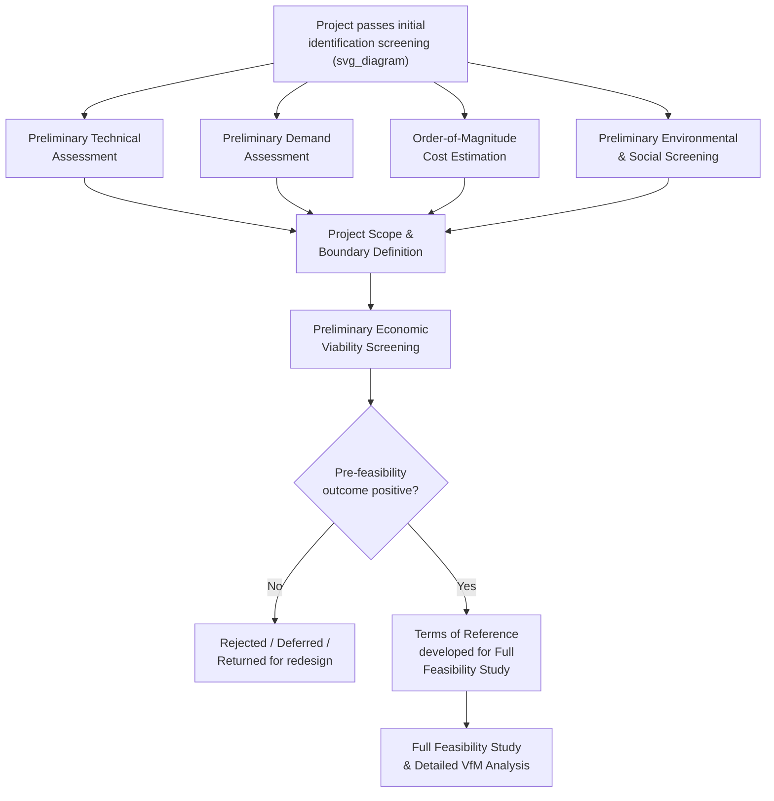

## Pre-Feasibility Assessment and Project Definition

### Overview

Pre-feasibility assessment and project definition is the analytical stage in which a candidate project — already identified and having passed initial screening — is developed to a sufficient level of technical, financial, and conceptual clarity to determine whether it merits investment in a full feasibility study. This stage occupies a deliberate middle ground between the light-touch initial screening of project identification and the comprehensive, resource-intensive analysis of full feasibility and Value-for-Money assessment: it is designed to resolve major uncertainties and clearly define project scope and parameters at relatively low cost, before committing substantial resources to detailed studies.

### Purpose and Positioning in the Project Cycle

**Key Points**

- Full feasibility studies (encompassing detailed engineering design, comprehensive financial modeling, full environmental and social impact assessment, and detailed demand studies) are expensive and time-consuming; pre-feasibility assessment exists to filter out projects with fundamental viability problems before this significant investment is made.
- Pre-feasibility assessment also serves a **project definition function** distinct from pure viability screening: even projects that will clearly proceed to full feasibility often require this intermediate stage to properly define scope, technical approach, and boundary conditions — without which a full feasibility study risks being commissioned against poorly specified terms of reference, generating inefficient or unfocused analysis.
- [Inference] Public investment management good practice, as reflected in guidance from institutions such as the World Bank and IMF, generally treats pre-feasibility as a distinct, identifiable stage with its own approval gate, rather than as an informal or undocumented precursor folded into either project identification or full feasibility — this separation is intended to create an explicit decision point and prevent projects from advancing to costly full feasibility work by default or momentum alone.

### Core Components of Pre-Feasibility Assessment

**Key Points**

**1. Preliminary Technical Assessment**

- A conceptual-level engineering assessment identifying the general technical approach, broad site/route options (where alternatives exist), major technical risks or constraints, and an order-of-magnitude assessment of technical complexity — sufficient to rule out fundamentally infeasible technical approaches without the detailed design work full feasibility requires.

**2. Preliminary Demand Assessment**

- An initial, relatively high-level estimate of likely demand/usage, typically based on existing data sources (population statistics, existing traffic/usage counts, comparable project benchmarks) rather than the primary demand surveys or detailed econometric modeling conducted at full feasibility stage.

**3. Order-of-Magnitude Cost Estimation**

- A preliminary capital and, where relevant, operating cost estimate, typically derived from unit-cost benchmarks (cost per kilometer, cost per bed, cost per megawatt) drawn from comparable completed projects, rather than detailed quantity-surveying or engineering cost estimation.

**4. Preliminary Economic and Financial Viability Screening**

- An indicative estimate of economic viability (a rough benefit-cost ratio or economic rate of return) sufficient to determine whether the project is plausibly justified on economic grounds, deferring rigorous cost-benefit analysis methodology to the full feasibility stage.

$$\text{Indicative EIRR: solve for } r \text{ such that } \sum_{t=0}^{T} \frac{B_t - C_t}{(1+r)^t} = 0$$

using preliminary, benchmark-derived estimates of $B_t$ and $C_t$ rather than detailed primary data.

**5. Project Scope and Boundary Definition**

- Clearly defining what is and is not included within the project (physical scope, geographic boundaries, service scope, interfaces with adjacent infrastructure or other pipeline projects) — a foundational step without which subsequent feasibility work risks scope ambiguity or scope creep.

**6. Preliminary Environmental and Social Screening**

- An initial, desk-based screening for potentially significant environmental or social impacts (proximity to protected areas, likely resettlement scale, sensitive ecosystems) sufficient to identify whether full Environmental and Social Impact Assessment (ESIA) will likely be required and to flag any potentially disqualifying issues early.

**7. Preliminary Institutional and Legal Assessment**

- Identifying the likely institutional arrangements (which agency will be the Contracting Authority), any land tenure or regulatory prerequisites, and whether the existing legal/regulatory framework accommodates the contemplated project approach.

**8. Initial PPP Suitability Indication**

- A preliminary view (not a final determination, which occurs at the dedicated suitability screening stage) on whether the project characteristics suggest PPP delivery may be appropriate, informing the terms of reference for subsequent feasibility work.

### Diagram: Pre-Feasibility Assessment Process Flow (svg_diagram)

### Terms of Reference Development for Full Feasibility

**Key Points**

- A key output of pre-feasibility assessment is a well-specified **Terms of Reference (ToR)** for the subsequent full feasibility study — defining the specific technical, financial, environmental, social, and legal analyses required, the project scope and boundaries established during pre-feasibility, and any particular areas of uncertainty or risk that the full feasibility study should specifically address in depth.
- Poorly defined pre-feasibility outputs frequently translate directly into poorly scoped feasibility study ToRs, a recurring practical link between pre-feasibility quality and downstream feasibility study efficiency and usefulness — [Inference] this connection is frequently emphasized in public investment management capacity-building guidance, on the basis that transaction advisors and consultants can only produce feasibility work as well-targeted as the ToR they are given, though the specific magnitude of quality improvement attributable to better pre-feasibility scoping has not been rigorously quantified across a broad comparative sample.

### Institutional Responsibility and Resourcing

**Key Points**

- Pre-feasibility assessment is typically conducted by, or under the direct supervision of, the **sponsoring line ministry**, often with technical support from a PPP Unit or central planning authority, reflecting its position early in the project cycle before the more specialized transaction-structuring capacities become centrally relevant.
- Because pre-feasibility work is deliberately lighter-weight than full feasibility, it is more commonly conducted using **in-house government technical capacity** (sector ministry engineers, planners, economists) rather than requiring extensive external consultant engagement — though this depends heavily on the specific institutional capacity available in a given jurisdiction and sector.
- Financing for pre-feasibility work, where it exceeds available in-house capacity, is sometimes drawn from a **Project Preparation Facility** or equivalent dedicated funding mechanism, though many jurisdictions treat pre-feasibility as a standard planning function financed through regular line ministry operating budgets rather than dedicated project-preparation financing (which is more commonly associated with the costlier full feasibility and transaction-structuring stages).

### Distinguishing Pre-Feasibility from Full Feasibility

**Key Points**

| Dimension | Pre-Feasibility | Full Feasibility |
| --- | --- | --- |
| **Technical detail** | Conceptual-level, benchmark-based | Detailed engineering design, site investigations |
| **Demand analysis** | Secondary data, comparable-project benchmarks | Primary surveys, detailed econometric/traffic modeling |
| **Cost estimation** | Order-of-magnitude, unit-cost benchmarks | Detailed quantity-based cost estimation |
| **Environmental/social** | Desk-based screening | Full ESIA/resettlement action plan where triggered |
| **Financial modeling** | Indicative viability screening only | Full financial model supporting PSC and VfM analysis |
| **Typical cost and duration** | Relatively low cost; weeks to a few months | Substantially higher cost; several months to over a year for complex projects |
| **Primary purpose** | Filter and define scope before major investment | Support definitive investment decision and procurement structuring |

### Common Weaknesses in Pre-Feasibility Practice

**Key Points**

- **Skipping the stage entirely**: Some jurisdictions, particularly under political pressure to demonstrate rapid project progress, proceed directly from initial identification to full (and costly) feasibility studies without a distinct pre-feasibility filter, increasing the risk of significant resources being spent on projects with fundamental viability problems that a lighter-weight pre-feasibility assessment would have identified earlier and more cheaply.
- **Insufficient scope definition rigor**: Treating pre-feasibility as a purely financial/economic viability screen while neglecting the project scope and boundary definition function, resulting in full feasibility studies commissioned against ambiguous or incomplete terms of reference.
- **Over-reliance on generic unit-cost benchmarks**: Using cost benchmarks from other countries or significantly different project contexts without adequate adjustment for local conditions, potentially producing pre-feasibility cost estimates significantly divergent from actual costs revealed at full feasibility stage — undermining the pre-feasibility stage's core screening function if the divergence is large enough to reverse the viability conclusion.
- **Blurring pre-feasibility and PPP suitability determination**: Treating the preliminary PPP suitability indication generated during pre-feasibility as a final determination, rather than recognizing that dedicated suitability screening (typically conducted with more complete information from the full feasibility stage) is the appropriate point for a definitive PPP-versus-conventional-procurement decision.

### Related Topics

- Identifying Priority Public Investment Projects (upstream stage supplying pre-feasibility candidates)
- Screening Criteria for PPP Suitability (informed by, but distinct from, pre-feasibility indications)
- Building and Managing an Infrastructure Project Pipeline (pre-feasibility as a tracked pipeline stage)
- Value-for-Money Analysis and the Public Sector Comparator (the subsequent full feasibility analytical output)
- Terms of Reference Development for Technical and Transaction Advisory Services
- Environmental and Social Impact Assessment Screening Processes
- Project Preparation Facilities and Upfront Transaction Cost Financing
- Unit-Cost Benchmarking Methodologies in Infrastructure Cost Estimation