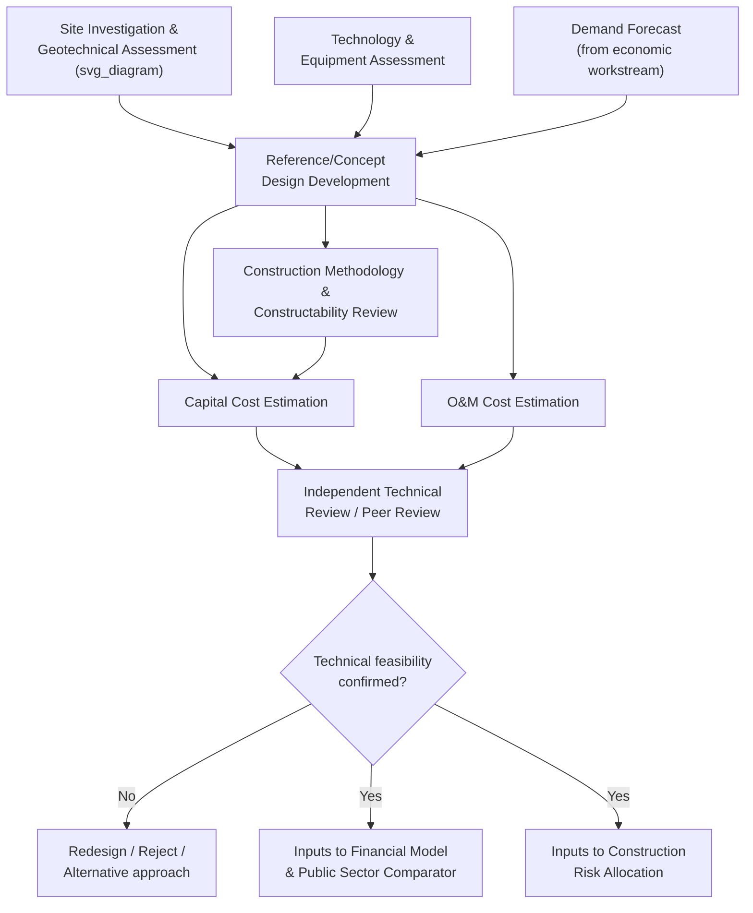

## Technical Feasibility and Engineering Due Diligence

### Overview

Technical feasibility and engineering due diligence is the detailed engineering-level analysis conducted during the full feasibility study stage to establish whether a proposed PPP project can be physically constructed and operated as conceived, at what cost, and with what risks — providing the technical foundation upon which financial modeling, risk allocation, and procurement design are subsequently built. Unlike the conceptual, benchmark-based technical assessment conducted at pre-feasibility, this stage involves detailed site investigation, engineering design development, and independent technical verification sufficient to support a definitive investment decision and, later, to inform private bidders' own technical proposals during procurement.

### Purpose and Positioning in the Project Cycle

**Key Points**

- Technical feasibility findings directly determine the reliability of the capital and operating cost estimates that feed into both the government's Public Sector Comparator and the private sector's own bid pricing — a technically under-scoped feasibility study is a common root cause of cost overruns and disputes discovered only after financial close, since technical uncertainties not resolved during feasibility tend to resurface as contested change orders or claims during construction.
- Engineering due diligence at the feasibility stage differs from routine engineering design in that it must explicitly identify and quantify **technical risk** for the purpose of informed risk allocation — the feasibility study should not merely produce a technical design but should also characterize which technical uncertainties are best allocated to the private party (who will have direct construction/operational control) versus which should remain with the public sector (e.g., pre-existing site conditions the government had superior means of investigating before contract signing).
- Technical feasibility informs several other feasibility study workstreams: cost estimates feed the financial model, construction risk characterization feeds risk allocation and the PSC's risk-adjustment methodology, and design assumptions feed environmental and social impact assessments.

### Core Components of Technical Feasibility Assessment

**Key Points**

**1. Site Investigation and Geotechnical Assessment**

- Detailed geotechnical surveys (soil bearing capacity, groundwater conditions, seismic risk, geological hazards) sufficient to inform foundation design and identify site-specific construction risks and cost drivers.
- Topographic and hydrological surveys where relevant (flood risk assessment, drainage design requirements, coastal/riverine conditions for applicable infrastructure types).
- Identification of existing utilities, underground infrastructure, or other physical constraints that could affect construction sequencing or cost.

**2. Engineering Design Development**

- Development of a **preliminary or reference design** (sometimes called a "concept design" or "basic design") to a level of detail sufficient to produce reliable cost estimates and to define the physical performance envelope of the asset, without necessarily proceeding to full detailed design — the appropriate design depth at feasibility stage is a deliberate trade-off between cost certainty and preserving flexibility for private bidders to propose their own optimized technical solutions during procurement (particularly relevant where output-based specifications are used, allowing bidder-driven design innovation).
- Assessment of alternative technical approaches or design standards, with an explicit comparison of lifecycle cost implications across alternatives (a design choice favoring lower capital cost but higher maintenance cost, for example, is highly relevant to bundled PPP structures where the same party bears both costs).

**3. Technology and Equipment Assessment**

- For projects involving specific technology choices (power generation technology, water treatment processes, ICT infrastructure), an assessment of technology maturity, proven track record, availability of qualified suppliers/maintainers, and technology-specific risks (obsolescence risk, spare parts availability, required specialist skills for operation and maintenance).
- [Unverified] For any technology characterized as new, niche, or not well-established in the specific market context, feasibility assessment should include a specific, documented review of the technology's operational track record and available independent technical verification, since claims made in vendor or promoter documentation regarding performance, cost, or reliability cannot be assumed reliable without independent corroboration.

**4. Capacity and Demand-Matching Analysis**

- Verification that the proposed technical design and capacity appropriately match the demand forecast developed under the project's economic/demand feasibility workstream — a technical design that is either significantly over- or under-sized relative to genuine demand represents a technical feasibility finding with direct fiscal and value-for-money implications.

**5. Construction Methodology and Constructability Review**

- Assessment of proposed construction methods, sequencing, and staging, including consideration of constructability challenges specific to the site (access constraints, need to maintain existing service during construction/retrofit projects, environmental construction windows).
- Identification of major construction risk factors (e.g., unknown subsurface conditions, weather/seasonal constraints, availability of specialized construction equipment or skilled labor in the local market).

**6. Cost Estimation**

- Development of a detailed capital cost estimate based on the reference design, typically using quantity-based estimation methods (bill of quantities, unit rate application) rather than the order-of-magnitude benchmarking used at pre-feasibility stage.
- Development of corresponding operating and maintenance cost estimates over the anticipated asset life, informed by the technical design and technology choices, feeding directly into lifecycle costing analysis central to the PPP bundling rationale.

**7. Independent Technical Review/Peer Review**

- Many feasibility frameworks require an **independent technical review** (a "second opinion" review by technical experts not involved in preparing the primary feasibility study) specifically to test the reasonableness of design assumptions, cost estimates, and risk characterizations before they are relied upon for investment decision-making — a safeguard against both unintentional optimism bias and the principal-agent risk that a sponsoring ministry's own commissioned advisors may have incentives (reputational or financial) to present a favorable technical case.

### Diagram: Technical Feasibility Workstream and Interfaces (svg_diagram)

### Technical Risk Identification and Allocation Implications

**Key Points**

- A core purpose of engineering due diligence, beyond establishing base-case feasibility, is to explicitly catalog **technical risk factors** in a form that directly informs the risk allocation matrix developed later in project structuring — for example: geotechnical risk (should the government, having had the opportunity to conduct thorough site investigation, retain risk for unforeseen ground conditions, or transfer full risk to the private party who will conduct construction?), technology performance risk, and design risk.
- Following the property rights/incomplete contracts logic discussed elsewhere in this course, the level of technical design detail resolved at feasibility stage has direct implications for optimal risk allocation: the more thoroughly technical uncertainties are investigated and resolved *before* contract signing, the more defensible it is to transfer residual technical/construction risk fully to the private party, since genuine information asymmetry (the classic justification for risk retention by the party with superior information) is thereby reduced.
- [Inference] Underinvestment in site investigation and geotechnical assessment at the feasibility stage is a frequently cited contributing factor in the international infrastructure literature to construction risk disputes and claims after financial close, since private bidders typically cannot conduct investigation as thorough as the public sector's opportunity to do so pre-tender, making inadequate pre-tender site investigation a source of asymmetric information that tends to generate costly disputes over "unforeseen condition" claims during construction — though the specific magnitude of this effect varies by project type and jurisdiction and is not separately quantified as a universal statistic here.

### Output-Based versus Input-Based Design Specification Trade-offs

**Key Points**

- A key technical feasibility design decision concerns the appropriate depth of design detail to specify in procurement documents: **fully detailed design specifications** provide cost certainty and reduce bidder technical risk (potentially lowering bid prices) but eliminate the opportunity for private bidders to propose innovative, potentially more cost-effective technical solutions; **output-based/performance specifications** preserve bidder innovation flexibility but require the feasibility study to have established robust performance criteria and monitoring mechanisms sufficient to verify compliance regardless of which technical approach a winning bidder ultimately proposes.
- The choice generally reflects the same design-versus-operate bundling logic discussed under incomplete contract theory: where meaningful innovation potential and lifecycle cost trade-offs exist (bundled DBFOM structures), output-based specification with a less detailed reference design is generally favored; where technical standardization or interoperability with existing infrastructure is paramount, more detailed input specification may be warranted regardless of contract structure.

### Common Weaknesses in Technical Feasibility Practice

**Key Points**

- **Insufficient site investigation depth**: Particularly for geotechnically complex projects (tunnels, bridges, projects on reclaimed or unstable land), inadequate geotechnical investigation at feasibility stage is a recurring and well-documented source of subsequent cost overruns and disputes.
- **Optimism bias in cost and schedule estimation**: A well-documented tendency (analyzed extensively in infrastructure megaproject literature, e.g., work associated with Bent Flyvbjerg on cost overrun patterns) for feasibility-stage cost and schedule estimates to be systematically optimistic relative to actual outcomes — a pattern attributed to both unintentional cognitive bias and, in some cases, strategic incentives to present favorable initial estimates to secure project approval ("strategic misrepresentation").
- **Inadequate independent review**: Reliance solely on the primary feasibility study preparer's own conclusions without genuine independent technical peer review, reducing the safeguard value that independent review is specifically intended to provide.
- **Design specification depth mismatched to contract structure**: Specifying overly detailed input-based design requirements in a bundled DBFOM contract structure, thereby undermining the lifecycle-cost-optimization rationale for bundling in the first place, or conversely specifying insufficiently detailed performance criteria in output-based contracts, creating downstream compliance-verification and dispute risk.
- [Speculation] Some practitioner commentary suggests that technical feasibility studies conducted by advisors under fee structures tied to advancing the project to the next stage (rather than fee structures neutral to the feasibility outcome) may face a structural incentive misalignment favoring positive feasibility findings — though rigorously isolating this specific incentive effect from other contributing factors to optimism bias has not been established through systematic empirical study, and this remains a matter of governance design concern rather than settled fact.

### Related Topics

- Pre-Feasibility Assessment and Project Definition (upstream, lower-detail technical screening)
- Value-for-Money Analysis and the Public Sector Comparator (recipient of technical feasibility cost inputs)
- Output-Based Specifications versus Input-Based Specifications in PPP Contracts
- Construction Risk Allocation and Geotechnical/Site Condition Risk
- Optimism Bias and Strategic Misrepresentation in Megaproject Cost Estimation
- Incomplete Contract Theory and the Property Rights Approach (bundling and design-depth linkage)
- Independent Technical Review and Peer Review Governance Mechanisms
- Lifecycle Costing and Whole-of-Life Asset Management Analysis