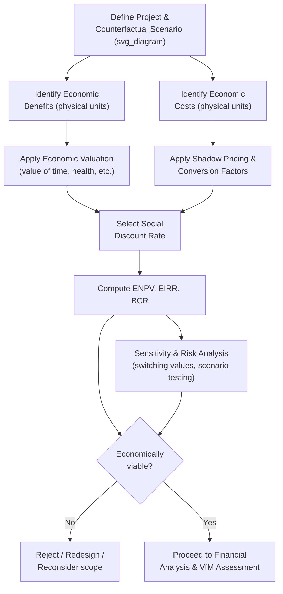

## Economic Cost-Benefit Analysis for Infrastructure Projects

### Overview

Economic Cost-Benefit Analysis (CBA) is the analytical methodology used to assess whether an infrastructure project generates net positive value to society as a whole, expressed in economic (as opposed to purely financial) terms. It is a foundational component of the feasibility study stage, answering the prior and more fundamental question of whether a project should be built at all — a question logically independent of, and preceding, the later question of how the project should be financed and delivered (PPP versus conventional procurement), which is addressed through Value-for-Money analysis.

### Economic Analysis versus Financial Analysis: The Core Distinction

**Key Points**

- **Financial analysis** assesses a project from the perspective of a specific entity (the project company/SPV, or the government budget), using market prices, and asking whether the project generates sufficient financial returns/cash flow to that specific entity.
- **Economic analysis** assesses a project from the perspective of society as a whole, using **shadow prices** (economic values that may differ from market prices where market prices are distorted by taxes, subsidies, monopoly power, or externalities), and asking whether the project's total social benefits exceed its total social costs, regardless of who within the economy captures the benefits or bears the costs.
- A project can be financially unviable (unable to attract private financing on standalone commercial terms) while being economically highly justified (generating substantial net social benefit) — this divergence is precisely the rationale for public financial support, subsidies, or availability payments in many PPP structures, since the government's own economic justification for supporting the project derives from the economic CBA, not from the project's standalone financial returns.

$$\text{Economic NPV} = \sum_{t=0}^{T} \frac{B_t^{economic} - C_t^{economic}}{(1 + r_{social})^t}$$

where $r_{social}$ is the **social discount rate**, which may differ from the private cost of capital used in financial analysis, reflecting society's rate of time preference and the opportunity cost of public capital rather than a specific investor's required return.

### Core Steps in Economic Cost-Benefit Analysis

**Key Points**

**1. Establishing the Counterfactual ("With-Without" Analysis)**

- Economic benefits and costs must be measured relative to a clearly defined **counterfactual scenario** — what would happen in the absence of the project — rather than a simple "before-after" comparison, since underlying trends (traffic growth, demand growth) would occur regardless of the project and should not be misattributed as project benefits.

**2. Identification and Quantification of Economic Benefits**

- Benefits vary substantially by sector but commonly include: time savings (for transport projects, valued using an established value-of-time methodology), vehicle operating cost savings, accident/safety cost reductions, health outcome improvements (water/sanitation projects), productivity gains, and environmental benefits (emissions reductions).
- Benefits should be quantified in physical/quantity terms first (hours saved, cases of illness averted) before economic valuation is applied, maintaining transparency about the underlying assumptions driving the final monetary benefit estimate.

**3. Identification and Quantification of Economic Costs**

- Capital costs, operating and maintenance costs, and any negative externalities (environmental degradation, social disruption, induced traffic congestion elsewhere in a network) valued in economic terms.

**4. Shadow Pricing and Conversion Factors**

- Market prices for key inputs (labor, foreign exchange, traded and non-traded goods) are adjusted using **conversion factors** to remove the distorting effects of taxes, subsidies, tariffs, and monopoly pricing, yielding shadow prices that better reflect true opportunity costs to the economy.
- **Shadow wage rate**: Particularly relevant in economies with significant unemployment or underemployment, where the market wage may overstate the true opportunity cost of labor employed on a project (since displaced workers may have had low or zero alternative economic output).
- **Standard Conversion Factor / Shadow Exchange Rate**: Adjusts for distortions between the official and shadow price of foreign exchange, relevant for projects with significant imported input components.

**5. Selection of the Social Discount Rate**

- The social discount rate reflects society's time preference and the opportunity cost of capital in its next-best public use, and is frequently set by central planning or finance authorities as a standard rate applied across public investment appraisal (commonly in a broad range depending on country context and methodology, though [Unverified] the specific rate applied varies considerably by jurisdiction and methodology and should be verified against the applicable national or institutional guidance rather than assumed universal).
- Some methodologies apply a **declining discount rate schedule** for very long-lived infrastructure assets, reflecting theoretical and empirical arguments (associated with work on discounting for long-term/intergenerational projects) that a constant discount rate may understate the value of long-term benefits and costs relevant to infrastructure with multi-decade or intergenerational impacts.

**6. Computation of Summary Economic Indicators**

- **Economic Net Present Value (ENPV)**: The discounted sum of economic benefits minus economic costs; a positive ENPV indicates the project generates net positive economic value.
- **Economic Internal Rate of Return (EIRR)**: The discount rate at which ENPV equals zero; compared against the social discount rate (or a minimum acceptable threshold) to determine economic viability.
- **Benefit-Cost Ratio (BCR)**: The ratio of discounted economic benefits to discounted economic costs; a BCR greater than 1 indicates positive economic value, and BCR is sometimes preferred over ENPV alone for ranking/prioritizing among competing projects with different scales.

$$\text{BCR} = \frac{\sum_{t=0}^{T} \frac{B_t}{(1+r)^t}}{\sum_{t=0}^{T} \frac{C_t}{(1+r)^t}}$$

### Diagram: Economic CBA Analytical Workflow (svg_diagram)

### Sensitivity Analysis and Risk Treatment in Economic CBA

**Key Points**

- Because economic CBA relies on numerous forecasting assumptions (demand growth, unit valuations, cost estimates) subject to genuine uncertainty, standard practice requires **sensitivity analysis**: systematically varying key assumptions (e.g., demand growth rate, discount rate, capital cost) to test how robust the ENPV/EIRR conclusion is to plausible variation in these inputs.
- **Switching value analysis**: Identifying the specific value a key variable would need to reach to change the project's economic viability conclusion (e.g., "demand would need to fall more than 30% below forecast for the project to become economically unjustified"), providing decision-makers with an intuitive sense of the project's risk margin.
- **Scenario analysis and, in more sophisticated applications, probabilistic (Monte Carlo) simulation**: Modeling combinations of correlated variable changes (rather than varying one variable at a time) to generate a fuller picture of the distribution of possible economic outcomes, increasingly recommended in more advanced feasibility study practice for higher-value or higher-uncertainty projects.

### Distributional and Non-Monetizable Considerations

**Key Points**

- Standard economic CBA aggregates costs and benefits across society without regard to who specifically bears costs or receives benefits; **distributional analysis** is sometimes conducted as a supplementary assessment to understand how project impacts are distributed across income groups, geographic regions, or demographic groups — relevant to broader public policy objectives (poverty reduction, regional equity) that a pure efficiency-focused CBA does not capture.
- Some project impacts (cultural heritage effects, certain ecosystem services, social cohesion impacts) are genuinely difficult or contested to monetize; good-practice CBA methodology generally recommends explicitly identifying and qualitatively describing such non-monetized impacts alongside the quantified ENPV/EIRR results, rather than either forcing an unreliable monetary valuation or omitting the consideration entirely from the decision-making record.
- [Inference] Multi-criteria decision analysis approaches (referenced under project prioritization) are sometimes used as a complement to, rather than a replacement for, economic CBA specifically to formally incorporate these distributional and non-monetizable considerations into project appraisal alongside the core efficiency-focused ENPV/EIRR results, though the specific methodological integration between CBA and MCDA varies across different national appraisal guidance frameworks.

### Relationship to Financial Analysis and PPP Structuring

**Key Points**

- A positive economic CBA result is generally treated as a **necessary but not sufficient condition** for proceeding with a project: it establishes that the project is worth building from a societal perspective, but does not by itself determine whether PPP delivery is the appropriate mechanism (a separate question addressed by suitability screening and VfM analysis) nor whether the specific financial structure proposed is fiscally sustainable (addressed by Ministry of Finance fiscal gatekeeping).
- The economic CBA's demand forecasts and benefit quantifications feed directly into the project's financial model (particularly relevant for demand-based/revenue-risk PPP structures, where the financial viability of the private concessionaire depends directly on realized demand) and into the government's own affordability assessment for availability-based structures.
- Where a project's positive economic case rests substantially on benefits that do not translate into revenue capturable by a private operator (e.g., broad economic productivity gains, accident reduction benefits not reflected in toll revenue), this divergence between economic and financial viability is a standard justification for **government co-financing, subsidies, or availability payment top-ups** to bridge the gap between the project's genuine economic merit and its standalone financial bankability.

### Common Weaknesses in Applied Economic CBA Practice

**Key Points**

- **Optimism bias in benefit and cost forecasting**: A well-documented pattern (paralleling the optimism bias discussed under technical feasibility) in which demand forecasts and benefit valuations tend toward systematic overstatement relative to realized outcomes, while costs tend toward systematic understatement — a pattern extensively documented in the infrastructure megaproject literature.
- **Inconsistent or non-standardized discount rate and shadow pricing application**: Where national appraisal guidance is not clearly established or consistently applied, cross-project and cross-sector comparability of economic CBA results can be significantly undermined, weakening the analysis's value for pipeline-level prioritization purposes.
- **Benefit transfer without adequate contextual adjustment**: Applying unit benefit valuations (e.g., value of time estimates) developed in a different country or context without adequate adjustment for local income levels, price levels, or behavioral differences, potentially producing systematically biased benefit estimates.
- **Underweighting genuine uncertainty**: Presenting a single-point ENPV/EIRR estimate without adequate sensitivity or probabilistic analysis, understating the genuine uncertainty inherent in long-horizon infrastructure demand and cost forecasts and potentially conveying false precision to decision-makers.

### Related Topics

- Technical Feasibility and Engineering Due Diligence (source of cost inputs to CBA)
- Value-for-Money Analysis and the Public Sector Comparator (distinct, subsequent analytical question)
- Optimism Bias and Strategic Misrepresentation in Megaproject Cost Estimation
- Social Discount Rate Selection and Long-Term/Intergenerational Discounting Debates
- Shadow Pricing, Conversion Factors, and Shadow Wage Rate Methodology
- Distributional Analysis and Multi-Criteria Decision Analysis as CBA Complements
- Demand Forecasting Methodologies and Traffic/Ridership Modeling
- Identifying Priority Public Investment Projects (pipeline-level use of CBA results)