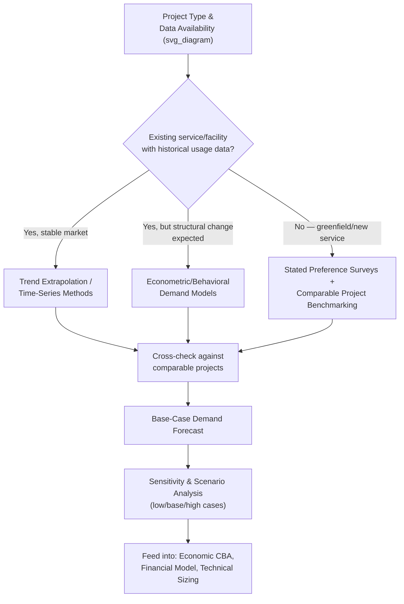

## Demand Forecasting and Usage Studies

### Overview

Demand forecasting and usage studies produce the projections of future service usage — traffic volumes, ridership, water consumption, energy demand, patient throughput — that underpin nearly every other component of a PPP feasibility study: economic cost-benefit analysis, financial modeling, technical design sizing, and, for demand-based/revenue-risk contract structures, the private partner's core commercial viability. Given that PPP contracts commonly run 20–30 years, demand forecasting inherently requires projecting usage patterns far beyond any period for which reliable historical data or robust predictive confidence is typically available, making this workstream one of the most consequential — and most frequently criticized — components of infrastructure feasibility analysis.

### Why Demand Forecasting Is Central to PPP Feasibility

**Key Points**

- Demand forecasts directly determine **economic benefit quantification** (time savings, health outcomes, productivity gains scale with usage volume) and are therefore a primary driver of the economic CBA's ENPV/EIRR conclusions.
- For **demand-based/revenue-risk PPP structures**, the demand forecast is the single most important determinant of the private partner's projected revenue and, consequently, project bankability, debt sizing, and equity return expectations — errors in demand forecasting translate directly and mechanically into financial outcomes for the concessionaire and its lenders.
- Demand forecasts inform **technical capacity/sizing decisions** (how many lanes, what treatment plant capacity, how many hospital beds) — both over- and under-sizing relative to actual future demand represent economically costly outcomes, whether through wasted capital investment or inadequate service capacity requiring costly later expansion.
- Even in **availability-based structures**, where the private partner does not bear direct demand risk, government affordability planning and public value-for-money justification still depend on realistic usage projections (e.g., a hospital PPP's justification depends on realistic patient volume projections even though the private partner's payment is not directly usage-linked).

### Core Demand Forecasting Methodologies

**Key Points**

**1. Trend Extrapolation / Time-Series Methods**

- Projecting future demand based on historical growth trends in existing usage data, using techniques ranging from simple linear/compound growth rate extrapolation to more sophisticated time-series econometric models (ARIMA and related approaches) that account for seasonality, cyclicality, and trend components.
- Most reliable for mature, stable markets with substantial historical data and limited structural change expected; least reliable for greenfield projects (no historical usage data exists by definition) or markets undergoing significant structural transformation.

**2. Econometric/Behavioral Demand Models**

- Models that explicitly relate demand to underlying explanatory variables (income growth, population growth, price/tariff levels, travel time, competing alternatives), allowing demand projections to be built up from projected changes in these underlying drivers rather than simple historical extrapolation.
- **Elasticity-based approaches**: Applying estimated demand elasticities (price elasticity, income elasticity) to projected changes in tariffs, incomes, or other drivers — commonly used in transport, water, and energy demand forecasting.

$$\%\Delta Q = \epsilon_{price} \times \%\Delta P + \epsilon_{income} \times \%\Delta Y$$

where $\epsilon_{price}$ and $\epsilon_{income}$ are the price and income elasticities of demand respectively.

**3. Four-Stage Transport Demand Models**

- The classical methodology specifically for transport infrastructure (roads, transit), comprising: (i) **trip generation** (how many trips originate from/attract to each zone), (ii) **trip distribution** (which origin-destination pairs those trips connect), (iii) **modal split** (which transport mode is chosen), and (iv) **traffic/trip assignment** (which specific routes/facilities carry the resulting traffic) — a structured, zone-based approach widely used for major transport PPP demand studies, typically implemented through dedicated transport planning software.

**4. Stated Preference and Revealed Preference Surveys**

- **Revealed preference (RP)** approaches infer demand parameters (e.g., value of time, mode choice sensitivity) from observed actual behavior in existing, comparable situations.
- **Stated preference (SP)** approaches use structured surveys presenting hypothetical choice scenarios to directly elicit preference parameters — particularly important for greenfield projects or entirely new service offerings where no directly observable revealed behavior exists (e.g., a new toll road where no toll currently exists on that corridor).

**5. Comparable Project Benchmarking**

- Drawing on demand outcomes from similar completed projects (comparable toll roads, comparable transit systems) in similar contexts as a cross-check or supplementary input, particularly valuable for calibrating and sense-checking the outputs of more formal econometric or behavioral models.

### Diagram: Demand Forecasting Methodology Selection (svg_diagram)

### Optimism Bias and the Traffic/Ridership Forecasting Track Record

**Key Points**

- Demand forecasting — particularly for greenfield toll roads and new transit systems — has a well-documented empirical track record of **systematic optimism bias**: actual demand in the early years of operation frequently falls short of pre-financial-close forecasts, a pattern studied extensively in infrastructure finance literature (notably empirical work such as that conducted for the World Bank by Bain and colleagues on toll road traffic forecasting accuracy, and broader megaproject forecasting research associated with Flyvbjerg).
- Proposed explanations in this literature span both **unintentional forecasting error** (genuine difficulty predicting long-horizon behavioral responses, macroeconomic conditions, and competing infrastructure developments) and **strategic misrepresentation** (incentives for project sponsors, and sometimes government sponsors seeking project approval, to present optimistic forecasts that support a positive investment case) — [Unverified] the relative contribution of each explanation is genuinely debated in the literature and likely varies by project and context, rather than being resolved to a single dominant cause.
- This empirical track record is a primary reason many jurisdictions have shifted away from pure demand-risk PPP structures toward availability payments, shadow tolls, minimum revenue guarantees, or LPVR/variable-term concession mechanisms (discussed under contract typologies) specifically to mitigate the fiscal and bankability consequences of demand forecast error.

### Sensitivity Analysis and Scenario Development

**Key Points**

- Given the demonstrated unreliability of point-estimate demand forecasts over long horizons, robust feasibility practice requires developing **multiple demand scenarios** (commonly low/base/high cases) reflecting plausible variation in key underlying drivers, rather than relying on a single base-case projection.
- **Sensitivity testing of financial and economic outputs to demand assumptions**: Systematically testing how project financial viability (debt service coverage ratios, equity returns) and economic viability (ENPV, EIRR) respond to demand falling below the base case — directly informing both risk allocation decisions (is the private party genuinely capable of absorbing this level of demand variability?) and the design of risk-mitigation instruments (at what demand shortfall level would a minimum revenue guarantee be triggered, and what is the resulting contingent liability?).
- **Ramp-up period modeling**: Explicit modeling of the typically gradual growth of actual usage toward mature-state demand levels following project opening (a "ramp-up curve"), rather than assuming immediate achievement of long-run forecast demand from the day of opening — a modeling refinement directly relevant to early-year debt service coverage analysis, since many demand-risk PPP financial distress events occur in the first several years of operation during this ramp-up period rather than at full-maturity demand levels.

### Data Sources and Primary Data Collection

**Key Points**

- Common data sources include national statistical office demographic and economic projections, existing traffic/usage counts (where available from prior public operation of the asset or comparable facilities), household travel surveys, and sector-specific regulatory or utility billing data (for water/energy demand studies).
- For major projects, **primary data collection** (dedicated origin-destination surveys, willingness-to-pay surveys, traffic counts at the specific project location) is frequently commissioned specifically for the feasibility study, since existing secondary data is often insufficiently granular or current for reliable project-specific forecasting.
- [Speculation] Some practitioner guidance suggests that the marginal value of investing in more sophisticated primary data collection and modeling techniques diminishes for smaller-scale or lower-risk-transfer (availability-based) projects, where the fiscal consequences of moderate demand forecast error are less severe than in large-scale, pure demand-risk concessions — though this represents a proportionality judgment applied in practice rather than a formally established methodological threshold.

### Independent Review and Verification of Demand Forecasts

**Key Points**

- Given the well-documented optimism bias pattern and the direct financial stakes involved (particularly for lenders financing demand-risk PPPs), **independent traffic/demand studies** — commissioned separately from the sponsor's or government's own study, often at the specific insistence of prospective lenders during financial close due diligence — are standard practice for major demand-risk transport PPPs, providing an additional layer of scrutiny distinct from the original feasibility study forecast.
- Lenders in project finance transactions frequently apply their own **haircut or discount** to sponsor-provided demand forecasts when sizing debt (setting more conservative debt service coverage ratio assumptions than the sponsor's base case), reflecting the financial market's own accumulated experience with the historical pattern of forecast optimism.

### Related Topics

- Availability-Based versus Demand-Based Contract Structures (direct dependency on forecast reliability)
- Economic Cost-Benefit Analysis for Infrastructure Projects (demand as a primary CBA input)
- Technical Feasibility and Engineering Due Diligence (capacity-sizing linkage)
- Minimum Revenue Guarantees and Government Contingent Liabilities
- Least-Present-Value-of-Revenue (LPVR) Auction Design as a Demand-Risk Mitigant
- Optimism Bias and Strategic Misrepresentation in Megaproject Cost Estimation
- Project Finance Debt Sizing and Debt Service Coverage Ratio Methodology
- Value-of-Time and Willingness-to-Pay Survey Methodologies