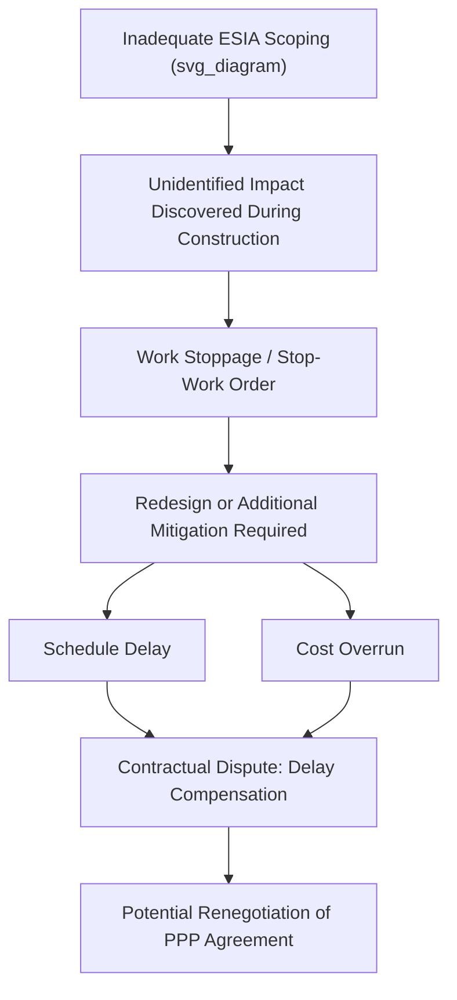

## Environmental and Social Impact Assessment

### Definition and Purpose

Environmental and Social Impact Assessment (ESIA) is a structured process for identifying, predicting, evaluating, and mitigating the biophysical, social, health, and other relevant effects of a proposed infrastructure or development project before major decisions are made and commitments undertaken. In the context of Public-Private Partnership (PPP) feasibility studies, ESIA serves both a regulatory-compliance function and a risk-management function: it determines whether a project is permittable under domestic environmental law and international lender safeguard policies, and it surfaces environmental and social (E&S) risks that can materially affect project cost, schedule, financeability, and long-term social license to operate.

ESIA is distinct from, but feeds into, the broader feasibility study. While technical and financial feasibility ask "can this project be built and can it generate adequate returns," ESIA asks "should this project be built in this form, at this location, and under what conditions," and "what will it cost, in mitigation and compensation, to make the project acceptable to affected communities, regulators, and financiers."

### Position Within the PPP Project Cycle

ESIA is typically initiated during the pre-feasibility or feasibility stage, run in parallel with technical design and financial modeling, and finalized before financial close. Its outputs directly influence:

- **Site selection and alignment** — environmental or social constraints can force route/site changes.
- **Capital cost estimates** — mitigation measures, resettlement, and compensation are capitalized costs.
- **Project schedule** — public consultation periods and regulatory review are often on the critical path.
- **Contractual risk allocation** — the PPP contract must assign responsibility for E&S compliance, cost overruns from late-discovered impacts, and ongoing monitoring obligations.
- **Bankability** — international financiers (IFC, ADB, World Bank, export credit agencies) will not disburse funds without a compliant ESIA, and their safeguard policies often exceed host-country legal minimums.

### Core Stages of the ESIA Process

#### 1. Screening

Screening determines whether a project requires an ESIA and, if so, at what level of rigor. Most jurisdictions and multilateral lenders use categorization schemes:

- **Category A (High Risk)** — significant, irreversible, or diverse adverse impacts; requires full ESIA with extensive baseline data and stakeholder engagement (e.g., large dams, major highways through sensitive ecosystems).
- **Category B (Moderate Risk)** — site-specific, reversible impacts; requires a limited or partial ESIA/Environmental Management Plan.
- **Category C (Low Risk)** — minimal or no adverse impacts; typically exempted or requires only a simple checklist.

This tiering (used by the World Bank's Environmental and Social Framework and IFC Performance Standards, among others) directly affects feasibility study cost and duration, so screening classification should be confirmed early, as it drives budget and timeline assumptions in the overall feasibility study.

#### 2. Scoping

Scoping defines the boundaries of the assessment: which impacts, geographic areas, project alternatives, and stakeholder groups will be studied in depth. Key outputs include:

- **Terms of Reference (ToR)** for the ESIA consultant/study.
- **Identification of Valued Environmental and Social Components (VECs)** — the specific receptors (e.g., a wetland, an indigenous community, a livelihood system) that warrant focused study.
- **Alternatives analysis framework** — including the "no project" alternative, alternative sites, and alternative technologies.

#### 3. Baseline Data Collection

Establishes the pre-project state of the environment and society against which impacts will be measured. Typically covers:

**Environmental baseline:**

- Air quality, noise, and vibration
- Surface water and groundwater hydrology and quality
- Soil and geology
- Terrestrial and aquatic biodiversity, including protected or critical habitat
- Climate and greenhouse gas context

**Social baseline:**

- Demographics, livelihoods, and land tenure
- Cultural heritage and archaeological resources
- Indigenous peoples and vulnerable groups
- Public health status and infrastructure
- Existing land use and resource dependency patterns

[Inference] The rigor and duration of baseline studies (e.g., requiring a full seasonal cycle of ecological surveys) is often underestimated in early feasibility schedules, and is a common source of PPP project delay.

#### 4. Impact Identification, Prediction, and Evaluation

This stage systematically links project activities (construction, operation, decommissioning) to potential impacts on the VECs identified in scoping. Common methodologies include:

- **Matrix methods** (e.g., Leopold Matrix) — cross-tabulating project activities against environmental/social receptors.
- **Checklists** — standardized lists of potential impact categories.
- **Network/cause-effect diagrams** — tracing indirect and cumulative impact chains.
- **Overlay/GIS mapping** — spatially correlating project footprint with sensitive receptors.
- **Modeling** — quantitative prediction (e.g., air dispersion models, hydrological models, noise propagation models).

Impacts are typically evaluated on: nature (positive/negative), magnitude, extent (local/regional), duration (short/long-term), reversibility, likelihood, and significance (often a function of magnitude × sensitivity of the receptor).

**Example — Simplified Impact Significance Matrix:**

| Impact | Magnitude | Receptor Sensitivity | Significance |
| --- | --- | --- | --- |
| Construction dust on nearby village | Medium | High (health-sensitive population) | High |
| Temporary traffic diversion | Low | Low | Low |
| Loss of riparian habitat at bridge crossing | High | High (critical habitat) | High |
| Increased local employment | Positive/Medium | Medium | Moderate (positive) |

#### 5. Mitigation Hierarchy

International good practice (IFC Performance Standard 1, Equator Principles) requires impacts to be addressed in a strict sequence:

1. **Avoid** — eliminate the impact through site or design changes.
2. **Minimize** — reduce the impact's magnitude, extent, or duration.
3. **Restore/Rehabilitate** — repair impacts that occur despite minimization.
4. **Offset/Compensate** — as a last resort, compensate for residual impacts (e.g., biodiversity offsets, resettlement compensation).

**Key Points:**

- Compensation is only acceptable for *residual* impacts after avoidance and minimization have been genuinely pursued — it is not a substitute for good design.
- The mitigation hierarchy should be documented and defensible, since lenders and regulators will scrutinize whether cheaper compensation was used to bypass more costly avoidance measures.

#### 6. Stakeholder Engagement and Public Consultation

A legally mandated and technically essential component. Requirements typically include:

- **Free, Prior, and Informed Consent (FPIC)** processes for indigenous peoples affected by the project (required under IFC PS7 and increasingly in domestic law).
- **Public disclosure** of the draft ESIA report, usually with a mandated minimum comment period (commonly 30–60 days depending on jurisdiction).
- **Grievance Redress Mechanisms (GRM)** — an accessible, transparent channel for affected persons to raise concerns throughout the project lifecycle, not just during ESIA preparation.
- **Stakeholder mapping** distinguishing directly affected persons (DAPs), indirectly affected communities, civil society, and government bodies.

#### 7. Resettlement Action Plan (RAP) / Livelihood Restoration Plan (LRP)

Where a project triggers physical or economic displacement, a separate but linked instrument is prepared:

- **Physical displacement** — relocation of housing/structures.
- **Economic displacement** — loss of income or livelihood without necessarily requiring relocation (e.g., loss of farmland or market stalls).

The RAP documents: census and asset inventory of affected persons, entitlement matrix (compensation rates and eligibility categories), resettlement site selection and design, livelihood restoration strategy, implementation schedule, and monitoring/grievance provisions. World Bank and IFC standards generally require that resettled populations be economically and socially better off, or at minimum no worse off, than before displacement — this is often termed the "livelihood restoration" standard rather than simple cash compensation.

#### 8. Environmental and Social Management Plan (ESMP)

The ESMP operationalizes the mitigation hierarchy into implementable, monitorable actions across construction and operation phases. It typically contains sub-plans such as:

- Construction Environmental Management Plan (dust, noise, erosion control, waste management)
- Traffic Management Plan
- Biodiversity Management Plan
- Community Health and Safety Plan
- Emergency Response Plan
- Labor and Working Conditions Plan (including Occupational Health and Safety)
- Monitoring and Reporting Plan with defined indicators, frequency, and responsible parties

**Output:** A binding schedule of E&S commitments, often incorporated by reference into the PPP concession agreement or construction contract, with associated Key Performance Indicators (KPIs) and non-compliance consequences.

### Regulatory and Safeguard Frameworks Relevant to PPPs

| Framework | Applicability | Notes |
| --- | --- | --- |
| Host-country EIA law/regulations | Mandatory legal baseline | Varies significantly by jurisdiction in scope and rigor |
| World Bank Environmental and Social Framework (ESF) | World Bank-financed or co-financed projects | 10 Environmental and Social Standards (ESS1–ESS10) |
| IFC Performance Standards (PS1–PS8) | IFC and Equator Principles Financial Institution-financed projects | De facto global benchmark for private-sector project finance |
| Equator Principles | Adopted voluntarily by ~130 financial institutions globally | Applies IFC PS framework to project finance debt above certain thresholds |
| ADB Safeguard Policy Statement | ADB-financed projects | Similar categorization (A/B/C) to World Bank |
| National Environmental Policy Act (NEPA)-style statutes | Jurisdictions with NEPA-derived frameworks | Requires Environmental Impact Statements for major federal actions |

[Unverified] Specific procedural timelines, thresholds, and categorization criteria vary by country and are frequently amended; project teams should verify current requirements against the applicable jurisdiction's environmental agency and any co-financing institution's current safeguard policy.

### Cumulative and Transboundary Impact Assessment

For large linear or regional infrastructure PPPs (highways, transmission corridors, water transfer schemes), ESIA increasingly must address:

- **Cumulative impacts** — the combined effect of the project together with other past, present, and reasonably foreseeable future projects in the same area (e.g., multiple hydropower dams on the same river system).
- **Transboundary impacts** — effects crossing national or subnational jurisdictional boundaries, which may trigger additional notification and consultation obligations under instruments such as the Espoo Convention.

### Climate Risk Integration

Modern ESIA practice increasingly integrates:

- **Climate change mitigation** — quantification of project greenhouse gas emissions (often required for large projects above defined thresholds, e.g., 25,000 tCO2e/year under IFC PS3).
- **Climate change adaptation/resilience** — assessment of the project's vulnerability to physical climate risks (flooding, sea-level rise, extreme heat, changing precipitation patterns) over its design life, which is particularly relevant for long-tenor PPP concessions (25–30 years).

This is formalized through Task Force on Climate-related Financial Disclosures (TCFD)-aligned physical and transition risk screening in many recent lender requirements.

### Integration with PPP Risk Allocation

ESIA findings must translate into explicit contractual risk allocation in the PPP agreement:

- **Pre-existing environmental liability** (e.g., contaminated land) is typically retained by the public authority/grantor, since the private party had no control over its creation.
- **Change in environmental law** risk is commonly allocated to the grantor (as a form of political/regulatory risk), or shared via a defined mechanism, since the private operator cannot control legislative change.
- **Non-compliance with the ESMP during construction/operation** is allocated to the private party (contractor/operator), since this is within its operational control.
- **Cost overruns from unforeseen E&S impacts discovered post-financial-close** are a frequent source of dispute; well-structured contracts define a clear change-management and cost-sharing mechanism for such events.

**Key Points:**

- Weak ESIA scoping is a leading cause of PPP renegotiation and cost overrun, because impacts not identified pre-financial-close often surface during construction, forcing costly retrofits, work stoppages, or emergency compensation payments.
- Lenders' independent E&S due diligence (via an Independent Environmental and Social Consultant, IESC) is standard practice in project-financed PPPs and functions as a continuous compliance check through construction and early operations.

### Illustrative Cost and Schedule Impact Diagram

### Worked Example: Toll Road PPP

**Example:**

A proposed 80 km toll road PPP crosses a river floodplain that is seasonally used by a fishing community and borders a designated wetland reserve.

- **Screening:** Classified Category A due to proximity to a legally protected wetland.
- **Scoping:** VECs identified include wetland hydrology, fish breeding grounds, and the livelihoods of approximately 340 fishing households.
- **Baseline:** A full annual hydrological cycle is monitored (12 months), delaying the ESIA timeline relative to the original feasibility schedule.
- **Impact prediction:** Bridge piers and approach embankments are modeled to show a 15% reduction in seasonal floodplain connectivity if built as originally designed.
- **Mitigation:** Design is revised (avoidance) to use a longer clear-span bridge structure instead of an embanked causeway, reducing floodplain obstruction; residual habitat loss is offset through a wetland restoration program elsewhere in the same catchment.
- **RAP:** Approximately 40 households facing economic displacement (loss of fishing access) are enrolled in a livelihood restoration program combining cash compensation and alternative aquaculture training.
- **Contractual outcome:** The wetland restoration obligation and fishing-community livelihood monitoring are written into the ESMP, incorporated by reference into the concession agreement, with quarterly reporting to the grantor and independent lender's engineer.

[Inference] The redesign from embanked causeway to clear-span bridge would materially increase capital cost but reduce long-term legal, reputational, and biodiversity offset liabilities — this is a typical avoidance-vs-cost trade-off decision point in ESIA-informed PPP design, and actual figures would require project-specific engineering and cost estimation.

### Common Pitfalls in PPP Feasibility Practice

- Treating ESIA as a late-stage regulatory formality rather than an input to site selection and design.
- Underbudgeting for baseline data collection duration, particularly ecological surveys requiring multiple seasons.
- Inadequate stakeholder engagement leading to community opposition that surfaces only after financial close.
- Failing to align domestic legal ESIA requirements with stricter lender safeguard policies, resulting in a compliance gap discovered during due diligence.
- Vague or unenforceable ESMP commitments that cannot be effectively monitored or audited during operations.
- Omitting cumulative impact assessment where multiple similar projects are planned in the same region.

### Related Topics

- Resettlement Action Plans and Livelihood Restoration Frameworks
- IFC Performance Standards and Equator Principles in Project Finance
- Risk Allocation Matrices in PPP Contracts
- Climate Risk and Resilience Assessment in Infrastructure Appraisal
- Grievance Redress Mechanisms and Stakeholder Engagement Design
- Independent Engineer and Independent E&S Consultant Roles in PPP Due Diligence
- Cost-Benefit Analysis and Economic Feasibility in PPP Appraisal
- Land Acquisition and Compensation Frameworks