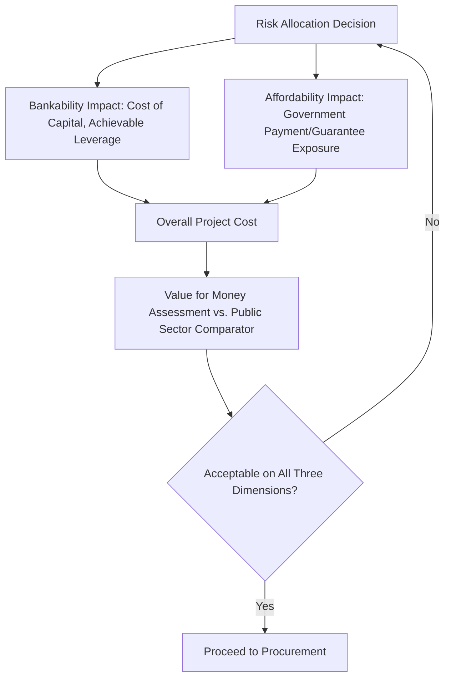

## Bankability Assessment from the Private Sector Perspective

### Definition and Purpose

Bankability assessment evaluates whether a proposed Public-Private Partnership (PPP) project can attract non-recourse or limited-recourse project finance debt and equity on acceptable terms, from the perspective of lenders, sponsors, and investors rather than the public authority. A project is "bankable" when its risk allocation, revenue structure, and contractual protections give lenders sufficient confidence that debt service will be met and give equity sponsors sufficient confidence of an adequate risk-adjusted return, such that financial close can actually be achieved on reasonable terms.

Bankability is distinct from, but closely linked to, affordability (the public sector's capacity to pay) and Value for Money (whether PPP procurement beats conventional procurement). A project can be affordable to government and offer strong VfM in theory, yet fail entirely if it cannot be financed — bankability is the gating constraint that determines whether the deal closes at all.

### Position Within the PPP Project Cycle

Bankability is not assessed once but continuously reality-tested from early feasibility through financial close:

1. **Pre-feasibility** — a high-level bankability screen against comparable transactions and market appetite.
2. **Feasibility study** — detailed financial modeling, risk allocation design, and informal market sounding with prospective lenders/sponsors.
3. **Transaction structuring and procurement** — draft contract terms are tested against bidder and lender feedback (often via a formal market sounding or bidder consultation process).
4. **Bid submission and negotiation** — actual lender term sheets and credit committee approvals validate or challenge assumed bankability.
5. **Financial close** — the definitive bankability test: can the sponsor consortium actually raise the debt and equity required, on the terms assumed in the bid.


### The Lender's Perspective: Core Bankability Criteria

Project finance lenders evaluate bankability primarily through the lens of predictable, protected cash flow available for debt service. Core criteria include:

#### 1. Revenue Certainty and Predictability

Lenders strongly prefer contractually fixed or formula-based revenue (availability payments, indexed tariffs) over demand-dependent revenue (pure toll/patronage risk), because uncertain revenue directly threatens debt service coverage. Where demand risk cannot be avoided, lenders typically require: conservative (P90-type) demand forecasts, minimum revenue guarantees, or revenue floor mechanisms.

#### 2. Risk Allocation Appropriateness

The foundational bankability principle is that **risk should be allocated to the party best able to manage and price it**. Lenders will not accept risks assigned to the private party that it cannot reasonably control or insure against. Common bankability-critical risk allocation issues include:

| Risk | Bankable Allocation | Unbankable Allocation |
| --- | --- | --- |
| Change in law (general) | Private party bears, priced into returns | — |
| Change in law (discriminatory/project-specific) | Government compensates | Private party bears uncompensated |
| Force majeure | Relief from performance obligations; cost-sharing regime defined | No relief mechanism |
| Land acquisition delay | Government responsible, with compensation for delay | Private party responsible for factors outside its control |
| Demand/volume risk (availability model) | Government/grantor bears | Private party bears with no floor |
| Termination for grantor default | Full compensation covering debt plus reasonable equity return | Compensation capped below outstanding debt |

**Key Points:**

- The single most common bankability failure point in PPP contracts is inadequate **termination payment provisions** — lenders require near-certainty that in a termination-for-grantor-default or force-majeure scenario, compensation will at minimum cover outstanding senior debt, since debt is otherwise left unsecured.
- "Unbankable" risk allocation does not necessarily mean lenders refuse the deal outright; it more often means they price the risk into a higher margin, demand additional guarantees, or reduce the leverage (debt-to-equity ratio) they are willing to extend — all of which raise the project's cost of capital and can erode Value for Money.

#### 3. Debt Service Coverage and Financial Ratios

Lenders assess bankability quantitatively through coverage ratios applied to the financial model:

$$\text{DSCR} = \frac{\text{Cash Flow Available for Debt Service}}{\text{Total Debt Service (Principal + Interest)}}$$


$$\text{LLCR} = \frac{\text{NPV of Cash Flows Available for Debt Service over Remaining Loan Life}}{\text{Outstanding Debt Balance}}$$

Typical minimum thresholds vary by sector and risk profile — availability-based social infrastructure (e.g., schools, hospitals) often targets a minimum DSCR in a lower range (commonly cited around 1.2x–1.3x) given more predictable cash flows, while demand-risk projects (e.g., toll roads) typically require materially higher minimum and average DSCR thresholds to compensate lenders for revenue volatility. [Unverified] Exact benchmark ratios are lender-, market-, and deal-specific and should be confirmed against current market practice and the specific lender group's credit policy for the relevant sector and jurisdiction.

**Example — Simplified DSCR Sensitivity Table:**

| Scenario | Annual CFADS | Annual Debt Service | DSCR |
| --- | --- | --- | --- |
| Base case | 24.0 | 20.0 | 1.20x |
| Demand -10% (toll road) | 21.0 | 20.0 | 1.05x |
| Demand -10% (availability payment, unaffected) | 24.0 | 20.0 | 1.20x |

This table illustrates why lenders discount pure demand-risk structures more heavily: the same downside shock materially erodes coverage under a toll model but leaves an availability-payment structure's coverage untouched.

#### 4. Security Package

Lenders require a robust security package to protect their claim on project assets and cash flows, typically including: a pledge or assignment of shares in the project company (SPV), step-in rights allowing lenders to replace a failing operator/sponsor, assignment of project contracts and insurance proceeds, and (where legally permissible) a mortgage/charge over project assets and the concession right itself.

**Key Points:**

- **Step-in rights** are a critical bankability feature: they allow lenders to intervene and cure a default (or substitute a new operator) before the grantor can terminate the concession, preserving the value of the underlying asset for lenders rather than allowing termination to wipe out the debt claim.
- In many jurisdictions, direct security over public infrastructure assets or the concession right itself is legally restricted or prohibited, requiring bankability to be achieved instead through step-in rights, direct agreements between lenders and the grantor, and contractual assignment structures rather than conventional asset-backed security.

#### 5. Direct Agreements (Tripartite Agreements)

A Direct Agreement between the grantor, the project company, and the lenders is a standard bankability instrument. It typically grants lenders:

- Notice of, and an opportunity to cure, project company defaults before the grantor can terminate.
- Step-in rights to appoint a substitute entity to perform the concession.
- Consent rights over amendments to the underlying concession agreement.
- Confirmation that termination compensation will be paid directly to, or as directed by, the lenders to the extent of outstanding debt.

#### 6. Termination Payment Adequacy

Because termination can occur for multiple reasons (grantor default, private party default, force majeure, voluntary termination), lenders scrutinize the termination payment schedule for each scenario:

```mermaid
flowchart TD
    A[Termination Event (svg_diagram)] --> B{Cause}
    B -->|Grantor Default| C[Full Compensation: Debt + Equity Return]
    B -->|Force Majeure| D[Compensation: Debt + Partial Equity]
    B -->|Private Party Default| E[Compensation: Debt Only, Often at Discount]
    B -->|Voluntary/Political Termination| F[Compensation: Debt + Reasonable Equity Return]
    C --> G[Lender Bankability Assessment]
    D --> G
    E --> G
    F --> G
```

Lenders generally require that even in a private-party-default termination scenario, compensation covers a substantial portion of outstanding senior debt (since lenders should not bear the consequences of sponsor mismanagement they had no control over, provided they exercised step-in rights in good faith) — projects offering materially lower default-termination compensation face reduced lender appetite or higher required margins.

### The Equity Sponsor's Perspective

Alongside lender bankability, equity sponsors assess **investability** — whether projected returns compensate for the risk retained:

- **Equity IRR** relative to the sponsor's required return for the specific country and sector risk profile.
- **Return predictability** — sponsors, like lenders, prefer contracted/formula-based revenue over pure market risk.
- **Exit optionality** — the ability to sell down equity stakes post-construction (once construction risk is retired) to infrastructure funds or other long-term investors, which is a major driver of primary sponsor (contractor/developer) appetite to bid in the first place.
- **Political and regulatory risk** — expropriation risk, currency convertibility and transfer risk, and the credibility of dispute resolution mechanisms (particularly access to international arbitration rather than exclusive reliance on host-country courts).

### Currency and Macroeconomic Bankability Factors

For PPPs in emerging markets, currency risk is frequently the decisive bankability factor:

- **Revenue-cost currency mismatch** — if project revenue is in local currency but debt service is in foreign currency (common where local capital markets lack long-tenor local-currency debt), lenders require either revenue indexed to the foreign currency/exchange rate, a government exchange rate guarantee, or hedging arrangements — each of which affects bankability and cost differently.
- **Convertibility and transferability risk** — the ability to convert local currency earnings and transfer them offshore; often mitigated through Multilateral Investment Guarantee Agency (MIGA) or export credit agency political risk insurance.
- **Local capital market depth** — availability of long-tenor local-currency debt (often limited in developing markets) affects whether the project can avoid currency mismatch risk altogether by financing in local currency.

[Inference] The relative bankability improvement from political risk insurance or partial credit guarantees (e.g., from MIGA, IFC, or export credit agencies) is generally significant in emerging-market PPPs, but the specific pricing and risk transfer terms are transaction-specific and would require quotation from the relevant guarantee provider for a given deal.

### Bankability Red Flags Commonly Identified in Due Diligence

- **Ambiguous or overly broad force majeure definitions** that create uncertainty about when and how the private party is relieved of obligations.
- **Discretionary or unclear change-in-law compensation mechanisms** leaving the private party exposed to unpredictable regulatory cost increases.
- **Weak or capped termination compensation**, particularly in force majeure and grantor-default scenarios.
- **Absent or weak step-in rights and Direct Agreement provisions.**
- **Inconsistent or unenforceable dispute resolution clauses**, particularly reliance on domestic courts perceived as lacking independence, rather than international arbitration.
- **Land or permitting risk retained by the private party** where the private party has no practical ability to expedite government processes.
- **Overly optimistic demand forecasts** underlying the financial model, which lenders' independent traffic/demand consultants will typically revise downward, reducing achievable leverage.
- **Currency mismatch without adequate hedging or indexation mechanisms.**

### Market Sounding and Its Role in Bankability Validation

Because bankability ultimately depends on real market appetite rather than theoretical analysis, governments and their transaction advisors typically conduct structured market sounding before finalizing contract terms:

1. Circulate a summary of proposed project structure and key risk allocation terms to prospective lenders, sponsors, and equity investors (often under confidentiality arrangements).
2. Solicit written or verbal feedback on perceived bankability gaps, required contract amendments, and indicative pricing/leverage expectations.
3. Incorporate feedback into contract terms before formal procurement launch, reducing the risk of a failed or under-subscribed tender.
4. In some markets, conduct a second sounding round after draft contract publication to confirm that revisions resolved the concerns raised.

**Key Points:**

- Skipping or under-investing in market sounding is a frequent cause of failed procurements, where bids are not received, received bids qualify (materially deviate from) the draft contract, or financial close is delayed for months while bankability gaps are renegotiated post-award.

### Worked Example: Toll Road PPP Financing Structure

**Example:**

A toll road PPP is initially structured with pure toll/demand risk fully retained by the private party. During market sounding, lenders indicate they can only support a maximum 60% debt-to-total-capitalization ratio at this risk allocation, given demand uncertainty, versus a typical 70–75% gearing achievable for a comparable availability-payment structure in the same market.

- **Bankability gap identified:** Full demand risk transfer suppresses achievable leverage, raising the required equity contribution and, consequently, the toll rate or subsidy needed to achieve target equity returns.
- **Structuring response:** The government introduces a **Minimum Revenue Guarantee (MRG)** covering a defined percentage (e.g., 70%) of the base-case traffic forecast, with excess revenue above a cap shared back to government.
- **Revised lender feedback:** With the MRG in place, lenders indicate willingness to support 68–70% gearing, closer to the availability-payment benchmark, since downside revenue risk is now partially mitigated.
- **Trade-off:** The MRG improves bankability and lowers the cost of capital, but reintroduces a contingent fiscal liability for government (linking back to affordability and fiscal space assessment), illustrating the direct interdependency between bankability (private-sector-facing) and affordability (public-sector-facing) analysis in PPP structuring.

### Bankability vs. Affordability vs. Value for Money — Interdependency



[Inference] In practice, achieving simultaneous bankability, affordability, and strong VfM often requires iterative structuring rather than a single optimal solution, since risk allocation changes that improve bankability (e.g., adding guarantees) frequently worsen affordability, and the appropriate balance point is transaction- and country-context-specific.

### Common Pitfalls in Practice

- Designing contract risk allocation based purely on theoretical "best practice" principles without validating actual market appetite through sounding.
- Underestimating the bankability cost of weak termination payment provisions until bid responses reveal reduced lender interest or higher pricing.
- Failing to address currency mismatch risk explicitly, discovering the problem only during lender due diligence late in procurement.
- Treating bankability as a one-time check at financial close rather than continuously validating it as contract terms evolve through negotiation.
- Overreliance on a single prospective lender or sponsor's informal feedback rather than broad market sounding, resulting in a false sense of confirmed bankability.
- Ignoring the interaction between bankability-improving guarantees and the government's own affordability and contingent liability exposure.

### Related Topics

- Risk Allocation Matrices in PPP Contracts
- Affordability Analysis and Fiscal Space Assessment
- Value for Money Analysis and the Public Sector Comparator
- Project Finance Structuring and Debt Service Coverage Ratios
- Termination Payment Mechanisms and Compensation on Termination
- Political Risk Insurance and Multilateral Guarantee Instruments (MIGA, ECAs)
- Currency Risk Mitigation in Emerging Market Infrastructure Finance
- Market Sounding and Transaction Advisory in PPP Procurement