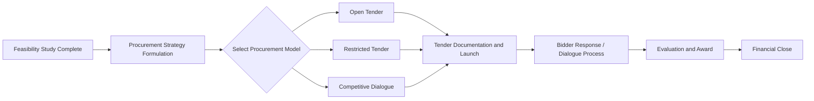
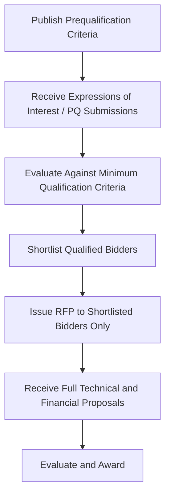

## Procurement Models: Open Tender, Restricted Tender, and Competitive Dialogue

### Definition and Purpose

Procurement model selection determines the structured process by which a contracting authority solicits, evaluates, and awards a Public-Private Partnership (PPP) contract to a private sector partner. The choice of procurement model directly affects competition intensity, transaction cost and duration, the government's ability to refine complex technical and financial requirements, and ultimately the Value for Money achieved. Open Tender, Restricted Tender, and Competitive Dialogue represent three points on a spectrum from maximum openness/simplicity to maximum flexibility for complex, non-standardized projects.

Selecting the appropriate model is a core early decision in procurement strategy, made after feasibility studies confirm project viability but before detailed tender documentation is finalized, since the chosen model shapes the entire subsequent tender design.

### Position Within the PPP Project Cycle



### Open Tender (Open Procedure)

#### Overview

Under Open Tender, the contracting authority publishes the invitation to tender publicly, and **any interested and qualified bidder may submit a full proposal** without a prior shortlisting stage. All submitted proposals are evaluated against pre-published criteria.

#### Characteristics

- **Single-stage process**: qualification and technical/financial evaluation typically occur together or in immediate sequence, without a separate pre-qualification round limiting who may bid.
- **Maximum openness**: designed to maximize competition and transparency, since no discretionary shortlisting occurs.
- **Fixed requirements**: the contracting authority must have a clear, largely finalized specification before launch, since there is no mechanism to iteratively refine requirements with bidders during the process.

#### When Appropriate

- Projects with **well-defined, standardized technical requirements** (e.g., a straightforward availability-payment road resurfacing concession, a standardized school-building program).
- Markets with **many potential bidders**, where pre-qualification would add cost/time without meaningfully narrowing a large or unclear field.
- Lower-complexity projects where extensive dialogue or negotiation is unlikely to improve outcomes.
- Jurisdictions or funding sources (e.g., certain public procurement regulations, EU public procurement directives for simpler contracts) that favor open procedures as the presumptive default for transparency reasons.

**Key Points:**

- Open Tender minimizes procurement duration and transaction cost relative to more elaborate models, but is poorly suited to complex, high-value infrastructure PPPs where requirements cannot be fully specified upfront — applying it to an overly complex project risks receiving non-compliant, poorly costed, or unworkable bids.
- Because there is no shortlisting stage, the contracting authority may need to evaluate a larger number of full proposals, which can itself increase evaluation cost and duration even though the process design is nominally "simple."

### Restricted Tender (Restricted Procedure / Two-Stage Prequalification)

#### Overview

Restricted Tender introduces a **two-stage process**: first, a Prequalification (PQ) stage in which the authority publishes minimum qualification criteria (technical capability, financial capacity, relevant experience/track record) and shortlists a limited number of qualified bidders; second, only shortlisted bidders are invited to submit full, detailed proposals in response to the Request for Proposals (RFP).



#### Characteristics

- **Two distinct stages** with different evaluation logic: PQ is typically pass/fail against minimum thresholds (financial standing, relevant experience, technical capacity), while the RFP stage involves substantive, often weighted, technical and financial evaluation.
- **Reduced field for detailed evaluation**: by the RFP stage, only bidders demonstrably capable of delivering the project remain, reducing the authority's evaluation burden and the number of parties incurring full bid-preparation costs.
- **No iterative dialogue with bidders on project requirements**: unlike Competitive Dialogue, the specification is generally fixed by the time the RFP is issued, though limited bidder queries/clarifications are typically permitted.

#### When Appropriate

- **Large, capital-intensive PPPs** where bid preparation costs are substantial (e.g., detailed technical design, financial modeling), making it important to limit the number of full bids required to those from credibly capable bidders.
- Projects requiring **specific technical or financial capacity thresholds** (e.g., demonstrated experience delivering comparable-scale infrastructure, minimum net worth or credit rating) that justify screening before inviting costly full proposals.
- Markets where an unrestricted open tender would likely attract many unqualified or non-serious bidders, imposing unnecessary evaluation burden.

**Key Points:**

- The prequalification criteria must be objective, proportionate, and clearly published in advance; overly restrictive or vaguely defined PQ criteria can be legally challenged as anti-competitive or discriminatory, particularly in jurisdictions with formal procurement challenge/protest mechanisms.
- Restricted Tender balances competition and efficiency better than Open Tender for complex, high-value projects, but like Open Tender, it still assumes the authority can specify requirements with reasonable precision before the RFP stage — it does not solve the problem of genuinely undefined or highly complex, negotiable project requirements.

### Competitive Dialogue

#### Overview

Competitive Dialogue is designed for **complex projects where the contracting authority cannot, in advance, fully define the technical, legal, or financial solution** required to meet its objectives. Rather than issuing a fixed specification, the authority engages in structured, iterative dialogue with a shortlisted group of bidders to develop and refine one or more viable solutions, before requesting final tenders based on the solution(s) developed through dialogue.

```mermaid
flowchart TD
    A[Publish Prequalification Criteria and Outline Requirements] --> B[Shortlist Qualified Bidders]
    B --> C[Dialogue Phase: Multiple Iterative Rounds]
    C --> D[Discuss Technical Solutions]
    C --> E[Discuss Financial Structuring]
    C --> F[Discuss Risk Allocation and Contract Terms]
    D --> G{Solution(s) Sufficiently Developed?}
    E --> G
    F --> G
    G -->|No| C
    G -->|Yes| H[Close Dialogue, Finalize Requirements]
    H --> I[Invite Final Tenders]
    I --> J[Evaluate Final Tenders and Award]
```

#### Characteristics

- **Iterative, multi-round dialogue** conducted individually (and typically confidentially, bidder-by-bidder) with each shortlisted participant, allowing the authority to explore different technical and financial approaches before committing to a final specification.
- **Solution development is genuinely open-ended** at the outset — the authority defines its needs and objectives (e.g., "reduce urban congestion on this corridor") rather than a prescriptive technical solution, and bidders propose and refine approaches through dialogue.
- **Confidentiality between bidders** is a critical procedural safeguard: the authority must not disclose one bidder's proposed solutions or commercially sensitive information to competing bidders during dialogue, to preserve fair competition and protect intellectual property in innovative solutions.
- **Formal closure of dialogue** occurs once the authority determines that one or more solutions can adequately meet its requirements, after which final tenders are invited based on the now-defined specification(s) — no further substantive negotiation on the fundamental solution typically occurs after this point, though limited clarification may be permitted depending on the governing procurement framework.

#### When Appropriate

- **Highly complex PPPs** involving novel technical solutions, innovative financing structures, or projects where multiple viable delivery approaches exist and the optimal approach is not obvious in advance (e.g., a major multi-modal transport hub, a complex water treatment and reuse system, large-scale urban regeneration PPPs).
- Projects where the authority's own technical capacity or market knowledge is insufficient to specify a detailed solution independently, and private sector expertise is needed to shape the ultimate specification.
- Contexts governed by procurement frameworks (e.g., EU public procurement directives, and jurisdictions that have adopted similar competitive dialogue provisions) that formally recognize Competitive Dialogue as an available procedure for sufficiently complex contracts.

**Key Points:**

- Competitive Dialogue is significantly more resource- and time-intensive for both the contracting authority and bidders than Open or Restricted Tender, given the multiple dialogue rounds required — this transaction cost must be justified by genuine project complexity, not used as a default for convenience.
- The dialogue process requires strong procedural governance (documented dialogue records, consistent treatment of all participants, clear rules on what may and may not be shared) to withstand legal challenge and maintain bidder confidence that the process is fair despite its inherently more discretionary, iterative nature compared to a fixed-specification tender.
- [Inference] Because Competitive Dialogue allows the authority to absorb private-sector innovation into the eventual specification, it can produce superior technical and financial outcomes for genuinely complex projects, but the specific magnitude of that benefit is project- and market-specific and difficult to generalize or benchmark precisely.

### Comparative Summary

| Dimension | Open Tender | Restricted Tender | Competitive Dialogue |
| --- | --- | --- | --- |
| Number of stages | Single stage | Two stages (PQ + RFP) | Multiple stages (PQ + dialogue rounds + final tender) |
| Specification maturity required | High (fixed upfront) | High (fixed by RFP stage) | Low to moderate (developed through dialogue) |
| Suitable project complexity | Low to moderate | Moderate to high | High/novel |
| Competition breadth | Maximum (open to all) | Narrowed via prequalification | Narrowed via prequalification |
| Transaction cost and duration | Lowest | Moderate | Highest |
| Bidder solution flexibility | None (fixed spec) | Limited (fixed spec, minor clarifications) | High (iteratively shaped) |
| Risk of unbankable/unworkable bids | Higher, if project is complex | Moderate | Lowest (solution tested through dialogue) |

**Example — Model Selection Logic:**

| Project | Recommended Model | Rationale |
| --- | --- | --- |
| Standardized rural road resurfacing concession, well-established technical specification | Open Tender | Simple, well-defined scope; many potential regional contractors; competition maximization is the priority |
| 500 MW greenfield power plant with conventional technology | Restricted Tender | High capital cost justifies PQ screening for financial/technical capacity; technical solution (conventional plant) is well understood and can be specified upfront |
| Multi-modal transit hub integrating rail, bus, and last-mile mobility with an untested revenue-sharing structure | Competitive Dialogue | Genuinely open technical and financial design question; authority benefits from private-sector-proposed solutions before finalizing specification |

### Additional Procurement Model Variants Relevant to PPPs

Beyond the three core models, several related or hybrid approaches commonly appear in PPP procurement practice and are useful to distinguish:

- **Negotiated Procedure (with or without prior publication)** — direct negotiation with one or a limited number of parties, generally reserved for exceptional circumstances (e.g., unsolicited proposals, sole viable supplier situations, extreme urgency), since it minimizes competitive tension and carries higher governance/transparency risk.
- **Competitive Procedure with Negotiation** — a hybrid retaining an initial tender submission but allowing subsequent negotiation rounds to refine bids, positioned as less intensive than full Competitive Dialogue while still permitting some iterative refinement.
- **Swiss Challenge** — used primarily for unsolicited proposals, where an original proponent's proposal is published and competing bidders are invited to submit better offers, with the original proponent typically given a right to match the best competing offer.
- **Best and Final Offer (BAFO)** — a closing mechanism often layered onto any of the above models, in which a small number of finalist bidders are invited to submit a final, improved offer after an initial evaluation round, used to sharpen competitive tension before final award.

**Output:** The procurement strategy document should explicitly justify the chosen model against project complexity, market capacity, and applicable legal/regulatory procurement framework, since this justification is often subject to audit or legal challenge, particularly where a more restrictive or discretionary model (Restricted Tender, Competitive Dialogue, or Negotiated Procedure) is chosen over the presumptively more competitive Open Tender.

### Common Pitfalls in Practice

- Defaulting to Competitive Dialogue for projects that are not genuinely complex, incurring unnecessary transaction cost and delay.
- Using Open Tender for a complex, high-value project, resulting in numerous non-compliant or unbankable bids and a failed or significantly delayed procurement.
- Setting prequalification criteria in Restricted Tender that are disproportionate to project requirements, either excluding capable bidders (reducing competition) or failing to meaningfully screen out incapable ones.
- Inadequate confidentiality controls during Competitive Dialogue, leading to bidder distrust, withdrawal from the process, or legal challenge.
- Failing to document the rationale for model selection, creating audit or legal vulnerability, particularly for more discretionary procedures.
- Allowing dialogue in Competitive Dialogue to continue indefinitely without a clear closure trigger, extending procurement timelines and increasing bid costs for all participants.

### Related Topics

- Prequalification Criteria Design and Bidder Capacity Assessment
- Request for Proposals (RFP) Structuring and Evaluation Criteria Design
- Unsolicited Proposals and Swiss Challenge Mechanisms
- Bid Evaluation Methodologies: Technical, Financial, and Combined Scoring
- Procurement Timeline Management and Transaction Cost Control
- Bankability Assessment from the Private Sector Perspective
- Legal and Regulatory Frameworks Governing Public Procurement
- Best and Final Offer (BAFO) Processes in PPP Tendering