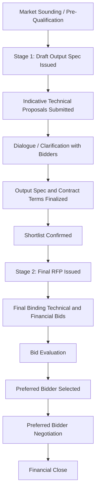
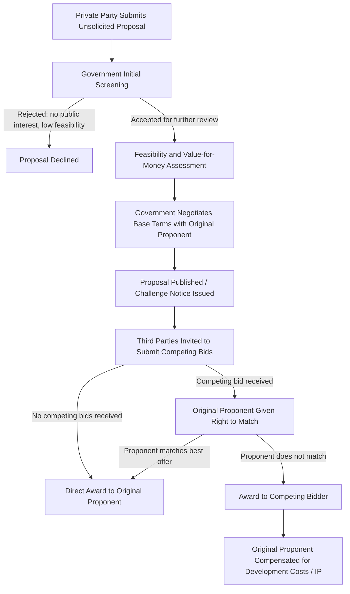

## Two-Stage Bidding and Swiss Challenge Processes

### Overview

Two-stage bidding and Swiss challenge are two distinct but related procurement mechanisms used in Public-Private Partnership (PPP) transactions to reconcile a core tension: the need for competitive, transparent tendering versus the need for design flexibility, unsolicited innovation, or negotiation on complex, high-value infrastructure projects. Both mechanisms deviate from single-stage sealed-bid competitive tendering, and both carry distinct integrity risks that procuring authorities must manage through structured safeguards.

- **Two-stage bidding** is a procurement method for solicited (government-initiated) projects where technical complexity or incomplete specifications make a single-stage bid impractical.
- **Swiss challenge** is a procurement method most often used for unsolicited proposals (private-sector-initiated), where an original proponent's idea is opened to competitive matching rather than negotiated directly.

### Two-Stage Bidding

#### Definition and Rationale

Two-stage bidding (also called "two-envelope" or "two-step" bidding in some jurisdictions, though those terms sometimes refer to a narrower variant) is used when the procuring authority knows *what* outcome it wants (e.g., a bulk water treatment facility, a toll road) but cannot fully specify *how* it should be designed, financed, or delivered at the outset. This is common in:

- Projects with significant technical uncertainty (e.g., novel engineering conditions, unproven technology)
- Projects where the authority wants to benefit from private-sector design innovation
- Large, complex PPPs where output specifications, risk allocation, or contractual terms need refinement based on market feedback before final commercial bids are locked in

#### Structure of the Two Stages

**Stage One: Technical/Conceptual Stage**

- Bidders submit non-binding or indicative technical proposals in response to a draft output specification and draft contract terms (often issued as an Invitation to Negotiate or Indicative Request for Proposals).
- No price or only indicative pricing is submitted.
- The authority (and sometimes bidders) uses this stage to clarify requirements, resolve ambiguities, refine risk allocation, and finalize the output specification and contract terms.
- Bidders may be shortlisted based on technical merit, financial capacity, and responsiveness.
- Interactive dialogue or negotiation with individual bidders is typically permitted at this stage (distinguishing it from single-stage tenders where post-bid negotiation is restricted).

**Stage Two: Final Binding Bid Stage**

- The authority issues a final Request for Proposals (RFP) incorporating the refined output specification and finalized (or near-final) contract terms.
- Shortlisted bidders submit final, binding technical and financial proposals.
- Bids are evaluated on a like-for-like basis since all bidders responded to the same finalized terms.
- The preferred bidder is selected, typically followed by a limited "preferred bidder" negotiation phase before financial close.

#### Process Flow Diagram

#### Key Points

- **Purpose**: converts an underspecified requirement into a fully bankable, competitively tested final bid.
- **Fairness mechanism**: because all shortlisted bidders negotiate against the *same* evolving draft terms, the process preserves competitive tension despite the dialogue element.
- **Common in**: World Bank and Asian Development Bank–financed PPPs, competitive dialogue procedures under EU procurement law (Directive 2014/24/EU), and large availability-based PPPs (hospitals, toll roads, water treatment plants).
- **Distinction from competitive dialogue**: competitive dialogue (an EU-specific procedure) is procedurally similar but has stricter rules on maintaining bidder anonymity of proposals during dialogue and on not disclosing one bidder's proposed solutions to another without consent.

#### Risks and Safeguards

| Risk | Safeguard |
| --- | --- |
| Information leakage between bidders during Stage 1 dialogue | Strict "Chinese wall" protocols; separate negotiation teams; confidentiality undertakings |
| Design/IP appropriation — authority incorporates one bidder's Stage 1 innovation into the final spec used by all | Contractual non-use clauses; compensation mechanisms for unsuccessful bidders' IP; anonymized dialogue where feasible |
| Scope creep or moving goalposts discouraging bidder participation | Clear change-control protocol between Stage 1 and Stage 2; capped number of dialogue rounds |
| Reduced competition if bidders drop out due to high Stage 1 costs | Bid cost reimbursement (break funding fee) for shortlisted, unsuccessful bidders who submit compliant final bids |
| Collusion risk from small shortlist | Maintain minimum of 3 bidders through Stage 2 where possible; monitor for bid coordination signals |

#### Example

A national government wants to procure a 300 MW independent power producer (IPP) facility but is uncertain whether gas-fired or hybrid solar-gas is more cost-effective given evolving fuel supply agreements.

1. **Stage 1**: The authority issues a draft output specification requiring "300 MW dispatchable capacity, 95% availability." Three pre-qualified consortia submit indicative technical concepts — one proposes pure gas, two propose hybrid solutions. Through dialogue, the authority learns that fuel supply guarantees are the binding constraint and revises the output specification and risk allocation matrix (shifting fuel supply risk partially to the authority via a fuel supply agreement (FSA) with a passthrough mechanism).
2. **Stage 2**: The finalized RFP, reflecting the revised risk allocation, is issued to all three shortlisted consortia. They submit binding levelized-cost-of-electricity (LCOE) bids and final technical designs.
3. The lowest-evaluated LCOE bid meeting technical compliance thresholds is selected as preferred bidder.

### Swiss Challenge Process

#### Definition and Rationale

The Swiss challenge is a procurement mechanism designed primarily to handle **unsolicited proposals (USPs)** — projects conceived and initially designed by a private party (the "original proponent") rather than tendered by government. It attempts to reconcile two competing goals:

- Rewarding and incentivizing private-sector innovation and initiative in identifying and structuring infrastructure opportunities
- Preserving competitive tension and value-for-money, since a direct negotiated award to the original proponent would bypass competition entirely

#### Standard Process Steps

#### Detailed Mechanics

1. **Unsolicited proposal submission**: A private party submits a project concept, often including a feasibility study, preliminary design, and financing plan, for a project not currently in the government's pipeline.
2. **Screening and evaluation**: The relevant PPP unit or contracting authority assesses:
   - Alignment with sector strategy and public need
   - Technical and financial feasibility
   - Absence of duplication with existing government plans
   - Preliminary value-for-money indication
3. **Original Proponent Status (OPS) and incentive**: If accepted, the proponent may be granted "original proponent" status, sometimes including a bid bonus (an evaluation scoring advantage, commonly 5-10%) or right to match, as compensation for having borne early development risk and cost.
4. **Challenge/publication**: The government publishes the key parameters of the proposal (or a summary sufficient to permit comparable bidding) and invites competing bids from the market within a defined window (commonly 60-120 days).
5. **Right to match (the "challenge")**: If a competing bid is received that is superior on the government's evaluation criteria, the original proponent is given a defined period (commonly 15-30 days) to match or beat the best competing offer.
   - If matched: contract awarded to the original proponent at the matched terms.
   - If not matched: contract awarded to the competing bidder.
6. **Compensation for unsuccessful original proponent**: In most well-designed Swiss challenge frameworks, if the original proponent loses to a competing bidder, they are entitled to reimbursement of development costs (and sometimes a premium) from either the winning bidder or the government, as compensation for the intellectual and financial investment in originating the project.

#### Key Points

- **Named after**: the mechanism resembles Swiss cantonal procurement practices though its formal legal codification and widespread PPP use developed independently across jurisdictions including the Philippines (BOT Law, RA 6957 as amended by RA 7718), India, Indonesia, South Africa, and several Latin American countries.
- **Distinguishing feature from two-stage bidding**: two-stage bidding is authority-initiated and competitive from the outset; Swiss challenge originates from a private proposal and introduces competition only after an initial bilateral development phase.
- **Legal basis varies by jurisdiction**: some countries codify Swiss challenge in PPP law with mandatory publication and matching-period rules (e.g., the Philippines' Build-Operate-Transfer Law IRR); others use it as an ad hoc administrative practice without a comprehensive statutory framework, which raises legal-certainty risk.

#### Risks and Criticisms

| Risk/Criticism | Explanation | Mitigation |
| --- | --- | --- |
| Weak competitive tension | The right-to-match advantage discourages third parties from investing in competing bids, since the incumbent has an inherent edge | Limit or eliminate bid bonuses; ensure sufficiently detailed publication for genuine competing bids; cap matching advantage |
| Information asymmetry | Original proponent has deep knowledge of the site/sector the government gained from them; competitors bid with less information | Require the authority to publish a reasonably complete summary; conduct independent due diligence before publication |
| Corruption and favoritism risk | The bilateral negotiation phase between government and original proponent occurs outside open competition, creating opportunities for undue influence | Independent evaluation committees; transparency/publication requirements; anti-corruption safeguards and conflict-of-interest disclosures |
| Discourages market-driven tendering | Overuse of Swiss challenge for USPs can crowd out proactive, better-planned solicited PPPs | Cap the proportion of pipeline projects sourced via USP; require sector-strategy alignment screening |
| Valuation disputes over development cost compensation | Original proponent and government/winning bidder may disagree on fair reimbursement | Pre-agreed compensation formulas or independent auditor-verified cost schedules specified before proposal acceptance |

[Inference] Empirical studies of Swiss challenge outcomes in several jurisdictions (e.g., Philippines transport PPPs, Indonesian toll roads) have found that competing bids are submitted in only a minority of challenges, which is frequently cited by multilateral development banks as evidence that the mechanism under-delivers on true price competition relative to open tendering — though outcomes vary significantly by how the framework is designed and enforced.

#### Example

A private infrastructure developer identifies an opportunity to build an elevated busway along a congested urban corridor not currently in the transport authority's pipeline.

1. The developer submits an unsolicited proposal with a feasibility study, preliminary alignment, ridership projections, and an indicative concession structure (25-year build-operate-transfer with toll/fare revenue).
2. The transport authority screens the proposal, confirms alignment with the city's transport master plan, and grants the developer "original proponent" status with a right to match.
3. The authority publishes a summary of the technical parameters (alignment, capacity, service standards) and financial structure (concession period, indicative fare formula) and opens a 90-day challenge window.
4. A second consortium submits a competing bid offering a shorter concession period (22 years) for the same service standards — a more favorable term for the government.
5. The original proponent is notified and given 30 days to match the 22-year term.
   - If matched, the original developer wins at 22 years.
   - If not matched, the competing consortium is awarded the contract, and the original proponent is reimbursed audited feasibility study and preliminary design costs (commonly $500,000-$2,000,000 depending on project scale, though exact figures are project-specific and [Unverified] without a specific case reference).

### Comparative Summary

| Dimension | Two-Stage Bidding | Swiss Challenge |
| --- | --- | --- |
| Initiator | Government (solicited) | Private party (unsolicited) |
| Competition timing | Competitive throughout (shortlist from Stage 1) | Bilateral first, competitive only at challenge stage |
| Primary purpose | Refine specifications/terms before locking in bids | Reward private innovation while preserving contestability |
| Key integrity risk | Information leakage/IP appropriation between bidders | Incumbent advantage suppressing genuine competing bids |
| Typical legal basis | General public procurement law, EU competitive dialogue rules, MDB procurement guidelines | PPP-specific unsolicited proposal regulations |
| Compensation mechanism | Bid cost reimbursement for unsuccessful shortlisted bidders | Development cost reimbursement for unsuccessful original proponent |

### Value-for-Money Considerations

Both mechanisms are assessed against the counterfactual of a standard single-stage open tender using a **Public Sector Comparator (PSC)** or equivalent value-for-money framework:

$$VfM_{adjusted} = PV(Cost_{PPP}) - PV(Cost_{PSC}) - Premium_{process}$$

Where $Premium_{process}$ [Inference] is a qualitative-to-quantitative adjustment some PPP units apply to account for the reduced competitive tension inherent in two-stage and Swiss challenge processes relative to fully open single-stage tendering; this adjustment is not universally standardized across jurisdictions and its application depends on the specific PPP unit's methodology.

### Related Topics

- Competitive Dialogue Procedure (EU Directive 2014/24/EU)
- Unsolicited Proposals: Policy Frameworks and Screening Criteria
- Public Sector Comparator and Value-for-Money Assessment
- Bid Bonus and Original Proponent Incentive Design
- Preferred Bidder Negotiation and Financial Close Process
- Anti-Collusion Safeguards in Infrastructure Procurement
- Development Cost Compensation Formulas in PPP Contracts
- Direct Negotiation vs. Competitive Tendering in PPP Procurement Law
- Philippine BOT Law (RA 7718) Unsolicited Proposal Rules