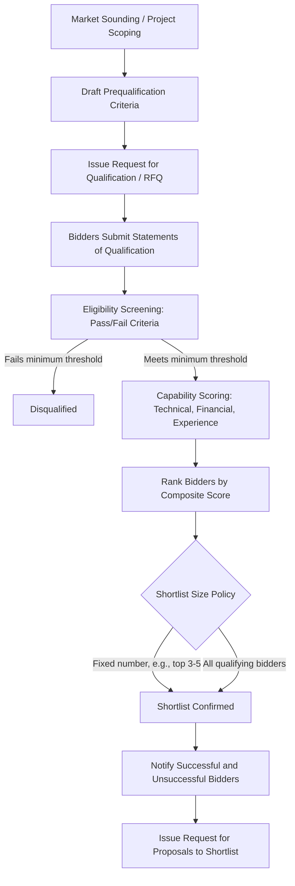

## Prequalification and Shortlisting of Bidders

### Overview

Prequalification and shortlisting is the procedural stage in PPP procurement that occurs before detailed bidding, in which the procuring authority screens prospective bidders (individual firms or consortia) against minimum eligibility and capability thresholds, then narrows the pool to a manageable, competitively meaningful shortlist invited to submit full proposals. The purpose is to filter out consortia lacking the technical, financial, and legal capacity to deliver a complex, long-tenor infrastructure asset, thereby reducing wasted bidding costs (for both bidders and the authority) while preserving genuine competition.

This stage is critical in PPPs specifically because of the scale, duration (often 20-30+ years), and risk-transfer complexity involved — unlike conventional public works procurement, a failed PPP concessionaire cannot simply be replaced mid-contract without significant disruption, refinancing complications, and potential termination payment liabilities.

### Objectives of Prequalification

- **Risk screening**: Exclude bidders who lack the financial strength, technical track record, or legal standing to bear long-term project risk.
- **Cost efficiency**: Limit the number of full proposals the authority must evaluate, and limit the number of bidders incurring high bid-preparation costs (often $1-10 million+ for major PPPs) on proposals unlikely to succeed.
- **Market testing**: Confirm sufficient market appetite exists before committing to a full tender process.
- **Fairness and transparency**: Establish objective, pre-disclosed criteria so that exclusion decisions are defensible and not arbitrary.

### Process Flow

### Stage 1: Defining Prequalification Criteria

Criteria are typically grouped into three categories, each with minimum pass/fail thresholds:

#### Legal and Eligibility Criteria

- Valid business registration/incorporation in relevant jurisdiction(s)
- No conflicts of interest (e.g., involvement in project preparation/advisory work)
- No history of debarment, blacklisting, or exclusion by the procuring government or multilateral development banks (World Bank, ADB, etc.)
- Compliance with anti-corruption declarations
- No ongoing insolvency, bankruptcy, or receivership proceedings

#### Technical/Experience Criteria

- Track record of having designed, built, financed, and/or operated comparable infrastructure assets (often expressed as: minimum number of projects of similar type/scale in the past 5-10 years)
- Minimum aggregate project value or capacity delivered (e.g., "at least one road project of minimum 50km" or "at least one power plant of minimum 100 MW")
- Relevant technology or operational expertise (e.g., desalination technology, rail signaling systems)
- Health, safety, and environmental (HSE) compliance record

#### Financial Capacity Criteria

- Minimum annual turnover or net worth thresholds (commonly set as a multiple of estimated project capital cost, e.g., average annual turnover ≥ 1x-2x estimated project cost over the last 3-5 years)
- Minimum credit rating (where applicable) or evidence of bankability
- Access to financing: letters of support/intent from lenders or equity sponsors
- Debt-to-equity capacity consistent with the project's anticipated financing structure

**Consortium-specific rules**: Since PPP bids are commonly submitted by consortia (a lead sponsor/developer, construction contractor, O&M operator, and sometimes a financial investor), prequalification criteria typically specify:

- Whether the lead member alone must meet the full financial threshold or whether it can be met collectively across consortium members
- A minimum equity stake the lead member/technical partner must hold (commonly 20-51%, ensuring skin in the game and preventing "shell" arrangements)
- Restrictions on member substitution between prequalification and final bid submission (to prevent bait-and-switch qualification gaming)
- Joint and several liability provisions among consortium members

### Stage 2: Evaluation Methodology

Two common approaches:

**Pass/Fail (Compliance-Based) Approach**

- Bidders either meet all minimum criteria or are excluded — no relative ranking among those who pass.
- All bidders meeting minimum thresholds proceed to the RFP stage.
- Simpler, more objective, minimizes discretion, but can result in large shortlists if many bidders qualify.

**Scored (Merit-Based) Approach**

- Bidders are scored numerically against weighted sub-criteria (e.g., technical experience 40%, financial capacity 40%, HSE record 20%).
- A composite score determines ranking.
- The authority sets a fixed shortlist size (e.g., top 3-6 bidders) or a minimum score threshold.
- More discriminating for high-demand projects with many qualified bidders, but requires more transparent scoring rubrics to withstand challenge.

A representative weighted scoring formula:

$$S_i = \sum_{j=1}^{n} w_j \cdot c_{ij}$$

Where $S_i$ is bidder $i$'s composite score, $w_j$ is the weight assigned to criterion $j$, and $c_{ij}$ is bidder $i$'s normalized score on criterion $j$.

### Determining Shortlist Size

There is a documented trade-off between competition intensity and bid-cost efficiency:

| Shortlist Size | Advantage | Disadvantage |
| --- | --- | --- |
| Large (6+) | Maximizes price competition, wider innovation pool | High aggregate bid costs across market, discourages participation due to low win probability, higher evaluation burden on authority |
| Moderate (3-5) | Balances genuine competition with manageable bid costs; industry-standard range for most PPPs | Some risk of collusion in very small candidate pools |
| Small (1-2) | Minimal bid cost burden | Effectively eliminates competitive tension; only justified for highly specialized or Swiss-challenge-type situations |

[Inference] Multilateral development banks and PPP units commonly recommend a shortlist of 3-5 bidders for capital-intensive PPPs as the empirical sweet spot balancing competitive tension against the deterrent effect of high bid-preparation costs, though the optimal number varies by sector, project size, and market depth, and is not a fixed universal rule.

### Key Points

- **Two-envelope prequalification** is sometimes merged with two-stage bidding: RFQ (prequalification) → Stage 1 (technical dialogue) → Stage 2 (final binding bids).
- **Standalone RFQ vs. combined RFQ/RFP**: Complex, high-value PPPs typically separate prequalification (RFQ) from the bid stage (RFP) into distinct procedural steps; smaller or simpler PPPs sometimes combine both into a single-stage tender with prequalification embedded as an initial compliance check.
- **Debriefing and challenge rights**: Good-practice frameworks require the authority to provide written reasons to unsuccessful bidders and allow a formal challenge/protest period, reducing litigation risk and preserving market confidence in future tenders.
- **Bid bond/security at prequalification**: Some jurisdictions require a bid security or prequalification bond, forfeited if a prequalified bidder later withdraws without cause — this discourages speculative applications.

### Risks and Mitigations

| Risk | Mitigation |
| --- | --- |
| Criteria set too narrowly, favoring incumbents or specific firms | Independent legal/technical review of RFQ criteria before issuance; market sounding to calibrate thresholds against actual market capacity |
| Criteria set too loosely, producing an unwieldy shortlist | Combine pass/fail eligibility with a capped, merit-ranked shortlist |
| Consortium gaming (weak member added just to meet aggregate threshold, later removed) | Lock-in clauses restricting consortium composition changes between prequalification and bid submission without authority consent |
| Legal challenges over subjective scoring | Publish detailed, weighted scoring criteria in the RFQ; use independent evaluation panels with documented scoring justifications |
| Insufficient bidder interest (only 1-2 qualify) | Extend prequalification deadline, revise criteria, or consider restructuring project scope/risk allocation before re-issuing RFQ |

### Example

A government tenders a 500 MW combined-cycle gas power PPP.

1. **RFQ issued** requiring: (a) minimum one 300+ MW power plant developed and operated in the last 10 years by the lead consortium member; (b) minimum average annual turnover of $200 million over 3 years across the consortium; (c) no debarment by IFC, World Bank, or ADB; (d) lead technical partner holds ≥30% consortium equity.
2. **Eight consortia submit** statements of qualification.
3. **Screening**: Two are disqualified for failing the minimum project-experience threshold; one is disqualified due to an active debarment finding.
4. **Scoring** of the remaining five: technical experience (40%), financial capacity (35%), HSE record (15%), local content commitment (10%).
5. **Shortlist**: Top four scoring consortia are invited to submit full technical and financial proposals in the RFP stage; the fifth-ranked bidder is debriefed with written reasons and given a 14-day protest window.

### Related Topics

- Request for Qualification (RFQ) Drafting and Structuring
- Consortium Structuring and Joint Venture Agreements in PPP Bids
- Bid Bonds, Prequalification Bonds, and Performance Security
- Two-Stage Bidding and Swiss Challenge Processes
- Bidder Debriefing and Procurement Challenge/Protest Mechanisms
- Market Sounding and Pre-Tender Industry Consultation
- Consortium Lock-In and Change-of-Control Restrictions
- Evaluation Committee Governance and Conflict-of-Interest Controls