## Drafting Requests for Proposals and Tender Documentation

### Overview

The Request for Proposals (RFP) and its accompanying tender documentation constitute the legal, technical, and commercial foundation of a PPP transaction. This document set defines what the private party is being asked to deliver, how it will be evaluated, what contractual terms will govern the relationship, and what risk allocation the parties will operate under for the life of the concession. Poorly drafted tender documentation is one of the most common root causes of PPP disputes, renegotiations, and failed transactions — ambiguities or gaps at this stage propagate through the entire project lifecycle, often for 20-30+ years.

Unlike conventional procurement documents, PPP tender documentation must simultaneously function as: a procurement instrument (defining evaluation and award procedures), a technical specification (defining outputs, not just inputs), a risk allocation framework, and effectively a near-final draft of the long-term contract itself.

### Core Components of the Tender Documentation Set

```mermaid
flowchart TD
    A[Tender Documentation Set] --> B[Instructions to Bidders / ITB]
    A --> C[Output Specification / Technical Requirements]
    A --> D[Draft PPP Agreement / Concession Contract]
    A --> E[Evaluation Criteria and Methodology]
    A --> F[Commercial and Financial Requirements]
    A --> G[Forms, Schedules, and Annexes]
    B --> B1[Submission procedures and deadlines]
    B --> B2[Eligibility confirmation]
    B --> B3[Clarification and query process]
    C --> C1[Performance/output-based specs]
    C --> C2[Service level agreements / KPIs]
    D --> D1[Risk allocation matrix]
    D --> D2[Payment mechanism]
    D --> D3[Step-in and termination provisions]
    E --> E1[Technical scoring criteria]
    E --> E2[Financial scoring criteria]
    E --> E3[Combined evaluation formula]
    F --> F1[Bid bonds / securities]
    F --> F2[Financial model requirements]
    G --> G1[Legal forms and declarations]
    G --> G2[Standard form letters]
```

### Instructions to Bidders (ITB)

The ITB governs the procedural mechanics of the tender process itself:

- **Eligibility and submission requirements**: format, number of copies, sealed-envelope or electronic submission protocols, deadlines
- **Bid validity period**: the duration for which submitted bids remain binding (commonly 120-180 days for major PPPs, given lengthy evaluation and approval timelines)
- **Clarification procedure**: formal mechanism (often a structured Q&A period with published consolidated answers) for bidders to seek clarification without informal side-channel communication
- **Bid security requirements**: bid bonds (typically 1-3% of estimated project value) to discourage frivolous or non-serious bids
- **Rules on bid modification/withdrawal**: conditions under which bidders may amend or withdraw submissions before the deadline
- **Confidentiality and non-collusion undertakings**
- **Rights reserved by the authority**: right to reject all bids, right to negotiate with preferred bidder, right to cancel the tender without liability

### Output Specifications (Not Input Specifications)

A defining feature of PPP tender documentation, distinguishing it from traditional public works procurement, is the use of **output-based** (performance-based) specifications rather than input/prescriptive specifications.

| Input Specification (Traditional) | Output Specification (PPP) |
| --- | --- |
| "Use asphalt concrete of X thickness with Y material grade" | "Maintain road surface at International Roughness Index ≤ 2.5 for 25 years" |
| "Install HVAC system of specific brand/model" | "Maintain indoor temperature between 22-26°C, 95% of operating hours" |
| Prescribes the method | Prescribes the result, leaving method to bidder's design discretion |

**Rationale**: output specifications transfer design and innovation risk to the private party, who is best placed to determine the most efficient means of achieving the performance outcome, and they enable genuine whole-of-life optimization (since the same entity that designs and builds will also operate and maintain).

**Key drafting principles**:

- Specify measurable, auditable performance indicators — avoid subjective or unmeasurable standards
- Include a clear baseline/definition for each KPI, measurement methodology, and monitoring frequency
- Tie specification breaches directly to the payment mechanism (deductions) and, for repeated/severe breaches, to termination triggers
- Avoid excessive prescriptiveness that inadvertently reintroduces input-specification rigidity (a common drafting error that undermines the output-based rationale)

### Draft PPP Agreement / Concession Contract

Most authorities issue the draft contract as part of the tender documentation itself (not negotiated from scratch post-award), so bidders price and structure their bids against known contractual terms. Core schedules typically include:

- **Risk allocation matrix**: explicit table assigning each identified project risk (construction, demand, financing, force majeure, political, currency, regulatory) to the party best able to manage or bear it
- **Payment mechanism**: formula linking availability/performance to payment (for availability-based PPPs) or the toll/tariff structure and revenue-sharing/support mechanisms (for demand-based PPPs)
- **Step-in rights**: procedures allowing the authority or lenders to intervene in cases of default without immediately terminating the contract
- **Termination provisions**: termination for default, authority convenience, and force majeure, each with associated compensation formulas
- **Change in law and relief event provisions**
- **Handback requirements**: condition standards the asset must meet at contract expiry/transfer

**Drafting caution**: [Inference] issuing an overly negotiable or heavily bracketed draft contract at tender stage is widely regarded in PPP practice as increasing post-award renegotiation risk and prolonging the preferred-bidder period, since it signals to bidders that commercial terms remain open — most mature PPP frameworks therefore aim to finalize contract terms as close to "non-negotiable" as feasible before RFP issuance, reserving negotiation for limited, clearly scoped items.

### Evaluation Criteria and Methodology

Must be disclosed in full within the RFP (not applied retroactively) to withstand legal challenge and preserve bidder confidence. Common structures:

**Two-Envelope System**

- Envelope 1: Technical proposal (design, methodology, experience, management plan)
- Envelope 2: Financial proposal (price, tariff, or subsidy request)
- Technical envelope opened and scored first; financial envelope opened only for bidders meeting the minimum technical threshold

**Combined Scoring Formula** (common approach):

$$Score_{final} = (w_T \times Score_{technical}) + (w_F \times Score_{financial})$$

Where $w_T + w_F = 1$, and weights commonly range from 70/30 to 30/70 technical/financial depending on project complexity — more technically complex or innovation-dependent projects weight technical scoring more heavily.

**Least-Present-Value-of-Revenue (LPVR)** or **Lowest Tariff/Subsidy** bidding: for demand-risk PPPs, bids are sometimes ranked purely on a single financial variable (e.g., lowest toll, shortest concession period, or lowest government subsidy requested) once minimum technical compliance is confirmed — this simplifies evaluation and reduces evaluator discretion but requires very tightly specified technical minimums to prevent quality shortfalls.

### Financial Model and Commercial Requirements

- Bidders are commonly required to submit a **financial model** (in a prescribed template/format) demonstrating bankability, capital structure (debt-to-equity ratio), pricing assumptions, and sensitivity analysis
- **Debt-to-equity ratio disclosure**: authorities often specify a maximum/typical gearing assumption (e.g., 70:30 or 80:20 debt-to-equity) to ensure comparability across bids and confirm realistic financing assumptions
- **Committed financing evidence**: letters of intent/commitment from lenders and equity sponsors, sometimes with increasing binding force through preferred-bidder stage
- **Currency and inflation-indexation mechanisms** for tariffs or payments

### Key Points

- **Consistency across documents** is critical: the risk allocation matrix, payment mechanism, output specification, and draft contract must align — internal contradictions between documents are a frequent source of bidder queries and later disputes.
- **Bidder query/clarification transparency**: all clarifications and amendments must be issued to all bidders simultaneously (via addenda) to preserve a level playing field.
- **Legal review before issuance**: draft contracts and tender documents typically undergo legal vetting against the enabling PPP law/framework and, where applicable, MDB procurement guidelines (World Bank, ADB, IFC) if co-financed.
- **Standardization vs. project-specific tailoring**: many jurisdictions and MDBs maintain standardized RFP/contract templates by sector (roads, water, health) to reduce transaction costs and legal risk, while retaining schedules for project-specific technical and commercial terms.

### Common Drafting Pitfalls

| Pitfall | Consequence | Mitigation |
| --- | --- | --- |
| Ambiguous or unmeasurable KPIs | Disputes over payment deductions during operations | Define KPIs with explicit measurement methodology and thresholds before issuance |
| Inconsistent risk allocation between narrative text and contract schedules | Bidder confusion, inflated risk premiums in bids | Cross-check all documents against a single master risk matrix before finalization |
| Overly broad change-in-law or force majeure definitions | Excessive compensation claims during operations | Narrowly and precisely define triggering events, distinguishing general and specific change-in-law |
| Evaluation criteria not fully disclosed or open to late modification | Legal challenges, procurement annulment risk | Lock and publish full evaluation methodology in the RFP; require formal addenda for any changes |
| Unrealistic timelines for bid preparation given project complexity | Reduced bidder participation, "check-the-box" low-quality bids | Benchmark bid preparation periods against comparable regional PPPs (commonly 4-9 months for complex projects) |

### Example: Output Specification Excerpt (Toll Road PPP)

Rather than specifying pavement composition, an output-based clause would read:

> "The Concessionaire shall maintain the Carriageway such that the International Roughness Index (IRI) does not exceed 2.5 m/km on any 100-meter segment, measured quarterly via laser profilometer survey. Non-compliance identified in two consecutive quarterly surveys on the same segment shall trigger a Performance Deduction of [X]% of the Monthly Availability Payment attributable to that segment, calculated per Schedule [Payment Mechanism]."

This ties a measurable, auditable output (IRI threshold) directly to a defined monitoring method and a quantified financial consequence — avoiding both vague standards ("maintain in good condition") and prescriptive input specifications.

### Related Topics

- Output-Based Specifications and Performance Standards Drafting
- Risk Allocation Matrix Design in PPP Contracts
- Payment Mechanism Design: Availability Payments vs. Demand-Based Tariffs
- Bid Evaluation Methodologies: Two-Envelope and Combined Scoring Systems
- Financial Model Requirements and Bankability Assessment
- Change in Law and Force Majeure Clause Drafting
- Standardized PPP Contract Templates (World Bank, ADB Model Agreements)
- Bidder Query Management and Addenda Procedures