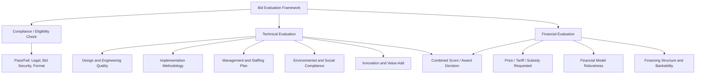

## Bid Evaluation Criteria and Scoring Methodologies

### Overview

Bid evaluation is the procedural and analytical process by which a procuring authority assesses competing PPP proposals against pre-disclosed criteria to select a preferred bidder. Because PPP contracts commit public resources and risk allocation for multi-decade terms, evaluation methodology design carries outsized importance: it must simultaneously ensure value-for-money, technical adequacy, financial robustness, legal defensibility, and resistance to manipulation or collusion. Evaluation criteria and their relative weighting must be fully disclosed in the tender documentation before bid submission — retroactive or undisclosed criteria are a leading cause of procurement challenges and annulments.

### Categories of Evaluation Criteria

### Stage 1: Compliance/Eligibility Screening

Before substantive evaluation, bids undergo a threshold pass/fail check:

- Bid security/bond submitted in correct form and amount
- Submission within deadline and required format (sealed envelopes, page limits, required forms)
- All mandatory declarations and legal documents included
- No material deviations from mandatory tender conditions

Bids failing this stage are typically disqualified without further technical or financial review, regardless of underlying quality — this stage is designed to be objective and non-discretionary to minimize challenge risk.

### Stage 2: Technical Evaluation

Technical evaluation assesses whether — and how well — a bidder's proposed solution meets the output specification. Common sub-criteria and illustrative weightings:

| Sub-Criterion | Typical Weight Range | What It Assesses |
| --- | --- | --- |
| Design/engineering solution quality | 25-35% | Technical soundness, compliance with output specs, design life |
| Implementation/construction methodology | 15-25% | Realistic scheduling, risk mitigation during construction |
| Operations and maintenance plan | 15-25% | Whole-of-life asset management approach, staffing adequacy |
| Track record and key personnel experience | 10-20% | Demonstrated delivery capability on comparable projects |
| Environmental, social, and safety management | 10-15% | Compliance with ESIA requirements, HSE systems |
| Innovation / value-added proposals | 5-15% | Technical or commercial innovations beyond minimum spec |

**Minimum technical threshold**: most frameworks set a minimum passing technical score (commonly 70-80 out of 100) below which a bid is disqualified regardless of its financial offer — this prevents award to technically inadequate but cheap proposals.

**Scoring approach**: technical criteria are typically scored by an independent evaluation panel using a structured rubric (e.g., 1-5 or 1-10 scale per sub-criterion, converted to weighted points) to reduce subjectivity. Panels commonly include technical, financial, legal, and environmental specialists, sometimes with an independent/external member to enhance credibility.

### Stage 3: Financial Evaluation

The financial evaluation methodology depends heavily on the PPP's underlying commercial structure:

#### Lowest Cost to Government (Availability-Based PPPs)

Bids are ranked by the lowest present value of availability payments requested from the authority over the concession term:

$$PV_{payments} = \sum_{t=1}^{n} \frac{AP_t}{(1+r)^t}$$

Where $AP_t$ is the availability payment in year $t$ and $r$ is the discount rate specified in the RFP (often the authority's cost of capital or a standardized social discount rate).

#### Least Present Value of Revenue (LPVR) (Demand-Risk PPPs)

Used for toll roads and similar projects; the bidder requesting the shortest revenue-collection period (or lowest total revenue) to recoup investment wins, rather than fixing the concession term and competing on toll rates. [Inference] LPVR is generally regarded in PPP practice as reducing demand-forecasting risk transferred to bidders relative to fixed-term concessions, since the concession length flexes to match actual traffic outcomes rather than requiring bidders to price uncertain long-term demand into a fixed-term bid — though it introduces its own complexities in revenue verification and audit.

#### Lowest Tariff/Subsidy Requested

Bidders compete on the lowest tariff charged to end-users (e.g., water utilities) or the lowest government subsidy/viability gap funding requested, holding technical specifications constant.

#### Combined Technical-Financial Scoring

Where both technical differentiation and price matter, a weighted formula combines both:

$$Score_{total} = \left(\frac{Score_{technical}}{Score_{technical,max}} \times w_T \times 100\right) + \left(\frac{Price_{lowest}}{Price_{bidder}} \times w_F \times 100\right)$$

This normalizes both technical and financial scores to a comparable 0-100 scale before applying weights $w_T$ and $w_F$ (which sum to 1).

### Evaluation Methodology Comparison

| Methodology | Best Suited For | Advantage | Limitation |
| --- | --- | --- | --- |
| Pass/fail technical + lowest price | Simple, well-specified projects | Objective, minimal discretion, fast | Ignores quality differentiation above minimum threshold |
| Weighted technical-financial scoring | Complex, innovation-sensitive projects | Rewards quality and value-add | More subjective, requires robust rubric and panel governance |
| LPVR | Toll roads and demand-risk concessions | Reduces demand-risk mispricing | Requires reliable revenue audit/verification mechanisms |
| Lowest subsidy/tariff | Utility PPPs with social pricing objectives | Directly minimizes public cost or end-user cost | Can incentivize unrealistically low bids (see below) |

### Handling Abnormally Low Bids

A recurring evaluation challenge is distinguishing genuinely efficient low bids from unsustainably low ("lowball") bids submitted to win the contract with intent to renegotiate post-award. Common safeguards:

- **Abnormally low bid (ALB) thresholds**: bids priced significantly below the average of all compliant bids (commonly 15-20% below the mean, or below the second-lowest bid by a defined margin) trigger mandatory additional scrutiny
- **Bidder justification requirement**: bidders whose prices trigger the ALB threshold must submit detailed cost breakdowns and justification; the authority may reject the bid if justification is inadequate
- **Anti-renegotiation contractual provisions**: penalty clauses or restrictions on early renegotiation requests, particularly within a defined "lock-in" period post-financial-close
- [Inference] Some PPP frameworks additionally require a performance/completion bond scaled to the bid price rather than a fixed amount, which raises the cost of an unrealistically low bid and provides a partial disincentive against strategic underbidding, though this is not a universal design feature across jurisdictions.

### Governance and Integrity Safeguards

| Safeguard | Purpose |
| --- | --- |
| Independent evaluation committee with documented scoring | Reduces single-point discretion and corruption risk |
| Sealed/simultaneous envelope opening in presence of bidder representatives | Transparency and tamper-evidence |
| Conflict-of-interest declarations by evaluators | Prevents bias from prior relationships with bidders |
| Pre-disclosed, immutable evaluation criteria | Prevents retroactive criteria manipulation |
| Formal scoring audit trail and evaluation report | Supports defensibility against legal challenge |
| Debriefing and protest/challenge period for unsuccessful bidders | Preserves market confidence, surfaces process errors |

### Key Points

- **Full disclosure is mandatory**: evaluation weights and methodology must appear in the RFP itself; undisclosed or post-hoc criteria expose the process to legal challenge and annulment.
- **Technical-financial sequencing matters**: in two-envelope systems, financial envelopes are typically opened only after technical evaluation is finalized and locked, preventing technical scores from being influenced (consciously or not) by knowledge of price.
- **Consistency with tender documentation**: evaluation criteria must align precisely with the output specification and risk allocation matrix — evaluating on criteria not grounded in the RFP's technical requirements is a common ground for challenge.
- **Multilateral development bank requirements**: MDB-financed PPPs (World Bank, ADB, IFC) typically impose their own procurement guidelines on evaluation methodology, often requiring quality-cost-based selection or fixed-budget selection variants analogous to consulting-services procurement frameworks.

### Example

A water treatment PPP RFP specifies:

- Minimum technical score to qualify: 75/100
- Technical weight: 30%, Financial weight: 70% (reflecting a well-specified, less innovation-dependent asset class)
- Financial criterion: lowest levelized water tariff ($/m³) over the 25-year concession

Three compliant bidders score 82, 88, and 91 on technical merit (all above the 75 threshold, so all proceed to financial evaluation). Financial envelopes are then opened:

| Bidder | Technical Score | Tariff Bid ($/m³) | Normalized Financial Score | Combined Score |
| --- | --- | --- | --- | --- |
| A | 82 | 0.85 | 100 (lowest tariff) | (82/100×30) + (100×70) = 24.6 + 70 = 94.6 |
| B | 88 | 0.95 | 89.5 | (88/100×30) + (89.5×70) = 26.4 + 62.65 = 89.05 |
| C | 91 | 1.05 | 81.0 | (91/100×30) + (81.0×70) = 27.3 + 56.7 = 84.0 |

Bidder A is awarded preferred bidder status due to the highest combined score, despite not having the highest technical score — illustrating how weighting design directly determines outcomes and must be calibrated deliberately to the authority's actual priorities before tender issuance.

### Related Topics

- Drafting Requests for Proposals and Tender Documentation
- Abnormally Low Bid Detection and Anti-Renegotiation Safeguards
- Least Present Value of Revenue (LPVR) Bidding Mechanisms
- Independent Evaluation Committee Governance
- Bidder Debriefing and Procurement Challenge/Protest Mechanisms
- Public Sector Comparator and Value-for-Money Assessment
- Two-Envelope and Multi-Envelope Bid Submission Systems
- Multilateral Development Bank Procurement Guidelines (World Bank, ADB, IFC)