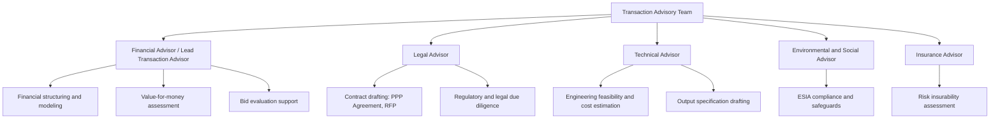
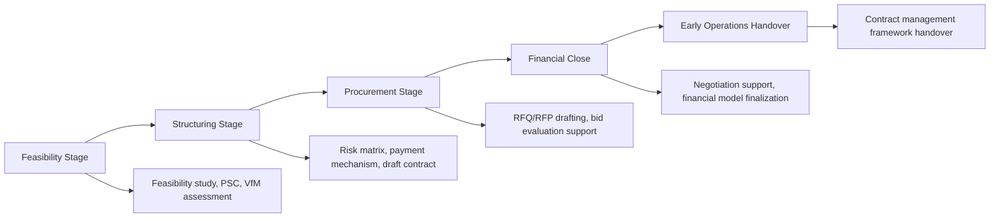

## Role of Transaction Advisors

### Overview

Transaction advisors are specialized external professionals engaged by a procuring authority (or, less commonly, by a private sponsor) to provide technical, financial, legal, and procedural expertise throughout the PPP project cycle — from feasibility and structuring through procurement to financial close, and sometimes into early operations. Because most government agencies lack in-house capacity to structure and negotiate complex, multi-decade infrastructure concessions, transaction advisors function as a critical capacity-substitution mechanism, translating policy objectives into a bankable, competitively tendered, and legally sound transaction.

### Why Transaction Advisors Are Needed

- **Capacity gap**: government procurement agencies rarely have permanent staff experienced in project finance structuring, PPP risk allocation, or complex commercial negotiation at the scale required.
- **Specialized, intermittent need**: PPP transaction skills (financial modeling, risk matrix design, lender due diligence coordination) are not needed continuously, making in-house retention inefficient relative to project-based engagement.
- **Market credibility**: engaging reputable advisors signals transaction seriousness and bankability to prospective bidders and lenders, improving market response.
- **Conflict-of-interest management**: independent advisors provide arms-length technical/financial opinions that support governance and audit requirements, distinct from the authority's own institutional interests.

### Categories of Transaction Advisors

#### Financial Advisor (often "Lead Transaction Advisor" or "Lead Advisor")

- Structures the overall commercial and financing framework: payment mechanism design, capital structure assumptions, government support instruments (guarantees, viability gap funding)
- Builds or reviews the project's financial model and Public Sector Comparator for value-for-money assessment
- Coordinates the overall transaction timeline and workstream integration across legal, technical, and environmental advisors
- Supports bid evaluation, particularly financial proposal assessment and bankability review
- Typically an investment bank, specialized infrastructure advisory firm, or Big Four advisory practice

#### Legal Advisor

- Drafts and reviews the RFP, draft PPP/concession agreement, and all supporting legal schedules
- Conducts legal due diligence on land tenure, regulatory approvals, and enabling legislation
- Advises on compliance with the jurisdiction's PPP law, public procurement law, and (where applicable) international arbitration/dispute resolution frameworks
- Reviews consortium/JV structures and shareholder agreements submitted by bidders

#### Technical Advisor

- Prepares or reviews engineering feasibility studies, cost estimates, and design standards
- Drafts the output specification and performance/KPI framework
- Assesses technical bids for compliance and engineering soundness during evaluation
- Advises on construction and O&M risk allocation

#### Environmental and Social Advisor

- Conducts or reviews Environmental and Social Impact Assessments (ESIA)
- Ensures compliance with national environmental law and, where relevant, lender/MDB safeguard policies (e.g., IFC Performance Standards, World Bank Environmental and Social Framework)
- Advises on resettlement action plans (RAP) where land acquisition or displacement is involved

#### Insurance Advisor (sometimes embedded within technical or financial advisory scope)

- Assesses insurability of project risks and appropriate insurance package requirements for bidders

### Engagement Models

| Model | Description | Typical Use Case |
| --- | --- | --- |
| Single lead advisor with sub-consultants | One firm holds overall contract, subcontracts specialist legal/technical/environmental input | Simpler or medium-complexity projects; single point of accountability |
| Multiple direct-contracted advisors | Authority separately contracts financial, legal, and technical advisors, coordinated by an in-house PPP unit or project team | Large, complex projects (major toll roads, airports, power plants) requiring deep specialist input in each domain |
| MDB-provided or co-financed advisory support | Advisory costs funded or subsidized by a multilateral development bank or dedicated PPP facility (e.g., PPIAF, IFC InfraVentures) | Lower-income or emerging-market contexts with limited government advisory budgets |
| Success-fee-based advisory | Advisor compensation includes a fee contingent on reaching financial close | Common for financial advisors; incentivizes deal completion but raises independence concerns (see below) |

### Procurement and Independence of Advisors

Because transaction advisors substantially shape the terms bidders will compete on, their own selection and independence are governed by safeguards:

- **Competitive procurement of advisors**: authorities typically procure transaction advisors through their own competitive tender (often quality-and-cost-based selection), rather than sole-source appointment, to ensure advisor quality and value-for-money.
- **Conflict-of-interest restrictions**: firms advising the government on a transaction are generally barred from simultaneously advising bidders, financiers, or sponsors on the same transaction; unsolicited-proposal originators are typically barred from receiving the subsequent transaction advisory mandate for their own proposal.
- **Success-fee structuring caution**: [Inference] while success fees can align advisor incentives with reaching financial close efficiently, PPP governance guidance frequently flags that a purely success-fee-based mandate risks incentivizing advisors to push a transaction to close even where terms are suboptimal for the public sector, which is why many frameworks combine a fixed retainer with a capped or moderate success component rather than a fee structure that is entirely contingent.
- **Government PPP unit oversight**: a dedicated PPP unit or project steering committee within government commonly retains final decision-making authority, using advisors in a purely advisory (non-decision-making) capacity to preserve public accountability.

### Key Deliverables Across the Project Cycle

| Project Stage | Typical Advisor Deliverables |
| --- | --- |
| Feasibility | Feasibility study, Public Sector Comparator, preliminary risk allocation, VfM assessment |
| Structuring | Detailed risk allocation matrix, payment mechanism design, financing structure options, government support instrument design |
| Procurement | Draft RFQ/RFP, evaluation criteria design, bidder query management, bid evaluation reports |
| Preferred bidder / financial close | Negotiation support, financial model audit/certification, condition precedent tracking, lender due diligence coordination |
| Post-close / early operations | Handover of contract management tools, KPI monitoring frameworks, sometimes ongoing contract management advisory |

### Risks and Governance Considerations

| Risk | Mitigation |
| --- | --- |
| Advisor capture / undue influence over transaction structure | Institutional PPP unit retains decision authority; advisors provide recommendations, not binding decisions |
| Conflicts of interest (advisor also serving bidder-side interests) | Strict conflict screening at advisor procurement; contractual non-compete/confidentiality clauses |
| Success-fee incentive misalignment | Blended fixed/success fee structures; independent VfM sign-off separate from advisor recommendation |
| Loss of institutional knowledge after advisor contract ends | Structured knowledge transfer requirements; parallel building of in-house PPP unit capacity |
| Advisor quality variance across firms/markets | Competitive, criteria-based advisor selection; reference checks against comparable prior mandates |
| Cost of advisory services relative to project/government budget | MDB or PPP facility co-financing of advisory costs; scaling advisor scope to project complexity |

### Key Points

- **Not decision-makers**: transaction advisors provide expert recommendations; ultimate procurement and contract-award decisions remain with the government authority to preserve accountability and public-sector ownership of the transaction.
- **Cross-functional coordination is essential**: financial, legal, technical, and environmental advisors must work from a single consistent risk allocation matrix and output specification — siloed advisory work is a common source of internal document inconsistency (see also: Drafting Requests for Proposals and Tender Documentation).
- **Advisory cost is typically a small fraction of total project cost** but has outsized influence on lifecycle value-for-money outcomes, since structuring errors at this stage are costly or impossible to fully correct later.
- **Capacity-building objective**: well-designed advisory mandates often include explicit knowledge-transfer or co-working requirements with government PPP unit staff, aiming to build sustainable in-house capacity over successive transactions rather than perpetual advisor dependency.

### Example

A government preparing a 400-bed hospital PPP (design-build-finance-maintain, DBFM structure) engages:

- A **lead financial advisor** (international infrastructure advisory firm) to structure the availability-payment mechanism, build the value-for-money comparator against traditional procurement, and lead overall transaction coordination
- A **legal advisor** (local law firm partnered with international counsel) to draft the concession agreement and RFP, ensuring compliance with the national PPP law
- A **technical/healthcare infrastructure advisor** to define clinical and facilities-management output specifications (e.g., equipment lifecycle standards, non-clinical service KPIs such as cleaning and catering)
- An **environmental and social advisor** to complete the ESIA given the site's urban location and any resettlement implications

The financial advisor coordinates all four workstreams into a single, internally consistent RFP package, with the government's PPP unit reviewing and formally approving each milestone deliverable before procurement launch.

### Related Topics

- Public Sector Comparator and Value-for-Money Assessment
- PPP Unit Institutional Design and Government Capacity Building
- Conflict-of-Interest Management in PPP Advisory Engagements
- Drafting Requests for Proposals and Tender Documentation
- Government Support Instruments: Guarantees and Viability Gap Funding
- Multilateral Development Bank Advisory Facilities (PPIAF, IFC InfraVentures)
- Financial Model Structuring and Certification for PPP Bids
- Environmental and Social Impact Assessment (ESIA) in Infrastructure Projects