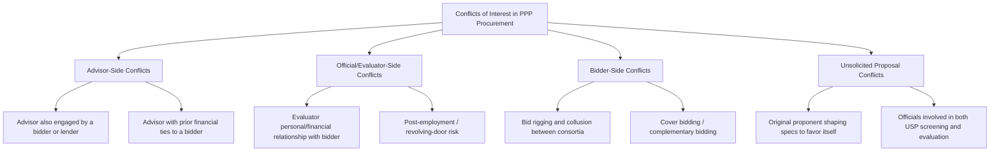
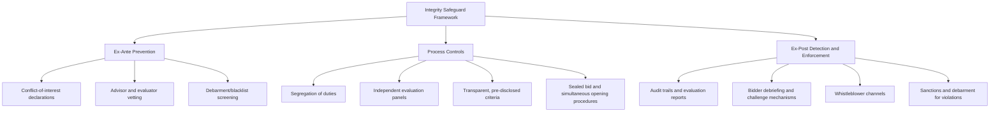

## Managing Conflicts of Interest and Procurement Integrity

### Overview

Procurement integrity in PPP transactions refers to the set of institutional, procedural, and legal safeguards designed to ensure that tendering, evaluation, and contract award decisions are made objectively, transparently, and free from undue influence — whether from corruption, conflicts of interest, collusion, or state capture. Given the scale, duration, and complexity of PPP contracts, and the high value of the rents at stake (concessions worth hundreds of millions to billions of dollars, spanning decades), PPPs are widely recognized by multilateral institutions as a procurement category with elevated corruption and integrity risk relative to conventional public works contracting.

### Why PPPs Carry Elevated Integrity Risk

- **Transaction complexity** creates information asymmetry between officials, advisors, and bidders, and provides more opportunities to conceal favoritism within technical justifications
- **High deal value** magnifies the financial incentive for corrupt influence
- **Long contract duration** compounds the cost of an initial integrity failure across decades of operation
- **Discretionary elements** (technical scoring, negotiated terms in two-stage bidding, unsolicited proposal screening) inherently involve more judgment than simple lowest-price tenders, increasing manipulation surface area
- **Multiple stakeholders** (government agencies, transaction advisors, bidders, lenders, sub-consultants) create numerous potential conflict-of-interest vectors

### Categories of Conflicts of Interest

#### Advisor-Side Conflicts

Occur when a transaction advisor engaged by the government has, or develops during the mandate, a financial or professional relationship with a prospective bidder, lender, or sponsor — compromising the independence of the advice given to the authority (see also: Role of Transaction Advisors).

#### Official/Evaluator-Side Conflicts

Arise when individuals responsible for drafting specifications, evaluating bids, or approving award decisions have personal, familial, or financial relationships with a bidding entity, or stand to benefit from a particular outcome (including future employment prospects with a winning bidder — a "revolving door" risk).

#### Bidder-Side Conflicts (Collusion)

Include bid rigging, cover bidding (a bidder submitting an intentionally uncompetitive bid to create the appearance of competition while another bidder is favored), and market allocation agreements among consortia that would otherwise compete.

#### Unsolicited Proposal Conflicts

Specific to Swiss challenge and USP frameworks: the original proponent's early involvement in shaping the project concept creates inherent risk that final specifications favor its own technical approach, disadvantaging later competing bidders (see also: Two-Stage Bidding and Swiss Challenge Processes).

### Institutional Safeguards

#### Ex-Ante Prevention

- **Mandatory conflict-of-interest declarations**: all officials, evaluators, and advisors involved in a transaction disclose financial interests, prior employment, and relationships with prospective bidders before the process begins, with standing obligations to update disclosures if circumstances change
- **Debarment/exclusion screening**: cross-checking bidders and key personnel against national and multilateral debarment lists (World Bank, ADB, AfDB cross-debarment agreements) before prequalification
- **Advisor independence clauses**: contractual prohibitions on transaction advisors simultaneously serving bidder-side or lender-side interests on the same transaction

#### Process Controls

- **Segregation of duties**: separating the individuals/units responsible for specification drafting, bid evaluation, and final award approval, so no single actor controls the full process
- **Independent, multi-disciplinary evaluation panels**: combining technical, financial, legal, and sometimes external/independent members to reduce single-point capture
- **Pre-disclosed, immutable evaluation criteria**: locking scoring weights and methodology into the RFP before submission (see also: Bid Evaluation Criteria and Scoring Methodologies)
- **Sealed bid submission and simultaneous public opening**: reducing opportunities for bid tampering or advance disclosure of competitor pricing
- **Structured, written-only clarification channels**: all bidder queries and authority responses conducted through formal, documented channels visible to all bidders, preventing informal side-channel influence

#### Ex-Post Detection and Enforcement

- **Documented audit trails**: every evaluation decision supported by a written scoring justification retained for audit and legal-challenge defense
- **Bidder debriefing and formal protest/challenge mechanisms**: unsuccessful bidders receive written reasons and a defined window to challenge the process, surfacing procedural errors or bias
- **Whistleblower protection mechanisms**: confidential reporting channels for procurement staff, advisors, or bidders to report suspected misconduct without retaliation risk
- **Debarment and sanctions regimes**: exclusion of firms or individuals found to have engaged in corruption, collusion, or fraud from future procurement, often coordinated across multiple government agencies or MDBs via cross-debarment agreements

### Red Flags Indicating Potential Collusion or Corruption

| Red Flag | Why It Is Concerning |
| --- | --- |
| Bid prices clustering suspiciously close together across ostensibly independent bidders | May indicate price-fixing or information-sharing among bidders |
| A pattern of the same small group of firms consistently winning/losing across multiple tenders in rotation | Suggests possible market/bid allocation agreement ("bid rotation") |
| Identical or near-identical errors/formatting across supposedly independent bid submissions | May indicate shared drafting or coordination between "competing" bidders |
| Specification unusually tailored to match one bidder's proprietary technology or specific past project experience | May indicate specification-writing influenced by a favored bidder |
| Evaluation criteria changed after bid submission | Strong indicator of process manipulation |
| Unusually rapid or under-documented evaluation timeline for a highly complex bid set | May indicate a pre-determined outcome with evaluation as a formality |
| Key evaluator or official subsequently employed by the winning bidder shortly after award | Revolving-door conflict, though not conclusive proof of misconduct on its own |

[Inference] The presence of one or more of these red flags does not by itself establish that corruption or collusion occurred — many have legitimate alternative explanations (e.g., price clustering can reflect genuinely similar cost structures in a mature, competitive market) — but their presence is generally treated in procurement integrity practice as warranting further investigation rather than automatic disqualification.

### International Frameworks and Standards

- **OECD Recommendation on Public Procurement**: sets principles on transparency, integrity, and access to remedies applicable to infrastructure procurement
- **World Bank Anti-Corruption Guidelines and Procurement Framework**: govern Bank-financed PPP transactions, including sanctionable practices definitions (corruption, fraud, collusion, coercion, obstruction) and a formal sanctions/debarment system
- **UNCITRAL Model Law on Public Procurement**: provides a legislative template many jurisdictions draw on for procurement integrity provisions
- **UNCAC (UN Convention Against Corruption)**: broader international anti-corruption framework referenced in many national PPP laws' integrity provisions
- **Cross-debarment agreements** among major MDBs (World Bank, ADB, AfDB, EBRD, IDB): a firm debarred by one participating institution is recognized as debarred by the others for the debarment period, extending enforcement reach

### Key Points

- **Integrity is designed in, not inspected in afterward**: robust procurement design (segregation of duties, transparent criteria, sealed bidding) is significantly more effective than relying solely on post-hoc audit or investigation to catch integrity failures.
- **Discretion is the primary risk vector**: the more discretionary an evaluation or negotiation stage (unsolicited proposals, two-stage dialogue, preferred-bidder negotiation), the more integrity safeguards must be layered onto that stage specifically.
- **Perception matters alongside actual misconduct**: even the appearance of a conflict of interest, absent proven wrongdoing, can undermine market confidence in the tender and deter future bidder participation — hence the emphasis on disclosure and transparency, not only on proving actual corrupt intent.
- **Enforcement credibility depends on consistent follow-through**: safeguard frameworks that exist on paper but are not actually enforced (e.g., debarment lists never checked, whistleblower channels with no follow-up) provide little real protection.

### Example

During a large airport PPP tender, the evaluation panel identifies that two of the four shortlisted bidders' financial models contain unusual similarities in formula structure and a shared, distinctive formatting error in the operating cost schedule.

1. The panel flags this as a potential collusion indicator per its documented integrity protocol.
2. An independent forensic review is commissioned rather than proceeding directly to award.
3. The review finds that both bidders had, in a prior unrelated tender, used a common third-party financial modeling consultant who had inadvertently reused a template across both engagements — a benign explanation rather than deliberate collusion, but a conflict-of-interest gap in the consultant's own client-separation practices.
4. The authority requires both bidders to submit independently re-verified financial models before proceeding, and separately refers the modeling consultant's practices to its own conflict-of-interest review for future engagements.

This illustrates why red-flag protocols require investigation rather than automatic disqualification, and why conflict-of-interest management must extend to third-party sub-consultants, not only bidders and government officials directly.

### Related Topics

- Role of Transaction Advisors
- Bid Evaluation Criteria and Scoring Methodologies
- Two-Stage Bidding and Swiss Challenge Processes
- Bidder Debriefing and Procurement Challenge/Protest Mechanisms
- World Bank and Multilateral Development Bank Sanctions Frameworks
- Whistleblower Protection Mechanisms in Public Procurement
- Bid Rigging and Collusion Detection Techniques
- PPP Unit Institutional Design and Governance Structures