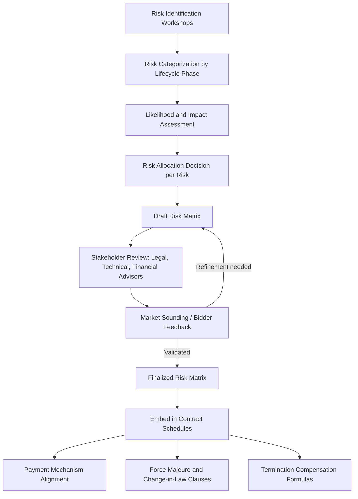
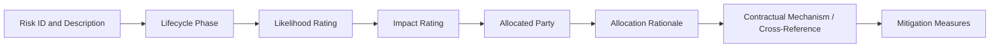

## Constructing a Comprehensive Risk Matrix

### Overview

A risk matrix (also called a risk allocation matrix or risk register in PPP practice) is the foundational analytical and contractual document that identifies every material risk associated with a PPP project across its full lifecycle, assesses each risk's likelihood and impact, and allocates responsibility for bearing and managing each risk to the party best positioned to do so — the public authority, the private party, or shared between them. The risk matrix underpins the entire PPP contract: the payment mechanism, the change-in-law provisions, the force majeure clauses, and the termination compensation formulas are all structured around, and must be internally consistent with, the risk allocation established in this document.

### The Fundamental Principle: Optimal Risk Allocation

The central doctrine guiding risk matrix construction is that **each risk should be allocated to the party best able to manage, mitigate, or bear it at least cost** — not automatically transferred entirely to the private party. Misallocating risk (either over-transferring risk the private party cannot control, or under-transferring risk it could manage more efficiently than government) both inflate the effective cost of the PPP: over-transferred risk gets priced into bids as a risk premium, while under-transferred risk leaves the public sector exposed without corresponding value.

$$Cost_{effective} = Cost_{base} + \sum_{i} P(Risk_i) \times Impact(Risk_i) \times RiskPremium_i$$

Where inefficient allocation of $Risk_i$ to a party unable to manage it increases $RiskPremium_i$ without a corresponding reduction in $P(Risk_i)$ or $Impact(Risk_i)$ — i.e., the government pays for risk transfer without actually reducing the probability or severity of the risk materializing.

### Risk Matrix Construction Process

#### Step 1: Risk Identification

Conducted through structured workshops involving technical, financial, legal, and environmental specialists, often supplemented by:

- Review of risk registers from comparable projects in the same sector/jurisdiction
- Site-specific due diligence (geotechnical surveys, existing infrastructure condition assessments)
- Regulatory and political-economy analysis of the host jurisdiction
- Lender/financier input on risks that would affect bankability

#### Step 2: Categorization by Lifecycle Phase

Risks are typically organized chronologically to ensure comprehensive coverage across the full project lifecycle:

| Phase | Representative Risks |
| --- | --- |
| Pre-construction/Development | Land acquisition delay, permitting delay, design errors, financing close delay |
| Construction | Cost overrun, construction delay, force majeure during construction, contractor default |
| Operations | Demand/volume risk, O&M cost overrun, performance/availability shortfall, technology obsolescence |
| Financial | Interest rate risk, foreign exchange risk, refinancing risk, inflation risk |
| Political/Regulatory | Change in law, expropriation, political force majeure, currency inconvertibility |
| Cross-cutting | Force majeure (natural), environmental liability, third-party/stakeholder risk, termination risk |

#### Step 3: Likelihood and Impact Assessment

Each identified risk is scored, often using a qualitative or semi-quantitative scale, to prioritize which risks warrant the most detailed contractual treatment:

| Likelihood | Impact | Priority |
| --- | --- | --- |
| High | High | Critical — requires explicit, detailed contractual mechanism |
| High | Low | Moderate — manage via standard operational provisions |
| Low | High | Critical — requires explicit mechanism despite low probability (e.g., force majeure, expropriation) |
| Low | Low | Lower priority — general contractual boilerplate may suffice |

#### Step 4: Allocation Decision

For each risk, the matrix specifies: which party bears the risk (Public, Private, or Shared), the rationale for that allocation, and the specific contractual mechanism giving effect to it.

### Standard Risk Categories and Typical Allocation

| Risk Category | Typical Allocation | Rationale |
| --- | --- | --- |
| Design risk | Private | Private party controls design choices and has relevant technical expertise |
| Construction cost overrun | Private | Private party controls construction management and contractor selection |
| Construction delay (non-force-majeure) | Private | Within private party's control via contractor management |
| Latent/unforeseen ground conditions | Shared or Public (with defined threshold) | Neither party can fully know pre-existing subsurface conditions; often government retains risk beyond a defined geotechnical baseline |
| Demand/volume risk (e.g., traffic, ridership) | Varies: Private (concession/toll model), Public (availability-payment model), or Shared (minimum revenue guarantee) | Depends on which party can better influence or forecast demand, and government's risk appetite |
| O&M cost overrun | Private | Private party controls operational efficiency |
| Performance/availability shortfall | Private | Directly tied to the private party's asset management quality |
| General inflation | Shared (indexation mechanism) | Neither party controls macroeconomic inflation; typically passed through via indexed payment formulas |
| Interest rate risk (pre-financial close) | Private | Private party's financing structuring responsibility |
| Foreign exchange risk | Shared or hedged | Depends on revenue currency vs. debt currency mismatch; sometimes mitigated via government FX support instruments |
| Change in law (general/non-discriminatory) | Private (up to a threshold) | General regulatory risk is a normal business risk in most frameworks |
| Change in law (discriminatory/project-specific) | Public | Government caused the specific harm and should bear the cost |
| Expropriation/nationalization | Public | Direct government action; core sovereign risk |
| Force majeure (natural disaster, war) | Shared (relief mechanisms, not full risk transfer) | Neither party controls; typically results in time/cost relief rather than full compensation, cost-shared per contract terms |
| Currency inconvertibility/transfer restriction | Public | Government controls monetary policy and capital controls |
| Environmental liability (pre-existing contamination) | Public | Existed before private party's involvement |
| Environmental liability (caused during construction/operation) | Private | Within private party's operational control |

[Inference] These allocations represent common industry practice patterns observed across many PPP frameworks and are frequently reflected in standardized MDB model risk matrices, but actual allocation in any specific project is a negotiated, project-specific outcome shaped by market conditions, sector characteristics, and government risk appetite — treating this table as a fixed rule rather than a starting reference point would misrepresent how risk allocation is actually negotiated in practice.

### Risk Matrix Template Structure

A standard risk matrix entry typically includes the following fields for each identified risk:

| Field | Purpose |
| --- | --- |
| Risk ID and Description | Unique identifier and clear, specific description (avoiding vague or overly broad risk statements) |
| Lifecycle Phase | When the risk is most relevant (construction, operations, etc.) |
| Likelihood/Impact Rating | Prioritization input |
| Allocated Party | Public, Private, or Shared |
| Allocation Rationale | Documented justification, supporting transparency and later dispute resolution |
| Contractual Mechanism | Cross-reference to the specific contract clause/schedule implementing the allocation (e.g., "Clause 14.3, Change in Law") |
| Mitigation Measures | Actions either party can take to reduce likelihood or impact regardless of who bears the residual risk |

### Common Drafting Pitfalls

| Pitfall | Consequence | Mitigation |
| --- | --- | --- |
| Vague risk descriptions (e.g., "operational risk" without specificity) | Ambiguity in contractual interpretation during disputes | Define each risk with precision sufficient to map directly to a specific contract clause |
| Inconsistency between risk matrix and contract schedules | Legal disputes over which document governs | Single source-of-truth risk matrix cross-referenced explicitly in all related contract schedules |
| Over-transferring risk beyond private party's control | Inflated bid premiums, reduced bidder participation, or later renegotiation demands | Apply the "best able to manage" principle rigorously; benchmark against comparable project allocations |
| Under-transferring risk the private party could manage | Reduced incentive for efficient private-sector risk management, moral hazard | Ensure risks within private operational control remain with the private party |
| Omitting low-probability, high-impact risks (e.g., pandemic, rare natural disaster) | Contractual gap when the risk materializes, leading to costly ad hoc renegotiation | Include explicit force majeure and relief-event provisions covering low-probability/high-impact scenarios even if a dedicated line-item risk is impractical |
| Failure to update the matrix as the transaction evolves (post-market sounding, post-negotiation) | Final contract drifts from the originally intended allocation | Treat the risk matrix as a living document through financial close, with version control and change tracking |

### Key Points

- **The risk matrix is not merely descriptive — it is the analytical basis for every major commercial term** in the PPP contract, including the payment mechanism, MDB/lender due diligence, and termination compensation calculations.
- **Market sounding validates allocation before finalization**: prospective bidders' feedback during market sounding or two-stage bidding dialogue often reveals where proposed allocations are unbankable or would generate excessive risk premiums, allowing the authority to recalibrate before formal tender issuance.
- **Shared risk requires precise mechanism design**: "shared" allocation is only meaningful when the matrix specifies exactly how sharing occurs (e.g., a deductible/cap structure, a defined trigger threshold, or a percentage split formula) — an undefined "shared" designation functions as a latent ambiguity.
- **Consistency with international standards enhances bankability**: aligning risk allocation with widely recognized MDB model risk matrices (World Bank, ADB, PPIAF) improves lender familiarity and can reduce financing costs and negotiation time.

### Example: Risk Matrix Entry (Demand Risk, Toll Road PPP)

| Field | Entry |
| --- | --- |
| Risk ID | R-014 |
| Description | Traffic volume falls below the base-case forecast used in the bidder's financial model, reducing toll revenue |
| Lifecycle Phase | Operations |
| Likelihood | Medium (dependent on macroeconomic conditions and competing route development) |
| Impact | High (directly affects debt service coverage) |
| Allocated Party | Private, with a Shared minimum revenue guarantee (MRG) mechanism |
| Allocation Rationale | Private party has some influence over toll pricing and service quality that affects usage, but has no control over macroeconomic demand drivers; a partial MRG improves bankability without eliminating the private party's incentive to maximize actual usage |
| Contractual Mechanism | Concession Agreement Schedule 6, Clause 22 (Minimum Revenue Guarantee): government pays the shortfall between actual and 80% of forecast revenue, subject to an annual cap of [X]% of forecast revenue |
| Mitigation Measures | Private party: demand-generation marketing, service quality management. Government: land use planning coordination to avoid competing free-route development |

### Related Topics

- Payment Mechanism Design: Availability Payments vs. Demand-Based Tariffs
- Force Majeure and Change-in-Law Clause Drafting
- Minimum Revenue Guarantees and Government Support Instruments
- Termination Compensation Formulas and Handback Provisions
- Public Sector Comparator and Value-for-Money Assessment
- Demand Risk Forecasting and Traffic/Revenue Studies
- MDB Model Risk Matrices (World Bank, ADB, PPIAF Toolkits)
- Currency and Inflation Risk Mitigation in Cross-Border PPPs