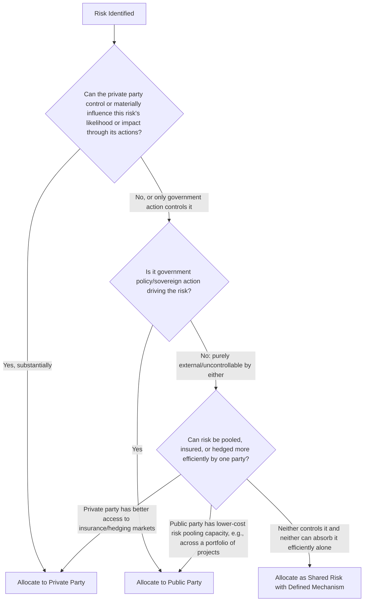
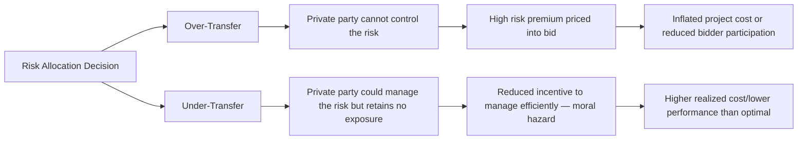

## The Principle of Allocating Risk to the Party Best Able to Manage It

### Overview

The principle of allocating risk to the party best able to manage it — often called the "optimal risk allocation" or "efficient risk transfer" principle — is the foundational doctrine of PPP risk structuring. It holds that a risk should be assigned not to whichever party can be made to formally accept it, and not automatically to the private party on the theory that PPPs exist to transfer risk away from government, but specifically to whichever party has the greatest ability to control, mitigate, price, or absorb that risk at the lowest overall cost to the project. This principle is the analytical foundation underlying the risk matrix itself (see also: Constructing a Comprehensive Risk Matrix) and is widely regarded across PPP literature and multilateral guidance as the central determinant of whether a PPP achieves genuine value-for-money or merely shifts cost inefficiently.

### The Core Logic

A common misconception is that PPPs are valuable simply because they transfer risk from the public sector to the private sector. This is inaccurate: transferring a risk to a party that cannot influence its likelihood or magnitude does not eliminate the underlying risk — it merely relocates who initially bears the financial exposure, while typically increasing the total cost of the risk to the system as a whole, because the party now holding the risk will price a premium into its bid to compensate for bearing something it cannot control.

$$Cost_{allocation} = Premium(Risk, Party) + ResidualCost(Risk)$$

Where $Premium(Risk, Party)$ increases as the ability of $Party$ to control or influence $Risk$ decreases — meaning misallocated risk generates a larger premium without a corresponding reduction in the risk's actual probability or impact, since the party bearing it has no meaningful ability to mitigate it.

### Determining "Best Able to Manage"

The assessment typically weighs several factors for each risk:

- **Control**: Which party's decisions and actions directly affect whether the risk materializes and how severely?
- **Information**: Which party has better information to assess, price, and monitor the risk?
- **Capacity to absorb**: Which party has the financial capacity or diversification (e.g., across a portfolio of assets) to bear the risk at lower cost if it does materialize?
- **Cost of risk transfer instruments**: Can the risk be insured, hedged, or otherwise transferred to third-party markets (insurers, currency hedging markets) more cheaply by one party than the other?
- **Incentive effects**: Does allocating the risk to a party create appropriate incentives for it to actively manage and mitigate that risk (moral hazard consideration)?

### Applying the Principle: Worked Categories

| Risk Type | Best-Placed Party | Reasoning |
| --- | --- | --- |
| Construction cost overrun from inefficient project management | Private | Private contractor/developer directly controls construction execution, procurement, and scheduling decisions |
| Geological/subsurface conditions unknown to both parties | Often Public, or Shared with a defined baseline | Neither party has superior information pre-construction; allocating fully to private party generates a large, non-value-adding risk premium since neither party can meaningfully "manage" pure information asymmetry about the ground |
| Change in general taxation law | Private (typically, up to a threshold) | A normal business risk faced by any commercial entity; private party can factor general regulatory risk into its business planning like any other market participant |
| Change in law that specifically and discriminately targets the project | Public | The public party is the source of the risk (its own policy action), so bears responsibility for the resulting cost |
| Currency devaluation affecting debt service on foreign-currency loans | Shared or hedged, sometimes Public (in weaker capital markets) | Private party can hedge to some extent via financial markets, but in some emerging markets, only the sovereign has meaningful capacity to manage currency risk (e.g., via a currency support facility), justifying partial public retention |
| Demand/patronage risk for an untested public transit corridor | Often Public (availability-based structure) or Shared (min. revenue guarantee) | Neither party can fully control ridership uptake for a genuinely new transit pattern; excessive demand-risk transfer to a private party in unproven markets has been linked in practice to underbidding, financial distress, and later renegotiation |
| O&M cost efficiency during operations | Private | Directly within the operator's day-to-day management control |

### Why Misallocation Is Costly: Two Failure Modes

#### Over-Transfer

Occurs when a risk genuinely outside the private party's control (e.g., unforeseeable geological conditions, extreme macroeconomic demand shocks) is nonetheless allocated to it. Because the private party cannot mitigate the risk through its own actions, it can only respond by pricing a large risk premium into its bid — or, if the risk later materializes and was underpriced, by seeking contract renegotiation or facing financial distress/default. [Inference] Over-transfer of demand risk in emerging-market transport PPPs has been repeatedly cited in post-project reviews (e.g., by multilateral development banks examining early-generation toll road concessions) as a contributing factor in a documented pattern of financial distress and subsequent renegotiation, though the specific causal weight of risk allocation versus other factors (overoptimistic traffic forecasting, macroeconomic shocks) varies by case and is often debated in the literature.

#### Under-Transfer

Occurs when a risk the private party could meaningfully influence (e.g., construction efficiency, O&M cost control) is instead retained by the public sector or shared without adequate private-party exposure. This removes the incentive alignment that is one of the primary value-adding rationales for using a PPP structure in the first place — if the private party bears no consequence for poor performance, the theoretical efficiency gains from private-sector risk-bearing and performance incentives do not materialize.

### Practical Application: The Role of Shared Risk Mechanisms

Not every risk cleanly falls to one party. Where a risk is genuinely influenced by both parties' actions, or where neither party can efficiently absorb the full risk alone, the principle supports designing an explicit **shared risk mechanism** rather than forcing a binary allocation:

- **Minimum revenue guarantees (MRGs)**: government absorbs downside demand risk below a threshold, private party retains upside and risk above the floor — preserving some incentive for demand generation while addressing genuinely unforecastable macro risk
- **Indexation formulas**: inflation risk, which neither party controls, is shared via automatic tariff/payment indexation rather than allocated wholesale to either side
- **Geotechnical baseline reports with defined risk-sharing above/below baseline conditions**: subsurface risk within a disclosed baseline is allocated to the private party (who priced against known data); risk beyond the baseline (genuinely unforeseeable) reverts to the public party
- **Force majeure relief-event structures**: rather than a party "bearing" force majeure risk financially in full, contracts typically provide time/schedule relief and, for specified events, cost-sharing formulas

### Key Points

- **The principle is normative, not mechanical** — it requires case-by-case judgment informed by market conditions, sector characteristics, and the specific project's risk profile; it is not a fixed lookup table, even though certain risk categories recur with similar typical allocations across projects (see also: Constructing a Comprehensive Risk Matrix for common allocation patterns).
- **Market feedback is often necessary to validate theoretical allocation**: what appears, in principle, to be an efficient allocation may prove unbankable or generate excessive risk premiums once tested against actual bidder and lender appetite — hence market sounding and, in two-stage bidding, dialogue-based refinement are important complements to ex-ante allocation design.
- **Government retaining a risk is not automatically "bad value"**: efficient allocation sometimes means the public sector should retain a risk, even though PPPs are often popularly framed as risk-transfer vehicles — retaining a risk the private sector cannot efficiently manage, and instead paying the true (lower) cost of bearing it directly, can represent better value-for-money than paying an inflated private-sector risk premium for the same exposure.
- **Allocation and incentive design are linked but distinct**: allocating a risk to a party should generally align with giving that party a meaningful incentive (financial exposure) to manage it — allocation without corresponding incentive exposure (e.g., a risk nominally assigned to the private party but fully compensated regardless of outcome) undermines the principle's purpose.

### Example

A government structuring a seaport PPP considers how to allocate cargo throughput (demand) risk.

- **Option A — Full private demand risk (concession model)**: the private operator earns revenue directly from port tariffs tied to actual cargo volume. This is efficient if the operator has meaningful influence over throughput (e.g., through marketing to shipping lines, efficient handling reducing vessel turnaround time, competitive tariff-setting) — factors within its control.
- **Option B — Full government demand risk (availability payment model)**: the government pays a fixed availability fee regardless of actual cargo volume. This removes the operator's incentive to actively attract cargo or operate efficiently to maximize throughput, since its payment is decoupled from performance on the dimension most linked to demand.
- **Option C — Hybrid (base availability payment plus throughput-linked incentive/penalty)**: a moderate fixed payment covers unavoidable base costs (recognizing the operator cannot fully control macro trade volumes, e.g., global shipping route changes), while a variable component tied to actual throughput preserves incentive for the operator to actively manage service quality, efficiency, and cargo attraction within its control.

Applying the "best able to manage" principle favors Option C in most contexts: it isolates the portion of demand risk within the operator's genuine influence (service quality, efficiency, competitive positioning) and assigns that portion to the operator, while avoiding forcing the operator to price a large premium for macro trade-volume risk it cannot control.

### Related Topics

- Constructing a Comprehensive Risk Matrix
- Minimum Revenue Guarantees and Government Support Instruments
- Payment Mechanism Design: Availability Payments vs. Demand-Based Tariffs
- Force Majeure and Change-in-Law Clause Drafting
- Geotechnical Baseline Reports and Subsurface Risk Allocation
- Renegotiation Patterns in Demand-Risk PPP Concessions
- Incentive Alignment and Moral Hazard in Contract Design
- Public Sector Comparator and Value-for-Money Assessment