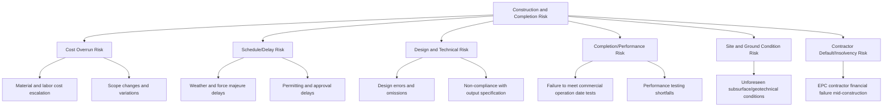
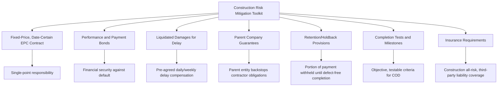

## Construction and Completion Risk

### Overview

Construction and completion risk encompasses all risks associated with designing and building a PPP asset from financial close through substantial completion — including cost overruns, schedule delays, technical/design defects, and the failure to achieve contractually defined performance standards required to enter the operational phase. This is one of the most extensively studied and standardized risk categories in PPP structuring, precisely because construction-phase failures are historically among the most common sources of PPP project distress, and because the industry has developed relatively mature contractual mechanisms (fixed-price, date-certain EPC contracts) to manage it.

### Sub-Components of Construction and Completion Risk

#### Cost Overrun Risk

The risk that actual construction costs exceed the budgeted/contracted amount, driven by factors such as material price escalation, labor cost increases, design changes, quantity variations, or inefficient project management.

#### Schedule/Delay Risk

The risk that construction is not completed by the contractually required date, driven by factors ranging within the contractor's control (poor scheduling, labor shortages) to factors outside it (extreme weather, permitting delays, force majeure events).

#### Design and Technical Risk

The risk that the design does not achieve the required output specification, contains errors or omissions, or requires costly rework — particularly relevant in output-specification-based PPPs where the private party bears design responsibility (see also: Drafting Requests for Proposals and Tender Documentation).

#### Completion/Performance Risk

The risk that, even if physically built, the asset fails to pass commissioning/performance tests required to achieve "Commercial Operation Date" (COD) or "Service Commencement Date" — e.g., a power plant that is physically complete but cannot achieve contracted output capacity or efficiency during test runs.

#### Site and Ground Condition Risk

The risk of encountering unforeseen subsurface conditions (contamination, unstable soil, unexpected archaeological finds, unmapped utilities) that increase cost or delay construction — a risk category requiring particularly careful allocation given genuine information asymmetry (see also: The Principle of Allocating Risk to the Party Best Able to Manage It).

#### Contractor Default/Insolvency Risk

The risk that the EPC (engineering, procurement, and construction) contractor becomes financially unable to complete the works, requiring replacement mid-construction — a scenario with significant cost, delay, and often legal complexity.

### Standard Risk Allocation

| Sub-Risk | Typical Allocation | Rationale |
| --- | --- | --- |
| Cost overrun (non-force-majeure, within contractor control) | Private (via fixed-price EPC contract) | Private party/EPC contractor controls procurement, scheduling, and site management decisions driving cost |
| Schedule delay (contractor-caused) | Private, with liquidated damages | Directly within contractor's operational control |
| Schedule delay (force majeure/authority-caused) | Shared or Public, with time (and sometimes cost) relief | Neither party controls force majeure; authority-caused delay (e.g., late site handover) is the authority's responsibility |
| Design errors/omissions | Private | Private party bears design responsibility in output-specification PPPs |
| Latent/unforeseen ground conditions | Shared, with defined geotechnical baseline | Genuine pre-existing information asymmetry; often split via baseline report defining known vs. unforeseeable conditions |
| Permitting/regulatory approval delay (where private party is responsible for obtaining permits) | Private | Within private party's process management, assuming reasonable diligence |
| Permitting delay caused by authority's own approval processes | Public | Authority controls its own internal approval timelines |
| EPC contractor insolvency | Private (mitigated via performance bonds, parent company guarantees) | Private party selects and contracts with the EPC contractor and bears counterparty risk |

### Key Contractual Mechanisms for Managing Construction Risk

#### Fixed-Price, Date-Certain EPC (Engineering, Procurement, Construction) Contracts

The primary risk-transfer instrument for construction risk. A single EPC contractor takes on-point responsibility for design, procurement, and construction at a fixed lump-sum price and a contractually certain completion date, effectively passing cost and schedule risk from the project company (SPV) to the contractor. This is often called "wrap" structuring — the EPC contract "wraps" construction risk into a single fixed-price, fixed-date obligation.

#### Liquidated Damages (LDs) for Delay

Pre-agreed daily or weekly compensation payable by the contractor if completion is delayed beyond the contractual date, providing the project company (and its lenders) compensation for lost revenue/increased financing costs during delay, without needing to prove actual damages in each instance. LDs are typically capped at a percentage of contract value (commonly 10-20%).

$$LD_{total} = \min(D \times R_{daily}, LD_{cap})$$

Where $D$ is days of delay, $R_{daily}$ is the daily liquidated damages rate, and $LD_{cap}$ is the contractual maximum.

#### Performance and Payment Bonds

Financial instruments (typically bank guarantees or surety bonds) providing security that the contractor will perform its obligations or that funds will be available to complete/remediate the works if the contractor defaults — commonly set at 10-20% of contract value.

#### Parent Company Guarantees (PCGs)

Where the EPC contractor is a subsidiary or special-purpose entity with limited balance sheet strength, a guarantee from its parent company provides additional financial backstop for the contractor's obligations.

#### Retention/Holdback Provisions

A percentage of each progress payment (commonly 5-10%) withheld until defects-free completion is confirmed, incentivizing quality and timely defect rectification.

#### Completion Tests and Milestone Definitions

Objective, measurable criteria defining when construction is deemed complete for contractual purposes — critical because "completion" in PPPs is rarely just physical completion:

- **Mechanical completion**: physical construction finished per specifications
- **Performance/commissioning tests**: the asset demonstrates it can achieve contracted operational performance (e.g., a power plant achieving rated capacity and heat rate during test runs)
- **Commercial Operation Date (COD)**: the point at which the asset is deemed ready for full commercial operation, typically the trigger for the payment mechanism to commence and the concession/operations period to begin

#### Insurance Requirements

Construction-phase insurance (Contractor's All Risk / Construction All Risk policies, third-party liability, delay-in-start-up coverage) is typically mandated in the PPP contract and financing documents to cover residual risks not otherwise contractually allocated.

### Interface with Financing: Lender Requirements

Because construction risk is the period of highest project vulnerability (before any revenue is generated to service debt), lenders typically impose their own layer of construction-risk mitigation requirements as conditions of financing:

- **Independent Engineer**: lenders appoint their own technical advisor to monitor construction progress and certify draw-downs against actual physical progress
- **Contingency reserves**: lenders often require a construction contingency fund (a percentage of total project cost, e.g., 5-10%) to cover cost overruns beyond the EPC fixed price (e.g., overruns not covered due to contractor default or scope changes)
- **Standby/sponsor support facilities**: sponsors may be required to provide standby equity or subordinated debt commitments to cover cost overruns beyond EPC contractor liability caps
- **Step-in rights**: lenders typically retain rights to step into the project company (and by extension, oversee or replace the EPC contractor relationship) if construction milestones are materially missed, protecting their security interest

### Common Drafting and Structuring Pitfalls

| Pitfall | Consequence | Mitigation |
| --- | --- | --- |
| EPC contractor's balance sheet insufficient to back its fixed-price commitment | LDs and warranties become uncollectable if the contractor cannot pay | Require parent company guarantees, performance bonds, or contractor creditworthiness thresholds in bid criteria |
| LD cap set too low relative to actual project delay costs | Inadequate compensation for the project company/lenders if severe delay occurs | Calibrate LD caps against realistic delay-cost analysis, not arbitrary industry defaults |
| Vague or subjective completion test criteria | Disputes over whether COD has actually been achieved | Define completion tests with precise, objective, independently verifiable technical parameters |
| Geotechnical/site risk not clearly bounded by a baseline report | Disputes over whether encountered conditions were "foreseeable" | Commission and disclose a geotechnical baseline report defining the risk-sharing boundary explicitly |
| Sole reliance on contractual risk transfer without adequate insurance backstop | Uninsured residual exposure if contractual counterparty (EPC contractor) becomes insolvent | Mandate minimum insurance coverage levels and lender-approved insurers as conditions precedent |

### Key Points

- **Single-point (wrap) EPC responsibility is the dominant industry mechanism** for transferring construction risk efficiently to the party — the contractor — with the greatest direct control over design, procurement, and construction execution.
- **Force majeure and authority-caused delay are carved out from full private-party risk-bearing** via time (and sometimes cost) relief provisions, consistent with the "best able to manage" principle — a contractor cannot control a flood or a government's late land handover.
- **Lenders' interests reinforce, and often exceed, the contract's own risk allocation**: because lenders have no recourse to revenue until COD, their construction-phase due diligence and monitoring requirements (independent engineer, contingency reserves) function as an additional layer of construction risk management beyond the EPC contract itself.
- **Completion is a defined, testable event, not an informal milestone**: ambiguity in defining COD/completion tests is a recurring and preventable source of PPP disputes.

### Example

A 250 MW solar PPP structures its construction risk as follows:

1. The project company (SPV) enters a fixed-price, date-certain EPC contract with a reputable international solar EPC contractor at $220 million, with a contractual Commercial Operation Date 18 months from Notice to Proceed.
2. The EPC contract includes: a 15% performance bond, a parent company guarantee from the contractor's globally rated parent entity, and liquidated damages of $50,000/day for delay, capped at 15% of contract value.
3. Commercial Operation Date is defined by objective performance test criteria: 72-hour continuous operation demonstrating ≥95% of rated capacity output under specified irradiance conditions, independently verified by the lenders' Independent Engineer.
4. A geotechnical baseline report, commissioned pre-financial-close and disclosed to all bidders, defines expected soil conditions; costs arising from conditions materially outside the baseline are treated as a compensation event shared per a pre-agreed formula, rather than fully absorbed by the EPC contractor.
5. Lenders require a 7% construction contingency reserve funded at financial close, accessible only with Independent Engineer certification, to cover any costs beyond the EPC fixed price arising from approved variations.

### Related Topics

- Constructing a Comprehensive Risk Matrix
- The Principle of Allocating Risk to the Party Best Able to Manage It
- EPC Contract Structuring and Fixed-Price Wrap Mechanisms
- Force Majeure and Change-in-Law Clause Drafting
- Independent Engineer Role in Project Finance Due Diligence
- Geotechnical Baseline Reports and Subsurface Risk Allocation
- Performance Bonds, Parent Company Guarantees, and Security Instruments
- Commercial Operation Date and Completion Test Design