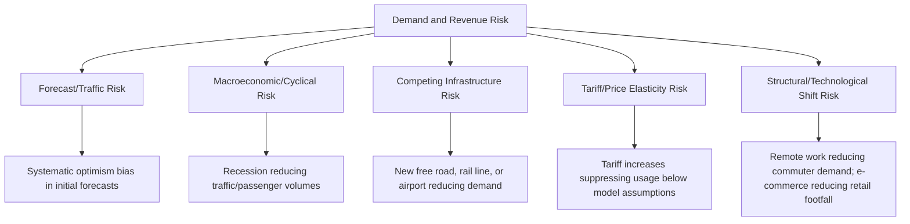
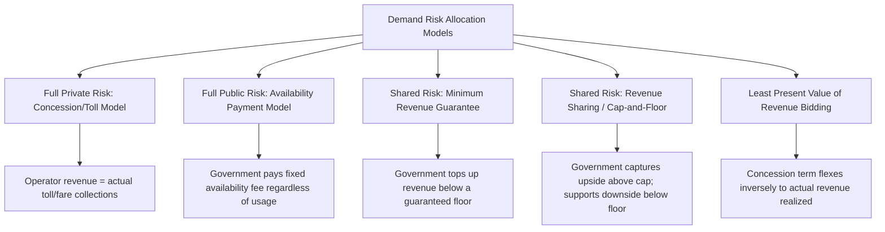

## Demand and Revenue Risk

### Overview

Demand and revenue risk is the risk that actual usage of a PPP asset — and consequently the revenue generated from user charges — differs from the levels forecast at the time of bidding and financial close. This risk category is distinct from most construction and operational risks in that it is driven substantially by factors outside either party's full control: macroeconomic conditions, competing infrastructure, changing consumer behavior, and broader demographic or economic trends. Demand risk is widely regarded across PPP practice and academic literature as one of the most difficult risks to allocate efficiently and one of the most common drivers of PPP financial distress and renegotiation, particularly in transport (toll roads, rail, airports, ports) and, to a lesser extent, other user-pays infrastructure.

### Why Demand Risk Is Distinctive

Unlike construction cost overruns or O&M inefficiency — risks substantially within a private operator's control — demand risk sits at the intersection of factors that are:

- **Partially influenceable** by the private party (service quality, pricing strategy, marketing, complementary services)
- **Partially influenceable** by the public party (land-use planning, competing free/subsidized infrastructure, complementary transit investment)
- **Substantially uncontrollable** by either party (macroeconomic cycles, fuel prices, structural shifts in travel/consumption behavior, pandemics, technological disruption)

This mixed-control profile is precisely why demand risk allocation is one of the most contested and consequential decisions in PPP structuring (see also: The Principle of Allocating Risk to the Party Best Able to Manage It).

### Sub-Components of Demand and Revenue Risk

#### Forecast/Traffic Risk

The risk that the initial demand forecast underlying the financial model and bid was inaccurate — a persistent and well-documented issue in infrastructure forecasting generally, often attributed to both genuine forecasting difficulty and systematic optimism bias in the forecasting process itself.

#### Macroeconomic/Cyclical Risk

The risk that broader economic conditions (recession, currency crisis, fuel price shocks) suppress demand below forecast levels for reasons unrelated to the specific asset's quality or management.

#### Competing Infrastructure Risk

The risk that a new, often government-funded, competing facility (a free alternative road, a new rail line, a second port) diverts demand away from the PPP asset — a risk with a clear public-sector dimension since government typically controls decisions about competing infrastructure investment.

#### Tariff/Price Elasticity Risk

The risk that raising tariffs/tolls to the levels assumed in the financial model actually suppresses demand more than modeled (price elasticity misestimation), creating a feedback loop where revenue targets are missed even as nominal tariffs are technically implemented.

#### Structural/Technological Shift Risk

Longer-term risk that structural changes in behavior or technology (remote work reducing commuting, e-commerce reducing retail/logistics patterns, autonomous vehicle adoption, aviation demand shifts) alter the fundamental demand baseline in ways not contemplated by traditional forecasting models. [Inference] The COVID-19 pandemic period is widely cited in post-2020 PPP literature as having crystallized this risk category's importance, since it demonstrated that demand shocks can be both severe and structurally persistent (e.g., sustained reductions in commuter rail and airport demand in some markets) rather than purely cyclical, though the extent of long-term structural change versus eventual demand recovery varies significantly by sector and geography and remains a live empirical question.

### Allocation Models for Demand Risk

#### Full Private Demand Risk (Concession/Toll Model)

The private operator's revenue is directly tied to actual usage (tolls, fares, tariffs collected from end users). This model maximizes the operator's incentive to manage service quality and pricing to maximize legitimate usage, but exposes the operator fully to macro and competing-infrastructure risks it cannot control — appropriate mainly where demand is relatively predictable and stable, or where the operator has genuine influence over the demand drivers.

#### Full Public Demand Risk (Availability Payment Model)

The government pays the private party a fixed periodic payment tied to the asset's *availability* and *performance*, not its usage — the government retains all revenue collection (if any exists) and all demand risk. This shifts the analytical framing away from demand risk allocation for the operator entirely, since operator payment is decoupled from usage. Commonly used for social infrastructure (hospitals, schools, prisons) where there is no natural user charge, and increasingly for transport projects where governments judge that transferring demand risk generates excessive risk premiums relative to its benefit.

#### Minimum Revenue Guarantee (MRG)

A shared-risk hybrid: the private operator retains upside revenue risk and receives full toll/fare revenue up to and above a forecast baseline, but the government guarantees a revenue floor — if actual revenue falls below a defined threshold (e.g., 70-85% of the base-case forecast), the government pays the shortfall (or a portion of it). This preserves some private-sector demand-management incentive while addressing the portion of demand risk (deep macro downside) genuinely outside the operator's control.

$$Payment_{MRG} = \max(0, Revenue_{floor} - Revenue_{actual})$$

Where $Revenue_{floor}$ is typically expressed as a percentage of the base-case forecast revenue used in the original financial model.

#### Revenue Sharing / Cap-and-Floor Mechanisms

A more symmetric variant: government provides downside protection below a floor and captures a share of upside revenue above a cap, reducing the incentive for either party to game forecasts opportunistically and moderating the fiscal cost of downside guarantees by offsetting them with upside sharing.

$$Payment_{net} = \begin{cases} Revenue_{floor} - Revenue_{actual} & \text{if } Revenue_{actual} < Revenue_{floor} \\ 0 & \text{if } Revenue_{floor} \leq Revenue_{actual} \leq Revenue_{cap} \\ -\alpha \times (Revenue_{actual} - Revenue_{cap}) & \text{if } Revenue_{actual} > Revenue_{cap} \end{cases}$$

Where $\alpha$ is the government's contractually agreed share of revenue above the cap.

#### Least Present Value of Revenue (LPVR) Bidding

Rather than fixing the concession term and letting revenue float with actual demand, the concession term itself flexes: the operator collects tolls/tariffs until it recovers a pre-bid, competitively determined present value of revenue, however long that takes. This directly addresses forecast risk by removing the fixed-term mismatch between assumed and actual demand, though it introduces revenue-verification and audit complexity, and can create ambiguity in project financing tenor planning.

### Comparative Trade-offs

| Model | Private Incentive Alignment | Public Fiscal Exposure | Bankability | Best Suited For |
| --- | --- | --- | --- | --- |
| Full private (concession) | High | None (beyond enabling actions) | Lower in volatile/unproven markets | Mature, well-forecast demand corridors |
| Full public (availability) | Decoupled from usage; incentive tied to performance/availability KPIs instead | Full and predictable | High | Social infrastructure; transport with high demand uncertainty |
| Minimum revenue guarantee | Retained above the floor | Contingent liability, capped | Improved vs. full private | Emerging transport corridors with real but bounded demand uncertainty |
| Revenue sharing (cap-and-floor) | Retained, moderated at extremes | Contingent liability, offset by upside capture | Improved, more fiscally balanced than pure MRG | Markets wanting symmetric risk-sharing and reduced windfall/distress tail risk |
| LPVR | High (concession length is the variable, not a guarantee) | Minimal ongoing exposure | Reduces forecast-mismatch risk specifically | Toll roads and similar long-lived, revenue-collecting assets |

### Contingent Liability Management (Public Sector Perspective)

Because MRGs and revenue-sharing mechanisms create government payment obligations contingent on future demand outcomes, they represent **fiscal contingent liabilities** requiring careful public financial management:

- **Actuarial/probabilistic valuation**: government finance ministries increasingly require contingent liability valuation (expected value and stress-tested tail scenarios) of demand guarantees before approving PPP structures, to understand true fiscal exposure beyond the headline "off-balance-sheet" framing
- **Guarantee caps and sunset provisions**: limiting the guarantee's maximum annual and lifetime payout, and sometimes its duration (e.g., only the first 10 years of a 30-year concession), to bound fiscal exposure
- **Disclosure and budgeting**: sound public financial management practice requires contingent liabilities from demand guarantees to be disclosed and, where possible, provisioned for in fiscal risk statements, even though they may not appear as on-balance-sheet debt

### Common Pitfalls in Demand Risk Structuring

| Pitfall | Consequence | Mitigation |
| --- | --- | --- |
| Overoptimistic base-case traffic/demand forecasts used for evaluation and financing | Revenue shortfalls, financial distress, renegotiation pressure | Independent, third-party-verified demand studies; sensitivity/stress-testing against conservative scenarios; benchmarking against comparable project outturns |
| Full demand risk transfer in genuinely unproven/new-corridor markets | Excessive risk premiums in bids, or bidder withdrawal, or later distress if premiums were insufficient | Consider availability-payment or MRG structures for genuinely novel demand contexts |
| MRG floor set too high relative to realistic downside scenarios | Excessive, underpriced fiscal contingent liability exposure | Rigorous probabilistic contingent liability valuation before floor-setting |
| No government commitment restricting competing infrastructure investment | Demand cannibalization by a later, government-funded competing facility | Non-compete or competing-infrastructure consultation clauses in the concession agreement |
| Revenue collection/monitoring not independently verified | Disputes over MRG trigger calculations; potential revenue underreporting by the operator | Independent revenue auditor with defined verification methodology in the contract |

### Key Points

- **No single "correct" allocation exists** — the appropriate model depends on the specific corridor/asset's demand predictability, market maturity, and the government's fiscal risk appetite; this is one of the clearest illustrations of the "best able to manage" principle requiring case-specific judgment rather than a fixed rule.
- **Demand risk allocation directly shapes bid competitiveness and pricing**: shifting from full private demand risk to an availability or MRG structure typically lowers bid risk premiums but increases (contingent or actual) government fiscal exposure — a trade-off requiring explicit policy judgment, not merely technical optimization.
- **Forecast quality is foundational regardless of allocation model**: even under an availability-payment structure that removes operator demand risk, poor demand forecasting distorts the underlying project economics and value-for-money assessment (e.g., a hospital sized for the wrong future patient volume).
- **Post-2020 practice has shown increased caution around full private demand-risk transfer** [Inference] in several markets, reflecting lessons drawn from pandemic-era demand shocks, though the degree of this shift and its permanence varies by jurisdiction and sector and should not be treated as a uniform global trend.

### Example

A government structures a 35 km light rail transit PPP along a corridor with no existing rail service (a genuinely novel demand context).

1. Independent demand forecasting produces a base-case ridership projection with wide confidence intervals given the absence of comparable historical ridership data on this specific corridor.
2. Given this genuine forecast uncertainty, the government adopts an availability-payment structure: the private consortium is paid based on train availability, service frequency compliance, and passenger-experience KPIs (cleanliness, punctuality), not on farebox revenue.
3. Farebox revenue is collected by the government (or a separate public transit authority) and used to partially offset the availability payment, but the private operator's compensation is not directly exposed to ridership shortfall risk.
4. This structure removes ridership forecast risk from the operator's bid pricing entirely, avoiding a large risk premium for a risk the operator has limited ability to influence in a genuinely new-corridor context, while service-quality KPIs preserve incentive for high operational performance.

### Related Topics

- The Principle of Allocating Risk to the Party Best Able to Manage It
- Payment Mechanism Design: Availability Payments vs. Demand-Based Tariffs
- Minimum Revenue Guarantees and Government Support Instruments
- Least Present Value of Revenue (LPVR) Bidding Mechanisms
- Contingent Liability Valuation and Fiscal Risk Management
- Demand Forecasting Methodologies and Optimism Bias in Infrastructure
- Competing Infrastructure and Non-Compete Clause Design
- Renegotiation Patterns in Demand-Risk PPP Concessions