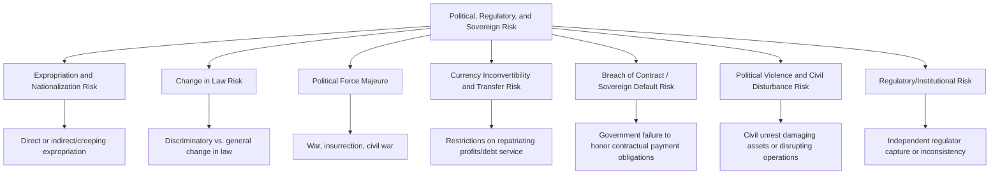
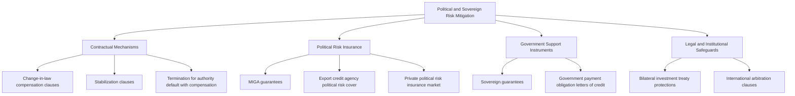

## Political, Regulatory, and Sovereign Risk

### Overview

Political, regulatory, and sovereign risk encompasses the range of risks arising from the actions, inactions, or instability of the host government and state institutions that can adversely affect a PPP project's viability, profitability, or continued operation. This risk category is distinctive because the risk-generating party — the state — is simultaneously the project's counterparty (as procuring authority), its regulator, and often the entity ultimately responsible for compensating the private party when these risks materialize. This dual role of government as both risk source and risk allocator creates unique structuring challenges not present in purely commercial risk categories.

### Sub-Components of Political, Regulatory, and Sovereign Risk

#### Expropriation and Nationalization Risk

The risk that the government directly seizes the project asset or company (direct expropriation), or takes actions that substantially deprive the private party of the economic benefit of its investment without formal seizure (indirect/"creeping" expropriation) — such as imposing punitive taxes or regulations specifically targeting the project to force its effective abandonment.

#### Change in Law Risk

The risk that new legislation, regulation, or policy changes materially affect project costs, revenues, or operating conditions. This category is typically subdivided:

- **General/non-discriminatory change in law**: applies broadly across the economy or sector, not specifically targeting the project (e.g., a general corporate tax rate increase)
- **Specific/discriminatory change in law**: targets the project or a narrow class including it (e.g., a new regulation imposed specifically on the concession's tariff-setting methodology)

#### Political Force Majeure

Distinguished from natural force majeure (see also: Constructing a Comprehensive Risk Matrix), this covers war, insurrection, civil war, terrorism, and similar politically-driven disruptive events beyond either party's control but with a distinctly political/security character, often triggering different contractual relief mechanisms and insurance/coverage regimes than natural catastrophe events.

#### Currency Inconvertibility and Transfer Risk

The risk that the government imposes capital controls or foreign exchange restrictions preventing the private party (particularly foreign investors and lenders) from converting local currency revenue into foreign currency or transferring/repatriating funds abroad — a critical concern for cross-border project financing.

#### Breach of Contract / Sovereign Default Risk

The risk that the government, as contracting counterparty, simply fails to honor its payment obligations (availability payments, guarantee payments, subsidy commitments) under the PPP agreement — a risk distinct from expropriation in that it involves contractual non-performance rather than asset seizure.

#### Political Violence and Civil Disturbance Risk

Physical damage to project assets or disruption to construction/operations arising from riots, civil commotion, or politically motivated violence not rising to the level of war or insurrection.

#### Regulatory/Institutional Risk

The risk arising from weak, inconsistent, or captured regulatory institutions — for example, an independent sector regulator (utility regulator, transport regulator) failing to apply tariff adjustment formulas as contractually agreed, or exhibiting regulatory unpredictability that undermines long-term investment planning.

### Standard Risk Allocation

| Sub-Risk | Typical Allocation | Rationale |
| --- | --- | --- |
| Direct expropriation/nationalization | Public (compensable) | Direct sovereign action; core state responsibility |
| Indirect/creeping expropriation | Public (compensable, though often harder to prove/trigger than direct expropriation) | Same rationale, though contractual and legal definition of the trigger is more complex |
| General, non-discriminatory change in law | Private, up to a defined materiality threshold | Treated as ordinary business/regulatory risk faced by any commercial entity |
| Specific/discriminatory change in law targeting the project | Public | Government is the direct cause of the specific harm |
| Political force majeure (war, insurrection) | Shared (via relief mechanisms) or Public in higher-risk jurisdictions | Neither party controls it, but government's political stability is more directly tied to the state; relief provisions and political risk insurance typically apply |
| Currency inconvertibility | Public | Government controls monetary policy and capital account regulation |
| Government breach of payment obligation | Public (by definition) | Direct contractual failure by the state counterparty |
| Regulatory institutional risk (tariff-setting failure) | Public/regulatory body, sometimes mitigated via international arbitration recourse | Government created and controls the regulatory framework |

### Mitigation Instruments and Mechanisms

#### Contractual Mechanisms

- **Change-in-law compensation clauses**: define precisely how compensation is calculated when a qualifying change in law occurs — typically restoring the private party to the economic position it would have been in absent the change (via tariff adjustment, direct payment, or extended concession term)
- **Stabilization clauses**: contractual provisions attempting to "freeze" certain regulatory or fiscal terms (e.g., tax rates) applicable to the project for its duration, or requiring compensation if they change — used cautiously given tension with a state's sovereign regulatory authority and potential for controversy if seen as unduly limiting future government policy flexibility
- **Termination for authority default**: defines the process and compensation formula if government breaches its payment or other material obligations, typically providing for termination with compensation calculated to cover outstanding debt and, in some formulations, equity return

#### Political Risk Insurance (PRI)

- **Multilateral Investment Guarantee Agency (MIGA)**: a World Bank Group institution providing political risk insurance to private investors and lenders covering expropriation, currency inconvertibility/transfer restriction, breach of contract, and war/civil disturbance, specifically to promote foreign direct investment into emerging markets
- **Export credit agencies (ECAs)**: many countries' ECAs provide political risk cover as part of export finance packages supporting their national companies' overseas investments
- **Private political risk insurance market**: commercial insurers (Lloyd's syndicates and specialized PRI providers) offer similar coverage, often used to supplement or substitute for multilateral cover

#### Government Support Instruments

- **Sovereign guarantees**: direct government guarantee of specific payment obligations (e.g., guaranteeing an off-taker's payment obligations under a power purchase agreement), enhancing bankability particularly where the direct contracting counterparty (a state-owned utility, for instance) has weaker independent credit standing than the sovereign itself
- **Letters of credit / payment security mechanisms**: providing a defined, drawable financial backstop for government payment obligations, reducing reliance on the government's general budgetary process for timely payment

#### Legal and Institutional Safeguards

- **Bilateral investment treaties (BITs)**: treaties between the host country and the investor's home country providing substantive protections (fair and equitable treatment, protection against uncompensated expropriation) and often a route to international arbitration
- **International arbitration clauses**: PPP contracts, particularly those involving foreign investors, commonly specify international arbitration (e.g., ICSID, ICC, UNCITRAL rules) as the dispute resolution forum, partly to mitigate concerns about the neutrality or reliability of host-country domestic courts in disputes involving the government itself

### Assessing Country and Political Risk

Procuring authorities, advisors, and lenders typically assess political risk using a combination of:

- **Sovereign credit ratings** (from major rating agencies) as a baseline indicator of overall fiscal and institutional stability
- **Political risk indices** (e.g., World Bank Worldwide Governance Indicators, country risk assessments from specialized political risk consultancies)
- **Sector-specific regulatory track record**: has the relevant regulator historically honored tariff formulas and contractual commitments in past concessions/PPPs?
- **Track record of contract sanctity**: has the government historically respected long-term contracts, or is there a pattern of renegotiation or repudiation?

[Inference] While quantitative political risk indices provide useful comparative benchmarking across jurisdictions, PPP practitioners generally treat them as one input among several rather than a sufficient basis alone for risk allocation decisions, since country-level indices may not capture project-specific or sector-specific regulatory dynamics relevant to a particular transaction.

### Common Structuring Pitfalls

| Pitfall | Consequence | Mitigation |
| --- | --- | --- |
| Overly broad "change in law" definition capturing routine regulatory adjustments | Excessive compensation claims for normal regulatory evolution | Narrowly and precisely define qualifying change-in-law triggers, distinguishing general from discriminatory changes |
| No independent dispute resolution mechanism, relying solely on host-country courts | Perceived (or actual) lack of impartiality in disputes involving the government as counterparty, deterring foreign investment | Include international arbitration clauses; consider treaty protections where available |
| Government payment obligations not independently secured | Payment risk if fiscal constraints arise, despite contractual commitment | Sovereign guarantees, escrow mechanisms, or letters of credit backing key payment obligations |
| Political risk insurance not obtained despite availability | Uninsured exposure to expropriation/currency/breach-of-contract risk that could have been mitigated at reasonable cost | Evaluate MIGA, ECA, or private PRI coverage as part of standard financing structuring, particularly for cross-border investment |
| Stabilization clauses drafted too broadly, freezing general regulatory evolution | Political and public controversy; potential conflict with the state's sovereign right to regulate in the public interest | Scope stabilization/compensation mechanisms narrowly to project-specific fiscal/regulatory terms, not general sovereign policy-making authority |

### Key Points

- **Government's dual role as counterparty and risk source requires distinct treatment**: unlike commercial counterparty risk, political and sovereign risk cannot be fully "allocated away" from government since government is inherently the source of the risk — the practical structuring question becomes how to define, bound, and compensate for it, not how to transfer it elsewhere.
- **Multilateral and treaty-based protections play an outsized role** in this risk category specifically, reflecting the recognition that purely domestic contractual remedies may be insufficient where the counterparty is the sovereign itself.
- **Distinguishing general from discriminatory change in law is the central drafting challenge**: this distinction determines whether a given regulatory change falls within normal private-party business risk or triggers government compensation, and is frequently a source of interpretive dispute if not defined with precision.
- **Political risk assessment should be jurisdiction- and sector-specific**, not based solely on aggregate country risk ratings, since regulatory track record can vary meaningfully by sector even within a single country.

### Example

A foreign-sponsored toll road PPP in a jurisdiction with a mixed history of contract sanctity structures its political risk protections as follows:

1. The concession agreement defines "Change in Law" narrowly: general tax law changes applicable economy-wide are excluded from compensation (treated as ordinary business risk), but any law or regulation specifically amending toll-setting methodology, environmental permit conditions applicable to the project, or land-use rights granted under the concession triggers a defined compensation mechanism (tariff adjustment or direct payment, calculated to restore the pre-change economic position).
2. The government provides a sovereign guarantee backing its own payment obligations under any government support/minimum revenue mechanism, given the relatively weaker independent credit standing of the specific contracting agency.
3. The sponsors obtain MIGA political risk insurance covering expropriation, currency transfer restriction, and breach of contract for the debt and equity portions of the financing, given the jurisdiction's political risk profile.
4. The concession agreement specifies ICC international arbitration, seated in a neutral third country, as the dispute resolution mechanism for any disputes arising under the agreement, including those involving alleged government breach.

### Related Topics

- Constructing a Comprehensive Risk Matrix
- The Principle of Allocating Risk to the Party Best Able to Manage It
- MIGA and Political Risk Insurance Structuring
- Bilateral Investment Treaties and International Arbitration in PPP Disputes
- Government Support Instruments: Guarantees and Viability Gap Funding
- Change in Law and Force Majeure Clause Drafting
- Sovereign Credit Risk and Government Payment Obligation Security
- Termination Compensation Formulas and Handback Provisions