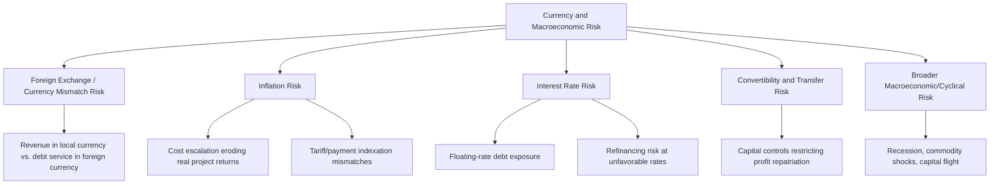
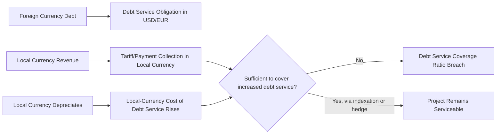
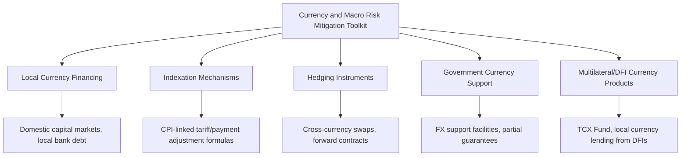

## Currency and Macroeconomic Risk

### Overview

Currency and macroeconomic risk encompasses the risks arising from exchange rate movements, inflation, interest rate fluctuations, and broader macroeconomic instability that affect a PPP project's costs, revenues, debt service obligations, and overall financial viability. This risk category is particularly acute in cross-border PPP financing — where debt is often raised in hard currency (USD, EUR) while project revenue is earned in local currency — and in economies with a history of macroeconomic volatility. Unlike construction or operational risk, currency and macroeconomic risk is driven by forces (central bank policy, global capital flows, commodity price cycles) that neither the public nor private party can meaningfully control, making it one of the risk categories where allocation debates center less on "who can manage it" and more on "who can absorb or hedge it most efficiently."

### Sub-Components of Currency and Macroeconomic Risk

#### Foreign Exchange / Currency Mismatch Risk

The core structural risk in many emerging-market PPPs: project revenue is typically denominated in local currency (tolls, tariffs, availability payments from a local government budget), while a significant portion of construction-phase debt and imported equipment costs may be denominated in foreign hard currency (particularly where local capital markets lack sufficient long-tenor debt capacity). A local currency depreciation increases the local-currency cost of servicing foreign-currency debt without a corresponding increase in local-currency revenue.

#### Inflation Risk

The risk that domestic or international inflation erodes the real value of contracted payments or increases input costs (materials, labor, spare parts) faster than payment/tariff mechanisms adjust, compressing project margins.

#### Interest Rate Risk

The risk that floating interest rates on project debt rise, increasing debt service costs, or that refinancing (common in PPP structures using shorter-tenor construction debt refinanced with longer-tenor operational debt) occurs at less favorable rates than assumed in the original financial model.

#### Convertibility and Transfer Risk

The risk that capital controls or foreign exchange restrictions prevent converting local currency earnings into foreign currency or transferring funds abroad for debt service or dividend repatriation — closely related to, and often addressed alongside, political risk (see also: Political, Regulatory, and Sovereign Risk).

#### Broader Macroeconomic/Cyclical Risk

Systemic risk from recessions, commodity price shocks (particularly relevant for resource-dependent economies), or capital flight events that affect the overall economic environment in which the project operates, indirectly affecting demand, cost inputs, and financing conditions simultaneously.

### The Currency Mismatch Problem in Detail

$$DSCR_{adjusted} = \frac{Revenue_{local} \times FX_{rate,t}^{-1}}{DebtService_{foreign}}$$

Where a depreciation in $FX_{rate,t}$ (local currency units per unit of foreign currency, rising) directly reduces the effective foreign-currency value of local revenue relative to fixed foreign-currency debt service obligations, compressing the Debt Service Coverage Ratio (DSCR) even where local-currency revenue performance is on-target.

### Standard Risk Allocation and Mitigation Approaches

| Risk Sub-Category | Typical Allocation/Approach | Rationale |
| --- | --- | --- |
| General inflation (local and/or foreign) | Shared via indexation mechanism | Neither party controls macroeconomic inflation; addressed through automatic tariff/payment adjustment formulas rather than binary allocation |
| Interest rate risk during construction (pre-financial-close) | Private, mitigated via hedging | Private party structures its own financing and can hedge via interest rate swaps |
| Currency mismatch between revenue and debt currency | Shared/mitigated via structuring, hedging, and sometimes government support | Fundamental structural risk; approach depends on availability and cost of local currency financing and hedging markets |
| Convertibility/transfer restrictions | Public | Government controls monetary policy and capital account regulation |
| Broader macroeconomic/cyclical shocks | Generally uninsurable/unallocated as a discrete risk; addressed indirectly via demand-risk mechanisms and force majeure/relief provisions | Systemic risk not attributable to either party's specific actions |

### Mitigation Instruments and Structuring Approaches

#### Local Currency Financing

The most direct structural mitigation: financing the project in the same currency as its revenue eliminates the currency mismatch entirely. However, this depends on the depth and tenor availability of domestic capital markets — many emerging markets lack sufficiently deep, long-tenor local currency debt markets to fully finance large infrastructure projects, necessitating foreign currency borrowing despite the resulting mismatch.

#### Indexation Mechanisms

Payment or tariff formulas incorporating automatic adjustment for inflation (commonly linked to a domestic or international consumer/producer price index) and, in some structures, partial pass-through of exchange rate movements, reducing (though rarely eliminating) the real erosion of contracted payment values over time.

$$Tariff_t = Tariff_0 \times \left(\alpha \times \frac{CPI_t}{CPI_0} + \beta \times \frac{FX_t}{FX_0} + (1-\alpha-\beta)\right)$$

Where $\alpha$ and $\beta$ represent the respective weightings of domestic inflation and currency pass-through in the indexation formula, and the residual term reflects the unindexed portion of the tariff.

#### Hedging Instruments

- **Cross-currency swaps**: converting foreign-currency debt service obligations into local-currency equivalents (where such instruments are available and reasonably priced in the relevant market)
- **Forward contracts**: locking in future exchange rates for known future foreign-currency payment obligations
- [Inference] In many emerging and frontier markets, however, the depth, tenor, and pricing of local hedging markets are often insufficient to fully hedge the long tenors typical of PPP financing (20-30 years), meaning hedging instruments frequently provide partial, shorter-tenor mitigation rather than a complete solution — this varies considerably by market and should not be assumed uniformly available.

#### Government Currency Support Mechanisms

- **FX support/liquidity facilities**: government-backed facilities providing foreign currency at a pre-agreed or market rate to support debt service, particularly during periods of severe currency stress
- **Partial risk guarantees covering currency-related payment shortfalls**: government or multilateral guarantee mechanisms specifically addressing currency-driven debt service shortfalls, distinct from general payment guarantees

#### Multilateral and Development Finance Institution (DFI) Currency Products

- **The Currency Exchange Fund (TCX)**: a specialized multilateral facility providing local currency hedging products in markets where commercial hedging is unavailable or prohibitively expensive, specifically to support development finance and infrastructure projects
- **DFI local currency lending programs**: development finance institutions (IFC, various regional development banks) increasingly offer local currency-denominated loans directly, reducing reliance on cross-currency hedging altogether for the portion of debt they provide

### Common Structuring Pitfalls

| Pitfall | Consequence | Mitigation |
| --- | --- | --- |
| Foreign currency debt with no hedging or indexation against local currency revenue | Severe DSCR deterioration and potential default upon currency depreciation | Structure indexation formulas with meaningful FX pass-through; pursue local currency financing or DFI local currency products where feasible |
| Indexation formula weights inflation/currency components inaccurately relative to actual cost structure | Residual real erosion of margins despite nominal indexation | Calibrate indexation weights against the project's actual local/foreign cost and revenue currency composition |
| Assuming hedging market depth/pricing that does not exist at the required tenor | Financial model overstates achievable risk mitigation, creating a false sense of bankability | Verify actual hedging market capacity and pricing with market participants before finalizing financial structuring assumptions |
| No stress-testing of financial model against severe currency depreciation scenarios | Undetected fragility in the financing structure until an actual shock occurs | Mandate stress-testing of DSCR and equity returns against defined severe currency/macro scenarios as part of financial model review |
| Reliance solely on private hedging without considering DFI/multilateral currency products in markets with thin hedging markets | Missed opportunity for more cost-effective or longer-tenor risk mitigation | Evaluate TCX, DFI local currency lending, and other multilateral currency products alongside commercial hedging options |

### Key Points

- **Currency mismatch is a structural, not a contractual, risk** — while contract clauses (indexation, guarantees) can mitigate its financial impact, the underlying mismatch between local currency revenue and foreign currency debt is best addressed at the financing structuring stage, through the choice of debt currency and hedging strategy, rather than relying solely on downstream contractual risk-sharing.
- **Indexation is a partial mitigation tool, not a complete risk transfer mechanism** — most indexation formulas provide only partial protection, and the residual/unindexed portion of macroeconomic risk remains with whichever party the tariff/payment structure ultimately exposes.
- **Hedging market depth varies substantially by jurisdiction** — a mitigation strategy assuming freely available, long-tenor hedging instruments may not be realistic in many emerging and frontier markets, making multilateral currency support products a materially important structuring option in those contexts specifically.
- **Macroeconomic risk interacts closely with demand risk and political risk**: a currency crisis often coincides with recession (reducing demand) and increased political/regulatory instability (see also: Demand and Revenue Risk; Political, Regulatory, and Sovereign Risk), meaning these risk categories should be assessed for correlation and combined stress-tested impact, not purely in isolation.

### Example

A cross-border toll road PPP in a frontier market structures its currency risk mitigation as follows:

1. Given limited depth in domestic long-tenor debt markets, 60% of project debt is raised in USD from international lenders, with the remaining 40% sourced as local currency debt from domestic banks with shorter tenor, subsequently refinanced periodically.
2. The concession agreement's toll formula incorporates a blended indexation mechanism: 70% weighted to domestic CPI, 30% weighted to USD/local currency exchange rate movement, updated semi-annually, providing partial (though not complete) pass-through protection against currency depreciation's impact on USD debt service.
3. The sponsors negotiate a partial currency hedge via a DFI-arranged local currency lending facility for a portion of the debt, reducing the absolute USD-denominated exposure that would otherwise require full reliance on the indexation formula.
4. The financial model is stress-tested against a scenario of 30% currency depreciation over a 24-month period combined with a domestic recession reducing traffic by 15%, confirming the DSCR remains above the lenders' minimum covenant threshold even under this combined adverse scenario before financial close is approved.

### Related Topics

- Political, Regulatory, and Sovereign Risk
- Demand and Revenue Risk
- Payment Mechanism Design: Availability Payments vs. Demand-Based Tariffs
- The Currency Exchange Fund (TCX) and DFI Local Currency Lending
- Debt Service Coverage Ratio and Project Finance Covenant Structuring
- Government Support Instruments: Guarantees and Viability Gap Funding
- Financial Model Stress-Testing and Sensitivity Analysis
- Refinancing Risk and Gain-Sharing Mechanisms in PPP Financing