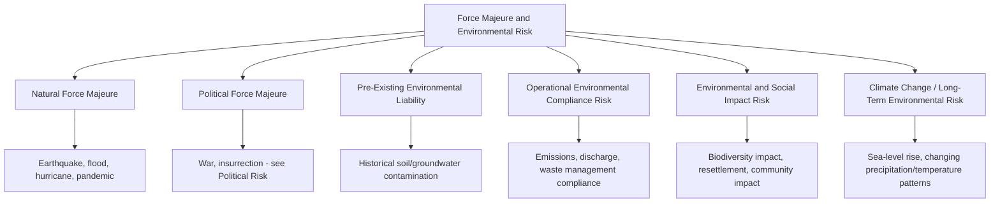
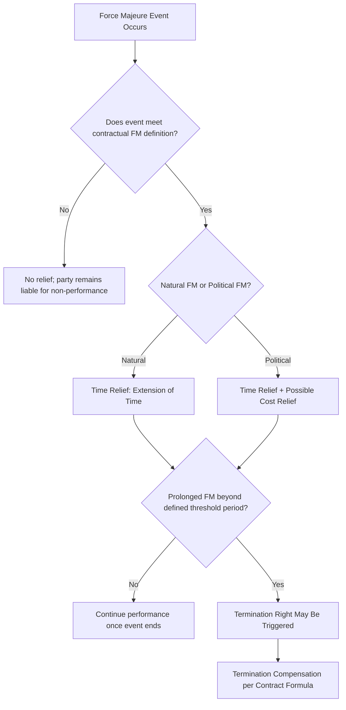
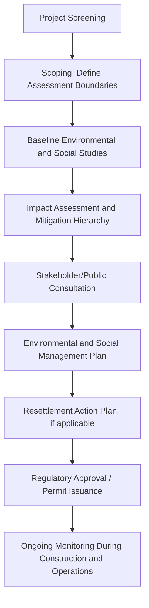

## Force Majeure and Environmental Risk

### Overview

Force majeure and environmental risk together comprise the category of risks arising from natural events, environmental conditions, and uncontrollable external circumstances that can disrupt PPP project construction or operations, or create liability exposure related to environmental impact and compliance. While force majeure is fundamentally a legal/contractual concept defining relief from performance obligations in the face of uncontrollable events, environmental risk spans both natural-event exposure (e.g., flood risk to a project site) and regulatory/liability exposure (compliance with environmental law, contamination liability). These two risk categories are grouped together because they share a common feature: events largely outside either party's control, requiring contractual relief mechanisms rather than pure risk-transfer pricing.

### Sub-Components

#### Natural Force Majeure

Events of natural origin beyond human control — earthquakes, floods, hurricanes/typhoons, volcanic eruptions, pandemics — that prevent or materially impede contractual performance by either party. This is the most classically recognized category of force majeure in PPP contracts.

#### Political Force Majeure

Covers war, insurrection, civil war, and similar politically-originated disruptive events; while sharing contractual treatment similarities with natural force majeure (both typically justify relief from performance), this sub-category is more closely linked analytically to sovereign/political risk (see Political, Regulatory, and Sovereign Risk) given its distinct causal origin and often different insurance/coverage regime.

#### Pre-Existing Environmental Liability

Risk arising from environmental contamination or damage that existed at the project site *before* the private party's involvement — a critical allocation question given the private party typically has no ability to have caused or prevented historical contamination it did not create.

#### Operational Environmental Compliance Risk

The risk of failing to comply with environmental regulations during construction or operations (emissions standards, waste discharge limits, environmental permit conditions), including the risk of new or tightened environmental regulations increasing compliance costs during the concession term.

#### Environmental and Social Impact Risk

Risk associated with the project's impact on surrounding communities and ecosystems — including resettlement of displaced populations, biodiversity/habitat impact, and broader social impact — governed by Environmental and Social Impact Assessment (ESIA) requirements and, where relevant, lender/MDB safeguard policies.

#### Climate Change / Long-Term Environmental Risk

Longer-horizon risk that changing climate patterns (sea-level rise, altered precipitation, increased frequency/severity of extreme weather events) affect asset design adequacy, operational costs, or asset lifespan over a multi-decade concession term — an increasingly prominent consideration in infrastructure planning and design standards.

### Force Majeure: Contractual Structure

#### Standard Force Majeure Definition Elements

A contractually qualifying force majeure event typically must satisfy several cumulative tests:

- **Beyond reasonable control** of the affected party
- **Not reasonably foreseeable** at the time of contract execution (or, if foreseeable, not reasonably avoidable/mitigable)
- **Not attributable to the affected party's fault or negligence**
- **Directly causes** the inability to perform the specific contractual obligation (a causal nexus requirement, not merely a general hardship)

#### Typical Relief Mechanisms

| Relief Type | Description | Typical Trigger |
| --- | --- | --- |
| Extension of time | Contractual deadlines (completion date, performance milestones) are extended by the duration of the qualifying FM event, without penalty | Any qualifying FM event affecting the critical path |
| Suspension of obligations | Performance obligations are suspended (not terminated) for the duration of the event | Ongoing FM event preventing performance |
| Cost relief / compensation | Direct compensation for costs incurred due to the FM event, distinguished from mere time relief | Typically reserved for political FM or specifically negotiated natural FM categories, since routine natural FM often receives only time relief, not cost compensation |
| Termination right | Either party may terminate if the FM event persists beyond a defined threshold period (e.g., 180-365 days) | Prolonged FM event rendering continued performance impractical |

[Inference] A common industry convention distinguishes between natural force majeure — typically resulting in time relief only, on the basis that this risk is best absorbed through insurance and contingency planning rather than direct compensation — and political force majeure, which more frequently attracts cost relief given its closer connection to sovereign risk and government responsibility; however, the specific relief mechanisms and their scope vary considerably by jurisdiction, sector, and the specific negotiated terms of each contract, so this distinction should be treated as a common pattern rather than a universal rule.

### Environmental Risk Allocation

| Risk Sub-Category | Typical Allocation | Rationale |
| --- | --- | --- |
| Pre-existing contamination (existed before private party's involvement) | Public | Private party did not cause it and could not have known its full extent absent disclosure |
| Contamination/environmental damage caused during construction or operations | Private | Within the private party's operational control |
| New environmental regulation (general, non-discriminatory) | Private, up to a threshold | Treated as ordinary regulatory/business risk |
| New environmental regulation specifically targeting the project | Public (via change-in-law compensation) | Discriminatory government action |
| ESIA/resettlement compliance costs identified during project preparation | Typically Public (borne in project preparation budget) or built into private party's scope with clearly disclosed baseline | Depends on when in the project cycle the requirement is identified and disclosed |
| Long-term climate/design-standard adequacy | Increasingly addressed via updated design codes and standards specified in the output specification, allocated to Private for design compliance with the specified (climate-adjusted) standard | Ensures the private party designs to a standard reflecting anticipated future conditions, rather than treating climate risk as an unallocated residual |

### Environmental and Social Impact Assessment (ESIA) Process

- **Mitigation hierarchy**: the standard sequence of avoid → minimize → mitigate → offset/compensate for environmental and social impacts, widely embedded in national environmental law and MDB/IFC safeguard frameworks
- **Resettlement Action Plan (RAP)**: required where the project involves physical or economic displacement of affected populations, specifying compensation, relocation assistance, and livelihood restoration measures
- **IFC Performance Standards / World Bank Environmental and Social Framework**: commonly referenced safeguard frameworks for internationally financed PPPs, particularly where MDB or DFI financing is involved, often exceeding minimum domestic regulatory requirements

### Insurance as a Mitigation Mechanism

| Insurance Type | Coverage |
| --- | --- |
| Construction/Contractor's All Risk | Physical damage to works during construction from natural perils, accidents |
| Business interruption / delay-in-start-up | Revenue loss from FM-related construction delay |
| Property/asset insurance (operations phase) | Physical damage to the completed asset during operations |
| Environmental liability insurance | Costs of pollution/contamination liability, particularly relevant given the pre-existing vs. caused-during-operations distinction |
| Political risk insurance | Political force majeure and related sovereign risk exposure (see also: Political, Regulatory, and Sovereign Risk) |

Insurance requirements are typically mandated as conditions precedent to financial close and ongoing conditions of the financing, with minimum coverage levels, deductibles, and approved insurer criteria specified in both the PPP contract and loan agreements.

### Common Structuring Pitfalls

| Pitfall | Consequence | Mitigation |
| --- | --- | --- |
| Overly broad force majeure definition capturing routine operational difficulties | Excessive relief claims eroding contractual accountability | Precisely define qualifying events with clear causal nexus and foreseeability tests |
| No distinction between time relief and cost relief | Ambiguity or disputes over whether compensation, not just schedule extension, is due | Explicitly specify which FM categories trigger cost relief versus time relief only |
| Pre-existing contamination not identified via adequate site due diligence before contract signing | Disputes over whether contamination found during construction is "pre-existing" or caused by the private party | Commission an environmental baseline assessment/site condition survey before financial close, referenced in the contract |
| ESIA and RAP not completed or adequately budgeted before construction commencement | Construction delays, regulatory non-compliance, community relations risk, and potential MDB financing non-compliance | Complete ESIA/RAP processes on the critical path timeline before construction mobilization, with realistic budget provision |
| Design standards not updated for evolving climate risk (e.g., historical rainfall/flood data used without climate adjustment) | Asset under-designed for actual conditions over a multi-decade concession, leading to premature failure or costly retrofits | Specify climate-adjusted design standards and return-period assumptions in the output specification, informed by current climate projections |

### Key Points

- **Force majeure relief is generally about schedule and continuity, not full risk transfer** — most force majeure regimes are designed to excuse non-performance and preserve the contractual relationship through a disruptive event, rather than to compensate the affected party financially for the event's full economic impact, which is why the distinction between time relief and cost relief matters significantly in drafting.
- **The pre-existing vs. caused-during-project distinction is the central environmental liability allocation question**, and its resolution depends heavily on the quality of environmental due diligence conducted before contract signing — inadequate baseline studies create ongoing dispute risk for the life of the concession.
- **ESIA compliance is both a risk category and a project preparation workstream**: unlike most risks that are purely allocated within the contract, ESIA requirements typically must be substantially addressed and satisfied before financial close and construction commencement, making it a critical-path project preparation activity as much as a risk allocation question.
- **Climate change is increasingly treated as a design-standard issue rather than a discrete, separately allocated risk** — by specifying climate-adjusted technical standards in the output specification, procuring authorities aim to embed climate resilience into the private party's design obligations directly, rather than leaving long-term climate risk as an unallocated residual exposure.

### Example

A coastal port PPP addresses force majeure and environmental risk as follows:

1. The concession agreement defines Natural Force Majeure to include named-storm events exceeding a specified wind-speed/category threshold, earthquakes above a defined magnitude, and flooding exceeding a specified return-period water level, each triggering time relief (extension of milestone/performance dates) but not direct cost compensation, consistent with standard industry treatment of natural FM.
2. Political Force Majeure (war, insurrection, terrorism) is separately defined and, in addition to time relief, triggers a cost-sharing mechanism per an agreed formula, reflecting its closer connection to sovereign risk.
3. A pre-contract environmental site assessment identifies documented historical soil contamination in a specific dockside zone from prior industrial use; the contract explicitly allocates remediation costs for this disclosed, pre-existing contamination to the public authority, while any new contamination arising from the private operator's activities during construction or operations remains the private party's responsibility.
4. Given the coastal location, the output specification requires design to a flood defense standard reflecting a climate-adjusted 1-in-200-year storm surge projection (rather than historical-only data), placing the burden of achieving this specified, forward-looking design standard on the private party's engineering team.
5. The private party is required to maintain construction all-risk insurance, property insurance during operations, and environmental liability insurance throughout the concession term, with minimum coverage levels specified as conditions precedent to financial close.

### Related Topics

- Constructing a Comprehensive Risk Matrix
- Political, Regulatory, and Sovereign Risk
- Environmental and Social Impact Assessment (ESIA) in Infrastructure Projects
- Resettlement Action Plans and IFC Performance Standards
- Change in Law and Force Majeure Clause Drafting
- Construction and Completion Risk
- Insurance Requirements and Risk Transfer Instruments in PPP Financing
- Climate-Resilient Infrastructure Design Standards