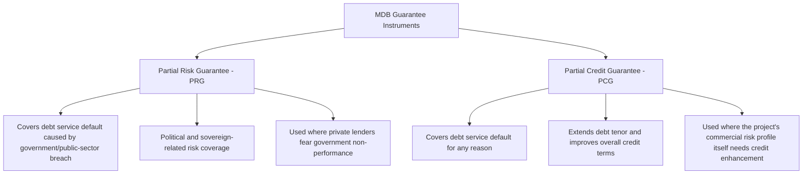
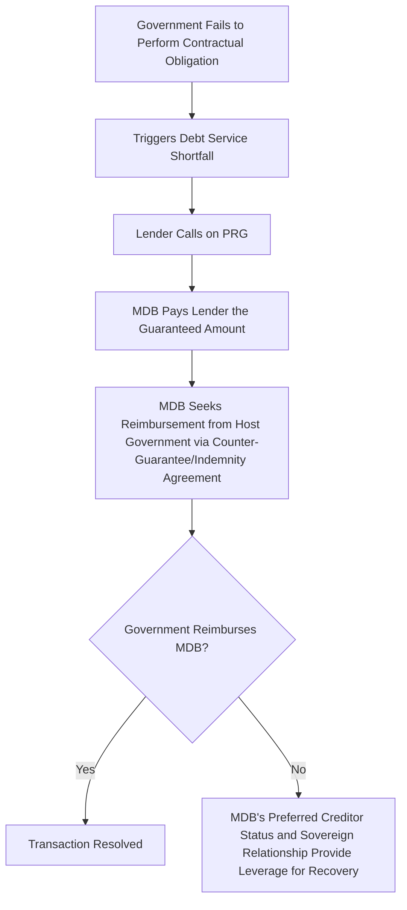
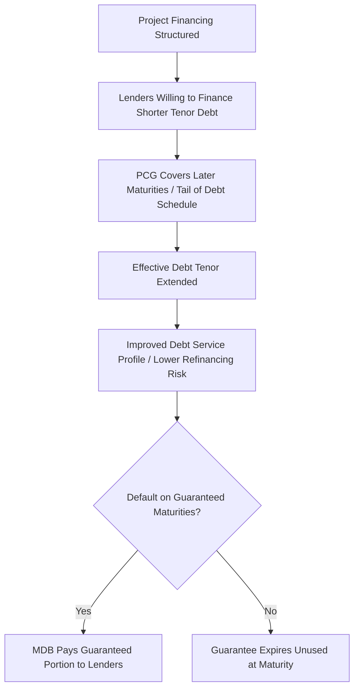

## Partial Risk Guarantees and Partial Credit Guarantees

### Overview

Partial Risk Guarantees (PRGs) and Partial Credit Guarantees (PCGs) are credit enhancement instruments, typically provided by multilateral development banks (MDBs) or export credit agencies, designed to improve the bankability of PPP and infrastructure projects by covering specific categories of risk that would otherwise deter private lenders from providing financing on acceptable terms. Both instruments work by providing lenders a guarantee against defined loss events, effectively substituting the MDB's superior credit standing and risk-bearing capacity for risks that the host government or project itself cannot credibly bear alone — but they differ fundamentally in *what type* of risk they cover, which determines their appropriate application.

### The Core Distinction

| Dimension | Partial Risk Guarantee (PRG) | Partial Credit Guarantee (PCG) |
| --- | --- | --- |
| Risk covered | Debt service default arising specifically from government or public-sector entity's failure to perform contractual obligations (payment default, breach of contract, political risk events) | Debt service default for any reason, commercial or otherwise, typically covering specific maturities or a portion of the debt service schedule |
| Primary purpose | Mitigate political/sovereign risk that private lenders are unwilling to bear | Extend debt tenor and improve credit terms by covering the "tail risk" period lenders are otherwise unwilling to finance |
| Typical trigger | Government payment default, breach of PPA/concession agreement, political force majeure, expropriation, currency inconvertibility | Any payment default on the guaranteed debt service amount, regardless of cause |
| Best suited for | Projects where the primary bankability obstacle is government counterparty risk (e.g., a power purchase agreement with a weak state-owned utility off-taker) | Projects where the primary obstacle is the debt tenor lenders will accept, or general credit enhancement needed to achieve investment-grade financing terms |

### Partial Risk Guarantee (PRG) Mechanics

A PRG covers commercial lenders against the risk of loan default resulting specifically from a government's failure to meet its contractual obligations to the project — such as a state-owned power off-taker failing to make payments under a power purchase agreement, or a host government breaching a concession agreement, imposing a discriminatory change in law, or restricting currency convertibility.

**Key structural features**:

- The MDB does not guarantee against ordinary commercial risks (construction cost overrun, operational inefficiency, normal market demand fluctuation) — only against risks connected to government/public-sector non-performance or defined political risk events
- Upon a valid claim, the MDB pays the guaranteed lenders directly, then seeks reimbursement (indemnification) from the host government under a separate counter-guarantee or indemnity agreement between the MDB and the government
- This structure leverages the MDB's unique relationship with the sovereign — including its "preferred creditor status" (the practical tendency of governments to prioritize repaying MDBs to preserve access to future MDB financing and international credibility) — to provide meaningful protection to private lenders that a purely private guarantee could not replicate
- [Inference] The credibility of a PRG rests substantially on the host government's incentive to honor its reimbursement obligation to the MDB, given the reputational and access-to-finance consequences of MDB arrears; this dynamic is generally considered a core reason PRGs are effective despite guaranteeing what is fundamentally sovereign risk, though the strength of this incentive can vary depending on the specific country's broader relationship with, and reliance on, the guaranteeing institution.

### Partial Credit Guarantee (PCG) Mechanics

A PCG covers a defined portion of scheduled debt service — commonly the later maturities of a loan or bond — regardless of the cause of default, whether commercial, operational, or political. This is particularly useful where local capital markets or commercial lenders are only willing to provide debt at shorter tenors than the project's cash flow profile can efficiently support.

**Key structural features**:

- By guaranteeing the "tail" of a debt instrument (e.g., years 15-20 of a 20-year bond), a PCG allows the overall debt instrument to be issued or extended to a longer tenor than would otherwise be achievable, since investors gain confidence in the final maturities specifically
- Can be used to enhance a project bond's credit rating, potentially bringing it to investment grade and broadening the pool of eligible institutional investors (e.g., pension funds, insurance companies with investment-grade mandates)
- Unlike a PRG, a PCG does not require the default to be linked to a specific government action — it is a general credit enhancement instrument
- Often used in **local currency bond market development** contexts, where the guarantee helps establish a track record and investor confidence in a nascent domestic PPP bond market

### Comparative Application by Project Context

| Project Context | More Suitable Instrument | Reasoning |
| --- | --- | --- |
| Power project with state-owned utility off-taker of uncertain payment reliability | PRG | The core bankability obstacle is specifically the off-taker's/government's payment performance risk |
| Well-structured toll road project with strong traffic history, but lenders unwilling to extend debt beyond 12 years despite a 25-year concession | PCG | The obstacle is tenor mismatch, not government counterparty risk; a PCG extends the effective financeable tenor |
| First domestic infrastructure bond issuance in a developing local currency capital market | PCG | Establishes market credibility and enables longer-tenor local currency financing, developing the broader market |
| Water utility PPP where the primary concern is government/regulator honoring tariff adjustment commitments | PRG | Directly addresses the specific political/regulatory performance risk at issue |
| Project facing multiple risk types (both government performance risk and general credit/tenor constraints) | Potentially both instruments combined, or a comprehensive guarantee structure | Different risk categories may require different guarantee mechanisms addressing each specifically |

### Providers and Typical Structuring Parties

- **World Bank Group (IBRD/IDA)**: a longstanding provider of PRGs, particularly for projects in IDA-eligible (lower-income) countries, often requiring a counter-guarantee from the host government
- **Regional development banks**: Asian Development Bank (ADB), African Development Bank (AfDB), Inter-American Development Bank (IDB), and others offer similar partial guarantee products tailored to their regional mandates
- **International Finance Corporation (IFC)**: primarily focused on private-sector lending and guarantee products, sometimes structuring PCG-type instruments for private project bonds and loans without requiring a sovereign counter-guarantee
- **Export Credit Agencies (ECAs)**: some ECAs provide guarantee products with features overlapping PRG/PCG structures, typically tied to supporting their national exporters' involvement in the project

### Pricing and Fee Structures

Guarantee fees are typically charged as an upfront and/or ongoing (annual) fee calculated as a percentage of the guaranteed amount, reflecting:

$$Fee_{guarantee} = f(RiskProfile_{country}, RiskProfile_{sector}, GuaranteeCoverage_{\%}, Tenor_{guaranteed})$$

Where higher country/political risk, broader guarantee coverage percentage, and longer guaranteed tenor generally correspond to higher guarantee fees, though [Inference] exact fee schedules are institution-specific and are typically negotiated on a case-by-case basis reflecting the specific project and country risk profile rather than published as a fixed universal rate.

### Common Structuring Considerations and Pitfalls

| Consideration/Pitfall | Explanation | Mitigation |
| --- | --- | --- |
| Applying a PRG where the actual bankability obstacle is commercial/tenor-related, not government performance risk | Guarantee fails to address the real obstacle, wasting the guarantee capacity and fee cost | Conduct careful risk diagnosis to identify the specific bankability gap before selecting the guarantee instrument |
| Underestimating the counter-guarantee negotiation complexity with the host government (for PRGs) | Delays in transaction timeline while government approval/counter-guarantee processes proceed, particularly in countries with complex sovereign guarantee approval procedures | Engage government counter-guarantee processes early in the transaction timeline, in parallel with other financial close workstreams |
| Treating MDB guarantee capacity as unlimited or automatically available | MDBs allocate guarantee capacity within overall country/sector exposure limits and lending programs, and approval is not guaranteed or instantaneous | Engage the relevant MDB early in project preparation to confirm guarantee product availability and indicative terms |
| Failing to align guarantee structuring with the overall risk allocation matrix | Guarantee structure may inadvertently duplicate or conflict with contractual risk allocation already established in the PPP agreement | Ensure guarantee instrument design is coordinated with, and consistent with, the project's overall risk matrix (see also: Constructing a Comprehensive Risk Matrix) |

### Key Points

- **PRGs address political/sovereign performance risk; PCGs address general credit and tenor constraints** — selecting the correct instrument requires precise diagnosis of which specific bankability obstacle a project actually faces, since applying the wrong instrument wastes guarantee capacity without solving the underlying problem.
- **The counter-guarantee relationship is central to PRG credibility**: a PRG functions by leveraging the MDB's unique sovereign relationship and preferred creditor status, meaning its effectiveness depends significantly on host government engagement and the strength of the counter-guarantee/indemnity arrangement, not merely the guarantee document issued to lenders.
- **PCGs can serve a market-development function beyond individual project bankability**, particularly when used to help establish credibility and precedent for longer-tenor local currency infrastructure bond markets in emerging economies.
- **These instruments are credit enhancement tools, not substitutes for sound underlying project structuring** — a PRG or PCG can improve the financing terms achievable for a well-structured project but cannot compensate for fundamentally weak project economics, inadequate risk allocation, or poor technical feasibility.

### Example

A 200 MW independent power producer (IPP) project in a lower-middle-income country faces a bankability challenge: the sole legally permitted off-taker is a state-owned electricity utility with a documented history of payment delays to prior IPPs, though the underlying project economics (fuel supply, technical design, tariff structure) are otherwise sound.

1. Commercial lenders indicate willingness to finance the project only if political/counterparty payment risk on the power purchase agreement (PPA) is substantially mitigated.
2. The government and project sponsors approach the World Bank for a Partial Risk Guarantee covering debt service default arising specifically from the utility's (or government's) failure to make PPA payments, currency inconvertibility, or specified political force majeure events.
3. The World Bank issues the PRG to the commercial lending syndicate, backed by a counter-guarantee/indemnity agreement with the host government, under which the government commits to reimburse the World Bank for any amounts paid under the PRG.
4. This structure allows commercial lenders to extend financing at materially improved terms (lower interest margin, longer tenor) than would have been achievable given the utility's standalone credit profile, because their effective credit exposure is now substantially to the World Bank's payment guarantee and the government's reimbursement obligation, rather than to the utility's independent creditworthiness alone.

### Related Topics

- Political, Regulatory, and Sovereign Risk
- MIGA and Political Risk Insurance Structuring
- Government Support Instruments: Guarantees and Viability Gap Funding
- Currency and Macroeconomic Risk
- Minimum Revenue Guarantees and Government Support Instruments
- Multilateral Development Bank Financing Structures for Infrastructure
- Power Purchase Agreement Structuring and Off-Taker Credit Risk
- Local Currency Bond Market Development for Infrastructure Finance