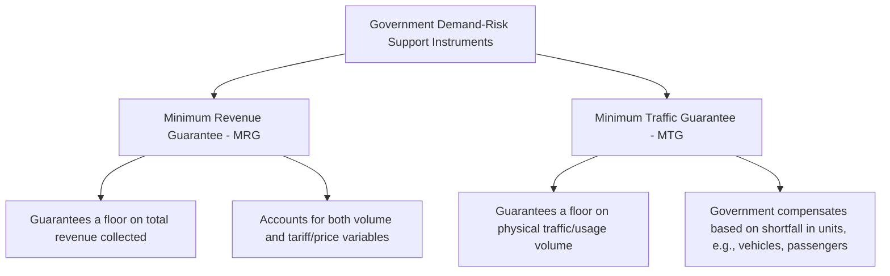
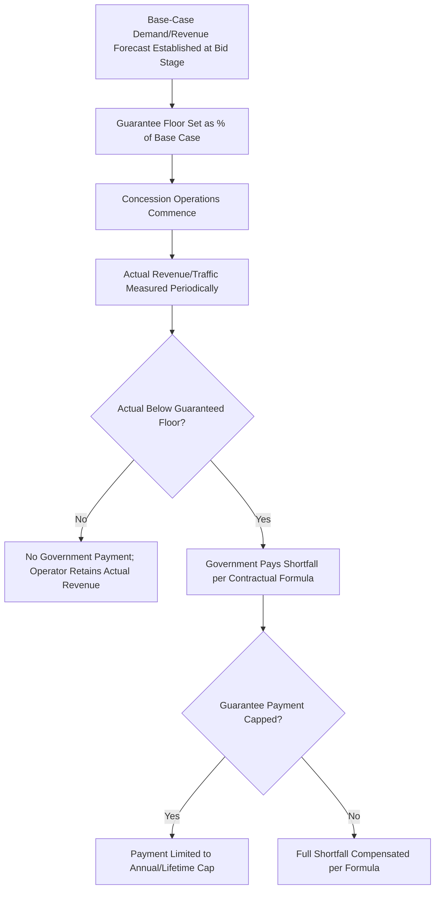
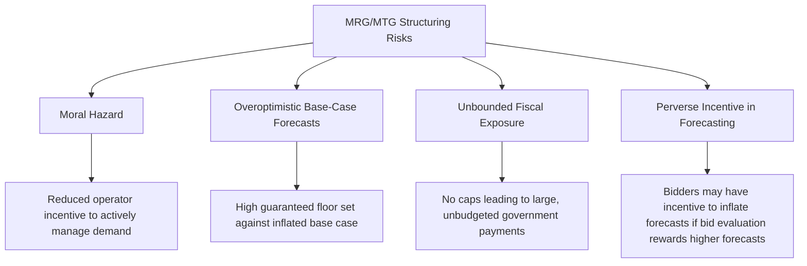

## Minimum Revenue and Traffic Guarantees

### Overview

Minimum Revenue Guarantees (MRGs) and Minimum Traffic Guarantees (MTGs) are government-provided credit enhancement and risk-sharing instruments used primarily in demand-risk PPPs — toll roads, railways, ports, and similar user-pays infrastructure — to address the portion of demand/revenue risk that lenders and private operators cannot efficiently bear alone, without transferring full demand risk back to government (see also: Demand and Revenue Risk). These instruments have a long and closely studied history in PPP practice, with substantial documented experience — both successful applications and cautionary failures — informing current structuring best practice.

### Distinguishing Minimum Revenue Guarantees from Minimum Traffic Guarantees

| Dimension | Minimum Revenue Guarantee (MRG) | Minimum Traffic Guarantee (MTG) |
| --- | --- | --- |
| What is guaranteed | A floor on total revenue (price × volume) collected by the operator | A floor on physical usage volume (e.g., vehicle-kilometers, passenger numbers) |
| Compensation trigger | Actual revenue falls below the guaranteed revenue floor, for any reason including both volume and price/tariff realization | Actual traffic/usage volume falls below the guaranteed volume floor |
| Sensitivity to tariff-setting | Compensation calculation is directly affected by actual achieved tariffs, which can create complexity if tariffs are adjusted mid-concession | Isolates volume risk specifically, often paired with a separately governed tariff-adjustment mechanism |
| Common use case | Toll roads and infrastructure where revenue (not just volume) is the primary financial variable of concern | Contexts where the primary uncertainty is genuinely about usage/demand volume rather than pricing |

### Standard Mechanics

$$Payment_{guarantee,t} = \max(0, Floor_t - Actual_t)$$

Where $Floor_t$ is the guaranteed revenue or traffic level in period $t$ (commonly expressed as a percentage of the original base-case forecast, e.g., 70-90%), and $Actual_t$ is the actual realized revenue or traffic volume.

Most well-structured guarantees incorporate additional design features beyond this basic formula:

- **Annual and lifetime payment caps**: limiting the government's maximum exposure per year and over the life of the concession, bounding the fiscal contingent liability
- **Upside sharing (cap-and-floor structures)**: government captures a share of revenue above a defined ceiling in exchange for providing downside protection, moderating net fiscal cost and reducing windfall/asymmetry concerns
- **Declining guarantee profile over time**: some structures reduce the guaranteed floor's percentage of base-case forecast over the concession term, reflecting the assumption that demand uncertainty is highest in early years (post-opening ramp-up period) and diminishes as an operating track record is established
- **Independent revenue/traffic verification**: an independent auditor or traffic-counting mechanism specified in the contract to verify actual performance against the guarantee threshold, reducing disputes over trigger calculations

### Rationale and Value-for-Money Logic

MRGs and MTGs are grounded in the "best able to manage" risk allocation principle (see also: The Principle of Allocating Risk to the Party Best Able to Manage It): genuinely novel demand contexts (a new corridor with no historical traffic pattern, a first-of-its-kind toll facility in a market) carry demand uncertainty that neither the private operator nor government can fully resolve through better management — it is a function of underlying, largely unobservable-in-advance economic and behavioral factors.

Without some form of downside protection, private operators facing this residual uncertainty must price a substantial risk premium into their bids (higher required tariffs, shorter concession terms, or higher subsidy requests) to compensate for bearing risk they cannot control. An MRG/MTG that only addresses the *deep downside tail* of demand risk — while leaving the operator fully exposed to demand risk within a normal, forecastable range — can reduce this risk premium meaningfully without eliminating the operator's incentive to actively manage and grow demand within its influence.

### Documented Risks and Historical Lessons

#### Moral Hazard

If the guaranteed floor is set too close to the base-case forecast (i.e., providing near-complete downside protection), the operator's financial outcome becomes substantially insulated from actual demand performance, undermining the incentive to actively manage service quality, pricing, and marketing to genuinely grow usage.

#### Overoptimistic Base-Case Forecasts

[Inference] A well-documented pattern across a range of early-generation demand-risk PPPs internationally — frequently discussed in retrospective reviews by multilateral development banks and infrastructure researchers — is that when guarantee floors are calculated as a percentage of an already-optimistic base-case forecast, the resulting floor can be triggered far more frequently and at far greater fiscal cost than originally anticipated, since the entire calculation inherits the forecast's initial bias; the specific magnitude and prevalence of this pattern vary by country and project and should be understood as a documented risk to guard against rather than a universal outcome.

#### Unbounded Fiscal Exposure

Guarantees structured without annual or lifetime payment caps expose government to potentially unlimited, unbudgeted contingent liabilities if demand substantially underperforms — a structuring choice that undermines the basic fiscal risk management rationale for using caps in the first place.

#### Perverse Incentive in Forecasting and Bid Evaluation

In some historical structures, bid evaluation methodologies inadvertently rewarded bidders who submitted higher demand forecasts (since higher committed forecasts could translate to more favorable evaluated terms), creating an incentive misaligned with realistic, defensible forecasting — a structuring flaw addressed in contemporary practice through independent, third-party-verified demand studies rather than relying on bidder-submitted forecasts as the basis for guarantee calculations.

### Contemporary Best-Practice Structuring Features

| Feature | Purpose |
| --- | --- |
| Independent, third-party demand forecast (not bidder-submitted) as guarantee basis | Removes bidder incentive to inflate forecasts for evaluation or guarantee-calculation advantage |
| Guarantee floor set meaningfully below base case (e.g., 70-85%, not 95%+) | Preserves operator incentive exposure to normal-range demand variation |
| Annual and lifetime payment caps | Bounds fiscal contingent liability to a defined, budgetable maximum |
| Cap-and-floor (symmetric) structure with upside sharing | Moderates net fiscal cost and reduces perceived asymmetry/windfall concern |
| Declining guarantee percentage over concession term | Reflects reducing genuine forecast uncertainty as operational track record accumulates |
| Independent revenue/traffic verification and audit mechanism | Reduces disputes over guarantee trigger calculations |
| Contingent liability valuation and disclosure in public fiscal accounts | Ensures the true fiscal exposure is understood and budgeted for by the finance ministry, not treated as costless "off-balance-sheet" risk transfer |

### Fiscal and Contingent Liability Management

Because MRG/MTG payment obligations are contingent (payable only if triggered) rather than fixed, they are typically treated in public financial management as **contingent liabilities** requiring specific governance:

- **Probabilistic/actuarial valuation**: modeling the expected value and distribution of potential guarantee payment outcomes across a range of demand scenarios, rather than relying solely on the single base-case forecast
- **Government contingent liability registers**: many countries with mature PPP frameworks now require fiscal risk statements or contingent liability registers disclosing aggregate exposure across all outstanding demand guarantees, improving fiscal transparency and long-term budget planning
- **Approval thresholds and central fiscal authority sign-off**: guarantee commitments above a certain size often require finance ministry (not just sector ministry) approval, reflecting their status as a fiscal instrument with budgetary implications comparable to explicit government spending

### Common Structuring Pitfalls

| Pitfall | Consequence | Mitigation |
| --- | --- | --- |
| Guarantee floor calculated from bidder-submitted (rather than independent) demand forecasts | Systematic optimism bias embedded directly into the guarantee's trigger calculation | Commission independent, third-party demand studies as the authoritative basis for guarantee floor calculation |
| No annual or lifetime payment cap | Unbounded, unbudgeted fiscal exposure if demand significantly underperforms | Structure explicit caps calibrated against realistic downside stress scenarios |
| Guarantee floor set too high relative to base case (excessive downside protection) | Moral hazard; reduced operator incentive to actively manage and grow demand | Set floors meaningfully below base case, preserving genuine operator exposure within a normal demand range |
| No independent revenue/traffic verification mechanism | Disputes over guarantee trigger calculations, potential for manipulation of reported figures | Specify an independent auditor/verification methodology in the contract |
| Guarantee exposure not disclosed or provisioned for in public fiscal accounts | Fiscal surprises when guarantees are triggered; poor long-term public financial planning | Require contingent liability valuation and disclosure as part of standard PPP approval and fiscal reporting processes |

### Key Points

- **MRGs and MTGs are shared-risk instruments, not full risk transfer to government** — well-designed structures preserve meaningful operator exposure to demand risk within a normal range while addressing only the deep downside tail that neither party can efficiently price or manage alone.
- **The quality of the underlying demand forecast is the single most important determinant of whether a guarantee functions as intended** — a guarantee calculated against a biased or overoptimistic forecast inherits and can amplify that bias's fiscal consequences.
- **Caps and upside-sharing mechanisms are not optional refinements but core risk management features** — unbounded, one-sided guarantees have been a documented source of fiscal distress in historical PPP experience internationally, making these design features central rather than peripheral to sound guarantee structuring.
- **Fiscal transparency and contingent liability governance are essential complements to guarantee design** — the technical structuring of the guarantee formula must be paired with appropriate public financial management practices (valuation, disclosure, approval thresholds) to ensure the government's aggregate exposure across its PPP portfolio is understood and managed responsibly.

### Example

A government structures a Minimum Revenue Guarantee for a new intercity toll expressway with no directly comparable existing traffic corridor.

1. An independent traffic and revenue study, commissioned separately from the bidding process and reviewed by an independent panel, establishes a base-case revenue forecast with defined confidence intervals.
2. The guarantee floor is set at 75% of the independent base-case forecast for years 1-5 (the period of highest genuine ramp-up uncertainty), declining to 60% for years 6-10, and eliminated thereafter as an established traffic pattern is expected to have emerged.
3. Government payment obligations under the guarantee are capped at a maximum of 3% of the original estimated project capital cost per year, and a lifetime cap of 20% of capital cost, bounding total fiscal exposure to a defined, budgetable maximum.
4. Above a defined revenue ceiling (120% of base case), the government captures 30% of revenue above that ceiling, creating a cap-and-floor structure that moderates the net expected fiscal cost of the downside guarantee.
5. An independent traffic counting and revenue audit firm, specified in the concession agreement, verifies actual annual revenue against the guarantee threshold, with results published as part of the government's annual contingent liability disclosure.

### Related Topics

- Demand and Revenue Risk
- The Principle of Allocating Risk to the Party Best Able to Manage It
- Least Present Value of Revenue (LPVR) Bidding Mechanisms
- Contingent Liability Valuation and Fiscal Risk Management
- Demand Forecasting Methodologies and Optimism Bias in Infrastructure
- Partial Risk Guarantees and Partial Credit Guarantees
- Payment Mechanism Design: Availability Payments vs. Demand-Based Tariffs
- Public Sector Comparator and Value-for-Money Assessment